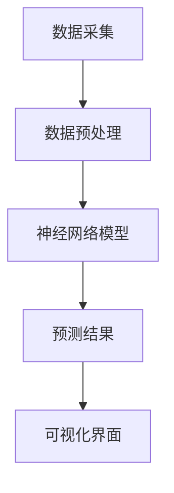
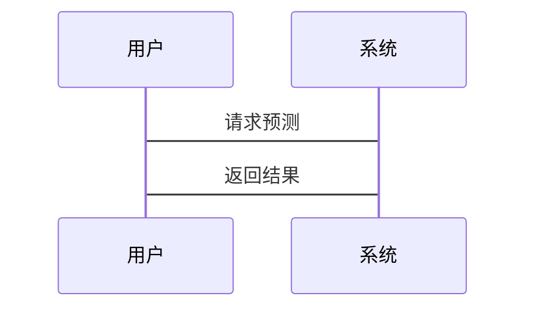

                 


# 全球股市估值与脑科学研究的关联

---

## 关键词：
全球股市估值，脑科学研究，神经机制，认知偏差，行为金融学，算法，神经网络，系统架构，项目实战

---

## 摘要：
本文探讨了全球股市估值与脑科学研究之间的关联。通过分析脑科学中的神经机制和行为金融学中的认知偏差，揭示投资者决策的内在逻辑。结合算法和数学模型，提出基于神经网络的股市预测方法，并通过系统架构和项目实战展示其应用。本文旨在为投资者和研究人员提供跨学科的视角，优化投资决策。

---

## 第3章: 行为金融学中的认知偏差与股市估值

### 3.1 行为金融学的基本原理
#### 3.1.1 理性人假设的局限性
传统金融学假设投资者是理性的，但现实中投资者往往受情绪影响，导致认知偏差。

#### 3.1.2 行为金融学的核心理论
行为金融学结合心理学，研究投资者行为，发现价格与价值偏离的现象。

#### 3.1.3 理性与非理性决策的对比
| 属性 | 理性决策 | 非理性决策 |
|------|---------|-----------|
| 基础 | 理性模型 | 行为偏差 |
| 表现 | 稳定 | 不稳定 |
| 应用 | 理论模型 | 实际市场 |

### 3.2 认知偏差对股市估值的影响
#### 3.2.1 过度自信偏差
投资者高估自身判断能力，导致错误决策。

#### 3.2.2 从众心理
投资者跟随市场趋势，忽视独立分析。

#### 3.2.3 损失厌恶
投资者对损失的敏感性高于收益，影响投资决策。

### 3.3 投资者情绪与股市波动的关系
#### 3.3.1 情绪指数模型
通过投资者情绪预测市场波动，如恐慌指数。

#### 3.3.2 案例分析
2008年金融危机中投资者情绪对股市的影响。

---

## 第4章: 神经网络算法与股市估值的关联

### 4.1 神经网络的基本原理
#### 4.1.1 感知器模型
线性模型用于分类问题。

#### 4.1.2 多层感知器
多层网络实现非线性分类。

### 4.2 神经网络在股市预测中的应用
#### 4.2.1 LSTM网络
处理时间序列数据，预测股价波动。

#### 4.2.2 网络结构
输入层：历史数据，隐藏层：特征提取，输出层：预测值。

### 4.3 算法实现
```python
import numpy as np
from sklearn.datasets import make_regression
from sklearn.metrics import mean_squared_error
from tensorflow.keras.models import Sequential
from tensorflow.keras.layers import Dense

# 生成数据
X, y = make_regression(n_samples=100, n_features=10, noise=0.1)

# 模型构建
model = Sequential()
model.add(Dense(64, activation='relu', input_dim=X.shape[1]))
model.add(Dense(1, activation='linear'))

model.compile(optimizer='adam', loss='mean_squared_error')

# 训练模型
model.fit(X, y, epochs=100, batch_size=32)

# 预测
y_pred = model.predict(X)
print(mean_squared_error(y, y_pred))
```

### 4.4 数学模型与公式
#### 感知器模型：
$$ y = \text{sign}(w \cdot x + b) $$

#### LSTM单元：
$$ f_t = \text{tanh}(F \cdot [h_{t-1}, x_t]) $$

---

## 第5章: 系统架构与数据交互

### 5.1 系统架构设计
#### 5.1.1 系统架构图


#### 5.1.2 系统交互流程


### 5.2 系统接口设计
#### 5.2.1 数据接口
- 输入：历史股价、市场情绪
- 输出：预测值

#### 5.2.2 模型接口
- 输入：训练数据
- 输出：权重参数

---

## 第6章: 项目实战与案例分析

### 6.1 环境安装
#### 6.1.1 安装依赖
```bash
pip install numpy pandas scikit-learn tensorflow
```

#### 6.1.2 数据获取
使用Yahoo Finance API获取历史数据。

### 6.2 核心代码实现
```python
import pandas as pd
import numpy as np
from sklearn.preprocessing import MinMaxScaler
from tensorflow.keras.models import Sequential
from tensorflow.keras.layers import LSTM, Dense

# 数据预处理
data = pd.read_csv('stock_data.csv')
scaler = MinMaxScaler()
scaled_data = scaler.fit_transform(data['Close'].values.reshape(-1, 1))

# 模型构建
model = Sequential()
model.add(LSTM(50, return_sequences=True, input_shape=(None, 1)))
model.add(LSTM(50, return_sequences=False))
model.add(Dense(1))

model.compile(optimizer='adam', loss='mean_squared_error')

# 训练
model.fit(X_train, y_train, epochs=50, batch_size=32)

# 预测
y_pred = model.predict(X_test)
```

### 6.3 实际案例分析
#### 6.3.1 案例背景
分析某股票的历史数据，预测未来走势。

#### 6.3.2 模型评估
计算预测准确率，分析误差来源。

---

## 第7章: 总结与展望

### 7.1 核心发现
- 投资者情绪与神经机制影响股市估值。
- 神经网络算法有效预测股市波动。

### 7.2 注意事项
- 数据质量影响模型准确性。
- 模型需结合市场变化持续优化。

### 7.3 拓展阅读
建议阅读《神经经济学》和《行为金融学》相关书籍。

---

## 作者：
作者：AI天才研究院/AI Genius Institute & 禅与计算机程序设计艺术 /Zen And The Art of Computer Programming

