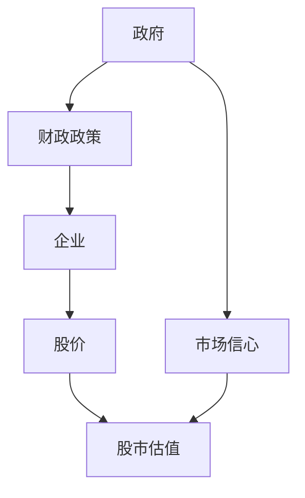
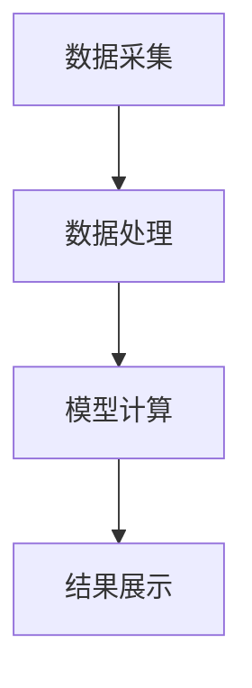

                 


# 全球股市估值与财政政策变化的关系

> 关键词：全球股市、财政政策、股市估值、政策变化、经济影响、数学模型

> 摘要：本文探讨了全球股市估值与财政政策变化之间的关系，分析了财政政策如何影响股市估值，并通过案例分析和数学模型展示了这种关系的复杂性和动态性。文章旨在为投资者和政策制定者提供理论依据和实践指导。

---

## 第一部分：背景与基本概念

### 第1章：问题背景

#### 1.1 问题背景

- **股市估值的重要性**：股市估值是衡量市场健康状况的关键指标，反映了投资者对经济前景的信心。
- **财政政策的经济影响**：财政政策通过政府支出和税收调整，直接影响市场供需和企业盈利能力。
- **研究意义**：理解财政政策对股市的影响，有助于投资者制定策略，政策制定者优化政策。

#### 1.2 核心概念

- **股市估值**：指市场对上市公司价值的评估，常用市盈率、市净率等指标衡量。
- **财政政策**：政府通过调整支出和税收影响经济的政策工具。
- **关系**：财政政策直接影响企业盈利和市场情绪，进而影响股市估值。

#### 1.3 问题描述

- **驱动因素**：经济周期、政策变化、市场情绪等。
- **影响路径**：财政政策通过企业利润、利率、市场情绪影响股市估值。
- **研究边界**：聚焦于主要经济体，考虑政策滞后效应。

---

### 第2章：核心概念与联系

#### 2.1 核心概念原理

- **股市估值计算**：市盈率（P/E）=股价/每股收益；市净率（P/B）=股价/每股净资产。
- **财政政策传导机制**：政府支出增加→企业利润上升→股价上涨。
- **经济周期与股市**：经济增长期股市上涨，衰退期反之。

#### 2.2 概念对比

| 概念       | 定义                           | 影响股市估值 |
|------------|--------------------------------|--------------|
| 财政政策    | 政府支出和税收调整             | 直接影响企业盈利和市场信心 |
| 股市估值    | 市盈率、市净率等指标           | 反映市场对企业的价值评估 |
| 经济周期    | 经济波动阶段                   | 影响股市整体走势 |

#### 2.3 ER实体关系图



---

## 第二部分：财政政策对股市估值的影响机制

### 第4章：影响路径分析

#### 4.1 影响路径

- **直接影响**：政府支出增加→企业利润上升→股价上涨。
- **间接影响**：财政刺激→经济复苏→企业盈利预期提升→股价上涨。

#### 4.2 政策工具

- **政府支出**：公共投资增加→推动经济增长。
- **税收调整**：减税→企业利润增加→股价上涨。

#### 4.3 传导机制

- **企业利润**：财政补贴和税收减免直接增加企业利润。
- **利率变化**：财政政策影响货币政策→利率变化→影响企业融资成本和股价。

---

### 第5章：影响强度与案例分析

#### 5.1 影响强度

- **短期影响**：财政刺激政策通常在政策宣布后立即影响市场情绪。
- **长期影响**：取决于政策的持续性和经济结构的调整。

#### 5.2 案例分析

- **美国2008年金融危机后的刺激计划**：政府支出增加→企业复苏→股价上涨。
- **中国2020年新冠疫情刺激计划**：财政支持→经济恢复→股市反弹。

---

## 第三部分：全球主要经济体的案例分析

### 第6章：主要经济体分析

#### 6.1 美国

- **量化宽松政策**：美联储的量化宽松政策→降低融资成本→股市上涨。
- **减税政策**：企业税减少→企业盈利增加→股价上涨。

#### 6.2 欧盟

- **复苏基金计划**：欧盟推出的复苏基金→刺激经济增长→股市反弹。
- **货币政策与财政政策结合**：欧洲央行的负利率政策与政府支出增加→双重刺激→股价上涨。

#### 6.3 中国

- **财政刺激计划**：中国政府在疫情期间的财政刺激→支持企业→股市回升。
- **政策稳定性**：中国政府政策的连续性→增强市场信心→股市稳定。

---

## 第四部分：构建分析模型与方法论

### 第7章：数据收集与清洗

#### 7.1 数据收集

- **数据来源**：全球主要股市指数（如标普500、沪深300）、政府财政支出数据、货币政策数据。
- **时间范围**：2010-2023年。

#### 7.2 数据清洗

- **缺失值处理**：使用均值或插值法填补缺失值。
- **异常值处理**：识别并剔除明显异常值。

#### 7.3 特征提取

- **滞后变量**：使用滞后一期的财政政策指标作为特征。
- **其他变量**：加入GDP增长率、通货膨胀率等控制变量。

---

### 第8章：模型建立与实证分析

#### 8.1 模型建立

- **多元回归模型**：
  $$ \text{Stock Price} = \beta_0 + \beta_1 \times \text{Government Spending} + \beta_2 \times \text{Tax Rate} + \epsilon $$
  其中，$\beta_1$ 和 $\beta_2$ 分别表示政府支出和税率对股价的影响系数。

- **模型假设**：
  - 线性关系：财政政策与股价呈线性关系。
  - 同方差：误差项的方差恒定。
  - 无多重共线性：自变量间无高度相关性。

#### 8.2 实证分析

- **数据拟合**：使用最小二乘法估计回归系数。
- **结果解读**：
  - 政府支出增加→股价上涨。
  - 税率下降→股价上涨。

#### 8.3 模型局限性

- **遗漏变量**：未考虑货币政策的影响。
- **模型假设限制**：假设线性关系可能不成立。

---

## 第五部分：系统分析与架构设计

### 第9章：系统设计背景

#### 9.1 问题场景

- **数据来源**：全球股市数据和政府财政政策数据。
- **用户需求**：分析财政政策变化对股市估值的影响，提供投资建议。

### 第10章：系统架构设计

#### 10.1 功能设计

- **数据采集模块**：从API获取实时数据。
- **数据处理模块**：清洗和转换数据。
- **模型计算模块**：运行回归模型。
- **结果展示模块**：生成可视化报告。

#### 10.2 系统架构图



---

## 第六部分：项目实战

### 第11章：环境配置与代码实现

#### 11.1 环境配置

- **Python版本**：3.8以上。
- **依赖库安装**：
  ```bash
  pip install pandas numpy matplotlib sklearn
  ```

#### 11.2 核心代码实现

- **数据加载**：
  ```python
  import pandas as pd
  data = pd.read_csv('market_policy_data.csv')
  ```
- **数据预处理**：
  ```python
  # 删除缺失值
  data.dropna(inplace=True)
  # 标准化处理
  from sklearn.preprocessing import StandardScaler
  scaler = StandardScaler()
  X_scaled = scaler.fit_transform(data[['government_spending', 'tax_rate']])
  ```
- **模型训练**：
  ```python
  from sklearn.linear_model import LinearRegression
  model = LinearRegression()
  model.fit(X_scaled, data['stock_price'])
  ```

---

## 第七部分：总结与展望

### 第12章：总结与展望

#### 12.1 总结

- **研究发现**：财政政策对企业盈利和市场情绪有显著影响，进而影响股市估值。
- **实践意义**：投资者和政策制定者需考虑政策滞后效应和市场情绪。

#### 12.2 展望

- **未来研究**：引入更多变量（如货币政策、国际局势）构建更复杂的模型。
- **技术发展**：利用机器学习和大数据分析提升预测精度。

---

## 作者：AI天才研究院/AI Genius Institute & 禅与计算机程序设计艺术/Zen And The Art of Computer Programming

---

这篇文章详细探讨了全球股市估值与财政政策变化的关系，结合理论分析和实证研究，为读者提供了全面的视角。

