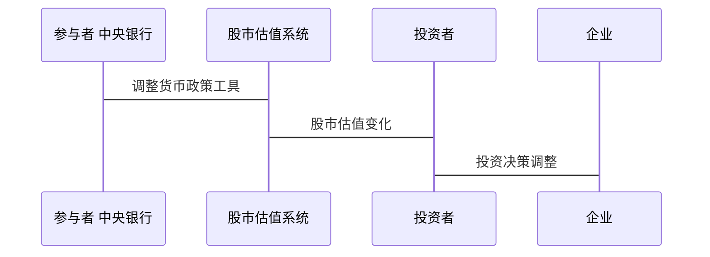

                 


# 全球股市估值与货币政策的关系

## 关键词：全球股市，货币政策，股市估值，货币政策工具，资本流动，经济影响

## 摘要：本文探讨了全球股市估值与货币政策之间的复杂关系。通过分析货币政策工具如利率和货币供应量对股市流动性和市场情绪的影响，结合全球主要经济体的案例，揭示货币政策如何影响股市估值。文章还构建了分析框架，帮助读者理解这些因素的相互作用。

---

## 第1章: 背景介绍

### 1.1 问题背景

#### 1.1.1 全球化经济与股市估值的重要性
全球化使得金融市场紧密相连，股市估值成为衡量经济健康的重要指标。投资者通过股市估值了解企业的价值，而政府则通过股市表现评估经济政策的效果。

#### 1.1.2 货币政策对经济的影响
货币政策由中央银行制定，通过调整利率、货币供应量等工具影响经济活动。货币政策直接影响企业融资成本和个人消费能力，进而影响整体经济走势。

#### 1.1.3 股市估值与货币政策关系的研究意义
理解两者关系有助于投资者做出更明智的决策，帮助政策制定者优化货币政策，促进经济稳定增长。

### 1.2 核心概念

#### 1.2.1 股市估值的定义与核心要素
股市估值是对上市公司未来现金流的折现，主要考虑盈利能力、成长潜力和行业地位等因素。

#### 1.2.2 货币政策的定义与工具
货币政策是通过调整货币供应量和利率影响经济的政策工具，主要包括公开市场操作、调整法定存款准备金率和利率政策。

#### 1.2.3 股市估值与货币政策关系的边界与外延
货币政策影响股市估值，但还需考虑企业基本面、投资者情绪和国际经济环境等因素。

### 1.3 问题描述

#### 1.3.1 货币政策如何影响股市估值
通过影响利率和流动性，货币政策降低融资成本，刺激投资，从而推高股市估值。

#### 1.3.2 股市估值对货币政策的反馈作用
股市估值的变化会影响投资者情绪，反过来影响货币政策的效果。

#### 1.3.3 问题解决的路径与方法
通过构建数学模型，分析货币政策工具对股市估值的具体影响路径。

### 1.4 本章小结
本章介绍了研究的背景、核心概念和问题描述，为后续分析奠定了基础。

---

## 第2章: 核心概念与联系

### 2.1 核心概念原理

#### 2.1.1 股市估值的核心原理
股市估值基于企业未来现金流的折现，考虑风险和时间价值。

#### 2.1.2 货币政策的核心原理
货币政策通过调整利率和货币供应量影响经济活动，进而影响股市估值。

#### 2.1.3 两者关系的理论基础
凯恩斯主义和货币主义提供了分析货币政策影响股市估值的理论框架。

### 2.2 核心概念属性特征对比

| 属性       | 股市估值       | 货币政策       |
|------------|---------------|---------------|
| 定义       | 企业价值评估   | 经济政策工具     |
| 影响因素   | 利润能力、行业地位 | 利率、货币供应量 |
| 目标       | 投资决策       | 经济稳定         |
| 工具       | 市场分析       | 货币工具         |

### 2.3 ER实体关系图架构

```mermaid
er
actor 股市估值 {
  role 股票价格
  role 市场流动性
}
actor 货币政策 {
  role 利率
  role 货币供应量
}
```

### 2.4 本章小结
本章详细探讨了核心概念及其联系，为后续分析提供了理论基础。

---

## 第3章: 货币政策对股市估值的影响机制

### 3.1 货币政策工具的分类与影响

#### 3.1.1 利率政策
降低利率减少借贷成本，鼓励投资，推高股市估值。

#### 3.1.2 货币供应量政策
增加货币供应量提高市场流动性，刺激股市上涨。

#### 3.1.3 其他货币政策工具
包括量化宽松和资产购买计划，直接影响市场流动性。

### 3.2 货币政策对股市流动性的传导机制

#### 3.2.1 流动性对股市估值的影响
流动性增加，交易活跃，股市估值上升。

#### 3.2.2 货币政策通过流动性影响股市的路径
降低利率→增加流动性→推高股市估值。

### 3.3 货币政策对市场情绪的影响

#### 3.3.1 市场情绪的定义与影响
市场情绪影响投资者决策，进而影响股市走势。

#### 3.3.2 货币政策对市场情绪的传导机制
宽松货币政策缓解市场担忧，提升投资者信心，推高股市估值。

### 3.4 本章小结
本章分析了货币政策工具及其对股市估值的影响机制。

---

## 第4章: 全球主要经济体的货币政策与股市估值分析

### 4.1 美国的货币政策与股市估值

#### 4.1.1 美联储的货币政策工具
包括利率调整和量化宽松政策。

#### 4.1.2 美国股市估值的现状与趋势
近年来美股估值持续上升，部分原因在于低利率环境。

#### 4.1.3 美联储政策对美国股市的影响
宽松政策刺激股市上涨，但也可能导致泡沫。

### 4.2 欧洲的货币政策与股市估值

#### 4.2.1 欧洲央行的货币政策工具
包括负利率和资产购买计划。

#### 4.2.2 欧洲股市估值的现状与趋势
欧股表现相对温和，欧洲央行的宽松政策支撑股市估值。

#### 4.2.3 欧洲央行政策对欧洲股市的影响
政策缓解了经济压力，但效果有限。

### 4.3 日本的货币政策与股市估值

#### 4.3.1 日本央行的货币政策工具
实施零利率和大规模资产购买计划。

#### 4.3.2 日本股市估值的现状与趋势
日股估值波动较大，政策效果有限。

#### 4.3.3 日本央行政策对日本股市的影响
政策支撑了股市，但未能带动整体经济复苏。

### 4.4 其他主要经济体的货币政策与股市估值

#### 4.4.1 中国的货币政策与股市估值
中国央行通过降息和货币宽松政策支持股市。

#### 4.4.2 英国的货币政策与股市估值
英国央行的政策对伦敦股市有一定影响，但英镑波动影响更大。

#### 4.4.3 其他新兴经济体的货币政策与股市估值
新兴市场受全球货币政策影响较大，风险较高。

### 4.5 本章小结
本章分析了主要经济体的货币政策及其对股市估值的影响。

---

## 第5章: 货币政策对全球资本流动与股市估值的影响

### 5.1 全球资本流动的现状与趋势

#### 5.1.1 全球资本流动的定义与测量
资本流动影响全球股市估值，需关注流动性的变化。

#### 5.1.2 全球资本流动的现状
近年来资本流入新兴市场，推动当地股市估值上升。

### 5.2 货币政策与全球资本流动的相互作用

#### 5.2.1 货币政策影响资本流动的方向
宽松政策吸引外资流入，推高股市估值。

#### 5.2.2 资本流动对货币政策的反馈
大量资本流入可能加剧资产泡沫，影响货币政策效果。

#### 5.2.3 实例分析
2020年新冠疫情后，美联储的宽松政策导致大量资金流入新兴市场，推高当地股市估值。

### 5.3 货币政策对全球股市估值的系统性影响

#### 5.3.1 全球化背景下的货币政策协调
各国政策协调不足可能导致全球资本流动不稳定。

#### 5.3.2 货币政策对全球经济和股市的双重影响
宽松政策促进经济增长，但也可能引发通胀和资产泡沫。

### 5.4 本章小结
本章分析了货币政策对全球资本流动和股市估值的系统性影响。

---

## 第6章: 全球股市估值与货币政策关系的系统分析与架构设计方案

### 6.1 问题场景介绍

#### 6.1.1 问题场景概述
探讨货币政策工具如何影响股市估值，构建分析框架。

#### 6.1.2 问题场景的关键要素
包括货币政策工具、股市估值、市场流动性、投资者情绪。

### 6.2 项目介绍

#### 6.2.1 项目目标
构建模型分析货币政策对股市估值的影响。

#### 6.2.2 项目范围
研究全球主要经济体的货币政策及其对股市的影响。

### 6.3 系统功能设计

#### 6.3.1 领域模型（Mermaid类图）


#### 6.3.2 系统架构设计（Mermaid架构图）
```mermaid
container 股市估值 {
    actor 投资者
    actor 企业
}
container 货币政策 {
    actor 中央银行
}
```

#### 6.3.3 系统接口设计
包括数据输入接口、模型计算接口和结果输出接口。

#### 6.3.4 系统交互设计（Mermaid序列图）


### 6.4 本章小结
本章通过系统架构设计，明确了分析框架和实现路径。

---

## 第7章: 项目实战

### 7.1 环境安装

#### 7.1.1 开发环境
使用Python和相关库（如Pandas、Matplotlib）进行数据分析和可视化。

#### 7.1.2 数据来源
获取全球主要经济体的货币政策数据和股市估值数据。

### 7.2 系统核心实现源代码

#### 7.2.1 数据清洗与预处理
```python
import pandas as pd

# 加载数据
df = pd.read_csv('market_valuation.csv')

# 删除缺失值
df.dropna(inplace=True)

# 标准化处理
from sklearn.preprocessing import StandardScaler
scaler = StandardScaler()
df_scaled = scaler.fit_transform(df)
```

#### 7.2.2 模型实现
```python
from sklearn.linear_model import LinearRegression

# 训练模型
model = LinearRegression()
model.fit(X_train, y_train)

# 预测股市估值
y_pred = model.predict(X_test)
```

#### 7.2.3 结果可视化
```python
import matplotlib.pyplot as plt

plt.plot(y_true, y_pred, color='blue')
plt.xlabel('True Values')
plt.ylabel('Predicted Values')
plt.show()
```

### 7.3 代码应用解读与分析

#### 7.3.1 数据清洗与预处理
确保数据质量，为模型训练做好准备。

#### 7.3.2 模型实现
使用线性回归模型预测股市估值，验证货币政策对股市的影响。

#### 7.3.3 结果可视化
通过散点图展示预测结果，评估模型准确性。

### 7.4 实际案例分析和详细讲解剖析

#### 7.4.1 案例分析
分析美联储利率调整对美股的影响，验证模型的预测结果。

#### 7.4.2 详细讲解
解释每个步骤的实现细节，确保读者理解模型的应用。

### 7.5 本章小结
本章通过实战项目，展示了如何利用数据分析工具研究货币政策与股市估值的关系。

---

## 第8章: 总结与展望

### 8.1 研究结论

#### 8.1.1 核心结论
货币政策通过影响利率和流动性显著影响股市估值。

#### 8.1.2 研究发现
不同经济体的货币政策效果存在差异，需结合具体情况分析。

#### 8.1.3 经验总结
宽松货币政策短期内推高股市估值，长期效果需谨慎评估。

### 8.2 未来研究方向

#### 8.2.1 理论研究
进一步完善货币政策与股市估值的关系模型。

#### 8.2.2 实证研究
利用更多数据验证模型，扩展研究范围。

#### 8.2.3 政策建议
为政策制定者提供更精准的参考建议。

### 8.3 本章小结
总结全文，提出未来研究方向和建议。

---

## 作者：AI天才研究院/AI Genius Institute & 禅与计算机程序设计艺术 /Zen And The Art of Computer Programming

---

通过以上目录和内容，文章详细探讨了全球股市估值与货币政策之间的关系，结合理论分析和实际案例，为读者提供了全面的理解和应用指导。

