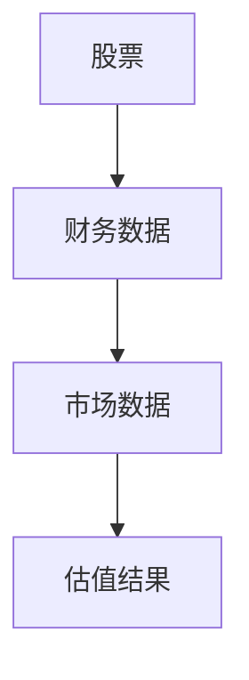
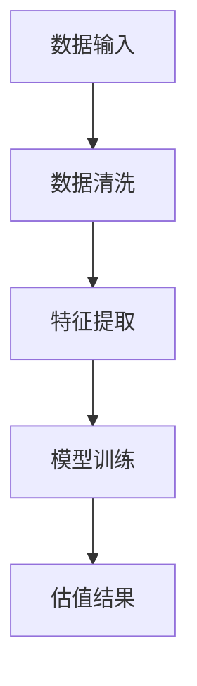
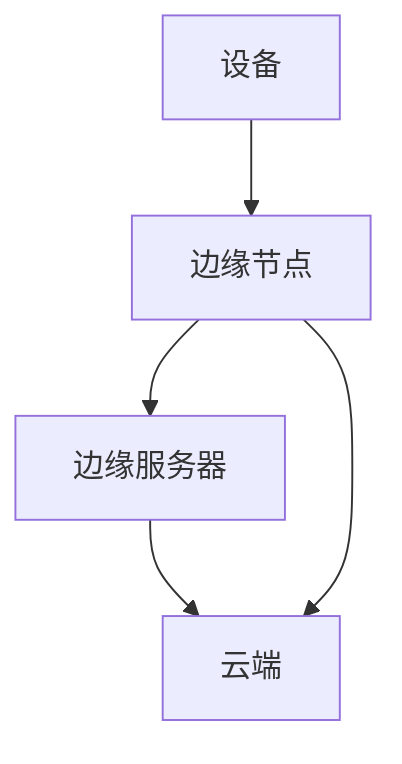
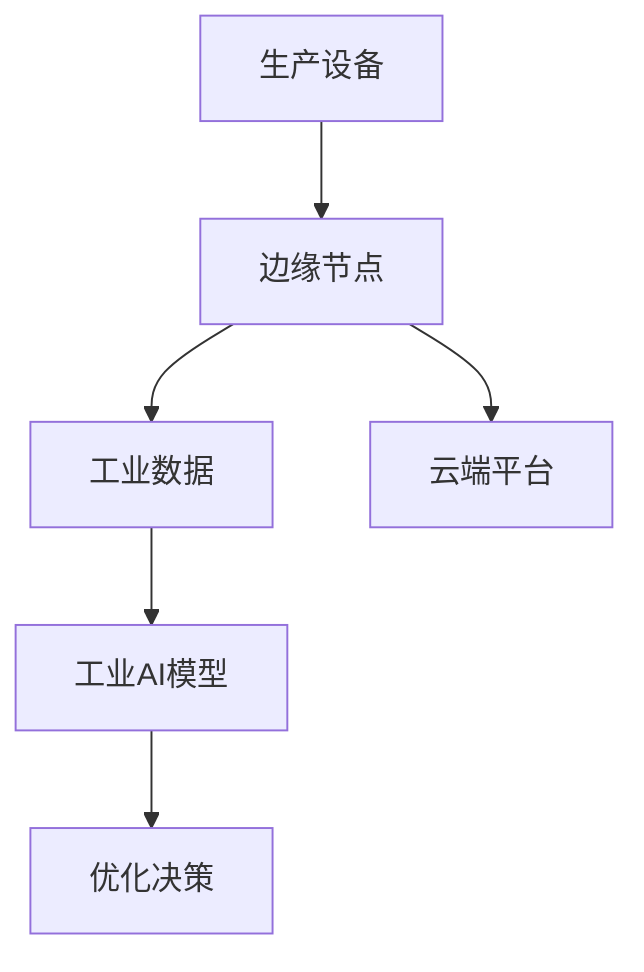

                 


# 全球股市估值与边缘计算在智能制造中的应用

## 关键词：全球股市估值、边缘计算、智能制造、工业4.0、边缘计算体系架构、工业数据采集、量化投资

## 摘要：  
本文探讨了全球股市估值的核心方法与边缘计算在智能制造中的应用，通过分析股市估值的背景、核心概念、算法原理以及边缘计算在智能制造中的体系架构、关键技术与应用案例，结合实际项目与代码实现，深入解析了这两者的结合与相互影响。本文内容涵盖背景介绍、概念对比、算法流程、系统架构设计、项目实战与最佳实践，旨在为读者提供一个全面、深入且易于理解的专业技术视角。

---

## 第一部分: 全球股市估值的背景与方法

### 第1章: 全球股市估值概述

#### 1.1 全球股市估值的背景与意义
- **1.1.1 什么是全球股市估值**  
  全球股市估值是通过对上市公司财务数据和市场数据的分析，评估股票的内在价值，帮助投资者做出投资决策。  
- **1.1.2 全球股市估值的重要性**  
  股市估值是投资决策的核心依据，能够帮助投资者识别低估或高估的股票，优化投资组合，降低风险。  
- **1.1.3 全球股市估值的边界与外延**  
  全球股市估值不仅关注单一市场，还需要考虑全球市场的联动性、宏观经济环境以及行业周期性。

#### 1.2 股市估值的核心概念与联系
- **1.2.1 核心概念原理**  
  股市估值的核心在于通过财务指标（如市盈率、市净率）和市场指标（如市场情绪）来衡量股票的价值。  
- **1.2.2 股市估值相关概念对比表格**  
  | 指标 | 定义 | 适用场景 |  
  |------|------|----------|  
  | 市盈率（P/E） | 价格与每股收益的比值 | 评估股票的相对估值 |  
  | 市净率（P/B） | 价格与每股净资产的比值 | 适用于净资产驱动的行业 |  
  | 股息率 | 每股股息与股票价格的比值 | 评估股票的分红能力 |  
- **1.2.3 ER实体关系图架构（Mermaid流程图）**  


### 第2章: 全球股市估值的方法与模型

#### 2.1 传统估值方法
- **2.1.1 市盈率（P/E）模型**  
  $$ P/E = \frac{Price}{Earnings} $$  
- **2.1.2 市净率（P/B）模型**  
  $$ P/B = \frac{Price}{Book\ Value} $$  
- **2.1.3 股息率模型**  
  $$ Dividend\ Yield = \frac{Dividend}{Price} $$  

#### 2.2 现代量化估值方法
- **2.2.1 市场情绪分析模型**  
  通过自然语言处理（NLP）分析新闻和社交媒体，评估市场情绪对股票估值的影响。  
- **2.2.2 风险中性定价模型**  
  在无套利条件下，通过资产定价模型（如CAPM）确定股票的公允价值。  
- **2.2.3 多因子模型**  
  $$ R_i = \alpha + \beta_1 F_1 + \beta_2 F_2 + \dots + \beta_n F_n + \epsilon $$  
  其中，$F$ 表示市场因子，$\beta$ 表示因子的敏感性。

### 第3章: 股市估值的算法原理

#### 3.1 股市估值算法的数学模型
- **3.1.1 市盈率模型公式**  
  $$ P/E = \frac{Price}{Earnings} $$  
- **3.1.2 多因子模型公式**  
  $$ R_i = \alpha + \beta_1 F_1 + \beta_2 F_2 + \dots + \beta_n F_n + \epsilon $$  

#### 3.2 算法流程图（Mermaid）


#### 3.3 代码实现
- **3.3.1 环境安装**  
  ```bash
  pip install pandas numpy scikit-learn
  ```
- **3.3.2 核心代码**  
  ```python
  import pandas as pd
  from sklearn.linear_model import LinearRegression

  # 数据清洗与特征提取
  df = pd.read_csv('stock_data.csv')
  features = df[['P', 'E', 'B', 'D']]
  target = df['Valuation']

  # 模型训练
  model = LinearRegression()
  model.fit(features, target)

  # 估值预测
  new_stock = pd.DataFrame({
      'P': [100],
      'E': [20],
      'B': [50],
      'D': [2]
  })
  prediction = model.predict(new_stock)
  print("预测估值：", prediction[0])
  ```

---

## 第二部分: 边缘计算技术概述

### 第4章: 边缘计算的核心概念与技术

#### 4.1 边缘计算的概念与特点
- **4.1.1 边缘计算的定义**  
  边缘计算是指在数据源附近进行数据处理和分析，减少对云端的依赖，提高实时性和安全性。  
- **4.1.2 边缘计算的特点**  
  - 分布式架构  
  - 低延迟  
  - 高实时性  
  - 数据隐私与安全  

#### 4.2 边缘计算的体系架构
- **4.2.1 边缘计算体系架构（Mermaid图）**  


#### 4.3 边缘计算的关键技术
- **4.3.1 数据采集与处理**  
  使用物联网（IoT）设备进行数据采集，通过边缘节点进行实时处理。  
- **4.3.2 边缘计算中的数据安全**  
  通过加密技术、访问控制和数据脱敏技术保护边缘设备的数据安全。

---

## 第三部分: 边缘计算在智能制造中的应用

### 第5章: 边缘计算在智能制造中的体系架构

#### 5.1 智能制造的背景与需求
- **5.1.1 智能制造的核心特征**  
  - 自动化生产  
  - 智能决策  
  - 数字化管理  

#### 5.2 边缘计算在智能制造中的应用体系
- **5.2.1 工业数据采集**  
  使用边缘设备实时采集生产过程中的数据，如温度、压力、速度等。  
- **5.2.2 工业AI与边缘计算的结合**  
  在边缘节点部署机器学习模型，进行实时预测和优化。

#### 5.3 边缘计算在智能制造中的系统架构（Mermaid图）  


### 第6章: 边缘计算在智能制造中的关键技术

#### 6.1 边缘计算在工业数据采集中的应用
- **6.1.1 工业数据采集的挑战**  
  - 数据量大  
  - 实时性要求高  
  - 网络环境复杂  

#### 6.2 边缘计算在工业AI中的应用
- **6.2.1 工业AI的核心算法**  
  - 异常检测  
  - 预测性维护  
  - 质量控制  

#### 6.3 边缘计算在数字孪生中的应用
- **6.3.1 数字孪生的定义**  
  数字孪生是通过数字化技术，构建物理设备的虚拟模型，实现实时监控与优化。  
- **6.3.2 边缘计算在数字孪生中的作用**  
  通过边缘计算实时更新虚拟模型，实现物理设备与虚拟模型的同步。

---

## 第四部分: 全球股市估值与边缘计算的结合

### 第7章: 数据驱动的量化投资

#### 7.1 量化投资的核心理念
- **7.1.1 量化投资的定义**  
  通过数学模型和算法进行投资决策，减少人为情绪的影响。  
- **7.1.2 数据驱动的投资策略**  
  - 基于历史数据的因子投资  
  - 基于实时数据的高频交易  

#### 7.2 边缘计算在量化投资中的应用
- **7.2.1 实时数据处理**  
  通过边缘计算实时处理市场数据，快速做出交易决策。  
- **7.2.2 风险管理与监控**  
  利用边缘计算进行实时风险评估，确保投资组合的安全性。

### 第8章: 边缘计算在金融分析中的应用

#### 8.1 边缘计算在金融分析中的优势
- **8.1.1 实时性**  
  边缘计算能够快速处理金融数据，满足高频交易的需求。  
- **8.1.2 数据隐私**  
  边缘计算可以在本地处理敏感数据，保护数据隐私。  

#### 8.2 边缘计算在金融分析中的关键技术
- **8.2.1 分布式计算**  
  在多个边缘节点上并行处理数据，提高计算效率。  
- **8.2.2 智能合约**  
  利用区块链技术，在边缘节点上实现智能合约的自动执行。

---

## 第五部分: 总结与展望

### 第9章: 全文总结

#### 9.1 全球股市估值的核心要点
- 股市估值是投资决策的核心，传统方法与现代量化方法各有优劣。  
- 边缘计算的应用能够提高估值的实时性和准确性。

#### 9.2 边缘计算在智能制造中的应用价值
- 边缘计算通过实时数据处理和智能决策，推动了智能制造的数字化转型。

#### 9.3 两者的结合与相互影响
- 全球股市估值与边缘计算的结合，不仅能够提升金融市场的效率，还能够为智能制造提供强大的数据支持。

### 第10章: 未来展望

#### 10.1 全球股市估值的未来趋势
- 更多的量化模型将被引入，人工智能和大数据技术将进一步提升估值的准确性。  

#### 10.2 边缘计算在智能制造中的未来发展
- 边缘计算将与工业互联网、数字孪生等技术深度融合，推动智能制造的智能化发展。  

#### 10.3 技术融合的潜力
- 全球股市估值与边缘计算的结合将催生更多创新的金融工具和智能制造模式，推动全球经济的数字化转型。

---

## 作者：AI天才研究院/AI Genius Institute & 禅与计算机程序设计艺术 /Zen And The Art of Computer Programming

