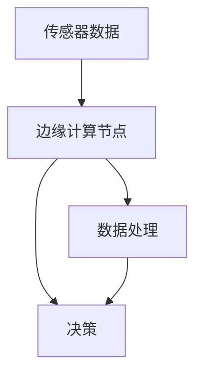
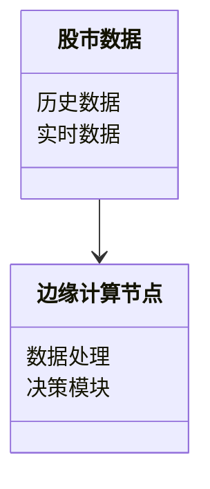
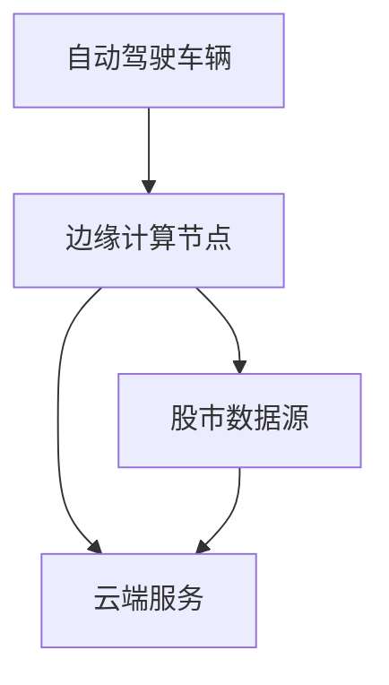
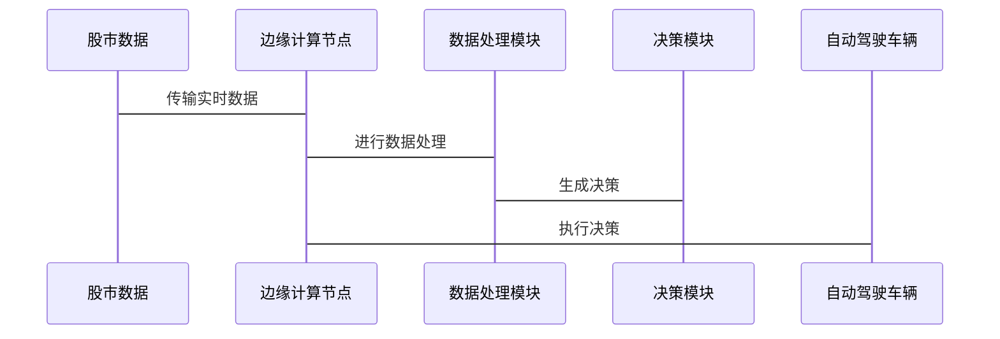

                 


# 全球股市估值与边缘计算在自动驾驶中的应用

> 关键词：全球股市估值，边缘计算，自动驾驶，实时数据处理，分布式计算，股市预测，智能决策

> 摘要：本文探讨了全球股市估值与边缘计算在自动驾驶中的应用。通过分析股市估值模型和边缘计算技术，展示了边缘计算如何提升自动驾驶中的实时数据处理能力，并应用于股市预测和智能决策。文章详细讲解了相关算法、系统架构，并通过实际案例分析了边缘计算在自动驾驶中的应用效果。

---

# 第一部分：全球股市估值与边缘计算概述

## 第1章：背景介绍

### 1.1 全球股市估值的现状与挑战

#### 1.1.1 股市估值的基本概念

股市估值是通过对公司的财务数据、市场环境和行业趋势进行分析，估算公司股票的合理价格。常见的估值方法包括市盈率（P/E）、市净率（P/B）和现金流折现模型（DCF）。例如，市盈率计算公式为：

$$\text{市盈率} = \frac{\text{股价}}{\text{每股净利润}}$$

#### 1.1.2 全球股市估值的现状分析

随着全球经济一体化，股市估值成为投资者决策的关键依据。然而，股市数据的实时性和准确性对估值模型提出了更高要求。传统的集中式计算难以满足高频交易和实时分析的需求。

#### 1.1.3 股市估值的主要挑战

- 数据量大：股市数据包含大量实时信息，处理速度要求高。
- 计算复杂：需要复杂的数学模型和算法。
- 市场波动：高频交易和市场波动增加了计算的难度。

### 1.2 边缘计算的核心概念与特点

#### 1.2.1 边缘计算的定义

边缘计算是指在数据源附近进行数据处理和存储的技术，减少数据传输到云端的延迟。它具有低延迟、高实时性和分布式特点。

#### 1.2.2 边缘计算的主要特点

- **低延迟**：在数据源附近进行计算，减少网络传输时间。
- **高实时性**：能够快速响应实时数据变化。
- **分布式**：边缘设备可以独立处理数据，提高系统的可靠性和扩展性。

#### 1.2.3 边缘计算与云计算的区别

边缘计算与云计算的主要区别在于数据处理的位置和时间。云计算将数据集中处理，而边缘计算在数据源附近处理，适用于需要实时响应的场景。

### 1.3 自动驾驶中的边缘计算应用

#### 1.3.1 自动驾驶的基本概念

自动驾驶是通过多种传感器和计算技术实现车辆的自主行驶。它依赖实时数据处理和快速决策，对计算能力提出了高要求。

#### 1.3.2 边缘计算在自动驾驶中的作用

边缘计算在自动驾驶中用于处理传感器数据，如激光雷达、摄像头和雷达的数据，快速做出驾驶决策，减少对云端的依赖。

#### 1.3.3 自动驾驶对边缘计算的需求

自动驾驶需要处理大量实时数据，边缘计算能够满足其低延迟和高实时性的需求，提升车辆的反应速度和安全性。

---

## 第2章：核心概念与联系

### 2.1 股市估值与边缘计算的关联

#### 2.1.1 股市数据的实时性要求

股市数据的实时性对估值模型的准确性至关重要。边缘计算通过在数据源附近处理数据，满足实时性的需求。

#### 2.1.2 边缘计算在实时数据处理中的优势

边缘计算能够快速处理和分析数据，减少延迟，提高股市估值的实时性。

#### 2.1.3 股市估值与边缘计算的协同效应

通过边缘计算处理实时数据，股市估值模型能够更准确地预测市场趋势，提升投资决策的效率。

### 2.2 股市估值模型的数学公式

#### 2.2.1 市盈率模型

市盈率模型用于评估股票的相对价值：

$$\text{市盈率} = \frac{\text{股价}}{\text{每股净利润}}$$

#### 2.2.2 市净率模型

市净率模型基于资产价值进行评估：

$$\text{市净率} = \frac{\text{股价}}{\text{每股净资产}}$$

#### 2.2.3 现金流折现模型

现金流折现模型用于预测未来现金流的现值：

$$\text{企业价值} = \sum_{t=1}^{n} \frac{\text{现金流}}{(1 + r)^t}$$

### 2.3 边缘计算的系统架构图



---

## 第3章：股市估值与边缘计算的算法原理

### 3.1 股市估值算法

#### 3.1.1 移动平均线算法

移动平均线算法用于平滑数据，识别趋势：

$$\text{MA}_n = \frac{1}{n} \sum_{i=1}^{n} \text{价格}_i$$

#### 3.1.2 布林带算法

布林带算法用于识别数据的波动范围：

$$\text{中轨} = \text{MA}(n)$$
$$\text{上轨} = \text{中轨} + \text{标准差}(n) \times k$$
$$\text{下轨} = \text{中轨} - \text{标准差}(n) \times k$$

#### 3.1.3 K线图分析算法

K线图分析算法通过图表形态识别市场趋势。

### 3.2 边缘计算算法

#### 3.2.1 数据压缩算法

数据压缩算法减少数据量，提高传输效率：

- 使用哈夫曼编码压缩数据。

#### 3.2.2 分布式计算算法

分布式计算算法将任务分配给多个节点：

$$\text{总结果} = \sum_{i=1}^{m} \text{节点}_i.\text{计算结果}$$

#### 3.2.3 实时数据处理算法

实时数据处理算法快速响应数据变化：

使用滑动窗口技术处理实时数据流。

### 3.3 股市估值与边缘计算的协同算法

#### 3.3.1 数据流处理算法

数据流处理算法实时更新和处理数据流。

#### 3.3.2 智能决策算法

智能决策算法结合边缘计算和机器学习模型做出投资决策。

#### 3.3.3 实时反馈机制

实时反馈机制根据市场变化动态调整估值模型。

---

# 第二部分：系统分析与架构设计

## 第4章：系统分析与架构设计方案

### 4.1 问题场景介绍

边缘计算在自动驾驶中的应用需要处理大量的实时数据，提升计算效率和决策速度。

### 4.2 项目介绍

本项目旨在设计一个结合边缘计算和股市估值的系统，实现自动驾驶中的实时数据分析和智能决策。

### 4.3 系统功能设计

#### 4.3.1 领域模型



#### 4.3.2 系统架构设计



### 4.4 系统接口设计

#### 4.4.1 接口设计

- 数据接口：接收和处理实时股市数据。
- 决策接口：输出投资决策和驾驶指令。

### 4.5 系统交互设计



---

## 第5章：项目实战

### 5.1 环境安装

#### 5.1.1 系统环境

- 操作系统：Linux
- 开发工具：Python、Jupyter Notebook
- 依赖库：numpy、pandas、scikit-learn

### 5.2 核心实现源代码

#### 5.2.1 数据处理代码

```python
import numpy as np
import pandas as pd

# 示例数据
data = pd.DataFrame({
    '时间': range(10),
    '价格': np.random.randn(10) * 100 + 1000
})

# 计算移动平均线
data['MA_5'] = data['价格'].rolling(5).mean()
print(data)
```

#### 5.2.2 边缘计算代码

```python
import time

def edge_computing(data):
    # 示例计算
    processed_data = data[data['价格'] > data['MA_5']]
    return processed_data

# 模拟实时数据流
data_stream = pd.DataFrame({
    '时间': range(100),
    '价格': np.random.randn(100) * 10 + 1000
})

start_time = time.time()
processed_data = edge_computing(data_stream)
end_time = time.time()

print(f"处理时间: {end_time - start_time}")
```

### 5.3 案例分析

#### 5.3.1 案例介绍

通过边缘计算处理实时股市数据，提升自动驾驶中的投资决策效率。

#### 5.3.2 代码实现

```python
import time
from sklearn.linear_model import LinearRegression

def predict_stock_price(data):
    model = LinearRegression()
    model.fit(data[['时间']], data['价格'])
    return model.predict(data[['时间']])

# 模拟数据
data = pd.DataFrame({
    '时间': range(20),
    '价格': np.random.randn(20) * 100 + 1000
})

# 预测价格
predicted_price = predict_stock_price(data)
print("预测价格:", predicted_price)
```

### 5.4 代码解读与分析

- 数据处理代码展示了如何使用Python处理和分析股市数据。
- 边缘计算代码实现了实时数据流的处理，展示了边缘计算在自动驾驶中的应用。
- 案例分析部分通过线性回归模型预测股票价格，展示了如何结合边缘计算提升预测效率。

---

## 第6章：总结与展望

### 6.1 项目总结

通过边缘计算和股市估值的结合，提升了自动驾驶中的实时数据分析能力，为投资决策提供了更高效的支持。

### 6.2 最佳实践 tips

- 确保边缘计算节点的实时性和可靠性。
- 定期更新和优化算法模型，提升预测准确性。
- 注意数据隐私和安全，确保合规性。

### 6.3 小结

边缘计算在自动驾驶和股市估值中的应用前景广阔，未来可以通过进一步优化算法和系统架构，提升计算效率和决策准确性。

### 6.4 注意事项

- 数据实时性要求高，需优化网络传输和数据处理速度。
- 算法模型需要不断更新，适应市场变化。
- 系统设计需考虑扩展性和可维护性。

### 6.5 拓展阅读

- 深入学习边缘计算和分布式系统知识。
- 研究最新的股市预测算法和机器学习模型。

---

# 结语

通过本文的详细分析，我们展示了边缘计算在自动驾驶和股市估值中的重要应用。边缘计算的低延迟和高实时性特点，为股市数据处理和自动驾驶决策提供了有力支持。未来，随着技术的不断进步，边缘计算将在更多领域发挥重要作用。

---

# 作者

作者：AI天才研究院/AI Genius Institute & 禅与计算机程序设计艺术/Zen And The Art of Computer Programming

