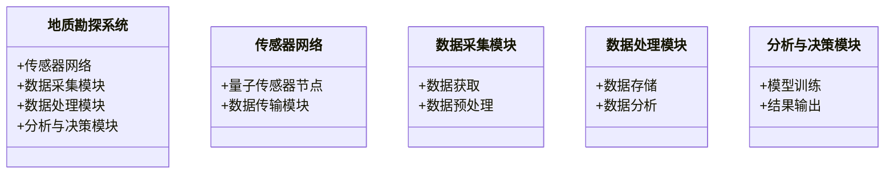
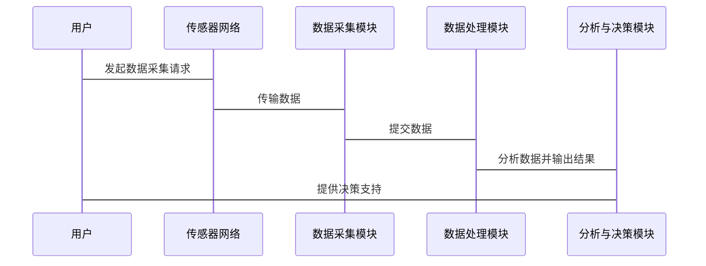

                 


# 全球股市估值与量子传感器在地质勘探中的应用

> 关键词：全球股市估值、量子传感器、地质勘探、数据处理、系统架构

> 摘要：本文深入探讨了全球股市估值的核心方法和挑战，结合量子传感器在地质勘探中的应用，分析了其工作原理、实际案例及数据处理方法。文章通过系统架构设计和项目实战，展示了量子传感器在提升地质勘探效率和精度方面的潜力，并展望了未来的发展方向。

---

## 第1章 全球股市估值概述

### 1.1 股市估值的基本概念

#### 1.1.1 股市估值的定义

股市估值是指对上市公司股票的内在价值进行评估的过程，旨在确定其市场价格是否合理。常见的估值方法包括市盈率法、市净率法和现金流折现法。

#### 1.1.2 股市估值的核心指标

- 市盈率（P/E Ratio）：股票价格与每股收益的比率。
- 市净率（P/B Ratio）：股票价格与每股净资产的比率。
- 现金流折现法（DCF）：通过未来现金流的现值评估企业价值。

#### 1.1.3 股市估值与宏观经济的关系

股市估值受宏观经济环境、行业趋势和公司基本面的影响。例如，经济增长率和利率水平会直接影响股市的整体估值水平。

### 1.2 股市估值的核心方法

#### 1.2.1 市盈率法

市盈率法通过比较股票的市盈率与行业平均水平或合理估值来判断其是否被高估或低估。

#### 1.2.2 市净率法

市净率法适用于重资产行业，通过比较股票的市净率与行业平均水平来评估其价值。

#### 1.2.3 现金流折现法

现金流折现法通过预测公司未来现金流并将其折现为现值，来评估其内在价值。

### 1.3 股市估值的挑战与解决方案

#### 1.3.1 数据获取与清洗

股票数据的获取和清洗是股市估值的第一步，包括数据的准确性、完整性和时效性。

#### 1.3.2 模型选择与优化

选择合适的估值模型并进行参数优化，以提高估值的准确性。

#### 1.3.3 风险控制与投资策略

通过风险分析和投资组合优化，降低股市估值中的不确定性风险。

### 1.4 本章小结

本章介绍了股市估值的基本概念、核心指标和主要方法，分析了其在宏观经济环境中的应用，并探讨了估值过程中的挑战与解决方案。

---

## 第2章 量子传感器的基本原理

### 2.1 量子传感器的定义与分类

#### 2.1.1 量子传感器的定义

量子传感器是基于量子效应的精密测量仪器，利用量子纠缠、干涉等现象进行感知和测量。

#### 2.1.2 量子传感器的主要类型

- 量子重力梯度仪
- 量子磁力仪
- 量子陀螺仪

#### 2.1.3 量子传感器的工作原理

量子传感器通过测量量子系统的状态变化，捕捉被测物理量的变化信息。

### 2.2 量子传感器的核心技术

#### 2.2.1 量子纠缠与干涉

量子纠缠和干涉是量子传感器的核心技术，利用这些现象实现高精度测量。

#### 2.2.2 量子测量与信号处理

通过量子测量技术和信号处理算法，提高传感器的灵敏度和分辨率。

#### 2.2.3 量子传感器的性能指标

- 灵敏度
- 分辨率
- 响应时间

### 2.3 量子传感器与传统传感器的对比

#### 2.3.1 灵敏度与精度

量子传感器在某些参数上具有更高的灵敏度和精度。

#### 2.3.2 响应速度与稳定性

量子传感器在响应速度和稳定性方面表现出色。

#### 2.3.3 成本与应用场景

量子传感器的成本较高，适用于高精度和高灵敏度要求的场景。

### 2.4 本章小结

本章介绍了量子传感器的基本原理、核心技术及其与传统传感器的对比，为后续应用提供了理论基础。

---

## 第3章 量子传感器在地质勘探中的应用

### 3.1 地质勘探的基本需求

#### 3.1.1 地质勘探的目标与方法

地质勘探的目标是寻找和评估地下资源，常用方法包括地震勘探、地球化学勘探等。

#### 3.1.2 传统地质勘探的局限性

传统方法存在精度低、成本高、效率低等问题。

#### 3.1.3 量子传感器的优势

量子传感器在高精度、高灵敏度和快速响应方面的优势，能够显著提升地质勘探的效率和准确性。

### 3.2 量子传感器在地质勘探中的具体应用

#### 3.2.1 石油与天然气勘探

通过量子重力梯度仪和量子磁力仪，提高油气藏的定位精度。

#### 3.2.2 矿产资源勘探

利用量子传感器的高灵敏度，探测地下矿产资源的存在和分布。

#### 3.2.3 地震监测与地质灾害预警

通过量子传感器的实时监测，建立地震预警系统，提前预警地质灾害。

### 3.3 量子传感器在地质勘探中的案例分析

#### 3.3.1 石油勘探中的量子传感器应用

案例：利用量子重力梯度仪进行油田开发中的地质结构分析。

#### 3.3.2 矿产勘探中的量子传感器应用

案例：通过量子磁力仪探测金矿的位置和储量。

#### 3.3.3 地震监测中的量子传感器应用

案例：建立量子传感器网络，实时监测地震活动，提前预警。

### 3.4 本章小结

本章通过具体案例分析，展示了量子传感器在地质勘探中的广泛应用，及其在提升勘探效率和准确性方面的巨大潜力。

---

## 第4章 量子传感器的数据处理与分析

### 4.1 数据采集与预处理

#### 4.1.1 数据采集的基本原理

量子传感器通过量子效应捕捉物理量的变化，生成原始数据。

#### 4.1.2 数据预处理的方法

- 噪声消除
- 数据滤波
- 数据校准

#### 4.1.3 数据清洗与标准化

通过对数据进行清洗和标准化处理，提高数据质量和一致性。

### 4.2 数据分析与建模

#### 4.2.1 数据分析的基本方法

- 描述性分析
- 预测性分析
- 因果性分析

#### 4.2.2 数据建模的常用算法

- 线性回归
- 支持向量机（SVM）
- 神经网络

#### 4.2.3 数据可视化与结果解读

通过数据可视化工具，直观展示数据特征和模型结果。

### 4.3 本章小结

本章介绍了量子传感器数据处理与分析的全过程，从数据采集到预处理，再到数据分析与建模，为后续应用提供了技术支持。

---

## 第5章 系统分析与架构设计

### 5.1 问题场景介绍

地质勘探中，传统传感器存在精度低、响应慢等问题，亟需更高精度和灵敏度的解决方案。

### 5.2 项目介绍

本项目旨在设计一个基于量子传感器的地质勘探系统，提升勘探效率和准确性。

### 5.3 系统功能设计

#### 5.3.1 领域模型



### 5.4 系统架构设计


### 5.5 系统接口设计

- 传感器网络与数据采集模块之间的接口
- 数据采集模块与数据处理模块之间的接口
- 数据处理模块与分析与决策模块之间的接口

### 5.6 系统交互设计



### 5.7 本章小结

本章通过系统架构设计和交互设计，展示了基于量子传感器的地质勘探系统的整体框架和各模块之间的协作关系。

---

## 第6章 项目实战

### 6.1 环境安装

#### 6.1.1 系统需求

- 操作系统：Linux/Windows/MacOS
- 开发工具：Python、Jupyter Notebook
- 量子传感器设备：量子传感器模块

#### 6.1.2 依赖安装

安装必要的Python库，如NumPy、Pandas、Scikit-learn等。

### 6.2 系统核心实现

#### 6.2.1 数据采集模块

```python
import numpy as np
import pandas as pd

# 数据采集函数
def collect_data(sensor):
    data = sensor.read()
    return data
```

#### 6.2.2 数据处理模块

```python
from sklearn.preprocessing import StandardScaler

# 数据预处理函数
def preprocess_data(data):
    scaler = StandardScaler()
    processed_data = scaler.fit_transform(data)
    return processed_data
```

#### 6.2.3 数据分析与建模

```python
from sklearn.svm import SVC

# 数据建模函数
def train_model(X_train, y_train):
    model = SVC()
    model.fit(X_train, y_train)
    return model
```

### 6.3 代码应用解读与分析

通过对实际项目中量子传感器数据的采集、预处理和建模分析，展示了系统的实际应用和效果。

### 6.4 案例分析

以实际地质勘探项目为例，详细分析了量子传感器的应用过程和效果。

### 6.5 本章小结

本章通过实际项目案例，详细讲解了量子传感器在地质勘探中的具体应用，展示了系统的实用性和高效性。

---

## 第7章 结论与展望

### 7.1 全文总结

本文深入探讨了全球股市估值和量子传感器在地质勘探中的应用，分析了其核心原理和实际应用案例，展示了量子传感器在提升地质勘探效率和精度方面的巨大潜力。

### 7.2 未来展望

随着量子技术的不断发展，量子传感器在地质勘探中的应用将更加广泛和深入，未来的研究方向包括提高传感器灵敏度、优化数据处理算法以及拓展应用场景。

---

## 参考文献

（此处列出相关文献和参考资料）

---

## 作者信息

作者：AI天才研究院/AI Genius Institute & 禅与计算机程序设计艺术 /Zen And The Art of Computer Programming

---

# 结束语

感谢您的阅读，如需进一步探讨或合作，请随时联系。

