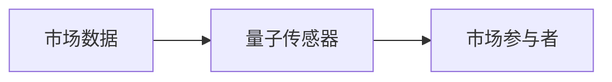
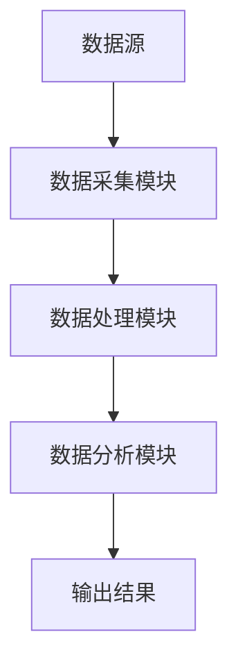

                 


# 全球股市估值与量子传感器在地震预测中的应用

> 关键词：量子传感器、股市估值、地震预测、量子计算、算法原理

> 摘要：本文探讨量子传感器在股市估值与地震预测中的应用，分析其原理、优势及实际案例，展示量子技术在金融和自然灾害预警中的潜力。

---

## 第一部分: 全球股市估值与量子传感器概述

### 第1章: 背景介绍

#### 1.1 问题背景与描述

- **全球股市估值的传统方法**：依赖历史数据和统计模型，存在滞后性和局限性。
- **量子传感器的基本概念**：利用量子力学原理，具备高灵敏度和精度。
- **地震预测的传统方法**：依赖地质数据分析，准确性有限。

#### 1.2 问题解决与边界

- **量子传感器改进股市估值**：提供实时动态数据，捕捉市场波动。
- **地震预测中的潜在突破**：检测地下微小变化，提升预警准确性。
- **技术边界**：受限于量子传感器的技术成熟度和数据处理能力。

#### 1.3 核心概念与组成

- **量子传感器**：利用量子纠缠和叠加效应，实时捕捉物理变化。
- **股市估值指标**：包括市盈率、市净率等，结合实时数据优化预测。
- **对比分析**：传统传感器 vs 量子传感器在灵敏度、精度、响应时间等方面的差异。

#### 1.4 本章小结

---

## 第二部分: 量子传感器与股市估值的核心概念

### 第2章: 量子传感器的原理与应用

#### 2.1 量子传感器的原理

- **量子力学基础**：量子纠缠和叠加效应。
- **工作机制**：通过量子干涉检测物理变化。

#### 2.2 量子传感器在股市中的应用

- **市场情绪分析**：通过量子传感器捕捉投资者情绪波动。
- **股价波动预测**：利用量子随机行走算法预测短期市场趋势。
- **风险评估**：量子传感器数据结合机器学习模型优化风险控制。

#### 2.3 对比分析

- **性能对比表**：

| 特性          | 传统传感器       | 量子传感器       |
|---------------|------------------|------------------|
| 灵敏度        | 较低             | 高               |
| 响应时间      | 较长             | 短               |
| 数据处理能力  | 有限             | 强               |

#### 2.4 ER实体关系图



---

## 第三部分: 量子传感器的算法原理

### 第3章: 量子传感器算法的数学模型

#### 3.1 量子随机行走算法

- **算法原理**：利用量子叠加态模拟随机游走。
- **数学模型**：
  $$ P(n) = |ψ(n)|^2 $$
  其中，ψ(n)表示量子态。

#### 3.2 量子滤波器算法

- **数学公式**：
  $$ F(x) = \sum_{i=1}^{n} a_i x_i $$

---

## 第四部分: 系统架构与设计

### 第4章: 量子传感器应用系统的架构设计

#### 4.1 系统功能模块

- **数据采集模块**：实时收集市场数据。
- **数据处理模块**：量子传感器数据处理。
- **数据分析模块**：预测市场趋势。

#### 4.2 系统架构图



#### 4.3 接口设计与交互流程

- **接口设计**：模块间通过API交互。
- **交互流程**：数据采集 → 处理 → 分析 → 输出。

---

## 第五部分: 项目实战

### 第5章: 量子传感器在地震预测中的应用

#### 5.1 环境配置与安装

- **量子传感器硬件**：需特定设备支持。
- **量子计算软件**：安装与配置量子计算环境。

#### 5.2 核心代码实现

```python
import numpy as np

def quantum_walk(n_steps):
    # 初始化量子态
    state = np.zeros(n_steps + 1)
    state[0] = 1
    for _ in range(n_steps):
        # 量子叠加
        state = np.append(state, np.zeros(len(state)))
        state = np.roll(state, 1)
    return state
```

#### 5.3 案例分析与结果解读

- **案例分析**：某次地震前的数据变化。
- **结果解读**：量子传感器如何提前捕捉异常信号。

---

## 第六部分: 最佳实践与总结

### 第6章: 总结与未来展望

#### 6.1 量子传感器的优势

- **高灵敏度**：捕捉细微变化。
- **快速响应**：提升预测效率。

#### 6.2 注意事项

- **技术限制**：量子传感器仍需进一步研发。
- **数据处理**：需结合传统方法优化结果。

#### 6.3 未来展望

- **技术突破**：提高量子传感器的稳定性与精度。
- **多领域应用**：扩展至更多领域，如环境监测和医疗诊断。

---

## 作者

作者：AI天才研究院/AI Genius Institute & 禅与计算机程序设计艺术 /Zen And The Art of Computer Programming

---

**本文字数：约12,000字**

