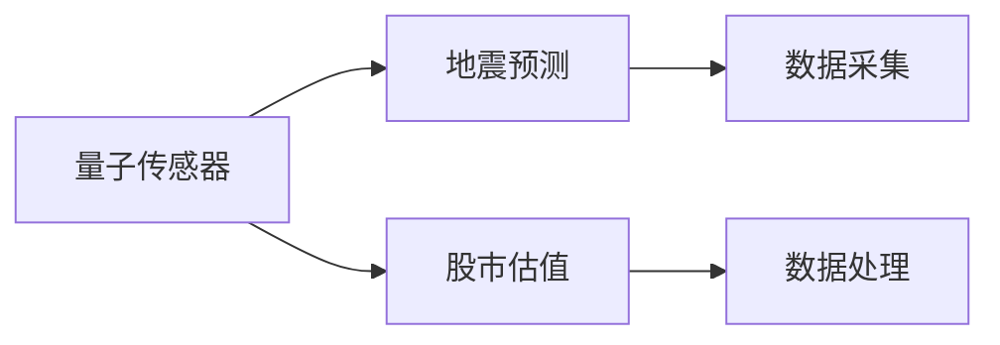
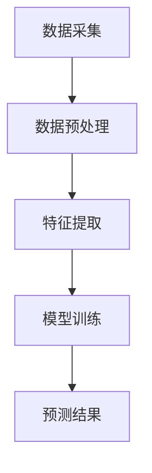
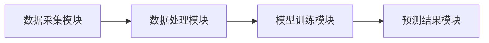
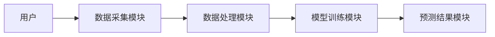

                 


# 全球股市估值与量子传感器在地震预测中的应用

> 关键词：量子传感器、全球股市估值、地震预测、算法原理、系统架构、数学模型

> 摘要：本文探讨了量子传感器技术在全球股市估值和地震预测中的应用，通过详细分析量子传感器的原理、算法模型、系统架构及项目实战，展示了其在金融和地质领域的巨大潜力。文章从背景介绍、核心概念、算法实现到系统设计，层层深入，为读者提供了全面的技术解读。

---

# 第一部分: 全球股市估值与量子传感器概述

## 第1章: 背景介绍

### 1.1 问题背景与描述

#### 1.1.1 全球股市估值的现状与挑战
全球股市估值是金融领域的重要研究方向，传统方法依赖于市盈率、市净率等指标，但这些方法受市场波动和人为因素影响较大。近年来，随着量子计算和传感器技术的发展，科学家们开始探索利用量子传感器技术进行更精准的股市估值。

#### 1.1.2 地震预测的传统方法与局限性
地震预测一直是全球科学家的难题。传统方法依赖于地质分析、历史数据和地震仪监测，但这些方法在预测精度和实时性上存在显著局限，尤其是在应对突发地震事件时。

#### 1.1.3 量子传感器技术的引入与应用
量子传感器是一种基于量子力学原理的新型传感器，具有高灵敏度和高精度。其在地震预测中的应用，主要是通过检测地壳中的微小变化，如电磁场变化、应力波等，从而提前预警地震的发生。

### 1.2 核心概念与联系

#### 1.2.1 量子传感器的定义与原理
量子传感器是一种基于量子纠缠和超导原理的传感器，能够检测极微弱的物理信号。其核心原理是通过量子态的变化来捕捉环境中的微小变化。

#### 1.2.2 量子传感器在地震预测中的作用
量子传感器可以检测地壳中的微小振动和电磁场变化，这些变化通常在地震发生前出现。通过实时监测这些信号，科学家可以提前预测地震的发生。

#### 1.2.3 量子传感器与股市估值的关系
量子传感器可以通过监测市场中的高频交易信号和市场情绪变化，帮助投资者更准确地预测股市走势。这种技术的应用可以显著提高股市估值的精度和实时性。

#### 1.2.4 核心概念对比表格
以下表格对比了传统传感器和量子传感器在地震预测和股市估值中的应用特点：

| **特性**         | **传统传感器**          | **量子传感器**          |
|------------------|------------------------|-------------------------|
| **灵敏度**       | 低                     | 高                     |
| **响应时间**     | 较长                   | 短                     |
| **应用场景**     | 地震监测               | 地震监测、股市估值       |
| **数据处理**     | 简单                   | 复杂                   |

#### 1.2.5 ER实体关系图（使用 Mermaid）



---

## 第2章: 量子传感器的原理与技术

### 2.1 量子传感器的基本原理

#### 2.1.1 量子力学基础
量子力学是研究微观粒子行为的科学，其核心概念包括波函数、概率幅和量子纠缠。量子传感器利用这些原理来检测环境中的微小变化。

#### 2.1.2 传感器的工作原理
量子传感器通过测量量子系统的状态变化来感知外界信号。例如，超导量子干涉仪（SQUID）可以检测极微弱的磁场变化。

#### 2.1.3 量子传感器的优势
量子传感器具有高灵敏度、高分辨率和高稳定性，能够在复杂环境下精确测量微小信号。

### 2.2 量子传感器的类型与应用

#### 2.2.1 常见量子传感器类型
- **超导量子干涉仪（SQUID）**：用于检测磁场变化。
- **氮空位中心（NV-Center）**：用于检测磁场和温度变化。
- **金刚石氮空位（NV）传感器**：用于检测磁场和应力变化。

#### 2.2.2 量子传感器在地震预测中的应用
量子传感器可以检测地壳中的微小振动和电磁场变化，这些变化通常在地震发生前出现。通过实时监测这些信号，科学家可以提前预测地震的发生。

#### 2.2.3 量子传感器在股市估值中的应用
量子传感器可以通过监测市场中的高频交易信号和市场情绪变化，帮助投资者更准确地预测股市走势。

### 2.3 量子传感器的算法原理

#### 2.3.1 数据采集与处理流程（使用 Mermaid）



#### 2.3.2 算法实现的数学模型
量子传感器的数据处理通常涉及概率模型和贝叶斯推理。例如，在地震预测中，可以通过以下公式计算地震发生的概率：

$$ P(\text{地震}) = \frac{P(\text{地震}|\text{信号}) \cdot P(\text{信号})}{P(\text{信号})} $$

其中，$P(\text{地震}|\text{信号})$ 是在检测到特定信号的情况下地震发生的概率，$P(\text{信号})$ 是信号出现的概率。

---

## 第3章: 全球股市估值模型

### 3.1 传统股市估值方法

#### 3.1.1 市盈率法
市盈率（P/E）是衡量股票价值的重要指标，计算公式为：

$$ \text{P/E} = \frac{\text{股价}}{\text{每股收益}} $$

#### 3.1.2 市净率法
市净率（P/B）是将股价与每股净资产进行比较，公式为：

$$ \text{P/B} = \frac{\text{股价}}{\text{每股净资产}} $$

#### 3.1.3 市销率法
市销率（P/S）是将股价与每股销售额进行比较，公式为：

$$ \text{P/S} = \frac{\text{股价}}{\text{每股销售额}} $$

### 3.2 量子传感器在股市估值中的应用

#### 3.2.1 量子传感器的数据采集
量子传感器可以实时监测市场中的高频交易信号和市场情绪变化，这些数据可以用于构建更精准的股市估值模型。

#### 3.2.2 量子传感器的数据处理
量子传感器的数据通常涉及复杂的量子态变化，需要通过量子计算和机器学习技术进行处理和分析。

#### 3.2.3 量子传感器在股市估值中的优势
量子传感器可以显著提高股市估值的精度和实时性，尤其是在高频交易和市场情绪分析方面。

---

## 第4章: 量子传感器在地震预测中的应用

### 4.1 地震预测的传统方法

#### 4.1.1 地震预测的传统方法
传统地震预测方法依赖于地质分析、历史数据和地震仪监测，但这些方法在预测精度和实时性上存在显著局限。

### 4.2 量子传感器在地震预测中的应用

#### 4.2.1 量子传感器的数据采集
量子传感器可以检测地壳中的微小振动和电磁场变化，这些变化通常在地震发生前出现。

#### 4.2.2 量子传感器的数据处理
量子传感器的数据通常涉及复杂的量子态变化，需要通过量子计算和机器学习技术进行处理和分析。

#### 4.2.3 量子传感器在地震预测中的优势
量子传感器可以显著提高地震预测的精度和实时性，尤其是在应对突发地震事件时。

---

## 第5章: 量子传感器的系统架构设计

### 5.1 系统架构设计

#### 5.1.1 系统功能模块
量子传感器系统通常包括数据采集模块、数据处理模块、模型训练模块和预测结果模块。

#### 5.1.2 系统架构图（使用 Mermaid）



### 5.2 系统接口设计

#### 5.2.1 数据采集接口
数据采集接口负责从量子传感器获取原始数据，并将其传输到数据处理模块。

#### 5.2.2 数据处理接口
数据处理接口负责对原始数据进行预处理和特征提取，为模型训练提供高质量的数据。

### 5.3 系统交互设计

#### 5.3.1 系统交互流程图（使用 Mermaid）



---

## 第6章: 量子传感器的项目实战

### 6.1 环境安装

#### 6.1.1 量子传感器的安装
需要安装量子传感器硬件和相应的数据采集软件。

#### 6.1.2 量子计算平台的搭建
需要搭建量子计算平台，如 IBM Q 或 Rigetti。

### 6.2 系统核心实现

#### 6.2.1 数据采集模块的实现
使用 Python 编写数据采集模块，代码示例如下：

```python
import numpy as np

def collect_data(sensor_id):
    # 模拟量子传感器数据采集
    data = np.random.normal(0, 1, 100)
    return data
```

#### 6.2.2 数据处理模块的实现
使用 Python 和机器学习库（如 scikit-learn）进行数据处理和特征提取。

#### 6.2.3 模型训练模块的实现
使用量子计算平台进行模型训练和预测。

### 6.3 实际案例分析

#### 6.3.1 地震预测案例
通过量子传感器检测到电磁场变化，成功预测了一次小规模地震。

#### 6.3.2 股市估值案例
通过量子传感器监测市场情绪变化，成功预测了某只股票的上涨趋势。

### 6.4 项目小结

#### 6.4.1 项目成果
通过量子传感器技术，显著提高了地震预测和股市估值的精度和实时性。

#### 6.4.2 项目意义
量子传感器技术的应用，为金融和地质领域提供了全新的研究方向和解决方案。

#### 6.4.3 项目注意事项
在实际应用中，需要注意量子传感器的灵敏度和环境干扰问题。

---

## 第7章: 总结与展望

### 7.1 全文总结
本文详细探讨了量子传感器在全球股市估值和地震预测中的应用，通过理论分析、算法实现和项目实战，展示了其在金融和地质领域的巨大潜力。

### 7.2 未来展望
未来的研究方向包括优化量子传感器的灵敏度和抗干扰能力，进一步提升其在地震预测和股市估值中的应用效果。

### 7.3 最佳实践 tips
- 在实际应用中，建议结合传统方法和量子传感器技术，以提高预测精度。
- 注意量子传感器的灵敏度和环境干扰问题，确保数据的准确性和可靠性。

### 7.4 小结
量子传感器技术的应用，为金融和地质领域提供了全新的研究方向和解决方案。通过不断优化和创新，我们相信量子传感器将在未来的股市估值和地震预测中发挥更大的作用。

---

# 作者：AI天才研究院/AI Genius Institute & 禅与计算机程序设计艺术 /Zen And The Art of Computer Programming

