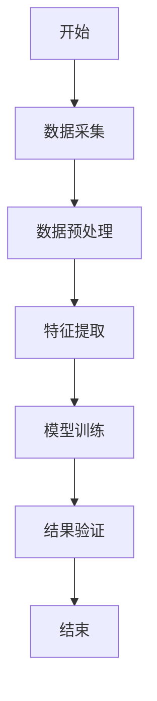

                 


# 全球股市估值与量子传感器技术的关系

## 关键词：全球股市估值、量子传感器技术、数据采集、算法分析、量子计算

## 摘要：本文探讨了量子传感器技术如何影响全球股市估值。通过分析量子传感器的数据采集能力、算法原理及系统架构，展示了其在金融数据处理中的应用潜力，结合实际案例，揭示了量子技术如何革新传统股市估值方法。

## 第一部分：全球股市估值与量子传感器技术的背景介绍

### 第1章：全球股市估值与量子传感器技术概述

#### 1.1 问题背景与问题描述
- 传统金融分析方法的局限性
- 量子传感器技术的定义与基本原理
- 问题解决路径：量子传感器技术如何提升股市估值的准确性

#### 1.2 核心概念与结构
- 量子传感器技术的高精度数据采集能力
- 股市估值的传统方法与技术限制
- 量子传感器技术与股市估值的关系框架

## 第二部分：量子传感器技术与股市估值的核心概念与联系

### 第2章：量子传感器技术的核心原理与属性特征

#### 2.1 量子传感器技术的核心原理
- 量子纠缠与量子测量的基本原理
- 量子传感器在金融数据采集中的应用
- 量子传感器技术的数学模型与公式

#### 2.2 量子传感器技术的属性特征对比
- 与传统传感器技术的对比分析
- 量子传感器技术的高精度、高灵敏度与实时性
- 量子传感器技术的可扩展性与局限性

#### 2.3 核心概念的ER实体关系图
```mermaid
erDiagram
    entity 投资者 {
        <string> id
        <string> 名称
        <string> 持股数量
    }
    entity 交易系统 {
        <string> id
        <string> 类型
        <string> 交易时间
    }
    entity 量子传感器数据 {
        <string> id
        <string> 数据类型
        <string> 时间戳
    }
    投资者 --> 交易系统 : 进行交易
    交易系统 --> 量子传感器数据 : 产生数据
```

## 第三部分：量子传感器技术在股市估值中的算法原理

### 第3章：量子传感器数据驱动的股市估值算法

#### 3.1 算法原理概述
- 量子传感器数据的采集与预处理
- 数据特征提取与分析
- 量子传感器数据对股市估值的影响模型

#### 3.2 算法实现步骤
- 数据采集与预处理
- 特征提取与建模
- 模型训练与优化
- 结果验证与分析

#### 3.3 算法流程图


#### 3.4 Python代码实现
```python
import numpy as np
import pandas as pd

# 示例量子传感器数据
data = {
    '时间戳': ['2023-10-01', '2023-10-02', '2023-10-03'],
    '传感器值': [0.1, 0.2, 0.15],
    '股价': [100, 105, 103]
}

df = pd.DataFrame(data)

# 数据预处理
df['时间戳'] = pd.to_datetime(df['时间戳'])
df.set_index('时间戳', inplace=True)

# 特征提取
from sklearn.preprocessing import MinMaxScaler
scaler = MinMaxScaler()
scaled_data = scaler.fit_transform(df['股价'].values.reshape(-1, 1))

# 模型训练（示例使用线性回归）
from sklearn.linear_model import LinearRegression
model = LinearRegression()
model.fit(scaled_data, df['传感器值'])
```

#### 3.5 数学模型与公式
- 相关性分析：$$ r = \frac{\sum (x_i - \bar{x})(y_i - \bar{y})}{\sqrt{\sum (x_i - \bar{x})^2 \sum (y_i - \bar{y})^2}} $$
- 回归模型：$$ y = \beta_0 + \beta_1 x + \epsilon $$

## 第四部分：系统分析与架构设计方案

### 第4章：量子传感器技术驱动的股市估值系统

#### 4.1 系统功能设计
- 数据采集模块：实时采集量子传感器数据
- 数据处理模块：数据清洗与特征提取
- 模型训练模块：构建量子传感器驱动的估值模型
- 结果展示模块：可视化估值结果

#### 4.2 系统架构设计


#### 4.3 接口设计与交互流程
- API接口定义：RESTful API
- 交互流程：用户请求 -> API接收 -> 数据处理 -> 返回结果

## 第五部分：项目实战与案例分析

### 第5章：基于量子传感器的股市估值项目

#### 5.1 环境安装与配置
- 安装必要的Python库：numpy, pandas, scikit-learn
- 配置量子传感器数据接口

#### 5.2 核心代码实现
```python
import numpy as np
import pandas as pd
from sklearn.linear_model import LinearRegression
from sklearn.preprocessing import MinMaxScaler

# 数据加载与预处理
data = pd.read_csv('quantum_sensor_data.csv')
data['时间戳'] = pd.to_datetime(data['时间戳'])
data.set_index('时间戳', inplace=True)

# 特征提取与标准化
features = data[['传感器值1', '传感器值2']]
target = data['股价']
scaler = MinMaxScaler()
scaled_features = scaler.fit_transform(features)

# 模型训练
model = LinearRegression()
model.fit(scaled_features, target)

# 预测与评估
predicted_prices = model.predict(scaled_features)
```

#### 5.3 案例分析与解读
- 数据分析结果展示
- 模型性能评估与优化
- 实际应用中的效果与反馈

## 第六部分：最佳实践与总结

### 第6章：总结与展望

#### 6.1 项目小结
- 量子传感器技术在股市估值中的应用前景
- 项目实施的关键点与经验总结

#### 6.2 注意事项
- 数据采集的准确性与实时性
- 模型的可解释性与稳定性
- 技术的局限性与适用场景

#### 6.3 拓展阅读
- 量子计算在金融建模中的应用
- 先进的量子传感器技术研究

## 作者：AI天才研究院/AI Genius Institute & 禅与计算机程序设计艺术 /Zen And The Art of Computer Programming

