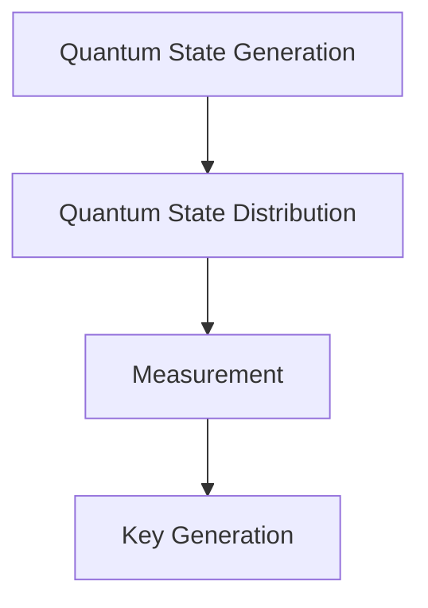
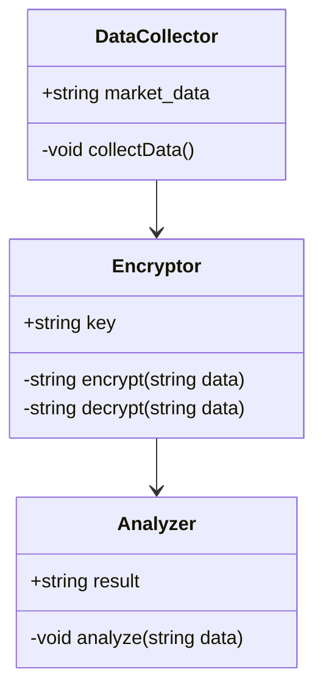

                 


# 全球股市估值与量子加密在金融领域的应用

## 关键词：全球股市估值, 量子加密, 金融安全, 量子密钥分发, 数据安全

## 摘要：  
本文探讨了全球股市估值与量子加密技术在金融领域的应用。首先，介绍了股市估值的重要性及其面临的挑战，特别是数据安全问题。随后，详细讲解了量子加密的基本原理，特别是量子密钥分发（QKD）技术。接着，分析了量子加密在股市估值中的应用场景，如数据传输加密和敏感数据分析保护。最后，通过系统架构设计和项目实战，展示了量子加密技术在金融领域的实际应用，并总结了其在未来金融安全中的潜力。

---

## 第一部分: 全球股市估值与量子加密概述

### 第1章: 全球股市估值的背景与重要性

#### 1.1 股市估值的基本概念

##### 1.1.1 股市估值的定义与意义  
股市估值是通过对公司财务数据和市场因素的分析，评估公司股票的内在价值。它帮助投资者做出理性决策，是金融市场的基石。

##### 1.1.2 股市估值的核心指标  
主要指标包括市盈率（P/E）、市净率（P/B）、股息率等，这些指标反映了公司的财务健康状况和市场表现。

##### 1.1.3 股市估值与金融市场的关联  
股市估值不仅影响投资者的决策，还影响市场的整体走势，是金融体系中不可或缺的一部分。

#### 1.2 量子加密技术的基本原理

##### 1.2.1 量子加密的定义与特点  
量子加密利用量子力学原理，通过量子态的叠加和纠缠实现加密，具有不可窃听性和不可复制性。

##### 1.2.2 量子加密与传统加密的区别  
传统加密依赖于数学算法，而量子加密利用物理原理，具备更高的安全性。

##### 1.2.3 量子加密在金融领域的潜力  
随着量子计算的发展，量子加密技术在金融数据保护中的应用前景广阔。

---

### 第2章: 股市估值与量子加密的结合

#### 2.1 股市估值中的数据安全需求

##### 2.1.1 股市数据的敏感性  
股市数据涉及公司财务信息和交易记录，一旦泄露可能引发市场动荡。

##### 2.1.2 数据泄露的风险与影响  
数据泄露可能导致股价 manipulation和经济损失，威胁金融市场的稳定。

##### 2.1.3 量子加密在数据保护中的作用  
通过量子加密技术，可以有效防止数据被非法窃取和篡改。

#### 2.2 量子加密在股市估值中的应用场景

##### 2.2.1 实时数据传输的加密  
量子加密技术确保股市数据在传输过程中的安全性。

##### 2.2.2 敏感数据分析的保护  
通过量子加密，保护敏感数据在分析过程中的安全。

##### 2.2.3 股市预测模型的安全性  
量子加密技术提升了预测模型的数据安全性和抗攻击能力。

---

## 第二部分: 量子加密技术的数学模型与算法原理

### 第3章: 量子加密的基本原理

#### 3.1 量子密钥分发（QKD）原理

##### 3.1.1 QKD的基本概念  
QKD是一种基于量子力学原理的密钥分发技术，确保密钥的安全传输。

##### 3.1.2 QKD的数学模型  
$$ E = \psi(x) = \frac{1}{\sqrt{2}} (\vert 0 \rangle + \vert 1 \rangle) $$  
其中，$\psi(x)$ 表示量子态，$\vert 0 \rangle$ 和 $\vert 1 \rangle$ 表示基态。

##### 3.1.3 QKD的实现流程  
1. 生成量子态：  
$$ \psi = \frac{1}{\sqrt{2}} (\vert 0 \rangle + \vert 1 \rangle) $$  
2. 分发量子态：  
Alice 发送量子态给 Bob。  
3. 测量量子态：  
Bob 对量子态进行测量，得到随机密钥。

##### 3.1.4 QKD的流程图  


---

### 第4章: 量子加密算法的实现

#### 4.1 量子加密算法的分类

##### 4.1.1 基于QKD的加密算法  
利用 QKD 生成共享密钥，对明文进行加密。

##### 4.1.2 基于量子叠加的加密算法  
利用量子叠加原理实现数据加密。

##### 4.1.3 其他量子加密算法  
包括基于量子纠缠和量子隐形传态的加密方法。

#### 4.2 量子加密算法的实现步骤

##### 4.2.1 密钥生成  
通过 QKD 技术生成共享密钥。  
代码示例：  
```python
import qiskit
from qiskit import QuantumCircuit, Aer, execute

# 生成量子态
qc = QuantumCircuit(1)
qc.h(0)
```

##### 4.2.2 数据加密  
利用生成的密钥对数据进行加密。  
代码示例：  
```python
def encrypt(data, key):
    encrypted_data = []
    for i in range(len(data)):
        if key[i] == 0:
            encrypted_data.append(data[i])
        else:
            encrypted_data.append(1 - data[i])
    return encrypted_data
```

##### 4.2.3 数据解密  
利用密钥对加密数据进行解密。  
代码示例：  
```python
def decrypt(data, key):
    decrypted_data = []
    for i in range(len(data)):
        if key[i] == 0:
            decrypted_data.append(data[i])
        else:
            decrypted_data.append(1 - data[i])
    return decrypted_data
```

---

## 第三部分: 量子加密在股市估值中的系统设计

### 第5章: 量子加密在股市估值系统中的应用

#### 5.1 系统架构设计

##### 5.1.1 系统功能模块划分  
- 数据采集模块  
- 数据处理模块  
- 加密模块  
- 解密模块  
- 数据分析模块  

##### 5.1.2 系统架构图  


#### 5.2 系统接口设计

##### 5.2.1 数据接口的设计  
- 数据输入接口：接收股市数据。  
- 数据输出接口：输出加密后的数据。  

##### 5.2.2 加密接口的设计  
- 加密函数：对数据进行加密。  
- 解密函数：对数据进行解密。  

##### 5.2.3 解密接口的设计  
- 解密函数：对加密数据进行解密。  

---

### 第6章: 系统的实现与测试

#### 6.1 系统实现

##### 6.1.1 环境搭建  
安装必要的库，如 Qiskit 和 NumPy。

##### 6.1.2 核心代码实现  
实现量子加密算法的核心部分。  
代码示例：  
```python
from qiskit import QuantumCircuit, Aer, execute

qc = QuantumCircuit(2)
qc.h(0)
qc.cnot(0, 1)
result = execute(qc, Aer.get_backend('qasm_simulator')).result()
print(result.get_counts())
```

##### 6.1.3 系统功能测试  
测试系统的加密和解密功能，确保数据的安全性。

#### 6.2 测试结果与分析

##### 6.2.1 测试用例设计  
设计不同的测试用例，验证系统的正确性。

##### 6.2.2 测试结果展示  
展示测试结果，分析系统的性能和安全性。

---

## 第四部分: 项目实战与总结

### 第7章: 项目实战

#### 7.1 项目背景与目标

##### 7.1.1 项目背景  
介绍项目的背景和意义。  

##### 7.1.2 项目目标  
通过量子加密技术提升股市估值系统的安全性。

#### 7.2 项目实施

##### 7.2.1 数据收集与处理  
收集股市数据并进行预处理。

##### 7.2.2 量子加密算法的实现  
实现量子加密算法并集成到系统中。

##### 7.2.3 系统集成与测试  
测试系统的整体功能和性能。

---

### 第8章: 总结与展望

#### 8.1 项目总结

##### 8.1.1 核心成果  
量子加密技术成功应用于股市估值系统，提升了数据安全性。

##### 8.1.2 经验总结  
在项目实施过程中，量子加密技术的实现需要结合实际应用场景。

#### 8.2 未来展望

##### 8.2.1 技术发展  
随着量子计算的进一步发展，量子加密技术将在更多领域得到应用。

##### 8.2.2 应用前景  
量子加密技术将在金融安全领域发挥越来越重要的作用。

---

## 作者：AI天才研究院/AI Genius Institute & 禅与计算机程序设计艺术 /Zen And The Art of Computer Programming

