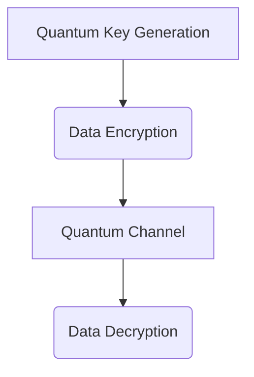

                 


# 全球股市估值与量子密钥分发在金融安全中的应用

> 关键词：量子密钥分发、金融安全、股市估值、量子加密、金融数据保护

> 摘要：本文探讨了全球股市估值与量子密钥分发技术在金融安全中的应用。首先，介绍了股市估值的基本概念、方法和模型；接着，详细阐述了量子密钥分发（QKD）的原理及其在金融安全中的应用；最后，结合实际案例，分析了如何利用量子密钥分发技术提升金融数据的安全性，特别是在全球股市估值中的潜在应用价值。

---

# 引言

随着全球金融市场的快速发展，股市估值和金融数据安全的重要性日益凸显。量子密钥分发作为一种前沿的加密技术，为金融数据的安全传输提供了前所未有的保障。本文将从股市估值的基础知识入手，深入探讨量子密钥分发的原理及其在金融安全中的实际应用，为读者提供全面的分析和见解。

---

# 第1章：全球股市估值概述

## 1.1 股市估值的基本概念

股市估值是通过对公司财务数据的分析，评估其股票的内在价值。这一过程帮助投资者判断股票是否被高估或低估。常见的估值指标包括市盈率（P/E）和市净率（P/B）等。

- **市盈率（P/E）**：公式为 `P/E = 股价 / 每股净利润`。例如，若某股票价格为 $50，每股净利润为 $5，则 P/E = 10。

- **市净率（P/B）**：公式为 `P/B = 股价 / 每股净资产`。例如，若某股票价格为 $40，每股净资产为 $10，则 P/B = 4。

## 1.2 股市估值的核心指标

除了市盈率和市净率，投资者还常用股息率（Dividend Yield）来评估股票的吸引力。公式为 `股息率 = 每股股息 / 股票价格`。例如，若某股票每股股息为 $2，股价为 $40，则股息率为5%。

## 1.3 股市估值的主要模型

现金流折现模型（DCF）是常用的估值方法之一。其基本原理是将未来现金流折现到现值，计算公司的真实价值。公式为：

$$
DCF = \sum_{t=1}^{n} \frac{CF_t}{(1 + r)^t} + \frac{TV}{(1 + r)^n}
$$

其中，$CF_t$ 是第 $t$ 年的现金流，$r$ 是折现率，$TV$ 是终值。

---

# 第2章：量子密钥分发（QKD）原理与应用

## 2.1 量子密钥分发的基本原理

量子密钥分发利用量子态的不可克隆性和测量扰动性，确保密钥的安全传输。BB84协议是最早提出的量子密钥分发协议，其流程如下：

1. **密钥生成**：Alice 和 Bob 分别生成随机的量子密钥，并选择不同的编码基。
2. **量子传输**：Alice 将量子态传输给 Bob。
3. **基比对**：双方公开使用的基，保留相同的基的测量结果作为密钥。
4. **纠错与隐私放大**：通过公开通信纠错，并使用信息理论方法进一步增强密钥安全性。

## 2.2 量子密钥分发在金融安全中的应用

### 2.2.1 金融数据的加密传输

量子密钥分发可以用于保护金融数据的传输安全。例如，在股票交易中，敏感数据如交易指令和股价数据可以通过量子密钥加密后传输，确保数据的机密性和完整性。

### 2.2.2 金融交易的安全保护

量子密钥分发技术可以防止金融交易中的数据篡改和窃听。通过在交易过程中使用量子密钥加密，确保交易数据的不可抵赖性和真实性。

---

# 第3章：量子密钥分发在金融安全中的实际应用

## 3.1 全球股市估值中的数据保护

### 3.1.1 量子加密在数据传输中的应用

在股市估值过程中，涉及大量敏感数据的传输，如公司财务数据和交易记录。通过量子密钥分发技术，可以确保这些数据在传输过程中的安全性。

### 3.1.2 实际案例分析

假设某全球投资机构使用量子密钥分发技术保护其交易数据。当机构进行跨国股票交易时，交易数据通过量子密钥加密，确保数据在传输过程中不会被窃取或篡改。

## 3.2 系统架构与设计

### 3.2.1 系统功能设计

- **密钥生成模块**：生成量子密钥。
- **数据加密模块**：对敏感数据进行加密。
- **数据传输模块**：通过量子通信通道传输数据。
- **解密模块**：接收并解密数据。

### 3.2.2 系统架构图



---

# 第4章：项目实战与代码实现

## 4.1 量子密钥分发的Python实现

以下是一个简单的量子密钥分发模拟代码：

```python
import random

def generate_key():
    key = []
    for _ in range(10):
        bit = random.choice([0, 1])
        key.append(bit)
    return key

def compare_bases(alice_basis, bob_basis):
    common_basis = [i for i in range(len(alice_basis)) if alice_basis[i] == bob_basis[i]]
    return common_basis

# 示例
alice_basis = [random.choice(['+','x']) for _ in range(10)]
bob_basis = [random.choice(['+','x']) for _ in range(10)]
common = compare_bases(alice_basis, bob_basis)
print("Common bases:", common)
```

## 4.2 环境配置与代码解读

上述代码展示了量子密钥分发的基本步骤，包括密钥生成和基比对。实际应用中，需要结合量子通信设备和加密算法进行实现。

---

# 第5章：总结与展望

## 5.1 总结

本文详细探讨了全球股市估值与量子密钥分发在金融安全中的应用。通过量子密钥分发技术，可以有效提升金融数据的安全性，特别是在股市估值和交易数据保护方面具有重要意义。

## 5.2 未来展望

随着量子计算技术的发展，量子密钥分发在金融领域的应用将更加广泛。未来的研究可以进一步探索量子密钥分发与其他加密技术的结合，提升金融系统的整体安全性。

---

# 作者

作者：AI天才研究院/AI Genius Institute & 禅与计算机程序设计艺术 /Zen And The Art of Computer Programming

---

本文通过详细的理论分析和实际案例，探讨了全球股市估值与量子密钥分发在金融安全中的应用，为读者提供了全面的分析和见解。

