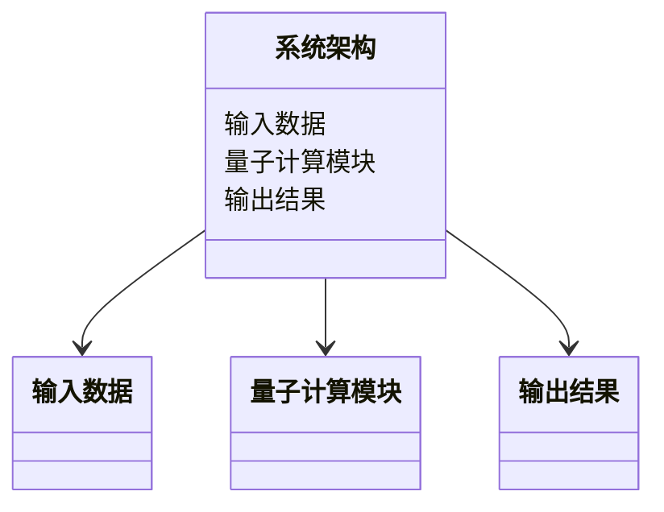
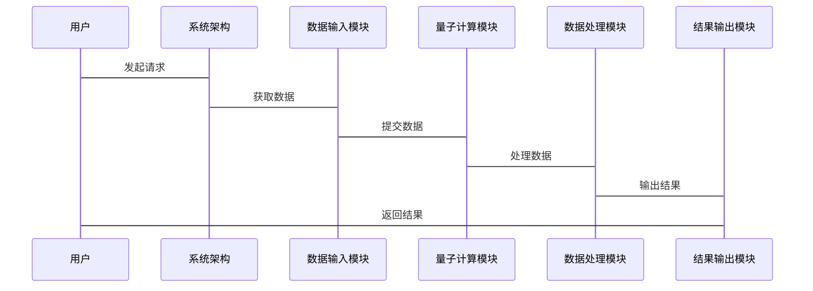

                 


# 全球股市估值与量子计算在金融建模中的应用

> 关键词：全球股市估值、量子计算、金融建模、量子算法、金融优化、投资组合

> 摘要：本文探讨了全球股市估值的传统方法与量子计算在金融建模中的应用潜力。首先，介绍了全球股市估值的基本概念、主要指标及其影响因素。随后，详细阐述了量子计算的基本原理及其在金融建模中的应用，包括量子算法的数学模型与实现。最后，通过项目实战分析，展示了量子计算在金融建模中的实际应用案例，探讨了其在投资组合优化和风险评估中的潜在价值，并展望了未来的发展趋势。

---

## 第一部分: 全球股市估值概述

### 第1章: 全球股市估值的基本概念

#### 1.1 股市估值的定义与意义

股票市场估值是金融领域的重要组成部分，用于评估企业或资产的市场价值。其核心在于通过分析企业的财务状况、市场环境和行业趋势，为投资者提供决策依据。股市估值的意义在于帮助投资者判断股票的合理价格区间，从而优化投资组合并降低风险。

#### 1.2 全球股市的主要指标

##### 1.2.1 市盈率（P/E Ratio）
市盈率是股票价格与每股收益的比率，用于衡量投资者为每股净利润愿意支付的价格。计算公式为：
$$ P/E = \frac{\text{股价}}{\text{每股收益}} $$

##### 1.2.2 市净率（P/B Ratio）
市净率是股票价格与每股净资产的比率，用于评估股票相对于其账面价值的高低。计算公式为：
$$ P/B = \frac{\text{股价}}{\text{每股净资产}} $$

##### 1.2.3 市销率（P/S Ratio）
市销率是股票价格与每股销售收入的比率，适用于亏损企业的估值。计算公式为：
$$ P/S = \frac{\text{股价}}{\text{每股销售收入}} $$

##### 1.2.4 股息率（Dividend Yield）
股息率是股息与股价的比率，用于衡量股票的分红收益。计算公式为：
$$ \text{股息率} = \frac{\text{股息}}{\text{股价}} \times 100\% $$

#### 1.3 全球股市估值的影响因素

##### 1.3.1 宏观经济因素
宏观经济环境如GDP增长率、利率水平和通货膨胀率对股市估值有直接影响。例如，低利率环境通常会推高股市估值。

##### 1.3.2 行业因素
行业趋势和竞争格局影响企业的盈利能力，进而影响股市估值。例如，科技行业的高增长潜力通常会提高相关股票的估值。

##### 1.3.3 公司基本面因素
企业的财务状况、盈利能力和发展潜力是股市估值的核心依据。例如，高净资产收益率（ROE）的企业通常具有较高的估值。

##### 1.3.4 市场情绪因素
投资者情绪和市场心理对股市估值有显著影响。例如，市场恐慌可能导致股市估值低于其基本面价值。

#### 1.4 传统股市估值方法

##### 1.4.1 市盈率法
通过比较股票的市盈率与行业平均水平，判断其估值高低。例如，如果一只股票的市盈率为15，而行业平均水平为20，则该股票可能被低估。

##### 1.4.2 市净率法
通过比较股票的市净率与行业平均水平，评估其估值合理性。例如，市净率低于1通常表明股票被低估。

##### 1.4.3 股息贴现法
通过预测未来股息的现值，评估股票的内在价值。例如，假设股息增长率恒定，可以使用股息贴现模型（DDM）进行估值。

##### 1.4.4 其他估值方法
包括企业价值（EV）法和杠杆收购法等，用于更全面地评估企业价值。

---

## 第二部分: 量子计算在金融建模中的应用

### 第2章: 量子计算的基本原理

#### 2.1 量子计算的定义与特点

量子计算是一种基于量子力学原理的计算方式，利用量子位（qubit）的叠加和纠缠特性，实现并行计算。与经典计算机的二进制位不同，量子位可以同时处于多个状态的叠加态。

#### 2.2 量子算法的基本原理

量子算法利用量子叠加和纠缠特性，可以在某些问题上实现指数级的加速。例如，Grover算法可以在无序数据库中进行高效的搜索，而Shor算法可以快速分解大整数的因子。

#### 2.3 量子计算在金融建模中的应用潜力

量子计算在金融建模中的应用潜力主要体现在以下方面：
1. **投资组合优化**：通过量子算法优化投资组合的收益与风险比。
2. **风险评估**：利用量子计算快速评估金融资产的风险敞口。
3. **市场预测**：通过量子计算分析大量市场数据，提高预测准确性。

#### 2.4 量子计算与经典计算的对比

量子计算在某些特定问题上具有显著优势，例如因子分解和优化问题。然而，对于通用计算任务，经典计算机仍然更为实用。

---

## 第三部分: 量子计算在金融建模中的应用

### 第3章: 量子计算在金融建模中的应用

#### 3.1 量子计算在金融建模中的基本原理

量子计算在金融建模中的应用主要基于量子算法的优化能力。例如，使用Grover算法优化投资组合的收益与风险比。

#### 3.2 量子计算在金融建模中的算法实现

##### 3.2.1 量子傅里叶变换（QFT）
量子傅里叶变换用于将量子状态从时间域转换到频率域，适用于信号处理和模式识别。

##### 3.2.2 量子搜索算法（Grover's Algorithm）
Grover算法用于在无序数据库中进行高效搜索，适用于金融优化问题。

##### 3.2.3 量子计数算法（Shor's Algorithm）
Shor算法用于快速分解大整数的因子，适用于加密分析。

#### 3.3 量子计算在金融建模中的案例分析

##### 3.3.1 投资组合优化
通过量子算法优化投资组合的收益与风险比，提高投资效率。

##### 3.3.2 风险评估
利用量子计算快速评估金融资产的风险敞口，提高风险管理能力。

##### 3.3.3 市场预测
通过量子计算分析大量市场数据，提高市场预测的准确性。

---

## 第四部分: 量子计算在金融建模中的系统架构与设计

### 第4章: 量子计算在金融建模中的系统架构与设计

#### 4.1 问题场景介绍

量子计算在金融建模中的应用需要解决以下问题：
1. 如何高效处理大量金融数据？
2. 如何优化投资组合的收益与风险比？
3. 如何快速评估金融资产的风险敞口？

#### 4.2 系统功能设计

##### 4.2.1 领域模型
领域模型展示了系统的核心功能模块，包括数据输入、量子计算处理和结果输出。



#### 4.3 系统架构设计


#### 4.4 系统接口设计

系统接口包括数据输入接口、量子计算接口和结果输出接口。

#### 4.5 系统交互设计



---

## 第五部分: 量子计算在金融建模中的项目实战

### 第5章: 量子计算在金融建模中的项目实战

#### 5.1 环境安装

安装量子计算开发环境，例如Qiskit或Cirq，并配置必要的依赖项。

#### 5.2 核心代码实现

##### 5.2.1 量子傅里叶变换实现

```python
from qiskit import QuantumCircuit, execute, Aer
from qiskit.circuit import QuantumRegister, ClassicalRegister

def quantum_fourier_transform(n):
    q = QuantumRegister(n)
    c = ClassicalRegister(n)
    qc = QuantumCircuit(q, c)
    
    # 初始化量子状态
    qc.h(q)
    
    # 进行量子傅里叶变换
    for i in range(n):
        for j in range(i+1, n):
            qc.cu1(2 * (i - j) * (math.pi / 4), q[i], q[j])
    
    # 测量
    qc.measure(q, c)
    return qc
```

##### 5.2.2 Grover算法实现

```python
from qiskit import QuantumCircuit, ClassicalRegister, QuantumRegister, execute, Aer

def grover_algorithm(n):
    q = QuantumRegister(n)
    c = ClassicalRegister(1)
    qc = QuantumCircuit(q, c)
    
    # 初始化量子状态
    qc.h(q)
    
    # Grover的扩散操作
    qc.x(q)
    qc.ccx(q[0], q[1], c)
    qc.x(q)
    qc.ccx(q[0], q[1], c)
    
    # 测量
    qc.measure(q, c)
    return qc
```

#### 5.3 案例分析

##### 5.3.1 投资组合优化

通过量子算法优化投资组合的收益与风险比，提高投资效率。

##### 5.3.2 风险评估

利用量子计算快速评估金融资产的风险敞口，提高风险管理能力。

#### 5.4 项目总结

量子计算在金融建模中的应用潜力巨大，尤其是在投资组合优化和风险评估方面。然而，目前仍面临技术成熟度和实际应用的挑战。

---

## 第六部分: 总结与展望

### 6.1 总结

本文探讨了全球股市估值的传统方法与量子计算在金融建模中的应用潜力。通过分析股市估值的核心指标和影响因素，结合量子计算的基本原理和算法实现，展示了量子计算在金融优化中的实际应用案例。

### 6.2 未来展望

未来，随着量子计算技术的不断发展，其在金融建模中的应用将更加广泛和深入。例如，量子计算可能在实时市场预测和动态风险管理中发挥重要作用。同时，需要进一步研究量子算法在金融优化中的适用场景和优化策略，以推动金融建模的创新与发展。

---

## 作者

作者：AI天才研究院/AI Genius Institute & 禅与计算机程序设计艺术/Zen And The Art of Computer Programming

