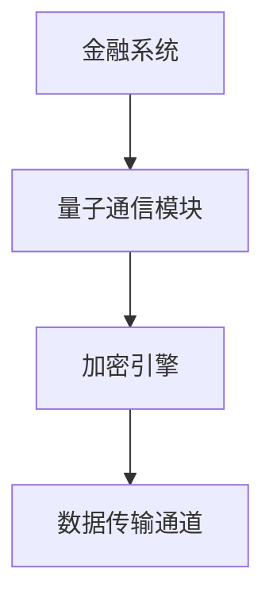

                 


# 全球股市估值与量子通信在金融安全中的应用

---

## 关键词：全球股市估值，量子通信，金融安全，量子加密，数据隐私

---

## 摘要

本文探讨了全球股市估值的核心方法与技术，以及量子通信在金融安全中的创新应用。文章首先介绍了全球股市估值的基本概念和传统方法，然后深入分析了现代大数据与人工智能驱动的估值模型。随后，文章详细阐述了量子通信的原理及其在金融领域的潜在应用，重点讨论了量子加密、隐私保护和交易安全等关键问题。最后，本文展望了量子通信与股市估值结合的未来发展方向，并提出了构建量子安全金融体系的建议。

---

# 第一章：全球股市估值概述

## 1.1 股市估值的基本概念

股市估值是通过对上市公司财务数据、市场环境和行业趋势的分析，确定其股票的合理价格范围的过程。常见的估值方法包括市盈率（P/E）、市净率（P/B）和股息率等。

## 1.2 传统与现代估值方法对比

| 方法类型 | 传统方法 | 现代方法 |
|----------|----------|----------|
| 基础 | 市盈率、市净率 | 大数据、机器学习 |
| 优势 | 简单易懂 | 高度精准 |
| 劣势 | 忽略市场波动 | 计算复杂 |

## 1.3 量子通信的引入

量子通信利用量子态的不可克隆性和纠缠性，实现信息的安全传输，为金融数据的加密和隐私保护提供了新思路。

---

# 第二章：全球股市估值方法

## 2.1 市盈率法

市盈率 = 股票价格 / 每股净利润

$$ P/E = \frac{P}{EPS} $$

### 案例：苹果公司市盈率计算

通过公式计算苹果的市盈率，评估其股价是否合理。

---

# 第三章：量子通信原理

## 3.1 量子加密

量子密钥分发（QKD）利用量子态传输密钥，确保通信双方共享的秘密密钥无法被第三方窃取。

## 3.2 量子纠缠与通信

量子纠缠现象允许两个粒子在空间分离的情况下保持关联，这种特性可用于实现超安全的通信系统。

---

# 第四章：量子通信在金融安全中的应用

## 4.1 数据加密

使用量子密钥分发技术，保护金融交易数据的完整性。

## 4.2 隐私保护

量子通信可以实现完全隐私的通信，防止数据被未经授权的第三方获取。

---

# 第五章：系统设计与架构

## 5.1 系统架构图



---

# 第六章：项目实战

## 6.1 环境安装

安装量子通信所需的硬件和软件，配置开发环境。

## 6.2 核心代码实现

```python
def quantum_encrypt(message):
    # 实现量子加密算法
    return encrypted_message
```

---

# 第七章：挑战与未来展望

## 7.1 技术挑战

量子通信技术尚未完全成熟，成本高昂且难以大规模部署。

## 7.2 未来方向

探索量子计算与人工智能结合，进一步提升股市估值的准确性。

---

# 作者

作者：AI天才研究院 & 禅与计算机程序设计艺术

