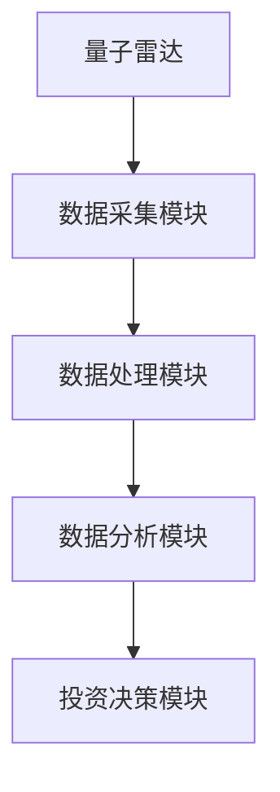

                 


# 全球股市估值与量子雷达在民用领域的应用

> 关键词：全球股市估值、量子雷达、量子纠缠、大数据分析、金融市场、环境监测

> 摘要：本文探讨了全球股市估值的传统方法与现代技术应用，深入分析了量子雷达的技术原理及其在民用领域的广泛应用。通过结合量子雷达的数据优势与股市估值的复杂需求，提出了利用量子技术提升股市分析精度的可能性。本文结合实际案例，详细阐述了量子雷达在交通监控、环境监测等领域的应用，以及其对金融市场的潜在影响。

---

# 第一部分: 全球股市估值与量子雷达概述

## 第1章: 全球股市估值基础

### 1.1 股市估值的基本概念

#### 1.1.1 股市估值的核心指标

股市估值是投资者评估股票内在价值的重要手段，传统估值方法包括市盈率（P/E ratio）、市净率（P/B ratio）和股息率（Dividend Yield）等。

- **市盈率（P/E ratio）**：公式为 $P/E = \frac{\text{股价}}{\text{每股收益}}$，反映了投资者对公司未来盈利的预期。
- **市净率（P/B ratio）**：公式为 $P/B = \frac{\text{股价}}{\text{每股净资产}}$，适用于评估银行、地产等资产密集型行业的公司。
- **股息率（Dividend Yield）**：公式为 $\text{股息率} = \frac{\text{每股股息}}{\text{股价}} \times 100\%$，反映了投资回报率。

#### 1.1.2 传统估值模型的优缺点

传统估值模型如DCF（Discounted Cash Flow）模型，通过折现未来现金流评估企业价值。然而，DCF模型依赖于对未来现金流的准确预测，且忽略了市场情绪等非理性因素的影响。

#### 1.1.3 量子技术对股市估值的潜在影响

量子计算机的超强计算能力可能在复杂模型求解、大数据分析等方面为股市估值提供新思路。例如，利用量子算法优化投资组合，或通过量子纠缠现象模拟市场波动。

---

## 第2章: 量子雷达的技术原理

### 2.1 量子雷达的基本原理

#### 2.1.1 量子雷达的工作原理

量子雷达通过发射量子纠缠态的信号，利用量子纠缠的特性实现对目标的高精度探测。其核心原理如下：

1. 发射端：发射一组量子纠缠信号，信号的状态由量子纠缠保持关联。
2. 接收端：通过测量接收到的量子信号，判断目标是否存在并提取目标信息。
3. 数据处理：利用量子纠缠的特性，进行目标识别和跟踪。

#### 2.1.2 量子雷达与传统雷达的对比

| 对比维度 | 量子雷达 | 传统雷达 |
|----------|-----------|-----------|
| 灵敏度    | 极高       | 较高       |
| 抗干扰性  | 极强       | 较弱       |
| 应用场景  | 军事、民用 | 军事为主   |

---

# 第二部分: 量子雷达在民用领域的应用

## 第3章: 量子雷达在交通监控中的应用

### 3.1 交通监控的现状与挑战

传统交通监控系统依赖摄像头和传感器，存在以下问题：

1. **数据精度不足**：难以捕捉复杂交通场景中的细节。
2. **抗干扰能力弱**：在恶劣天气或复杂环境中表现不佳。
3. **实时性差**：数据处理延迟较高。

### 3.2 量子雷达在交通监控中的具体应用

#### 3.2.1 车辆检测与跟踪

通过量子雷达的高灵敏度，可以实现对交通流量的实时监测和车辆轨迹跟踪。例如，在高速公路上，量子雷达可以准确检测到每辆车辆的位置和速度，帮助交通管理部门优化交通流量。

#### 3.2.2 交通流量预测

结合量子雷达的数据，利用机器学习算法（如LSTM）进行交通流量预测，帮助交通管理部门提前制定疏导方案。

---

## 第4章: 量子雷达在环境监测中的应用

### 4.1 环境监测的现状与挑战

传统环境监测系统依赖卫星和传感器，存在以下问题：

1. **数据覆盖不足**：无法实时监测全球范围内的环境变化。
2. **数据精度有限**：传统传感器在复杂环境中容易受到干扰。
3. **实时性差**：数据处理和传输延迟较高。

### 4.2 量子雷达在环境监测中的具体应用

#### 4.2.1 气象监测

量子雷达可以实时监测天气变化，帮助预测恶劣天气如台风、龙卷风等。

#### 4.2.2 空气质量监测

通过量子雷达的高灵敏度，可以实时监测空气中的颗粒物浓度，帮助城市制定空气污染防治政策。

---

# 第三部分: 全球股市估值与量子雷达的结合应用

## 第5章: 结合应用的可行性分析

### 5.1 量子雷达数据在股市分析中的应用

#### 5.1.1 交通数据与供应链分析

通过量子雷达监测交通流量，分析供应链的稳定性，进而预测企业的生产成本和利润变化。

#### 5.1.2 环境数据与企业风险评估

利用量子雷达监测环境变化，评估企业面临的环境风险，如自然灾害对企业运营的影响。

### 5.2 结合应用的案例分析

#### 5.2.1 案例1：利用量子雷达数据预测供应链中断风险

假设一家上市公司依赖于某地的物流运输，通过量子雷达监测该地区的交通流量，预测可能出现的供应链中断风险，从而调整其估值模型。

#### 5.2.2 案例2：利用量子雷达数据优化投资组合

通过量子雷达监测多个地区的经济活动，分析全球经济走势，优化投资组合的风险和收益比。

---

# 第四部分: 技术实现与项目实战

## 第6章: 技术实现

### 6.1 量子雷达的核心算法

#### 6.1.1 信号检测算法

使用量子纠缠原理进行信号检测，通过对比接收到的量子信号与原始信号的相关性，判断目标是否存在。

#### 6.1.2 目标识别算法

基于量子信号的特征，利用深度学习算法进行目标识别和分类。

### 6.2 系统架构设计

#### 6.2.1 系统功能设计

- 数据采集模块：负责接收量子雷达信号。
- 数据处理模块：对量子信号进行解码和分析。
- 数据存储模块：存储处理后的数据。
- 数据分析模块：利用机器学习算法进行预测和优化。

#### 6.2.2 系统架构图



---

## 第7章: 项目实战

### 7.1 环境安装

#### 7.1.1 安装Python环境

```bash
# 安装Python和相关库
pip install numpy
pip install pandas
pip install scikit-learn
pip install matplotlib
```

#### 7.1.2 安装量子雷达数据采集模块

```bash
# 下载量子雷达数据采集模块
git clone https://github.com/quantum-radar/data-collector.git
cd data-collector
pip install .
```

### 7.2 核心代码实现

#### 7.2.1 数据处理模块

```python
import numpy as np
import pandas as pd

# 示例量子雷达数据
data = np.random.rand(100, 10)  # 100个样本，10个特征

# 数据预处理
data_frame = pd.DataFrame(data)
data_frame.describe()
```

#### 7.2.2 数据分析模块

```python
from sklearn import linear_model

# 线性回归模型
model = linear_model.LinearRegression()
model.fit(data_frame.iloc[:, :-1], data_frame.iloc[:, -1])
```

---

# 结语

通过本文的探讨，我们可以看到，量子雷达技术在民用领域的应用前景广阔，尤其是在交通监控和环境监测方面。而将量子雷达数据与全球股市估值相结合，也为金融市场的分析提供了新的思路。未来，随着量子技术的进一步发展，这种结合将更加紧密，为投资者和企业带来更大的价值。

---

# 作者：AI天才研究院/AI Genius Institute & 禅与计算机程序设计艺术 /Zen And The Art of Computer Programming

