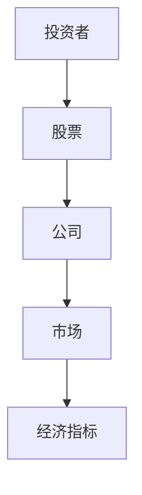
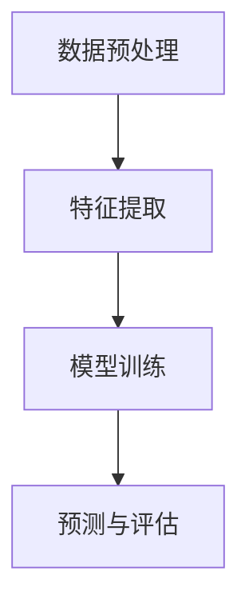

                 


# 全球股市估值和未来回报率预测概述

## 关键词：全球股市、估值方法、股票回报率预测、技术分析、机器学习、大数据分析

## 摘要：  
本文将深入探讨全球股市估值的核心概念、影响因素及其预测方法。通过结合传统统计分析与现代机器学习技术，分析如何利用大数据和人工智能模型来预测股市回报率。文章内容涵盖股市估值的基本原理、常见指标、算法模型以及实际案例分析，为投资者和数据科学家提供理论与实践相结合的参考。

---

# 第一部分：全球股市估值与预测概述

## 第1章：全球股市估值与预测的背景与概念

### 1.1 全球股市的基本概念

#### 1.1.1 股市的定义与功能  
股市是金融市场的核心组成部分，其功能包括资金筹集、资产配置和价格发现。股市为投资者提供了一个买卖股票的平台，股票代表了对公司部分所有权的投资。

#### 1.1.2 全球主要股市及其特点  
全球主要股市包括纽约证券交易所（NYSE）、纳斯达克（NASDAQ）、伦敦金融时报指数（FTSE 100）和东京证券交易所（Tokyo Stock Exchange）等。每个市场的特点与其所在国家的经济结构、政策和文化背景密切相关。

#### 1.1.3 股市估值的重要性  
股市估值是投资者进行决策的基础，它帮助投资者判断股票是否被高估或低估，从而做出买入、卖出或持有股票的决策。

---

### 1.2 股市估值的核心问题

#### 1.2.1 估值的基本概念  
股票的内在价值是基于公司基本面（如盈利能力、成长性、财务状况）和市场环境（如利率、通胀）等因素计算出的理论价值。市场价值则是实际交易价格，可能偏离内在价值。

#### 1.2.2 影响股市估值的主要因素  
影响股市估值的主要因素包括宏观经济指标（GDP、利率、通胀）、公司基本面（盈利能力、成长性）、市场情绪（投资者心理）和政策因素（政府政策、监管变化）。

#### 1.2.3 股市估值的边界与外延  
股市估值的边界在于其假设条件的限制，例如假设市场是有效的，或者模型参数的准确性。外延则包括对指数、行业或个股的估值。

---

### 1.3 股市回报率预测的必要性

#### 1.3.1 投资者的需求与挑战  
投资者希望通过预测股市回报率优化资产配置，降低风险，提高收益。然而，股市的复杂性和不确定性使得预测具有挑战性。

#### 1.3.2 股市回报率预测的现实意义  
准确的回报率预测可以帮助投资者做出更明智的决策，降低投资风险，提高投资效率。

#### 1.3.3 本书的核心目标与内容  
本书旨在通过理论分析和实践案例，帮助读者掌握全球股市估值的核心方法和预测技术。

---

## 第2章：股市估值的核心概念与联系

### 2.1 股市估值的核心概念

#### 2.1.1 股票的内在价值与市场价值  
股票的内在价值是基于公司基本面计算的理论价值，而市场价值是实际交易价格，受市场情绪和市场参与者的心理影响。

#### 2.1.2 市盈率、市净率等估值指标  
市盈率（P/E）= 股价 / 每股净利润  
市净率（P/B）= 股价 / 每股净资产  
市销率（P/S）= 股价 / 每股收入  

#### 2.1.3 股市指数与个股的关系  
股市指数是反映市场整体表现的指标，如标普500指数。个股的表现受市场整体趋势和公司基本面的影响。

---

### 2.2 核心概念的属性特征对比

#### 2.2.1 估值指标的属性特征表  
| 估值指标 | 计算公式 | 适用场景 | 优点 | 缺点 |
|----------|----------|----------|------|------|
| 市盈率    | P/E      | 利润稳定的公司 | 简单易懂 | 受利润波动影响 |
| 市净率    | P/B      | 资产密集型行业 | 稳定性高 | 受资产质量影响 |
| 市销率    | P/S      | 收入稳定的公司 | 抗周期性好 | 受收入结构影响 |

#### 2.2.2 股市指数与个股的对比分析  
股市指数反映市场整体表现，而个股受公司特定因素影响更大。

#### 2.2.3 估值模型的适用场景  
不同估值模型适用于不同的市场环境和公司类型，例如PE适用于成长型企业，PB适用于周期性行业。

---

### 2.3 ER实体关系图



---

## 第3章：股市回报率预测的算法原理

### 3.1 传统统计方法

#### 3.1.1 线性回归模型  
线性回归模型通过建立因变量（回报率）与自变量（如宏观经济指标）之间的线性关系，预测股市回报率。

#### 3.1.2 时间序列分析  
时间序列分析（如ARIMA模型）通过分析历史数据的周期性和趋势，预测未来回报率。

#### 3.1.3 马尔可夫链模型  
马尔可夫链模型用于分析市场状态的转移概率，帮助预测市场的未来状态。

---

### 3.2 机器学习算法

#### 3.2.1 支持向量机（SVM）  
SVM通过构建超平面，将数据点分到不同类别，适用于非线性分类问题。

#### 3.2.2 随机森林与梯度提升树  
随机森林和梯度提升树是基于树的集成学习方法，适用于高维数据和复杂关系的预测。

#### 3.2.3 神经网络与深度学习  
神经网络通过多层非线性变换，捕捉数据中的复杂模式，适用于复杂的股市预测。

---

### 3.3 算法流程图



---

### 3.4 算法实现代码

#### 示例代码：线性回归模型

```python
import pandas as pd
from sklearn.linear_model import LinearRegression

# 示例代码
data = pd.read_csv('stock_data.csv')
model = LinearRegression()
model.fit(data[['PE', 'PB', 'PS']], data['Return'])
```

---

## 第4章：基于大数据的股市预测

### 4.1 大数据分析方法

#### 4.1.1 数据源与特征工程  
数据源包括历史价格、财务数据、新闻 sentiment 等。特征工程包括数据清洗、特征选择和特征提取。

#### 4.1.2 机器学习与深度学习  
机器学习算法（如随机森林、XGBoost）和深度学习模型（如LSTM）在处理大数据时表现优异。

#### 4.1.3 系统架构设计  
系统架构包括数据采集模块、特征处理模块、模型训练模块和预测模块。

---

### 4.2 项目实战

#### 4.2.1 数据采集与处理  
使用API或爬虫获取历史数据，并进行清洗和转换。

#### 4.2.2 模型实现与优化  
通过交叉验证和超参数调优，优化模型性能。

#### 4.2.3 实验结果与分析  
通过回测和风险指标（如夏普比率）评估模型表现。

---

## 第5章：案例分析与总结

### 5.1 案例分析

#### 5.1.1 案例背景  
以某段时间内的标普500指数为例，分析其估值指标和回报率预测。

#### 5.1.2 数据分析  
通过计算PE、PB等指标，分析市场是否被高估或低估。

#### 5.1.3 模型预测  
使用机器学习模型预测未来3个月的回报率，并与实际数据对比。

---

## 第6章：总结与展望

### 6.1 全文总结  
本文系统介绍了全球股市估值的核心概念、影响因素及其预测方法，结合传统统计方法和现代机器学习技术，探讨了大数据在股市预测中的应用。

### 6.2 未来展望  
未来，随着人工智能和大数据技术的发展，股市预测将更加精准，投资者将能够更好地进行资产配置和风险控制。

---

## 作者：AI天才研究院/AI Genius Institute & 禅与计算机程序设计艺术 /Zen And The Art of Computer Programming

