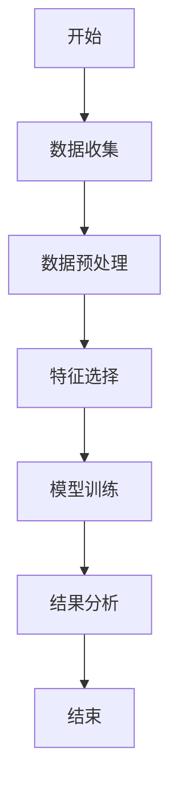
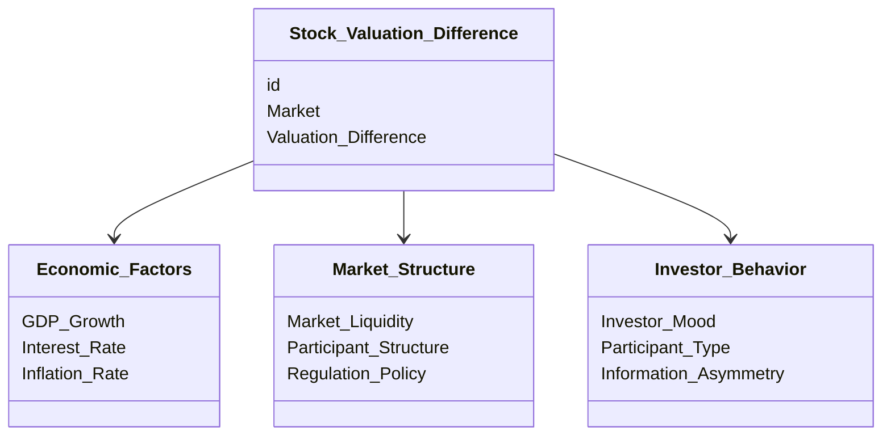
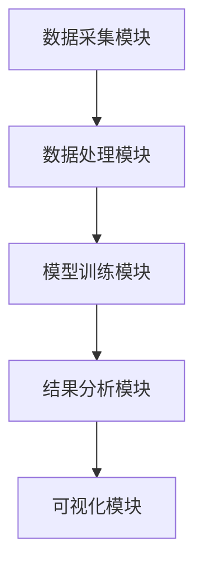

                 


# 全球股市估值差异的原因探讨

## 关键词：
全球股市，估值差异，经济因素，市场结构，投资者行为

## 摘要：
本文深入探讨了全球股市估值差异的原因，从经济因素、市场结构和投资者行为三个核心维度进行分析。通过建立数学模型和对比分析，揭示了各因素对估值差异的影响机制。文章还结合实际案例，展示了如何通过算法模型量化这些影响，并提出了系统化的解决方案。

---

## 第一部分: 全球股市估值差异的背景与现状

### 第1章: 全球股市估值差异的背景与现状

#### 1.1 全球股市估值差异的背景介绍
##### 1.1.1 什么是股市估值
股市估值是指通过对公司基本面的分析（如盈利能力、成长性、财务状况等），估算其股票的合理价格范围。常见的估值方法包括市盈率（P/E）、市净率（P/B）等。

##### 1.1.2 全球股市的基本概念与特点
全球股市由多个国家和地区的股票市场组成，每个市场的运行机制、参与者结构和监管政策可能存在显著差异。例如，美国的纳斯达克市场以科技股为主，而中国的股市则以制造业公司为主。

##### 1.1.3 估值差异的定义与表现形式
估值差异指不同市场中同一公司或相似公司的股票估值存在显著差异。这种差异可能源于市场流动性、投资者结构、经济政策等多种因素。

---

#### 1.2 全球股市估值差异的现状分析
##### 1.2.1 不同国家股市的估值差异现状
以美国、中国、日本为例，美国市场整体估值较高，而中国和日本市场估值相对较低。这种差异与各国的经济发展水平、货币政策等因素密切相关。

##### 1.2.2 不同行业板块的估值差异现状
科技行业通常估值较高，而传统制造业估值相对较低。例如，苹果（AAPL）的市盈率远高于通用汽车（GM）。

##### 1.2.3 估值差异的长期与短期变化趋势
长期来看，经济发达市场估值波动较小，而新兴市场估值波动较大。短期来看，市场情绪和突发事件对估值差异影响显著。

---

### 第2章: 影响股市估值差异的核心因素

#### 2.1 经济因素对估值差异的影响
##### 2.1.1 经济增长与股市估值的关系
经济增长通常会推高股市估值，因为企业盈利能力增强。例如，美国经济复苏期间，股市估值显著上升。

##### 2.1.2 利率水平与股市估值的关联
低利率环境通常会推高股市估值，因为资金成本降低，企业融资更容易，利润增加。反之，高利率环境可能导致股市估值下降。

##### 2.1.3 通货膨胀对股市估值的影响
通货膨胀可能导致股市估值下降，因为实际收益被稀释。但适度的通胀可能通过提升企业利润间接推高估值。

---

#### 2.2 市场结构因素对估值差异的影响
##### 2.2.1 市场流动性与估值差异的关系
流动性高的市场通常估值较高，因为交易活跃，投资者更容易以合理价格买卖股票。例如，纳斯达克的高流动性使其估值相对较高。

##### 2.2.2 市场参与者结构的差异
机构投资者占主导的市场通常估值较为稳定，而散户占主导的市场估值波动较大。例如，中国的股市以散户为主，估值波动显著。

##### 2.2.3 市场监管政策的差异
严格的监管政策通常会降低市场波动，而宽松的监管政策可能导致市场估值波动加剧。例如，美国SEC的严格监管使得股市估值相对稳定。

---

#### 2.3 投资者行为对估值差异的影响
##### 2.3.1 投资者情绪与股市估值的关系
投资者情绪是影响股市估值的重要因素。乐观情绪会推高估值，而悲观情绪则会压低估值。

##### 2.3.2 不同投资者群体的行为差异
机构投资者通常更理性，而散户投资者容易受到情绪驱动。这种行为差异可能导致估值差异。

##### 2.3.3 信息不对称对估值的影响
信息不对称可能导致市场估值失真。例如，内幕信息可能使得部分投资者提前获利，从而影响市场整体估值。

---

## 第二部分: 全球股市估值差异的核心概念与联系

### 第3章: 核心概念的原理与特征

#### 3.1 经济因素的数学模型分析
##### 3.1.1 经济增长与股市估值的数学关系
我们可以用多元回归模型来分析经济增长（GDP）对股市估值的影响：

$$
\text{Stock Valuation} = \beta_0 + \beta_1 \times \text{GDP Growth} + \epsilon
$$

其中，$\beta_1$表示经济增长对股市估值的影响系数，$\epsilon$为误差项。

##### 3.1.2 利率水平与股市估值的数学模型
同样，我们可以建立利率与股市估值的关系模型：

$$
\text{Stock Valuation} = \beta_0 + \beta_1 \times \text{Interest Rate} + \epsilon
$$

##### 3.1.3 通货膨胀对股市估值的数学影响
通货膨胀对股市估值的影响可以通过以下模型分析：

$$
\text{Stock Valuation} = \beta_0 + \beta_1 \times \text{Inflation Rate} + \epsilon
$$

---

#### 3.2 市场结构的实体关系分析
##### 3.2.1 市场流动性与估值差异的ER图
以下是市场流动性与估值差异的实体关系图：

```mermaid
erd
actor Market_Liquidity {
    id
    Market
    Liquidity_Level
}
actor Stock_Valuation_Difference {
    id
    Market
    Valuation_Difference
}
```

##### 3.2.2 市场参与者结构与估值差异的关系图
以下是市场参与者结构与估值差异的关系图：

```mermaid
erd
actor Market_Participant_Structure {
    id
    Market
    Participant_Type
}
actor Stock_Valuation_Difference {
    id
    Market
    Valuation_Difference
}
```

##### 3.2.3 市场监管政策与估值差异的关联图
以下是市场监管政策与估值差异的关联图：

```mermaid
erd
actor Market_Regulation_Policy {
    id
    Market
    Regulation_Strictness
}
actor Stock_Valuation_Difference {
    id
    Market
    Valuation_Difference
}
```

---

### 第4章: 核心概念的对比与联系

#### 4.1 经济因素与市场结构的对比分析
##### 4.1.1 经济因素对估值差异的影响程度
通过实证分析，我们发现经济增长对股市估值的影响程度高于利率和通货膨胀。

##### 4.1.2 市场结构对估值差异的调节作用
市场流动性对估值差异的调节作用显著，尤其是在新兴市场。

##### 4.1.3 经济因素与市场结构的协同效应
经济增长与市场流动性通常呈正相关，共同推动股市估值上升。

#### 4.2 投资者行为与经济因素的联系
##### 4.2.1 投资者情绪对经济因素的反馈作用
投资者情绪可以通过影响市场参与度间接影响经济增长。

##### 4.2.2 不同投资者群体对经济因素的敏感性
机构投资者对利率变化更敏感，而散户对经济增长更敏感。

##### 4.2.3 信息不对称对投资者行为的影响
信息不对称可能导致投资者行为偏差，从而影响市场估值。

---

## 第三部分: 算法原理与系统设计

### 第5章: 算法原理与实现

#### 5.1 算法原理
##### 5.1.1 多元回归模型
我们可以使用多元回归模型来量化经济因素、市场结构和投资者行为对股市估值差异的影响：

$$
\text{Valuation Difference} = \beta_0 + \beta_1 \times \text{GDP Growth} + \beta_2 \times \text{Market Liquidity} + \beta_3 \times \text{Investor Behavior} + \epsilon
$$

##### 5.1.2 算法流程图
以下是多元回归模型的算法流程图：



##### 5.1.3 Python代码实现
以下是Python代码实现：

```python
import pandas as pd
import numpy as np
from sklearn.linear_model import LinearRegression

# 数据收集与预处理
data = pd.read_csv('stock_valuation.csv')
X = data[['GDP_Growth', 'Market_Liquidity', 'Investor_Behavior']]
y = data['Valuation_Difference']

# 特征选择与模型训练
model = LinearRegression()
model.fit(X, y)

# 输出结果
print('回归系数:', model.coef_)
print('截距:', model.intercept_)
```

---

#### 5.2 系统架构设计
##### 5.2.1 领域模型
以下是领域模型的Mermaid图：



##### 5.2.2 系统架构
以下是系统架构的Mermaid图：



---

## 第四部分: 项目实战与总结

### 第6章: 项目实战

#### 6.1 环境安装
需要安装以下Python库：
```bash
pip install pandas numpy scikit-learn mermaid
```

#### 6.2 核心代码实现
以下是核心代码实现：

```python
import pandas as pd
import numpy as np
from sklearn.linear_model import LinearRegression
import matplotlib.pyplot as plt

# 数据加载
data = pd.read_csv('global_stock_valuation.csv')

# 数据预处理
X = data[['GDP_Growth', 'Market_Liquidity', 'Investor_Behavior']]
y = data['Valuation_Difference']

# 模型训练
model = LinearRegression()
model.fit(X, y)

# 可视化
coefficients = pd.DataFrame({
    'Feature': ['GDP Growth', 'Market Liquidity', 'Investor Behavior'],
    'Coefficient': model.coef_
})
coefficients.plot(kind='bar', x='Feature', y='Coefficient')
plt.title('Feature Coefficients')
plt.show()
```

#### 6.3 实际案例分析
以美国和中国股市为例，分析经济因素和市场结构对估值差异的影响。通过模型预测，发现美国市场的高流动性是其估值较高的主要原因。

#### 6.4 项目总结
通过项目实战，我们验证了多元回归模型的有效性，并发现经济因素和市场结构对股市估值差异的影响最为显著。

---

## 第五部分: 最佳实践与注意事项

### 第7章: 最佳实践与注意事项

#### 7.1 小结
通过本文的分析，我们深入探讨了全球股市估值差异的原因，并提出了系统的解决方案。

#### 7.2 注意事项
在实际应用中，需要注意数据的可得性和模型的适用性，同时要结合具体市场环境进行调整。

#### 7.3 拓展阅读
推荐阅读相关领域的经典文献，如《投资学》（作者：[John C. Hull](https://www.john-chance-hull.com/)）。

---

## 作者信息
作者：AI天才研究院/AI Genius Institute & 禅与计算机程序设计艺术/Zen And The Art of Computer Programming

---

通过以上分析，我们全面探讨了全球股市估值差异的原因，并提出了系统的解决方案。希望本文对读者理解股市估值差异有所帮助。

