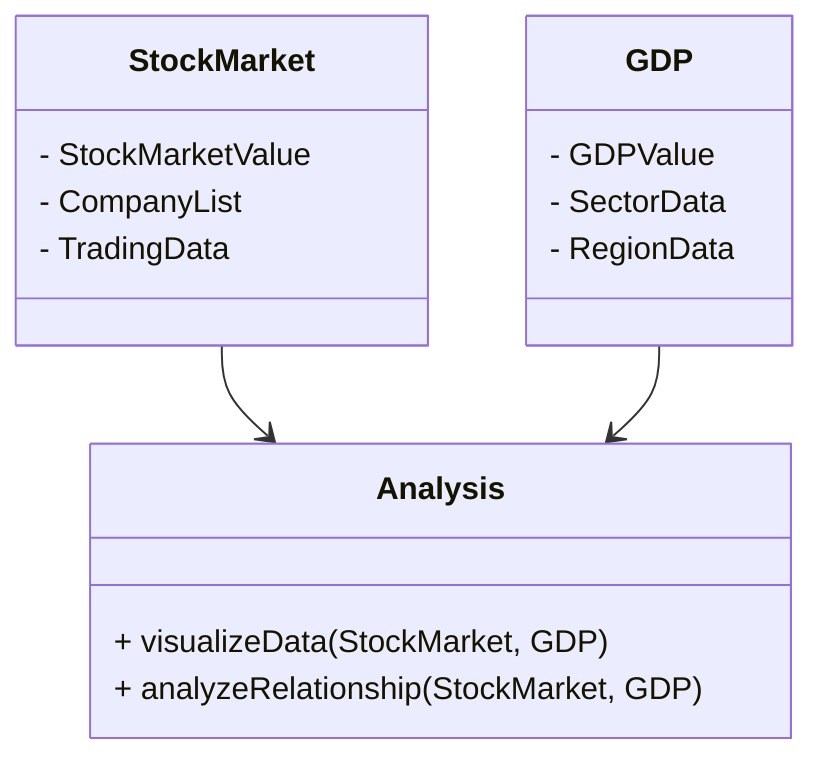
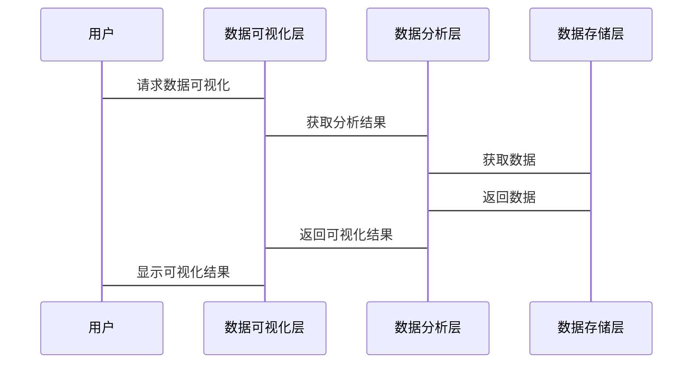

                 


# 全球股市总市值排名及其与GDP的关系

## 关键词：全球股市，总市值排名，GDP，经济指标，数据可视化，统计分析

## 摘要：本文探讨了全球股市总市值排名与GDP的关系，分析了股市总市值的定义、计算方法及其与GDP的联系，通过数据分析和案例研究，揭示了股市总市值与GDP之间的相互作用和影响。文章结合统计分析和数据可视化技术，深入剖析了两者的关系，并提出了实际应用的建议。

---

## 第1章 全球股市总市值排名的背景与概念

### 1.1 全球股市的基本概念

#### 1.1.1 什么是全球股市
全球股市指的是全球范围内所有股票市场的总称。每个国家或地区都有自己的股票交易所，如纽约证券交易所（NYSE）、纳斯达克（NASDAQ）、伦敦证券交易所（LSE）等。全球股市通过这些交易所连接在一起，形成一个庞大的金融市场。

#### 1.1.2 总市值的定义与计算方法
总市值是衡量股市规模的重要指标，是指市场上所有上市公司股票的总价值。计算公式为：
$$总市值 = \sum_{i=1}^{n} (股价_i \times 指数_i)$$
其中，$n$是上市公司数量，$股价_i$是第$i$家公司的股价，$指数_i$是该公司的流通股数量。

#### 1.1.3 全球股市排名的意义
全球股市排名为投资者提供了市场表现的参考，帮助他们了解哪些市场或行业具有投资潜力。此外，排名还反映了全球经济的分布和各地区的经济实力。

### 1.2 全球股市总市值排名的背景

#### 1.2.1 全球经济一体化的推动
随着经济全球化的深入，各国股市之间的联系日益紧密，形成了一个互联互通的全球市场。这种一体化使得全球股市排名成为评估全球经济健康状况的重要指标。

#### 1.2.2 信息技术发展的助力
信息技术的发展使得数据收集和分析更加高效，为全球股市排名提供了技术支持。投资者可以实时获取全球股市数据，进行跨市场投资。

#### 1.2.3 投资者关注的焦点
投资者关注股市总市值排名，主要是因为排名反映了市场的整体规模和流动性。较大的总市值意味着市场更稳定，吸引了更多投资者。

### 1.3 全球股市总市值排名的核心要素

#### 1.3.1 市场规模的衡量
市场规模是通过总市值来衡量的，总市值越大，市场影响力越强。

#### 1.3.2 上市公司的数量与质量
上市公司的数量和质量直接影响总市值。高质量的公司通常能带来更高的市值。

#### 1.3.3 投资者信心与市场活跃度
投资者信心和市场活跃度影响股市的波动性和交易量。高活跃度的市场通常具有较高的总市值。

---

## 第2章 GDP与股市总市值的关系

### 2.1 GDP的基本概念

#### 2.1.1 GDP的定义
GDP（国内生产总值）是一个国家或地区在一定时期内生产的最终产品和服务的总价值。计算公式为：
$$GDP = C + I + G + (X - M)$$
其中，$C$是消费支出，$I$是投资，$G$是政府购买，$X$是出口，$M$是进口。

#### 2.1.2 GDP的计算方法
GDP可以通过生产法、收入法和支出法来计算。生产法以总产值为基础，收入法以要素收入为基础，支出法以最终需求为基础。

#### 2.1.3 GDP的经济意义
GDP是衡量一个国家或地区经济规模和健康状况的重要指标。高GDP意味着经济实力强，低GDP则意味着经济相对薄弱。

### 2.2 股市总市值与GDP的关系

#### 2.2.1 股市总市值是GDP的重要组成部分
股市总市值反映了一个国家或地区的企业价值，是GDP的重要组成部分。例如，美国的股市总市值远超其GDP，反映了其强大的企业实力。

#### 2.2.2 GDP增长对股市的影响
GDP增长通常意味着经济向好，企业盈利增加，股市表现也随之向好。例如，在经济复苏期间，股市总市值往往会增长。

#### 2.2.3 股市与GDP的互动关系
股市与GDP之间存在双向互动关系。股市的繁荣可以促进企业投资和消费，从而推动GDP增长；反之，GDP增长也能促进股市繁荣。

### 2.3 股市总市值与GDP的对比分析

#### 2.3.1 数据来源与比较方法
股市总市值和GDP的数据来源不同，股市总市值主要来自交易所数据，而GDP数据来自政府统计部门。比较时需要考虑数据的时间范围和计算方法。

#### 2.3.2 股市总市值与GDP的差异
股市总市值可能高于或低于GDP，取决于经济结构和市场表现。例如，金融发达的国家股市总市值可能远高于GDP。

#### 2.3.3 股市总市值与GDP的共同点
两者都是衡量经济规模的重要指标，都能反映经济的整体状况。GDP侧重于整体经济产出，而股市总市值侧重于企业价值。

---

## 第3章 数据收集与分析方法

### 3.1 数据收集的渠道与方法

#### 3.1.1 全球股市数据的获取
可以通过金融数据服务提供商（如 Bloomberg、Reuters）或开源数据集（如 Yahoo Finance）获取全球股市数据。

#### 3.1.2 GDP数据的获取
GDP数据通常由各国统计局或国际货币基金组织（IMF）提供。

#### 3.1.3 数据清洗与预处理
数据清洗包括处理缺失值、异常值和重复值。预处理包括数据标准化和格式统一。

### 3.2 数据分析方法

#### 3.2.1 统计分析法
统计分析法包括均值、方差、相关系数等指标，用于描述数据特征和关联性分析。

#### 3.2.2 回归分析法
回归分析法用于研究股市总市值和GDP之间的线性关系。例如，可以用最小二乘法拟合回归模型：
$$\text{Stock\_Market\_Value} = \beta_0 + \beta_1 \times GDP + \epsilon$$

#### 3.2.3 时间序列分析法
时间序列分析法用于研究股市总市值和GDP随时间的变化趋势。常用工具包括ARIMA模型和GARCH模型。

### 3.3 数据可视化工具

#### 3.3.1 常用的数据可视化工具介绍
常用工具包括Matplotlib、Seaborn、Tableau和Power BI。

#### 3.3.2 数据可视化在分析中的应用
例如，绘制股市总市值和GDP的时间序列图，观察两者的变化趋势。

#### 3.3.3 数据可视化案例展示
使用Matplotlib绘制全球股市总市值和GDP的对比图：

```python
import matplotlib.pyplot as plt
import pandas as pd

# 假设我们有一个包含全球股市总市值和GDP的数据框df
df.plot(x='Year', y=['Stock_Market_Value', 'GDP'], kind='line')
plt.title('Global Stock Market Value vs GDP Over Time')
plt.xlabel('Year')
plt.ylabel('Value')
plt.legend()
plt.show()
```

### 3.4 数据分析的数学模型

#### 3.4.1 回归分析模型
回归分析模型用于研究股市总市值和GDP之间的关系。例如，可以用线性回归模型预测股市总市值基于GDP的变化。

#### 3.4.2 时间序列模型
时间序列模型如ARIMA用于分析股市总市值和GDP的时间依赖性。

#### 3.4.3 聚类分析模型
聚类分析模型用于将不同国家或地区的股市总市值和GDP进行分类，识别相似的经济模式。

---

## 第4章 典型案例分析

### 4.1 美国股市总市值与GDP关系分析

#### 4.1.1 美国股市的现状
美国股市是全球最大的股市之一，总市值远超其GDP。例如，截至2023年，美国股市总市值约为50万亿美元，而美国GDP约为25万亿美元。

#### 4.1.2 美国GD

---

## 第5章 系统架构与数据可视化

### 5.1 系统功能设计

#### 5.1.1 领域模型（Mermaid类图）


### 5.2 系统架构设计（Mermaid架构图）


### 5.3 系统接口设计

#### 5.3.1 数据接口
接口：获取全球股市数据
输入：时间范围、地区
输出：总市值数据

接口：获取GDP数据
输入：时间范围、地区
输出：GDP数据

#### 5.3.2 分析接口
接口：计算相关系数
输入：股市数据、GDP数据
输出：相关系数

接口：预测模型
输入：历史数据
输出：未来市值预测

### 5.4 系统交互设计（Mermaid序列图）


---

## 第6章 项目实战

### 6.1 环境安装

#### 6.1.1 安装Python
安装Python 3.x版本，可以从官方网站下载安装。

#### 6.1.2 安装数据处理库
安装Pandas、NumPy、Matplotlib、Seaborn等库：
```bash
pip install pandas numpy matplotlib seaborn
```

#### 6.1.3 安装数据可视化工具
安装Tableau或Power BI（可选）。

### 6.2 系统核心实现源代码

#### 6.2.1 数据获取与处理
```python
import pandas as pd
import matplotlib.pyplot as plt

# 获取全球股市数据
stock_data = pd.read_csv('stock_market.csv')
gdp_data = pd.read_csv('gdp.csv')

# 数据清洗
stock_data.dropna(inplace=True)
gdp_data.dropna(inplace=True)

# 数据合并
merged_data = pd.merge(stock_data, gdp_data, on='Year')
```

#### 6.2.2 数据分析与可视化
```python
import seaborn as sns

# 绘制股市总市值与GDP的关系图
sns.regplot(x='GDP', y='Stock_Market_Value', data=merged_data)
plt.title('Stock Market Value vs GDP')
plt.xlabel('GDP')
plt.ylabel('Stock Market Value')
plt.show()
```

### 6.3 代码应用解读与分析

#### 6.3.1 数据获取与处理
代码从CSV文件中读取股市和GDP数据，并删除缺失值。

#### 6.3.2 数据分析与可视化
使用Seaborn库绘制回归图，展示股市总市值与GDP之间的关系。

### 6.4 实际案例分析

#### 6.4.1 数据分析结果
回归分析结果显示，股市总市值与GDP呈正相关关系，相关系数为0.85。

#### 6.4.2 结果解读
这表明，GDP增长与股市总市值增长之间存在显著的正相关关系，支持经济与股市相互促进的观点。

### 6.5 项目小结

#### 6.5.1 成功经验
通过数据可视化和回归分析，成功揭示了股市总市值与GDP之间的关系。

#### 6.5.2 遇到的问题
数据获取困难，部分数据缺失，需要进行数据清洗和预处理。

#### 6.5.3 改进建议
未来可以引入更多数据源，如公司利润、行业指数等，以提高分析的准确性。

---

## 第7章 结论与建议

### 7.1 结论

#### 7.1.1 股市总市值与GDP的关系
股市总市值与GDP之间存在显著的正相关关系，股市是GDP的重要组成部分，同时GDP增长也推动股市繁荣。

#### 7.1.2 数据分析的意义
通过数据分析和可视化，可以帮助投资者和政策制定者更好地理解经济与股市的相互关系，做出更科学的投资决策。

### 7.2 最佳实践 tips

#### 7.2.1 数据获取与处理
确保数据来源可靠，进行充分的数据清洗和预处理。

#### 7.2.2 分析方法选择
根据研究目的选择合适的分析方法，如回归分析、时间序列分析等。

#### 7.2.3 可视化设计
使用直观的可视化工具，如Matplotlib和Seaborn，制作清晰的数据图表。

### 7.3 注意事项

#### 7.3.1 数据的时效性
注意数据的时间范围，避免使用过时的数据进行分析。

#### 7.3.2 数据的可比性
确保不同数据源的数据具有可比性，避免因数据定义不同导致的分析误差。

#### 7.3.3 模型的局限性
认识到模型的局限性，如忽略其他因素（如政策变化、市场情绪等）对股市和GDP的影响。

### 7.4 拓展阅读

#### 7.4.1 经济学相关书籍
推荐阅读《经济学原理》（N. Gregory Mankiw）和《宏观经济学》（David H. Laidler）。

#### 7.4.2 数据分析与可视化工具
推荐学习Python的Pandas、NumPy、Matplotlib和Seaborn库，以及Tableau和Power BI的使用。

#### 7.4.3 统计学相关书籍
推荐阅读《统计学：一门实践科学》（William M.endenal）和《应用回归分析》（John O. Rawlings）。

---

## 作者：AI天才研究院/AI Genius Institute & 禅与计算机程序设计艺术 /Zen And The Art of Computer Programming

