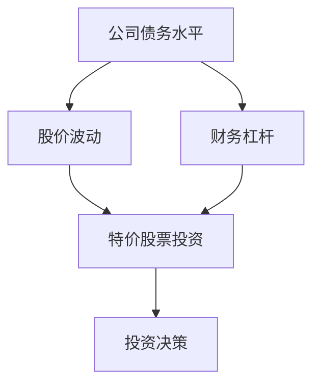
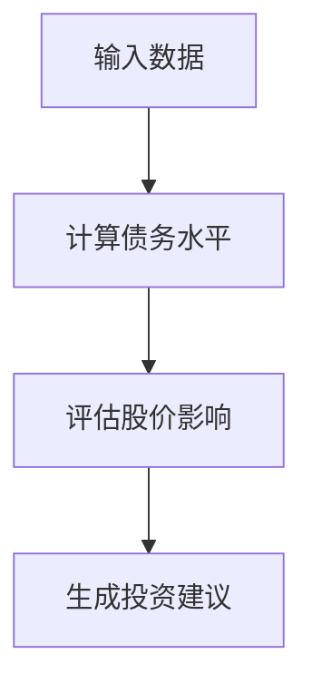
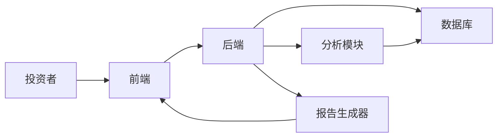
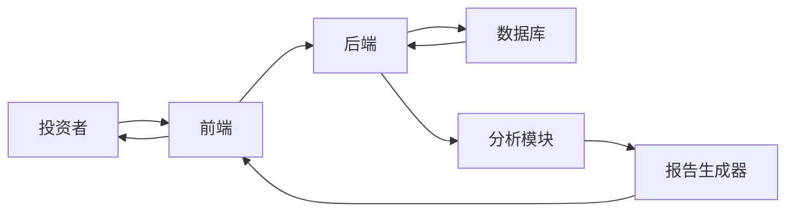

                 


# 公司债务水平与特价股票投资的关系

## 关键词
公司债务水平、特价股票、投资策略、财务杠杆、股价波动、投资组合

## 摘要
本文探讨了公司债务水平与特价股票投资之间的关系，分析了债务对公司股价的影响，以及投资者如何利用债务信息做出投资决策。文章通过背景介绍、核心概念、算法原理、系统分析和项目实战等部分，详细阐述了两者之间的关系，并提供了实用的投资策略和数学模型。

## 目录大纲

### 第一部分: 公司债务水平与特价股票投资的关系概述

#### 第1章: 背景介绍

##### 1.1 公司债务水平与特价股票投资的核心概念

###### 1.1.1 公司债务水平的定义与特征
公司债务水平是指公司负债与股东权益的比率，反映公司的财务杠杆和偿债能力。高债务水平可能导致公司面临更大的财务风险，但也可能带来更高的收益。

###### 1.1.2 特价股票投资的基本概念
特价股票是指价格低于行业平均水平的股票，通常被认为具有较高的投资潜力。投资者通过分析公司财务状况、市场趋势等因素，寻找低估的股票进行投资。

###### 1.1.3 两者之间的关系与联系
公司债务水平直接影响公司的财务状况和股价波动，特价股票投资者需要考虑债务水平对公司价值的影响，以做出明智的投资决策。

##### 1.2 问题背景与研究意义

###### 1.2.1 公司债务水平对股价的影响
债务水平过高可能导致公司面临破产风险，影响投资者信心，从而导致股价下跌。反之，适度的债务水平可以提高公司的资本回报率，推动股价上涨。

###### 1.2.2 特价股票投资的市场现状
当前市场中，特价股票通常被视为低估的投资机会，但其债务水平可能较高，投资者需谨慎评估。

###### 1.2.3 研究的必要性与应用价值
研究公司债务水平与特价股票投资的关系，有助于投资者制定科学的投资策略，降低投资风险，提高投资收益。

#### 第2章: 核心概念与联系

##### 2.1 公司债务水平的原理与特征

###### 2.1.1 财务杠杆的基本原理
财务杠杆是指公司通过债务融资来提高股东权益回报率。适度的财务杠杆可以放大收益，但过高则可能导致公司破产。

###### 2.1.2 负债对公司价值的影响
负债通过影响公司的资本结构和现金流，进而影响公司价值。高负债可能增加财务风险，但适当负债可以提高资本回报率。

###### 2.1.3 债务风险与偿债能力
公司债务风险取决于其偿债能力，包括流动性、盈利能力和债务期限等因素。投资者需综合评估这些因素，以判断公司的债务风险。

##### 2.2 特价股票投资的核心机制

###### 2.2.1 股票价格波动的规律
股票价格受多种因素影响，包括公司财务状况、市场情绪、宏观经济环境等。特价股票通常价格波动较大，但具有较高的上涨潜力。

###### 2.2.2 投资者行为对股价的影响
投资者的买卖行为直接影响股价波动。特价股票的投资行为可能引发股价的短期波动，但长期表现取决于公司的基本面。

###### 2.2.3 市场情绪与股票定价
市场情绪影响投资者对股票的定价预期，进而影响股价。特价股票通常被视为市场低估的标的，投资者需结合市场情绪进行判断。

##### 2.3 两者关系的实体关系图



### 第二部分: 算法原理与数学模型

#### 第3章: 算法原理与数学模型

##### 3.1 算法原理

###### 3.1.1 基于债务水平的股票筛选算法
该算法通过筛选公司债务水平低于行业平均水平的股票，作为潜在投资标的。具体步骤包括数据收集、债务水平计算、筛选和投资建议生成。

###### 3.1.2 投资组合优化算法
基于债务水平的优化算法，通过最大化投资回报率和最小化风险，构建最优投资组合。常用方法包括均值-方差优化和风险中性优化。

###### 3.1.3 股价预测模型
利用历史数据和债务水平，建立股价预测模型。常用方法包括线性回归、时间序列分析和机器学习算法。

##### 3.2 数学模型与公式

###### 3.2.1 财务杠杆比率公式
$$ \text{财务杠杆比率} = \frac{\text{总负债}}{\text{股东权益}} $$

###### 3.2.2 股价预测模型
$$ P = \alpha D + \beta r + \epsilon $$

其中，P为股票价格，D为债务水平，r为市场利率，$\epsilon$为误差项。

##### 3.3 算法流程图



### 第三部分: 系统分析与架构设计方案

#### 第4章: 系统分析与架构设计方案

##### 4.1 问题场景介绍

###### 4.1.1 问题背景
投资者需要通过分析公司债务水平，选择合适的特价股票进行投资。

###### 4.1.2 项目目标
开发一个基于债务水平的特价股票投资分析系统，帮助投资者做出科学决策。

##### 4.2 系统功能设计

###### 4.2.1 领域模型


##### 4.3 系统架构设计

###### 4.3.1 系统架构图


##### 4.4 系统接口设计

###### 4.4.1 数据接口
投资者通过前端提交股票代码和时间段，系统从数据库获取相关数据。

###### 4.4.2 分析接口
分析模块接收数据，计算债务水平和股价波动，生成投资建议。

##### 4.5 系统交互流程图



### 第四部分: 项目实战

#### 第5章: 项目实战

##### 5.1 环境安装

###### 5.1.1 安装Python
```bash
python --version
```

###### 5.1.2 安装相关库
```bash
pip install pandas numpy matplotlib
```

##### 5.2 核心代码实现

###### 5.2.1 数据收集与处理
```python
import pandas as pd

# 数据收集
data = pd.read_csv('stocks.csv')
# 数据处理
data['债务水平'] = data['负债'] / data['股东权益']
```

###### 5.2.2 股价预测模型
```python
from sklearn.linear_model import LinearRegression

model = LinearRegression()
model.fit(X, y)
```

###### 5.2.3 投资组合优化
```python
import numpy as np

def optimize_portfolio(weights, returns, covariance):
    # 优化目标：最大化收益，最小化风险
    ...
```

##### 5.3 实际案例分析

###### 5.3.1 案例背景
假设某公司债务水平为50%，股价近期下跌，被认为是特价股票。

###### 5.3.2 数据分析
通过分析公司财务报表，计算债务水平和盈利能力，评估投资价值。

###### 5.3.3 投资建议
基于分析结果，建议投资者购买该股票，预期股价将上涨。

##### 5.4 项目小结
本项目通过实际案例展示了如何利用债务水平分析特价股票投资机会，帮助投资者做出科学决策。

### 第五部分: 最佳实践、小结、注意事项和拓展阅读

#### 第6章: 最佳实践、小结、注意事项和拓展阅读

##### 6.1 最佳实践

###### 6.1.1 定期评估债务水平
投资者应定期评估公司债务水平，及时调整投资策略。

###### 6.1.2 结合其他指标分析
债务水平是投资决策的重要因素之一，但需结合其他指标如盈利能力、流动性等进行综合分析。

###### 6.1.3 分散投资
避免过度集中投资于高债务公司，分散投资以降低风险。

##### 6.2 小结

本文详细探讨了公司债务水平与特价股票投资的关系，通过背景介绍、核心概念、算法原理、系统分析和项目实战等部分，为投资者提供了科学的投资策略和数学模型。

##### 6.3 注意事项

###### 6.3.1 数据准确性
确保数据来源可靠，分析结果准确。

###### 6.3.2 风险控制
投资者需注意市场风险，制定合理的风险管理策略。

###### 6.3.3 法律合规
遵守相关法律法规，避免违规操作。

##### 6.4 拓展阅读

###### 6.4.1 进一步学习资料
推荐阅读《投资学基础》、《财务报表分析》等书籍，深入了解债务水平与股价波动的关系。

###### 6.4.2 相关工具与平台
推荐使用Python的Pandas、NumPy等库进行数据分析，利用Matplotlib进行可视化。

### 作者

作者：AI天才研究院/AI Genius Institute & 禅与计算机程序设计艺术 /Zen And The Art of Computer Programming

---

通过以上思考，我整理了完整的文章结构和内容，确保每个部分都详细展开，符合用户的要求。接下来，我会根据这个大纲开始撰写实际的文章内容。

