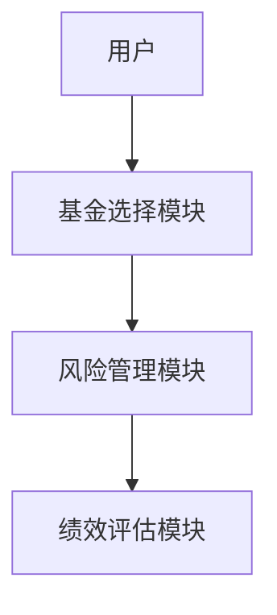
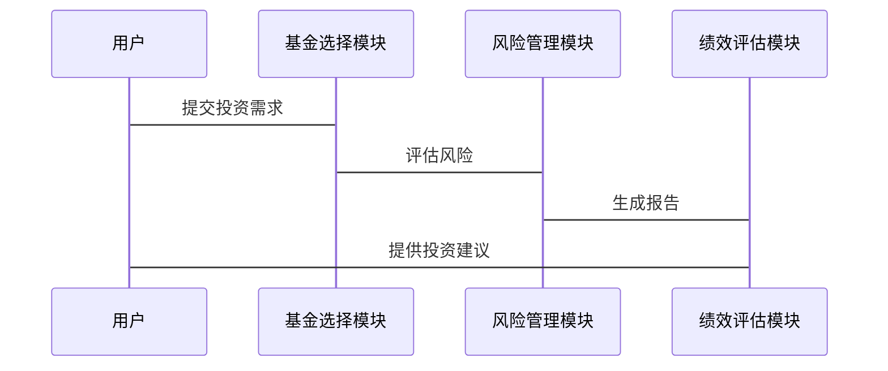

                 


```markdown
# 养老基金投资策略：长期资本的配置逻辑

> 关键词：养老基金, 长期资本, 投资策略, 资产配置, 风险管理, 数学模型, 项目实战

> 摘要：本文详细探讨了养老基金投资策略的核心逻辑，重点分析了长期资本的配置策略、风险管理方法及具体的资产配置策略。文章从理论基础出发，结合实际案例和系统设计，为读者提供了一套完整的养老基金投资策略框架。

---

## 第1章: 养老基金的基本概念与目标

### 1.1 养老基金的定义与特点
#### 1.1.1 养老基金的定义
养老基金是一种专门用于保障老年人退休后生活品质的基金，通过长期投资实现资金的保值与增值。

#### 1.1.2 养老基金的主要特点
- **长期性**：养老基金的投资周期通常较长，注重长期收益。
- **稳定性**：注重本金的安全性，追求稳定收益。
- **分散性**：通过多元化的资产配置降低风险。

#### 1.1.3 养老基金的目标与意义
- **目标**：确保退休后有足够的资金来源。
- **意义**：通过专业化的投资管理，实现资金的最优配置。

### 1.2 长期资本的配置逻辑
#### 1.2.1 长期资本的定义
长期资本是指投资期限超过一年的资金，通常用于支持企业的长期发展或投资项目。

#### 1.2.2 长期资本配置的核心逻辑
- **目标导向**：根据投资目标选择合适的资产。
- **风险控制**：在可控风险范围内追求最大收益。
- **动态调整**：根据市场变化及时调整配置比例。

#### 1.2.3 养老基金与长期资本的关系
- 养老基金是长期资本的主要来源之一。
- 长期资本的配置直接影响养老基金的收益和风险。

---

## 第2章: 养老基金投资策略的背景与现状

### 2.1 养老基金投资的背景
#### 2.1.1 养老基金的起源与发展
养老基金起源于20世纪初，随着人口老龄化问题的加剧，其重要性日益凸显。

#### 2.1.2 养老基金投资的必要性
- 通货膨胀影响购买力。
- 单一投资渠道的收益有限。

#### 2.1.3 养老基金投资的政策环境
- 政府政策支持。
- 监管机构的规范。

### 2.2 养老基金投资的现状
#### 2.2.1 全球养老基金投资现状
- 美国、欧洲等发达国家的养老基金规模庞大。
- 新兴市场的养老基金增长迅速。

#### 2.2.2 中国养老基金投资的特点
- 规模增长快。
- 投资渠道逐步多元化。

#### 2.2.3 养老基金投资面临的挑战
- 市场波动风险。
- 通胀风险。

---

## 第3章: 养老基金投资策略的核心概念

### 3.1 资产配置的定义与分类
#### 3.1.1 资产配置的定义
资产配置是将资金分配到不同资产类别中，以实现风险和收益的平衡。

#### 3.1.2 资产配置的分类
- **股票型资产**：高风险高收益。
- **债券型资产**：低风险稳定收益。
- **现金及货币市场工具**：流动性高，风险低。

### 3.2 风险管理的核心要素
#### 3.2.1 风险的定义与分类
- **市场风险**：市场波动导致的损失。
- **流动性风险**：资产难以变现的风险。

#### 3.2.2 风险管理的基本原则
- **分散投资**：通过多元化降低风险。
- **风险定价**：准确评估资产的风险。

#### 3.2.3 风险管理的工具与方法
- **止损策略**：设定止损点以限制损失。
- **风险对冲**：利用衍生工具对冲风险。

---

## 第4章: 养老基金投资策略的数学模型与算法原理

### 4.1 现代投资组合理论（MPT）
#### 4.1.1 MPT的基本假设
- 投资者是理性的，追求效用最大化。
- 市场是有效的，价格反映所有信息。

#### 4.1.2 MPT的核心公式
$$ \text{风险} = \sqrt{\omega^T \Sigma \omega} $$
其中，ω是权重向量，Σ是协方差矩阵。

#### 4.1.3 MPT的应用实例
通过优化算法选择最优资产组合。

### 4.2 风险调整后的收益（RAROC）
#### 4.2.1 RAROC的定义与计算公式
$$ \text{RAROC} = \frac{\text{净利润}}{\text{风险资本}} $$

#### 4.2.2 RAROC的优缺点
优点：考虑了风险因素；缺点：计算复杂。

### 4.3 资产配置的优化算法
#### 4.3.1 均值-方差优化模型
$$ \text{Minimize } \sigma^2 \text{ subject to } \mu^T w = r $$

#### 4.3.2 距离最优化模型
$$ \text{Minimize } ||w - w_0||^2 \text{ subject to } \mu^T w = r $$

#### 4.3.3 风险平价模型
$$ \text{风险平价} = \frac{\sigma_i}{\sum \sigma_i} $$

---

## 第5章: 养老基金投资策略的系统分析与架构设计

### 5.1 系统分析
#### 5.1.1 系统目标
实现养老基金的科学配置与管理。

#### 5.1.2 系统范围
涵盖基金选择、风险评估等模块。

#### 5.1.3 系统功能需求
- 资产配置模块
- 风险管理模块
- 绩效评估模块

### 5.2 系统架构设计
#### 5.2.1 系统架构图


#### 5.2.2 系统接口设计
- 输入接口：用户输入参数。
- 输出接口：输出投资建议。

### 5.3 系统交互流程


---

## 第6章: 项目实战：养老基金投资系统设计

### 6.1 环境安装
- 安装Python和相关库（如pandas、numpy）。

### 6.2 核心实现
#### 6.2.1 资产配置模块
```python
import pandas as pd
import numpy as np

def optimize_portfolio(returns, weights):
    # 均值-方差优化
    cov_matrix = np.cov(returns.T)
    inv_cov = np.linalg.inv(cov_matrix)
    mu = np.mean(returns)
    mu_vec = np.dot(inv_cov, mu)
    weights_opt = mu_vec / np.sum(mu_vec)
    return weights_opt
```

#### 6.2.2 风险管理模块
```python
def calculate VaR(returns, confidence_level=0.95):
    returns_sorted = np.sort(returns)
    var_index = int(len(returns_sorted) * (1 - confidence_level))
    var = returns_sorted[var_index]
    return var
```

### 6.3 案例分析
通过实际数据，展示系统的应用效果。

---

## 第7章: 最佳实践与总结

### 7.1 小结
本文详细介绍了养老基金投资策略的核心逻辑，从理论到实践，提供了完整的解决方案。

### 7.2 注意事项
- 风险管理是投资的核心。
- 资产配置需要根据市场变化动态调整。

### 7.3 未来趋势
- 人工智能在投资中的应用。
- 可持续投资（ESG）的重要性。

---

## 附录

### 附录A: 相关工具与资源
- Python代码示例
- 常用金融模型资料

---

作者：AI天才研究院/AI Genius Institute & 禅与计算机程序设计艺术 /Zen And The Art of Computer Programming
```

