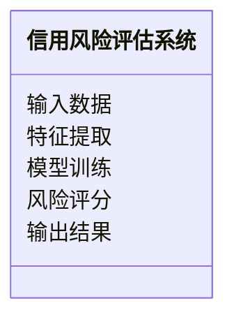
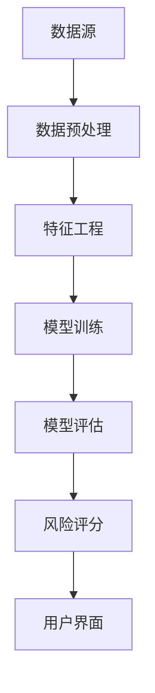
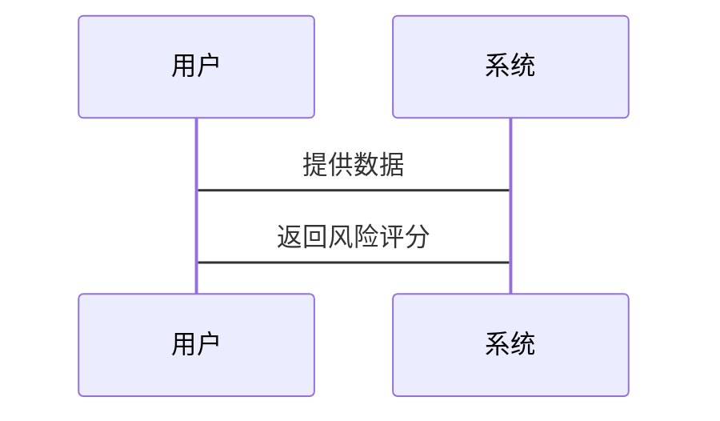

                 


# 利用AI构建自适应型信用风险评估模型：增强投资安全性

**关键词：**  
信用风险评估、人工智能、自适应模型、动态风险、投资安全性

**摘要：**  
在金融领域，信用风险评估是保障投资安全性的核心环节。传统方法依赖于统计模型，但其静态性和局限性限制了其在复杂金融市场中的应用效果。随着人工智能技术的快速发展，自适应型信用风险评估模型因其动态调整能力和高精度预测能力，逐渐成为金融领域的研究热点。本文系统地探讨了利用AI构建自适应型信用风险评估模型的方法，结合实际案例分析，展示了如何通过特征工程、模型选择和系统架构设计等步骤，构建出一个高效、可靠的自适应信用风险评估系统，从而帮助投资者在复杂多变的市场环境中做出更明智的投资决策。

---

# 第一部分: 信用风险评估与AI的结合

## 第1章: 信用风险评估的背景与挑战

### 1.1 信用风险的基本概念

#### 1.1.1 信用风险的定义  
信用风险是指债务人在偿还债务时可能发生的违约风险。在金融领域，信用风险是衡量投资安全性的重要指标，尤其是在信贷、债券和投资组合管理中，信用风险评估至关重要。

#### 1.1.2 信用风险的分类  
信用风险主要分为两类：  
1. **系统性风险**：由宏观经济因素（如经济衰退、利率上升）引发的广泛风险。  
2. **非系统性风险**：由特定主体或资产的信用状况变化引发的风险。

#### 1.1.3 信用风险的评估方法  
传统的信用风险评估方法包括：  
1. **信用评分模型**：如FICO评分，基于历史数据对信用风险进行评分。  
2. **Z评分模型**：用于预测企业违约风险。  
3. **KMV模型**：基于市场数据预测企业违约概率。  

---

### 1.2 传统信用风险评估的局限性

#### 1.2.1 传统信用评分模型的局限性  
传统模型依赖于历史数据，假设市场环境稳定，但现实中市场环境动态变化，导致模型预测能力有限。  

#### 1.2.2 数据不足与模型过拟合问题  
传统模型通常依赖少量特征，可能导致信息损失；而复杂模型（如复杂逻辑回归）可能因数据不足而出现过拟合问题。  

#### 1.2.3 传统模型对动态风险变化的适应性不足  
传统模型通常是静态的，无法实时捕捉市场变化，导致风险评估结果滞后。  

---

### 1.3 AI技术在信用风险评估中的应用前景

#### 1.3.1 AI技术在金融领域的应用现状  
AI技术在金融领域的应用日益广泛，包括智能投顾、 fraud detection、信用评估等领域。  

#### 1.3.2 AI在信用风险评估中的优势  
1. **数据处理能力**：AI能够处理大量非结构化数据，提取更多特征。  
2. **非线性关系建模**：AI模型（如神经网络）能够捕捉复杂的非线性关系。  
3. **动态调整能力**：AI模型可以实时更新，适应市场变化。  

#### 1.3.3 自适应型信用风险模型的必要性  
自适应型模型能够实时调整权重和特征，动态优化风险评估结果，提高预测准确性。  

---

## 第2章: AI在信用风险评估中的核心作用

### 2.1 AI技术的核心优势

#### 2.1.1 大数据分析能力  
AI技术能够处理海量数据，包括文本、图像和时间序列数据，提取更多有价值的信息。  

#### 2.1.2 非线性关系建模能力  
AI模型（如深度学习）能够捕捉复杂的非线性关系，提高预测精度。  

#### 2.1.3 动态调整能力  
AI模型能够实时更新参数和特征，适应市场变化。  

---

### 2.2 自适应型模型的定义与特点

#### 2.2.1 自适应型模型的定义  
自适应型模型是一种能够在运行过程中根据实时数据动态调整模型参数和特征权重的信用风险评估模型。  

#### 2.2.2 自适应模型的核心特征  
1. **动态权重分配**：根据实时数据调整特征的权重。  
2. **实时数据更新**：能够实时处理新的数据输入。  
3. **模型自适应学习**：通过反馈机制优化模型性能。  

#### 2.2.3 自适应模型与传统模型的对比  

| 特性                | 传统模型                     | 自适应模型                  |
|---------------------|-----------------------------|---------------------------|
| 数据处理能力        | 依赖少量特征                 | 处理大量非结构化数据       |
| 模型更新            | 静态，定期更新               | 动态调整，实时更新         |
| 预测精度            | 受限于模型假设               | 更高，捕捉非线性关系       |

---

### 2.3 自适应型信用风险模型的构建目标

#### 2.3.1 实时风险评估  
通过实时数据分析，快速评估信用风险，及时调整投资策略。  

#### 2.3.2 动态权重调整  
根据市场变化，动态调整各特征的权重，提高模型的适应性。  

#### 2.3.3 风险预测的准确性提升  
通过AI技术捕捉更多特征和非线性关系，提高预测精度。  

---

## 第3章: 自适应型信用风险模型的核心原理

### 3.1 自适应模型的动态调整机制

#### 3.1.1 动态权重分配  
通过实时数据分析，动态调整各特征的权重，突出重要特征。  

#### 3.1.2 实时数据更新  
模型能够实时处理新数据，更新特征权重和模型参数。  

#### 3.1.3 模型自适应学习  
通过反馈机制优化模型性能，例如通过强化学习调整模型参数。  

---

### 3.2 自适应模型的特征工程

#### 3.2.1 特征选择  
从海量数据中筛选出与信用风险相关的特征，如还款能力、信用历史等。  

#### 3.2.2 特征提取  
通过主成分分析（PCA）等方法，提取特征的主成分，降低维度。  

#### 3.2.3 特征变换  
对特征进行标准化、归一化处理，确保模型输入的均匀性。  

---

### 3.3 自适应模型的算法原理

#### 3.3.1 神经网络算法  
神经网络（如LSTM）能够捕捉时间序列数据中的模式，适合处理动态数据。  

#### 3.3.2 集成学习算法  
集成学习（如随机森林）通过组合多个模型的结果，提高预测精度。  

#### 3.3.3 贝叶斯网络  
贝叶斯网络能够建模变量之间的概率关系，适合处理不确定性。  

---

## 第4章: 自适应型信用风险模型的数学模型与算法实现

### 4.1 线性回归模型

#### 4.1.1 线性回归的基本原理  
线性回归通过最小化预测值与实际值的平方差，拟合特征与目标变量之间的线性关系。  

#### 4.1.2 线性回归的数学公式  
$$ y = \beta_0 + \beta_1x_1 + \beta_2x_2 + ... + \beta_nx_n $$  

#### 4.1.3 线性回归的优缺点  
- 优点：简单、易于解释。  
- 缺点：无法捕捉非线性关系。  

---

### 4.2 逻辑回归模型

#### 4.2.1 逻辑回归的基本原理  
逻辑回归通过sigmoid函数，将线性回归的输出映射到0-1区间，适合分类问题。  

#### 4.2.2 逻辑回归的数学公式  
$$ P(y=1|x) = \frac{1}{1 + e^{-\beta x}} $$  

#### 4.2.3 逻辑回归的优缺点  
- 优点：适合二分类问题。  
- 缺点：无法捕捉复杂的非线性关系。  

---

## 第5章: 系统架构设计与项目实战

### 5.1 系统功能设计

#### 5.1.1 领域模型  


#### 5.1.2 系统架构  


#### 5.1.3 系统交互  


---

### 5.2 项目实战

#### 5.2.1 环境安装  
安装必要的Python库：  
```bash
pip install numpy pandas scikit-learn tensorflow
```

#### 5.2.2 核心实现源代码  
```python
import numpy as np
import pandas as pd
from sklearn.model import LinearRegression
from sklearn.metrics import accuracy_score

# 加载数据
data = pd.read_csv('credit_data.csv')

# 特征工程
X = data.drop('target', axis=1)
y = data['target']

# 模型训练
model = LinearRegression()
model.fit(X, y)

# 预测与评估
y_pred = model.predict(X)
print("准确率:", accuracy_score(y, y_pred))
```

#### 5.2.3 实际案例分析  
以某企业为例，利用模型预测其违约概率，调整投资策略。  

---

## 第6章: 总结与展望

### 6.1 最佳实践 tips  
- 数据清洗和特征工程是关键。  
- 实时数据更新能够提升模型性能。  

### 6.2 小结  
通过AI技术构建的自适应型信用风险评估模型，能够实时捕捉市场变化，提高预测精度，为投资者提供更可靠的投资决策支持。  

### 6.3 注意事项  
- 数据隐私和安全问题需要重视。  
- 模型的可解释性是实际应用中的重要考量。  

### 6.4 拓展阅读  
推荐阅读《Python机器学习实战》和《深度学习》等相关书籍，深入了解AI技术在金融领域的应用。

---

**作者：**  
AI天才研究院/AI Genius Institute  
禅与计算机程序设计艺术 / Zen And The Art of Computer Programming  

---

通过以上目录和内容设计，我们可以看到，构建一个自适应型信用风险评估模型需要结合AI技术的优势，通过动态调整和实时更新，提升模型的预测精度和适应性。这不仅能够帮助投资者更好地管理风险，还能在复杂多变的金融市场中做出更明智的投资决策。

