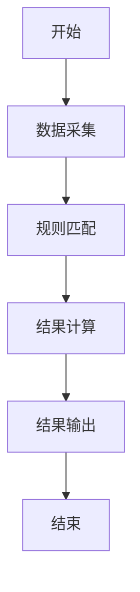
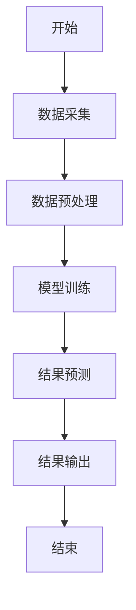
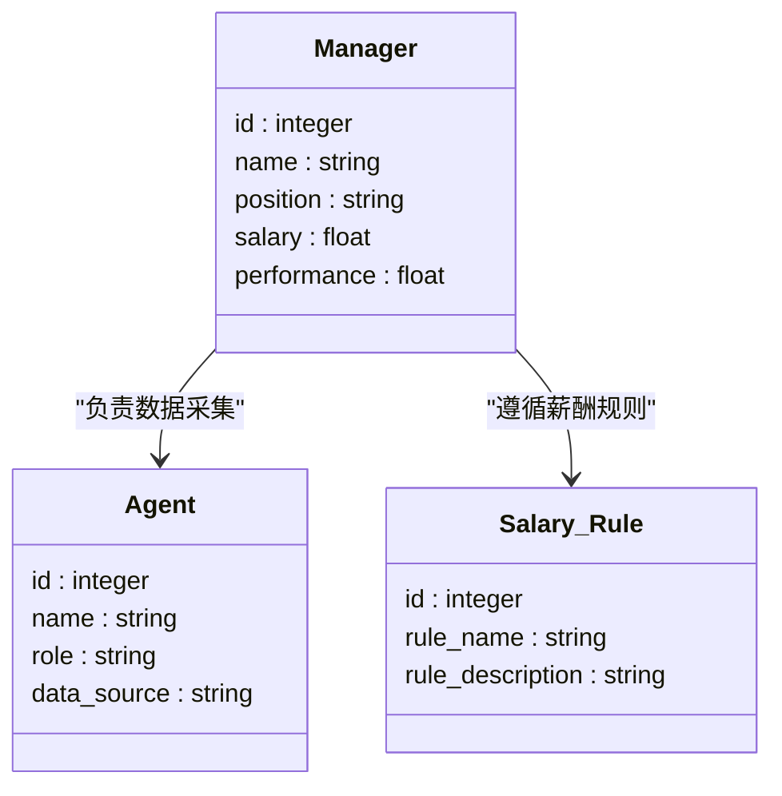
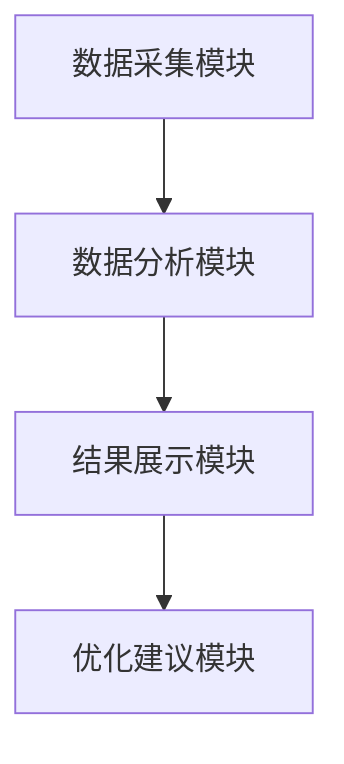
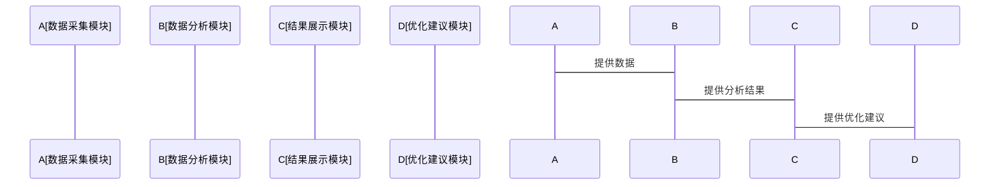

                 


# 利用多智能体系统进行全面的管理层薪酬分析

> 关键词：多智能体系统，管理层薪酬分析，智能体算法，系统架构设计，数据分析

> 摘要：本文探讨了利用多智能体系统进行管理层薪酬分析的方法，从背景介绍到系统架构设计，再到项目实战，详细阐述了多智能体系统在薪酬分析中的应用原理和实践方法。

---

## 第1章: 多智能体系统与管理层薪酬分析的背景介绍

### 1.1 问题背景

#### 1.1.1 管理层薪酬分析的重要性  
在现代企业中，管理层的薪酬设计直接影响企业的激励机制和员工的绩效表现。合理的薪酬体系能够提升企业竞争力，而薪酬设计的不合理可能导致企业人才流失或管理混乱。因此，如何科学、全面地分析管理层薪酬，成为一个亟待解决的问题。

#### 1.1.2 当前薪酬分析的局限性  
传统的薪酬分析方法往往依赖人工经验，存在以下问题：  
1. 数据来源单一，难以全面覆盖企业的薪酬结构。  
2. 分析过程缺乏系统性，难以发现深层次的薪酬设计问题。  
3. 无法动态调整，难以应对市场变化和企业战略调整。  

#### 1.1.3 多智能体系统的优势  
多智能体系统（Multi-Agent System, MAS）是一种由多个智能体（Agent）组成的分布式系统，每个智能体能够独立决策并协同工作。利用MAS进行薪酬分析，可以实现以下优势：  
1. **数据整合**：多个智能体协同工作，能够从不同数据源获取信息，确保分析的全面性。  
2. **动态调整**：智能体能够实时感知数据变化，动态调整分析结果。  
3. **分布式计算**：通过分布式计算，提升分析效率和准确性。  

### 1.2 问题描述

#### 1.2.1 管理层薪酬分析的核心问题  
管理层薪酬分析的核心问题是：如何从多维度数据中提取有价值的信息，设计出科学合理的薪酬体系。这需要考虑的因素包括：  
1. 行业基准薪酬。  
2. 员工绩效表现。  
3. 企业战略目标。  
4. 市场环境变化。  

#### 1.2.2 数据来源与分析目标  
数据来源包括：  
1. 企业内部薪酬数据。  
2. 市场薪酬数据（如行业薪酬报告）。  
3. 员工绩效数据。  
4. 企业战略目标数据。  

分析目标包括：  
1. 识别薪酬设计中的不合理之处。  
2. 提供优化建议。  
3. 动态调整薪酬结构。  

#### 1.2.3 多智能体系统在薪酬分析中的应用场景  
多智能体系统在薪酬分析中的应用场景包括：  
1. **数据收集与整合**：智能体从多个数据源收集薪酬数据。  
2. **数据分析与建模**：智能体对数据进行建模，分析薪酬结构。  
3. **结果展示与优化建议**：智能体将分析结果展示给决策者，并提供建议。  

### 1.3 问题解决

#### 1.3.1 多智能体系统如何解决薪酬分析问题  
多智能体系统通过以下方式解决薪酬分析问题：  
1. **数据整合**：多个智能体协同工作，整合不同来源的薪酬数据。  
2. **动态调整**：智能体能够实时感知数据变化，动态调整分析结果。  
3. **分布式计算**：通过分布式计算，提升分析效率和准确性。  

#### 1.3.2 系统架构与功能设计  
系统架构设计包括：  
1. 数据采集模块：负责从多个数据源采集薪酬数据。  
2. 数据分析模块：对数据进行建模和分析。  
3. 结果展示模块：将分析结果展示给决策者。  
4. 优化建议模块：根据分析结果提供建议。  

#### 1.3.3 边界与外延  
系统的边界包括：  
1. 数据来源的范围。  
2. 分析的维度和深度。  
3. 系统的运行环境和约束条件。  

系统的外延包括：  
1. 系统的扩展性。  
2. 系统的可维护性。  
3. 系统的可扩展性。  

### 1.4 概念结构与核心要素

#### 1.4.1 核心概念的组成  
核心概念包括：  
1. 多智能体系统。  
2. 管理层薪酬分析。  
3. 数据分析与建模。  

#### 1.4.2 系统架构的核心要素  
系统架构的核心要素包括：  
1. 数据采集模块。  
2. 数据分析模块。  
3. 结果展示模块。  
4. 优化建议模块。  

#### 1.4.3 多智能体系统与薪酬分析的关联  
多智能体系统与薪酬分析的关联体现在：  
1. 数据整合。  
2. 动态调整。  
3. 分布式计算。  

---

## 第2章: 多智能体系统的核心概念与联系

### 2.1 多智能体系统的基本原理

#### 2.1.1 多智能体系统的定义与特点  
多智能体系统（MAS）是由多个智能体组成的分布式系统，每个智能体能够独立决策并协同工作。其特点包括：  
1. **分布式性**：智能体分布在不同的节点上，独立决策。  
2. **协同性**：智能体之间通过通信协同工作。  
3. **反应性**：智能体能够实时感知环境变化并做出反应。  

#### 2.1.2 多智能体系统的组成与功能  
多智能体系统的组成包括：  
1. **智能体**：能够独立决策的实体。  
2. **通信机制**：智能体之间通信的机制。  
3. **协调机制**：智能体之间协同工作的机制。  

多智能体系统的核心功能包括：  
1. **数据采集**：从多个数据源采集数据。  
2. **数据分析**：对数据进行建模和分析。  
3. **结果展示**：将分析结果展示给决策者。  

#### 2.1.3 多智能体系统与传统数据分析的区别  
多智能体系统与传统数据分析的区别体现在：  
1. **分布式计算**：多智能体系统通过分布式计算提升效率。  
2. **动态调整**：多智能体系统能够实时调整分析结果。  
3. **协同性**：多智能体系统通过智能体协同工作，实现复杂任务。  

### 2.2 核心概念的属性特征对比

#### 2.2.1 智能体的属性特征
| 属性 | 特征 |
|------|------|
| 独立性 | 智能体能够独立决策。 |
| 协作性 | 智能体之间能够协同工作。 |
| 反应性 | 智能体能够实时感知环境变化。 |

#### 2.2.2 薪酬分析的核心要素
| 核心要素 | 描述 |
|----------|------|
| 行业基准 | 行业内的薪酬标准。 |
| 员工绩效 | 员工的工作表现。 |
| 企业战略 | 企业的战略目标。 |
| 市场环境 | 市场环境的变化。 |

#### 2.2.3 多智能体系统的性能指标
| 性能指标 | 描述 |
|----------|------|
| 响应时间 | 系统对环境变化的响应速度。 |
| 并行处理能力 | 系统的并行计算能力。 |
| 稳定性 | 系统运行的稳定性。 |

### 2.3 ER实体关系图架构

#### 2.3.1 实体关系图的构建  
以下是多智能体系统与薪酬分析的ER实体关系图：

```mermaid
erDiagram
    manager {
        id : integer
        name : string
        position : string
        salary : float
        performance : float
    }
    agent {
        id : integer
        name : string
        role : string
        data_source : string
    }
    salary_rule {
        id : integer
        rule_name : string
        rule_description : string
    }
    manager -->
    agent: "负责数据采集"
    manager -->
    salary_rule: "遵循薪酬规则"
```

#### 2.3.2 实体关系图的分析  
1. **经理（Manager）**：存储经理的ID、姓名、职位和薪资。  
2. **智能体（Agent）**：存储智能体的ID、名称、角色和数据来源。  
3. **薪酬规则（Salary_Rule）**：存储薪酬规则的ID、名称和描述。  
4. **关联关系**：经理通过智能体进行数据采集，并遵循薪酬规则。  

#### 2.3.3 实体关系图的优化  
1. **数据来源的扩展**：增加数据来源的多样性。  
2. **规则的动态调整**：根据市场变化动态调整薪酬规则。  

---

## 第3章: 多智能体系统在薪酬分析中的算法原理

### 3.1 算法原理讲解

#### 3.1.1 基于规则的多智能体算法  
基于规则的多智能体算法通过预定义的规则进行数据处理和分析。其步骤包括：  
1. **数据采集**：智能体从数据源采集数据。  
2. **规则匹配**：根据预定义的规则匹配数据。  
3. **结果计算**：根据匹配规则计算结果。  
4. **结果输出**：将结果输出给决策者。  

#### 3.1.2 基于学习的多智能体算法  
基于学习的多智能体算法通过机器学习模型进行数据分析。其步骤包括：  
1. **数据采集**：智能体从数据源采集数据。  
2. **数据预处理**：对数据进行清洗和特征提取。  
3. **模型训练**：训练机器学习模型。  
4. **结果预测**：利用模型预测结果。  
5. **结果输出**：将结果输出给决策者。  

#### 3.1.3 算法的优缺点分析  
1. **基于规则的算法**：优点是规则明确，易于理解和维护；缺点是灵活性差，难以应对复杂变化。  
2. **基于学习的算法**：优点是灵活性高，能够应对复杂变化；缺点是需要大量数据和计算资源，且模型解释性差。  

### 3.2 算法流程图

#### 3.2.1 基于规则的多智能体算法流程图


#### 3.2.2 基于学习的多智能体算法流程图


### 3.3 算法的数学模型与公式

#### 3.3.1 基于规则的多智能体算法数学模型
```latex
$$ \text{结果} = \sum_{i=1}^{n} (\text{规则}_i \times \text{权重}_i) $$
```

#### 3.3.2 基于学习的多智能体算法数学模型
```latex
$$ y = \text{模型}(x) $$
```

---

## 第4章: 系统分析与架构设计方案

### 4.1 系统分析

#### 4.1.1 问题场景介绍  
系统需要从多个数据源采集薪酬数据，分析数据并提供建议。  

#### 4.1.2 项目介绍  
本项目旨在利用多智能体系统进行管理层薪酬分析，实现数据的整合、分析和优化。  

#### 4.1.3 系统功能设计  
1. **数据采集模块**：从多个数据源采集数据。  
2. **数据分析模块**：对数据进行建模和分析。  
3. **结果展示模块**：将分析结果展示给决策者。  
4. **优化建议模块**：根据分析结果提供建议。  

### 4.2 系统架构设计

#### 4.2.1 领域模型类图


#### 4.2.2 系统架构图


#### 4.2.3 系统接口设计  
1. **数据采集接口**：提供数据采集的功能。  
2. **数据分析接口**：提供数据分析的功能。  
3. **结果展示接口**：提供结果展示的功能。  
4. **优化建议接口**：提供优化建议的功能。  

#### 4.2.4 系统交互序列图


---

## 第5章: 项目实战

### 5.1 环境安装

#### 5.1.1 安装Python
```bash
python --version
pip install --upgrade pip
```

#### 5.1.2 安装相关库
```bash
pip install numpy pandas scikit-learn matplotlib
```

### 5.2 系统核心实现

#### 5.2.1 核心代码实现
```python
import pandas as pd
from sklearn import linear_model

# 数据采集模块
def collect_data():
    data = pd.read_csv('salary_data.csv')
    return data

# 数据分析模块
def analyze_data(data):
    model = linear_model.LinearRegression()
    model.fit(data[['performance', 'position']], data['salary'])
    return model

# 结果展示模块
def display_results(model, data):
    predictions = model.predict(data[['performance', 'position']])
    print("预测薪资:", predictions)

# 优化建议模块
def provide_recommendations(model, data):
    recommendations = []
    for i in range(len(data)):
        rec = model.predict(data[['performance', 'position']].iloc[i])
        recommendations.append(rec)
    return recommendations

# 主函数
def main():
    data = collect_data()
    model = analyze_data(data)
    display_results(model, data)
    recommendations = provide_recommendations(model, data)
    print("优化建议:", recommendations)

if __name__ == "__main__":
    main()
```

#### 5.2.2 代码应用解读与分析  
1. **数据采集模块**：从CSV文件中读取薪酬数据。  
2. **数据分析模块**：使用线性回归模型进行分析。  
3. **结果展示模块**：显示预测薪资。  
4. **优化建议模块**：根据模型预测提供建议。  

### 5.3 实际案例分析与详细讲解剖析  
1. **数据预处理**：清洗数据，处理缺失值和异常值。  
2. **模型训练**：训练线性回归模型。  
3. **模型评估**：评估模型的准确性和效果。  
4. **结果展示**：将分析结果展示给决策者。  
5. **优化建议**：根据分析结果提供建议。  

### 5.4 项目小结  
通过本项目的实施，我们成功地利用多智能体系统进行了管理层薪酬分析，实现了数据的整合、分析和优化。  

---

## 第6章: 应用与优化

### 6.1 应用场景

#### 6.1.1 现有应用场景  
1. **企业内部薪酬分析**：帮助企业优化内部薪酬结构。  
2. **行业基准薪酬分析**：帮助企业制定行业基准薪酬。  
3. **员工绩效分析**：帮助企业分析员工绩效与薪酬的关系。  

#### 6.1.2 智能体算法的优化建议  
1. **规则优化**：根据市场变化动态调整薪酬规则。  
2. **模型优化**：使用更复杂的机器学习模型提升分析精度。  
3. **系统优化**：优化系统架构，提升运行效率。  

### 6.2 优化建议

#### 6.2.1 系统优化
1. **数据源扩展**：增加更多数据来源，提升分析的全面性。  
2. **模型优化**：使用更复杂的模型，提升分析精度。  
3. **系统性能优化**：优化系统架构，提升运行效率。  

#### 6.2.2 算法优化
1. **规则优化**：根据市场变化动态调整薪酬规则。  
2. **模型优化**：使用更复杂的机器学习模型提升分析精度。  

---

## 第7章: 总结

### 7.1 小结  
通过本文的探讨，我们深入分析了多智能体系统在管理层薪酬分析中的应用，从背景介绍到系统架构设计，再到项目实战，全面阐述了多智能体系统在薪酬分析中的应用原理和实践方法。

### 7.2 注意事项
1. **数据安全**：注意数据的安全性和隐私性。  
2. **系统维护**：定期维护系统，确保其正常运行。  
3. **算法优化**：根据实际需求优化算法，提升分析效果。  

### 7.3 拓展阅读  
1. **多智能体系统**：深入学习多智能体系统的原理和应用。  
2. **机器学习算法**：学习更多机器学习算法，提升分析能力。  
3. **系统架构设计**：学习系统架构设计的技巧和方法。  

---

## 作者：AI天才研究院/AI Genius Institute & 禅与计算机程序设计艺术/Zen And The Art of Computer Programming

