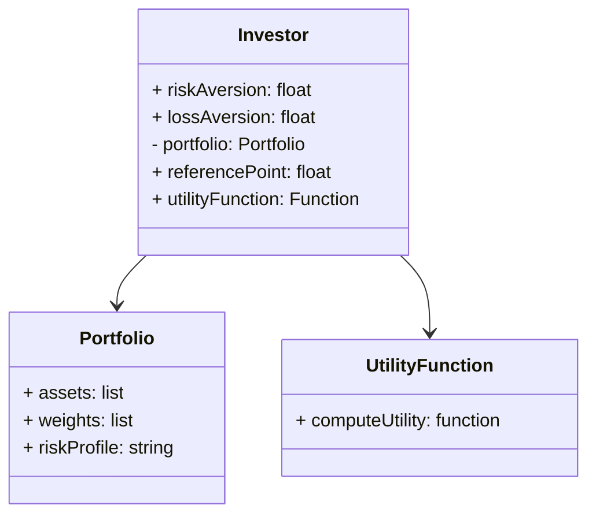
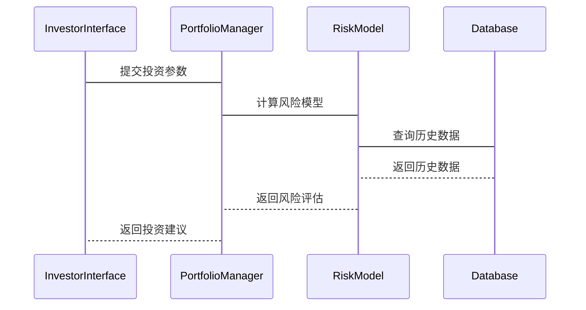

                 


# 前景理论：损失厌恶如何影响投资决策

> **关键词**: 前景理论, 损失厌恶, 投资决策, 决策权重函数, 资产定价, 风险管理

> **摘要**: 本文深入探讨了前景理论的核心概念，特别是损失厌恶对投资决策的影响。通过分析前景理论的数学模型、决策权重函数以及在资产定价和风险管理中的应用，揭示了损失厌恶如何影响投资者的决策行为。文章还结合实际案例，提供了系统架构设计和代码实现，帮助读者全面理解前景理论在投资决策中的应用。

---

## 第一部分: 前景理论的背景与基础

### 第1章: 前景理论的基本概念

#### 1.1 什么是前景理论

##### 1.1.1 传统决策理论的局限性
传统决策理论（如期望效用理论）假设投资者是理性的，决策基于对概率和收益的期望值。然而，实际投资行为中，投资者往往表现出非理性行为，如对损失的过度厌恶。

##### 1.1.2 前景理论的核心思想
前景理论由Kahneman和Tversky提出，认为投资者在决策时更关注损失和收益的相对变化，而非绝对值。损失厌恶是其核心，即人们对损失的敏感程度高于收益。

##### 1.1.3 前景理论与损失厌恶的关系
损失厌恶是前景理论的关键，它导致投资者在决策时更倾向于避免损失，而非追求收益最大化。

#### 1.2 前景理论的历史发展

##### 1.2.1 前景理论的提出背景
20世纪70年代，Kahneman和Tversky通过实验证实了传统决策理论的不足，提出了前景理论。

##### 1.2.2 前景理论的主要贡献者
Kahneman和Tversky是主要贡献者，他们通过大量实验验证了前景理论的适用性。

##### 1.2.3 前景理论的演变与扩展
前景理论不断扩展，引入了时间因素、社会偏好等，形成了更完善的决策框架。

#### 1.3 前景理论的数学基础

##### 1.3.1 前景函数的定义与公式
前景函数描述了决策结果的效用，公式为：$$ V(x) = \frac{x^{k}}{k} $$，其中k是风险厌恶参数。

##### 1.3.2 决策权重函数的数学表达
决策权重函数描述了概率的非线性变换，公式为：$$ w(p) = p^{\alpha}(1-p)^{\beta} $$，其中α和β是参数。

##### 1.3.3 前景理论的核心公式推导
综合前景函数和决策权重函数，整体效用为：$$ U = \sum w(p_i) \cdot V(x_i) $$。

---

### 第2章: 损失厌恶与投资决策的关系

#### 2.1 损失厌恶的定义与特征

##### 2.1.1 什么是损失厌恶
损失厌恶指投资者对损失的敏感程度高于收益，导致他们在决策时更倾向于避免损失。

##### 2.1.2 损失厌恶的测量方法
通过实验和问卷调查，测量投资者在不同损失和收益情况下的选择偏好。

##### 2.1.3 损失厌恶与风险偏好的对比
损失厌恶与风险偏好不同，后者关注总体风险水平，而前者关注损失的具体情况。

#### 2.2 前景理论中的损失厌恶模型

##### 2.2.1 前景函数中的损失厌恶体现
前景函数在损失时更陡峭，表现出对损失的更敏感。

##### 2.2.2 决策权重函数中的损失厌恶特征
决策权重函数在小概率损失时权重更高，导致投资者更关注小概率损失。

##### 2.2.3 损失厌恶对投资决策的影响
损失厌恶导致投资者在决策时更保守，可能错过高收益机会。

---

### 第3章: 前景理论的核心原理

#### 3.1 前景函数的原理

##### 3.1.1 前景函数的非线性特征
前景函数在损失时更陡峭，收益时更平缓。

##### 3.1.2 前景函数的单调性与凹凸性
前景函数在损失时是凹函数，收益时是凸函数。

##### 3.1.3 前景函数的参数化表达
通过调整参数k，可以模拟不同风险厌恶程度的投资者行为。

#### 3.2 决策权重函数的原理

##### 3.2.1 决策权重函数的形状特征
决策权重函数在小概率时更陡峭，大几率时更平缓。

##### 3.2.2 决策权重函数的参数化模型
通过调整α和β，可以模拟不同风险偏好的投资者行为。

##### 3.2.3 决策权重函数的适用范围
适用于描述小概率事件的决策权重。

#### 3.3 前景理论的综合应用

##### 3.3.1 前景理论的决策框架
通过前景函数和决策权重函数，构建完整的决策框架。

##### 3.3.2 前景理论的优缺点分析
优点：符合实际决策行为；缺点：复杂性较高。

##### 3.3.3 前景理论的适用场景
适用于小概率事件和损失厌恶明显的决策场景。

---

## 第二部分: 损失厌恶的核心机制

### 第4章: 决策权重函数的分析

#### 4.1 决策权重函数的数学模型

##### 4.1.1 决策权重函数的公式推导
通过实验证实决策权重函数的形式，$$ w(p) = p^{\alpha}(1-p)^{\beta} $$。

##### 4.1.2 决策权重函数的参数解释
α和β控制概率的非线性变换程度。

##### 4.1.3 决策权重函数的图形分析
图形显示小概率时权重更高，大几率时权重更低。

#### 4.2 决策权重函数的特征

##### 4.2.1 决策权重函数的非线性特征
在小概率时更陡峭，大几率时更平缓。

##### 4.2.2 决策权重函数的单调性特征
整体单调递增，但增速非线性。

##### 4.2.3 决策权重函数的凹凸性特征
在小概率时更凹，大几率时更凸。

#### 4.3 决策权重函数的扩展

##### 4.3.1 不同损失厌恶程度下的决策权重函数
通过调整α和β，模拟不同损失厌恶程度的投资者行为。

##### 4.3.2 不同风险偏好的决策权重函数
通过调整α和β，模拟不同风险偏好的投资者行为。

##### 4.3.3 决策权重函数的参数调整
根据具体场景调整α和β，以适应不同投资决策需求。

---

## 第5章: 参考点的确定与损失收益不对称性

### 5.1 参考点的定义与作用

#### 5.1.1 参考点的定义
参考点是投资者在决策时的基准，通常为现状或期望值。

#### 5.1.2 参考点的确定方法
通过实验或问卷调查确定，常用现状作为参考点。

#### 5.1.3 参考点对决策的影响
参考点的偏移导致损失和收益的不对称性。

### 5.2 损失与收益的不对称性

#### 5.2.1 损失与收益的不对称性表现
在损失时，决策权重更高；在收益时，决策权重更低。

#### 5.2.2 不对称性对投资决策的影响
导致投资者在损失时更保守，收益时更激进。

#### 5.2.3 不对称性对风险管理的启示
在风险管理中，需考虑投资者的损失厌恶，制定更稳健的策略。

---

## 第三部分: 投资决策中的应用

### 第6章: 资产定价与风险偏好

#### 6.1 资产定价的前景理论模型

##### 6.1.1 资产定价的数学模型
$$ P = \sum w(p_i) \cdot V(r_i) $$，其中r_i是资产i的收益率。

##### 6.1.2 损失厌恶对资产定价的影响
损失厌恶导致投资者对高风险资产要求更高的风险溢价。

#### 6.2 风险偏好的前景理论分析

##### 6.2.1 不同风险偏好的投资者行为
风险厌恶程度高的投资者更关注损失，导致更保守的投资决策。

##### 6.2.2 风险偏好与决策权重函数的关系
风险厌恶程度通过α和β参数体现。

### 第7章: 风险管理与投资组合优化

#### 7.1 风险管理的前景理论框架

##### 7.1.1 风险管理的决策模型
$$ U = \sum w(p_i) \cdot V(L_i) $$，其中L_i是损失事件。

##### 7.1.2 损失厌恶对风险管理策略的影响
损失厌恶导致投资者更倾向于分散投资，降低风险。

#### 7.2 投资组合优化的前景理论方法

##### 7.2.1 投资组合优化的数学模型
$$ \max U = \sum w(p_i) \cdot V(r_i) $$，在约束条件下优化。

##### 7.2.2 损失厌恶对投资组合的影响
投资者更倾向于选择低风险资产，降低组合的整体风险。

---

## 第四部分: 系统分析与架构设计

### 第8章: 系统功能设计

#### 8.1 问题场景介绍
投资者决策系统需要考虑损失厌恶，优化资产配置。

#### 8.2 系统功能设计

##### 8.2.1 领域模型（Mermaid类图）


#### 8.3 系统架构设计

##### 8.3.1 架构图（Mermaid架构图）


#### 8.4 系统接口设计
投资者通过界面输入参数，系统计算最优投资组合。

#### 8.5 系统交互（Mermaid序列图）


---

## 第五部分: 项目实战

### 第9章: 环境安装与代码实现

#### 9.1 环境安装
安装Python和相关库（如numpy、scipy）。

#### 9.2 核心代码实现

##### 9.2.1 前景函数实现
```python
def prospect_value(x, k):
    return (x ** k) / k
```

##### 9.2.2 决策权重函数实现
```python
def decision_weight(p, alpha, beta):
    return (p ** alpha) * ((1 - p) ** beta)
```

##### 9.2.3 资产定价模型
```python
def asset_pricing(returns, probabilities, alpha, beta):
    utility = 0
    for p, r in zip(probabilities, returns):
        utility += decision_weight(p, alpha, beta) * prospect_value(r, 1)
    return utility
```

#### 9.3 代码应用解读与分析
通过调整alpha和beta，模拟不同损失厌恶程度的投资者行为。

#### 9.4 实际案例分析
以股票投资为例，计算不同参数下的资产定价。

---

## 第六部分: 总结与展望

### 第10章: 最佳实践与小结

#### 10.1 最佳实践
考虑投资者的损失厌恶，制定稳健的投资策略。

#### 10.2 小结
前景理论揭示了损失厌恶对投资决策的重要影响，帮助投资者制定更合理的决策。

#### 10.3 注意事项
在实际应用中，需考虑投资者的个体差异和市场环境变化。

### 第11章: 拓展阅读

#### 11.1 相关书籍
推荐Kahneman的《思考，快与慢》。

#### 11.2 学术论文
推荐阅读Kahneman和Tversky的经典论文。

---

## 作者

作者：AI天才研究院/AI Genius Institute & 禅与计算机程序设计艺术 /Zen And The Art of Computer Programming

---

通过以上结构，您可以逐步深入探讨前景理论，理解其在投资决策中的应用，并通过实际案例和系统设计，掌握如何在实际中应用这些理论。希望这篇文章能为您提供有价值的见解和启发。

