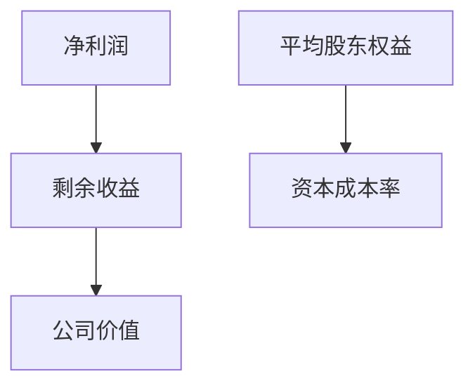
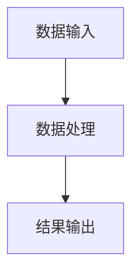

                 


# 剩余收益模型：结合会计信息的公司价值评估

> 关键词：剩余收益模型，公司价值评估，会计信息，财务分析，资本成本率，企业估值

> 摘要：本文将详细介绍剩余收益模型的基本原理、数学推导、系统分析及实际应用。通过结合会计信息，本文将探讨如何利用剩余收益模型进行公司价值评估，并通过实际案例分析和代码实现，帮助读者更好地理解和应用这一模型。本文还讨论了模型的优缺点、注意事项及未来研究方向。

---

# 第1章: 剩余收益模型的背景与概念

## 1.1 剩余收益模型的起源与发展

### 1.1.1 价值评估的基本概念
价值评估是金融学和会计学中的核心任务之一，其目的是通过分析公司的财务数据，估算其内在价值，从而为投资决策提供依据。传统的价值评估方法包括股利折现模型（DDM）、现金流折现模型（DCF）等。

### 1.1.2 剩余收益模型的提出与演变
剩余收益模型（Residual Income Model）是一种基于会计信息的公司价值评估方法，由美国会计学家詹姆斯·里特（James E. Ritt）在20世纪70年代提出。该模型的核心思想是通过分析公司的剩余收益（Net Income less Expected Net Income）来估算公司价值。与传统模型相比，剩余收益模型的优势在于其简单性和对会计信息的直接依赖。

### 1.1.3 与传统估值方法的对比
- **传统方法**：如DCF模型需要预测未来现金流，计算复杂且依赖假设。
- **剩余收益模型**：基于当前财务数据，计算简单，适用于中小型企业。

---

## 1.2 剩余收益模型的核心概念

### 1.2.1 剩余收益的定义与计算公式
剩余收益是指公司在扣除所有成本和预期收益后的净收益。其公式为：
$$ \text{剩余收益} = \text{净利润} - (\text{平均股东权益} \times \text{资本成本率}) $$

### 1.2.2 剩余收益模型的基本假设
- 股东权益不变。
- 资本成本率固定。

### 1.2.3 模型的适用范围与限制
- **适用范围**：适用于稳定发展的公司。
- **限制**：不适用于高增长或周期性波动较大的公司。

---

## 1.3 剩余收益模型的应用价值

### 1.3.1 在公司估值中的作用
剩余收益模型能够直接反映公司的实际盈利能力，帮助投资者判断其内在价值。

### 1.3.2 在投资决策中的应用
通过剩余收益模型，投资者可以快速判断公司是否被市场低估或高估。

### 1.3.3 在财务分析中的优势
剩余收益模型简单易用，且依赖于会计数据，便于财务分析。

---

## 1.4 本章小结
本章介绍了剩余收益模型的背景、核心概念和应用价值。通过对比传统估值方法，读者可以理解剩余收益模型的独特性和适用性。

---

# 第2章: 剩余收益模型的核心原理

## 2.1 剩余收益模型的数学基础

### 2.1.1 剩余收益的计算公式
剩余收益的计算公式如下：
$$ \text{剩余收益} = \text{净利润} - (\text{平均股东权益} \times \text{资本成本率}) $$

### 2.1.2 股东权益的计算方法
股东权益的计算公式为：
$$ \text{股东权益} = \text{资产} - \text{负债} $$

### 2.1.3 资本成本率的确定方法
资本成本率通常基于市场利率和行业平均水平确定。

---

## 2.2 剩余收益模型的构建与分析

### 2.2.1 模型的基本架构
剩余收益模型的基本架构如下：



### 2.2.2 模型的输入变量与输出结果
- **输入变量**：净利润、平均股东权益、资本成本率。
- **输出结果**：剩余收益、公司价值。

### 2.2.3 模型的敏感性分析
剩余收益模型对资本成本率的变化较为敏感。

---

## 2.3 剩余收益与公司价值的关系

### 2.3.1 剩余收益的累积与公司价值的关系
累积剩余收益的增加会导致公司价值的提升。

### 2.3.2 剩余收益的折现与公司价值的联系
剩余收益需要通过折现计算其现值，以确定公司价值。

### 2.3.3 剩余收益模型的局限性
- 模型假设过于简化。
- 适用于稳定发展的公司。

---

## 2.4 本章小结
本章详细讲解了剩余收益模型的数学基础和构建过程，并分析了剩余收益与公司价值的关系。

---

# 第3章: 剩余收益模型的数学推导与公式

## 3.1 剩余收益的计算公式

### 3.1.1 净利润的计算
净利润的计算公式为：
$$ \text{净利润} = \text{收入} - \text{成本} - \text{费用} $$

### 3.1.2 股东权益的计算
股东权益的计算公式为：
$$ \text{股东权益} = \text{资产} - \text{负债} $$

### 3.1.3 资本成本率的确定
资本成本率的确定公式为：
$$ \text{资本成本率} = \frac{\text{债务成本} \times \text{债务比例} + \text{股权成本} \times \text{股权比例}}{1} $$

---

## 3.2 剩余收益模型的数学模型

### 3.2.1 剩余收益的数学表达式
$$ \text{剩余收益} = \text{净利润} - (\text{平均股东权益} \times \text{资本成本率}) $$

### 3.2.2 公司价值的数学表达式
$$ \text{公司价值} = \text{剩余收益} \times \frac{1}{\text{资本成本率}} $$

---

## 3.3 本章小结
本章通过数学公式详细推导了剩余收益模型的计算过程，并展示了如何通过公式计算公司价值。

---

# 第4章: 剩余收益模型的系统分析与架构设计

## 4.1 系统分析

### 4.1.1 问题场景介绍
假设我们有一个中小型企业，需要对其价值进行评估。

### 4.1.2 系统功能设计
- 数据输入：净利润、股东权益、资本成本率。
- 数据处理：计算剩余收益。
- 结果输出：公司价值。

### 4.1.3 系统架构图


---

## 4.2 项目实战

### 4.2.1 环境配置
需要安装Python和相关库（如NumPy、Pandas）。

### 4.2.2 核心代码实现
```python
def calculate_residual_income(net_income, average_equity, cost_of_capital):
    residual_income = net_income - (average_equity * cost_of_capital)
    return residual_income

def calculate_company_value(net_income, average_equity, cost_of_capital):
    residual_income = net_income - (average_equity * cost_of_capital)
    company_value = residual_income / cost_of_capital
    return company_value
```

### 4.2.3 案例分析
假设某公司净利润为100万元，平均股东权益为500万元，资本成本率为8%。则：
$$ \text{剩余收益} = 100 - (500 \times 0.08) = 20 \text{万元} $$
$$ \text{公司价值} = 20 / 0.08 = 250 \text{万元} $$

---

## 4.3 本章小结
本章通过系统分析和项目实战，展示了如何将剩余收益模型应用于实际价值评估。

---

# 第5章: 最佳实践与注意事项

## 5.1 注意事项
- 确保输入数据的准确性。
- 合理确定资本成本率。

## 5.2 小结
剩余收益模型简单易用，但需注意其局限性。

---

## 5.3 拓展阅读
推荐阅读《财务报表分析与投资决策》。

---

# 附录

## 附录A: 数据来源与工具介绍
- 数据来源：公司财务报表。
- 工具：Python、Excel。

## 附录B: 参考文献
- James E. Ritt, 《Residual Income Model》, 1973.

---

# 作者：AI天才研究院 & 禅与计算机程序设计艺术

---

通过本文的详细讲解，读者可以全面了解剩余收益模型的理论基础、数学推导、系统设计及实际应用。希望本文能够为公司价值评估领域提供新的思路和方法。

