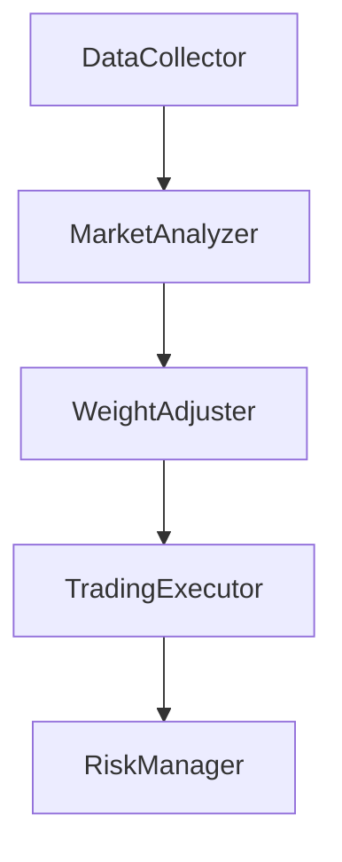

                 


# 动态资产配置：根据市场环境调整投资策略

## 关键词：动态资产配置、投资策略、市场环境、资产调整、风险管理

## 摘要：动态资产配置是一种根据市场环境变化实时调整资产配置比例的投资策略，旨在优化投资组合的收益与风险。本文从理论基础、算法实现、系统架构到实战应用，全面解析动态资产配置的实现方法，结合具体案例，深入探讨其在实际投资中的应用价值与挑战。

---

# 第1章: 动态资产配置概述

## 1.1 动态资产配置的定义与背景

### 1.1.1 资产配置的基本概念
资产配置是投资过程中至关重要的一步，它决定了将多少资金分配到不同的资产类别（如股票、债券、黄金等）中，以实现投资目标（如收益最大化或风险最小化）。传统的资产配置通常基于投资者的风险承受能力、投资期限和目标收益来制定，是一种静态配置方式。

### 1.1.2 动态资产配置的定义
动态资产配置是一种灵活的资产配置策略，其核心在于根据市场环境的变化（如经济周期、市场趋势、风险偏好等）实时调整资产配置比例，以适应不同的市场条件，优化投资组合的表现。

### 1.1.3 动态资产配置的背景与重要性
在传统资产配置中，市场环境的变化往往被忽视，导致投资组合的表现可能偏离预期。动态资产配置通过实时调整资产权重，能够在市场波动中捕捉机会，降低风险，从而提高投资收益。尤其是在市场波动较大的情况下，动态资产配置的优势更加明显。

### 1.1.4 动态资产配置的边界与外延
动态资产配置的边界在于其调整的频率和幅度，通常受到市场条件和投资者目标的限制。外延则包括对市场环境的实时监控、资产类别扩展（如引入另类资产）以及与其他投资策略的结合。

## 1.2 动态资产配置的核心要素

### 1.2.1 投资目标与风险承受能力
动态资产配置必须基于明确的投资目标和风险承受能力，这是调整资产配置的基础。

### 1.2.2 市场环境与经济周期
市场环境的变化（如经济周期的波动）直接影响资产配置的比例。例如，在经济衰退期间，债券的比例可能需要增加以降低风险。

### 1.2.3 资产类别与权重分配
动态资产配置的核心在于根据市场变化调整各资产类别的权重，以优化投资组合的风险收益比。

## 1.3 动态资产配置与传统资产配置的区别

### 1.3.1 传统资产配置的特点
传统资产配置通常基于长期假设，如平均通胀率和长期收益预期，是一种静态配置方式。

### 1.3.2 动态资产配置的独特优势
动态资产配置能够实时适应市场变化，避免了传统配置方式在市场波动中的劣势。

### 1.3.3 两者的适用场景对比
动态资产配置更适合市场波动较大或需要主动管理的投资者，而传统资产配置则适用于市场环境相对稳定的长期投资。

## 1.4 动态资产配置的边界与外延

### 1.4.1 资产配置的边界条件
动态资产配置的调整必须在可接受的风险范围内进行，不能偏离投资者的初始目标。

### 1.4.2 动态调整的范围与限制
调整的频率和幅度受到市场条件和投资者目标的限制，例如，频繁调整可能增加交易成本。

### 1.4.3 动态资产配置的外延应用
动态资产配置可以与其他投资策略结合，如量化交易、对冲策略等。

## 1.5 本章小结

---

# 第2章: 动态资产配置的理论基础

## 2.1 现代投资组合理论（MPT）的核心思想

### 2.1.1 MPT的基本假设
MPT假设资产收益服从正态分布，且投资者是理性的。

### 2.1.2 MPT的目标
通过优化资产配置，找到收益与风险的最佳平衡点。

### 2.1.3 MPT的主要结论
- 投资者可以通过分散投资降低非系统性风险。
- 最优资产配置取决于投资者的风险偏好和市场参数。

## 2.2 均值-方差优化模型

### 2.2.1 模型概述
$$\text{目标函数：} \min_w \sigma^2 \quad \text{约束条件：} \sum_i w_i = 1, \quad \text{权重} \ w_i \geq 0$$

### 2.2.2 模型的实现
通过拉格朗日乘数法求解优化问题，得到各资产的最优权重。

## 2.3 市场环境与动态调整的关系

### 2.3.1 经济周期对资产配置的影响
经济周期的不同阶段（复苏、繁荣、衰退、萧条）会影响资产收益和风险。

### 2.3.2 市场情绪与资产配置的调整
市场情绪的变化会导致投资者风险偏好改变，从而影响资产配置。

### 2.3.3 动态调整的触发条件
市场环境的变化，如宏观经济指标的变化、市场波动率的增加等。

## 2.4 动态资产配置的数学模型

### 2.4.1 动态权重调整公式
$$w_t = \alpha \cdot \text{Market Factor} + \beta \cdot \text{Risk Factor}$$

### 2.4.2 调整幅度的限制
$$|\Delta w_t| \leq \epsilon$$

### 2.4.3 优化目标函数
$$\min_w \text{风险} \quad \text{或} \quad \max_w \text{收益}$$

## 2.5 本章小结

---

# 第3章: 动态资产配置的算法实现

## 3.1 动态资产配置算法的核心步骤

### 3.1.1 数据采集
收集历史市场数据，包括各资产的收益率、波动率等。

### 3.1.2 市场状态识别
通过技术指标（如均线、RSI）或宏观经济指标判断当前市场状态。

### 3.1.3 权重调整
根据市场状态调整各资产的权重。

### 3.1.4 再平衡
定期或不定期对投资组合进行再平衡，确保权重符合调整后的目标。

## 3.2 基于机器学习的动态资产配置

### 3.2.1 机器学习在资产配置中的应用
使用回归、分类等算法预测市场走势，指导资产配置。

### 3.2.2 基于因子模型的动态调整
根据因子模型（如Fama-French三因子模型）调整资产权重。

### 3.2.3 机器学习模型的优缺点
优点：能够捕捉非线性关系；缺点：模型复杂，可能过拟合。

## 3.3 动态资产配置的代码实现

### 3.3.1 数据处理
```python
import pandas as pd

# 假设data是包含各资产收益率的数据框
data = pd.DataFrame({'Stock': [0.05, -0.02, 0.03, ...], 
                      'Bond': [0.02, 0.01, 0.02, ...]})
```

### 3.3.2 市场状态识别
```python
from sklearn.linear_model import LogisticRegression

# 示例：使用Logistic回归模型预测市场状态
model = LogisticRegression()
model.fit(X_train, y_train)
predicted_state = model.predict(X_test)
```

### 3.3.3 权重调整
```python
# 示例：根据市场状态调整权重
if predicted_state == 'bull':
    stock_weight = 0.7
    bond_weight = 0.3
else:
    stock_weight = 0.3
    bond_weight = 0.7
```

### 3.3.4 再平衡
```python
# 示例：定期再平衡投资组合
current_weights = {'Stock': 0.6, 'Bond': 0.4}
target_weights = {'Stock': stock_weight, 'Bond': bond_weight}
# 调整权重并执行交易
```

## 3.4 本章小结

---

# 第4章: 动态资产配置的系统架构

## 4.1 系统架构设计

### 4.1.1 系统功能模块
- 数据采集模块
- 市场分析模块
- 权重调整模块
- 执行交易模块
- 风险管理模块

### 4.1.2 系统架构图


## 4.2 系统实现细节

### 4.2.1 数据采集接口
```python
def collect_data(asset, start, end):
    # 实现数据采集逻辑
    return data
```

### 4.2.2 市场分析算法
```python
def analyze_market(data):
    # 实现市场分析算法
    return analysis_result
```

### 4.2.3 权重调整策略
```python
def adjust_weights(analysis_result):
    # 实现权重调整逻辑
    return target_weights
```

### 4.2.4 交易执行模块
```python
def execute_trade(target_weights, current_weights):
    # 实现交易逻辑
    return new_weights
```

## 4.3 本章小结

---

# 第5章: 动态资产配置的项目实战

## 5.1 项目背景与目标

### 5.1.1 项目背景
假设我们是一位机构投资者，希望通过动态资产配置优化投资组合的收益与风险。

### 5.1.2 项目目标
开发一个动态资产配置系统，能够根据市场环境实时调整资产权重，实现收益最大化和风险最小化。

## 5.2 项目实施步骤

### 5.2.1 环境安装
安装必要的工具和库，如Python、Pandas、NumPy、Scikit-learn等。

### 5.2.2 数据准备
收集历史市场数据，清洗数据并进行初步分析。

### 5.2.3 系统开发
开发各功能模块，包括数据采集、市场分析、权重调整、交易执行等。

### 5.2.4 测试与优化
对系统进行测试，优化算法和交易策略，确保系统稳定运行。

## 5.3 项目代码实现

### 5.3.1 数据采集与处理
```python
import pandas as pd
import requests

# 示例：从网络获取数据
def get_data(api_key):
    response = requests.get(f'https://api.example.com/data?api_key={api_key}')
    data = pd.DataFrame(response.json()['data'])
    return data
```

### 5.3.2 市场分析与预测
```python
from sklearn.model

