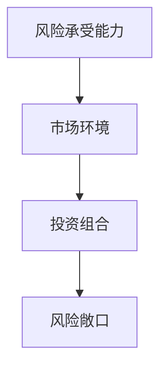
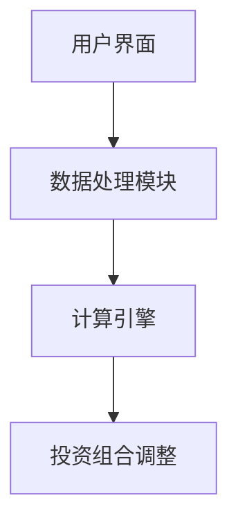

                 


# 动态风险预算：根据市场环境调整风险承受能力

> 关键词：动态风险预算，风险承受能力，市场环境，风险管理，投资组合，风险管理策略

> 摘要：  
在金融市场和企业管理中，风险承受能力是做出决策的核心因素之一。然而，传统的风险管理方法往往依赖于静态的预算设定，这在市场环境快速变化的今天显得力不从力。本文将深入探讨动态风险预算的概念，分析其背后的数学原理，展示如何通过实时市场数据调整风险承受能力，以优化投资组合表现并规避潜在风险。通过实际案例分析和系统设计，本文旨在为企业和投资者提供一套灵活、高效的风险管理工具。

---

# 第一部分: 动态风险预算的背景与概念

## 第1章: 动态风险预算的定义与背景

### 1.1 动态风险预算的定义
动态风险预算是一种根据市场环境变化实时调整风险承受能力的方法。与静态风险预算不同，动态风险预算能够根据市场波动、经济周期和行业特点等因素，灵活调整风险敞口，从而在不确定性中实现风险与收益的最佳平衡。

#### 1.1.1 风险承受能力的基本概念
风险承受能力是指企业在面对不确定性时，能够承担的最大风险水平。它通常与投资组合的波动性、资本充足率和企业战略目标相关。

#### 1.1.2 动态风险预算的核心定义
动态风险预算是指根据市场环境的变化，实时调整风险承受能力的预算，以适应当前市场条件。这种方法强调灵活性和适应性，能够帮助企业在复杂多变的市场中做出更优决策。

#### 1.1.3 动态风险预算与静态预算的区别
| 特性                | 静态预算                     | 动态预算                     |
|---------------------|-----------------------------|-----------------------------|
| 时间维度            | 固定时间段                   | 实时调整                     |
| 响应变化            | 较慢                        | 快速响应                     |
| 灵活性               | 低                         | 高                         |

### 1.2 动态风险预算的重要性
动态风险预算是现代风险管理的核心工具，尤其是在金融市场中，其重要性日益凸显。

#### 1.2.1 市场环境变化对企业的影响
市场环境的变化（如经济波动、政策调整和行业趋势）会直接影响企业的风险敞口和收益能力。动态风险预算能够帮助企业在这些变化中及时调整策略。

#### 1.2.2 风险承受能力调整的必要性
静态预算无法适应市场环境的快速变化，可能导致企业过度承担风险或错失收益机会。动态调整能够平衡风险与收益，提升企业的稳健性。

#### 1.2.3 动态风险预算在企业决策中的作用
动态风险预算是企业制定投资策略、资本分配和风险管理决策的重要依据。它能够帮助企业在复杂环境中做出更明智的决策。

### 1.3 动态风险预算的应用场景
动态风险预算适用于多种场景，包括：
- **投资组合管理**：优化资产配置，平衡风险与收益。
- **企业风险管理**：实时监控和调整企业风险敞口。
- **金融衍生品定价**：动态调整衍生品的风险参数。

---

## 第2章: 动态风险预算的核心概念与联系

### 2.1 风险承受能力的核心要素
风险承受能力的构成要素包括：
- **风险厌恶程度**：企业对风险的容忍度。
- **资本充足性**：企业的资本规模和流动性。
- **市场敏感性**：企业对市场变化的敏感程度。

### 2.2 市场环境与风险承受能力的关系
市场环境的变化直接影响企业的风险承受能力。例如：
- **市场波动**：波动性增加时，企业可能需要降低风险敞口。
- **经济周期**：经济衰退时，企业可能需要提高风险承受能力。

### 2.3 动态风险预算的实体关系图


---

# 第二部分: 动态风险预算的算法原理

## 第3章: 动态风险预算的数学模型

### 3.1 风险承受能力的数学表达
动态风险预算的数学模型可以表示为：

$$ R(t) = \alpha + \beta \cdot M(t) $$

其中：
- $R(t)$ 表示第 $t$ 时刻的风险承受能力。
- $\alpha$ 是基准风险承受能力。
- $\beta$ 是市场环境的敏感性系数。
- $M(t)$ 是第 $t$ 时刻的市场环境指标。

### 3.2 动态风险预算的优化算法
动态风险预算的优化目标是最大化投资组合的预期收益，同时最小化风险敞口。优化过程如下：

1. 确定市场环境指标 $M(t)$。
2. 计算风险承受能力 $R(t)$。
3. 调整投资组合权重以匹配 $R(t)$。

### 3.3 算法实现
以下是一个简单的Python实现：

```python
import numpy as np

def dynamic_risk_budget(weights, returns, lambda=0.1):
    # 计算投资组合的波动性
    portfolio_volatility = np.sqrt(np.dot(weights.T, np.dot(cov_matrix, weights)))
    # 调整权重以匹配风险承受能力
    adjusted_weights = weights * (1 - lambda * portfolio_volatility)
    return adjusted_weights

# 示例数据
returns = np.array([0.1, 0.2, 0.15])
weights = np.array([0.4, 0.3, 0.3])
lambda = 0.1

# 调整权重
adjusted_weights = dynamic_risk_budget(weights, returns, lambda)
print("Adjusted Weights:", adjusted_weights)
```

---

## 第4章: 动态风险预算的系统架构设计

### 4.1 问题场景介绍
企业在复杂的市场环境中需要实时调整风险承受能力，以优化投资组合的表现。

### 4.2 系统功能设计
- **用户界面**：展示市场环境指标和投资组合风险敞口。
- **数据处理模块**：实时获取市场数据并计算风险指标。
- **计算引擎**：执行动态风险预算算法并输出调整后的权重。

### 4.3 系统架构图


---

## 第5章: 动态风险预算的项目实战

### 5.1 环境安装
- 安装Python和相关库（如NumPy和Pandas）。
- 安装Jupyter Notebook用于数据分析和可视化。

### 5.2 核心代码实现
```python
import pandas as pd
import numpy as np

# 示例数据：市场环境指标
market_data = pd.DataFrame({
    '资产1': [0.05, 0.03, 0.06],
    '资产2': [0.04, 0.05, 0.03],
    '资产3': [0.07, 0.06, 0.04]
})

# 计算市场环境指标
market_volatility = market_data.std()

# 调整风险承受能力
adjusted_budget = market_volatility.apply(lambda x: x * 0.5)

print("Adjusted Risk Budget:", adjusted_budget)
```

### 5.3 案例分析
假设我们有一个包含三只股票的投资组合，目标是根据市场波动性调整风险承受能力。通过上述代码，我们可以计算每只股票的风险预算并进行调整。

---

## 第6章: 总结与展望

### 6.1 总结
动态风险预算是一个灵活、高效的风险管理工具，能够帮助企业实时调整风险承受能力，应对复杂多变的市场环境。

### 6.2 实际应用中的注意事项
- 数据质量：确保市场环境数据的准确性和及时性。
- 模型假设：验证模型假设的合理性，避免过度简化。

### 6.3 未来研究方向
- 结合机器学习技术，提升动态风险预算的预测能力。
- 探索更多市场环境指标，丰富模型的应用场景。

---

# 作者：AI天才研究院/AI Genius Institute & 禅与计算机程序设计艺术 /Zen And The Art of Computer Programming

