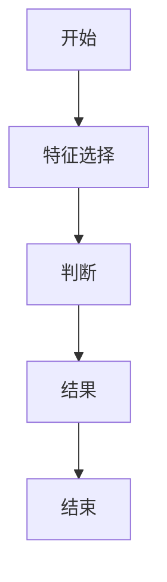
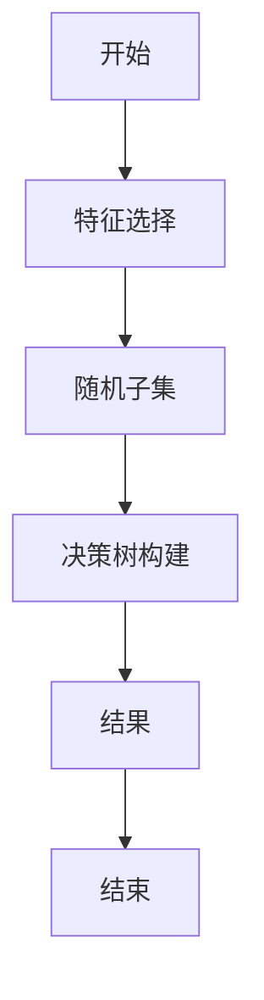
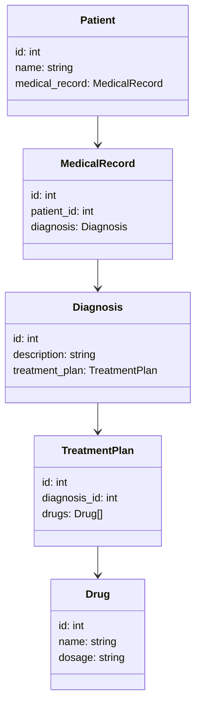
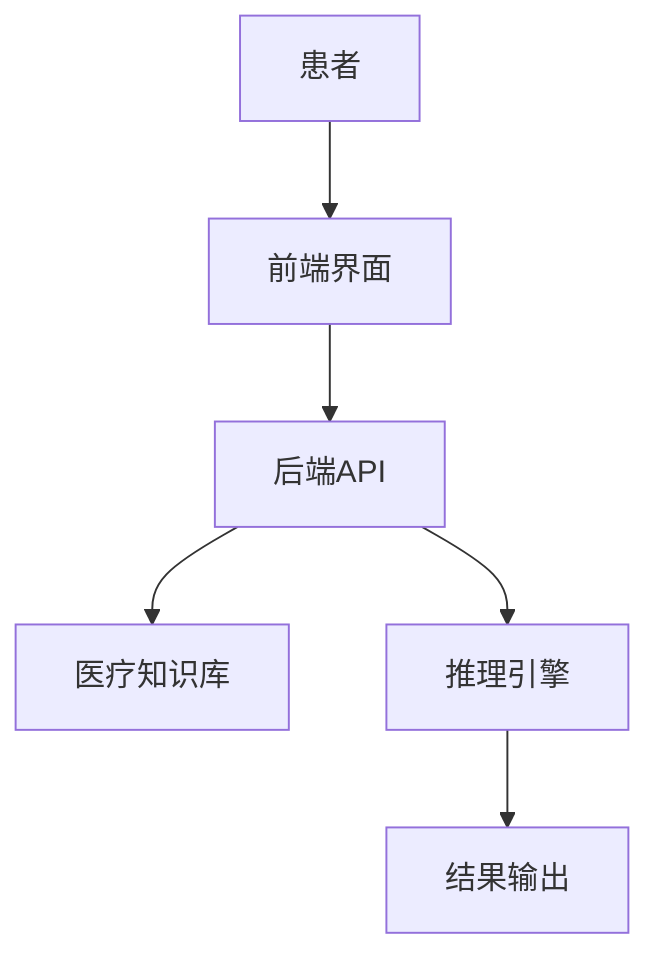

                 


# 医疗健康AI Agent：开发难点与突破

## 关键词：医疗AI Agent、人工智能、医疗数据、算法原理、系统架构、项目实战

## 摘要：医疗健康AI Agent作为人工智能在医疗领域的应用之一，旨在通过智能化的代理系统辅助医生和患者进行诊断、治疗和健康管理。本文将从背景、核心概念、算法原理、系统架构、项目实战等多方面进行详细分析，揭示医疗健康AI Agent的开发难点，并探讨如何通过技术创新实现突破。

---

## 第1章：医疗健康AI Agent的背景与问题描述

### 1.1 医疗健康AI Agent的背景

#### 1.1.1 人工智能在医疗领域的应用现状
人工智能技术在医疗领域的应用日益广泛，从疾病诊断、药物研发到患者管理，AI正在改变医疗行业的运作方式。医疗健康AI Agent作为一种智能代理系统，能够帮助医生和患者更高效地处理医疗信息。

#### 1.1.2 医疗健康AI Agent的核心概念与目标
医疗健康AI Agent是一种能够理解、分析和处理医疗数据的智能系统，其目标是通过提供个性化的医疗建议、辅助诊断和健康管理，提升医疗服务的效率和质量。

#### 1.1.3 医疗健康AI Agent的边界与外延
医疗健康AI Agent的应用范围涵盖疾病诊断、治疗建议、健康监测等领域，但其边界在于如何在不替代医生决策的情况下，提供有效的辅助支持。

### 1.2 医疗健康AI Agent的问题背景

#### 1.2.1 医疗数据的复杂性与多样性
医疗数据包括病历、检查结果、用药记录等，具有高度复杂性和多样性，这对AI Agent的数据处理能力提出了更高的要求。

#### 1.2.2 医疗AI Agent的开发难点
- 数据隐私与安全问题：医疗数据涉及患者隐私，如何在AI Agent中保护数据安全是一个重要挑战。
- 算法的可解释性：医疗AI Agent的决策需要高度透明，确保医生和患者能够理解AI的建议。

#### 1.2.3 医疗AI Agent的应用场景与潜在价值
医疗AI Agent可以在疾病早期筛查、用药建议、健康监测等方面提供支持，其潜在价值巨大，但开发难度也不容忽视。

### 1.3 医疗健康AI Agent的开发目标与意义

#### 1.3.1 医疗AI Agent的核心目标
通过智能化的代理系统，提升医疗服务的效率和质量，辅助医生和患者做出更明智的医疗决策。

#### 1.3.2 医疗AI Agent的开发意义
医疗AI Agent的开发不仅能够提高医疗服务的效率，还能降低医疗成本，改善患者的健康状况。

#### 1.3.3 医疗AI Agent的未来发展方向
随着人工智能技术的不断进步，医疗AI Agent将更加智能化、个性化，逐步成为医疗生态系统中的重要组成部分。

---

## 第2章：医疗健康AI Agent的核心概念与联系

### 2.1 AI Agent的基本原理

#### 2.1.1 AI Agent的定义与分类
AI Agent是一种能够感知环境并采取行动以实现目标的智能系统，根据应用场景的不同，可以分为服务型AI Agent和决策型AI Agent。

#### 2.1.2 医疗健康AI Agent的特殊性
医疗健康AI Agent需要处理高度敏感的医疗数据，并且需要具备高度的准确性和可解释性。

### 2.2 医疗健康AI Agent的核心要素

#### 2.2.1 数据输入与处理
医疗AI Agent需要处理多种来源的医疗数据，包括电子健康记录（EHR）、医学影像、实验室结果等。

#### 2.2.2 知识库与推理引擎
医疗AI Agent需要一个强大的知识库，包含医学知识、疾病症状、药物信息等，同时需要高效的推理引擎来处理复杂的医疗问题。

#### 2.2.3 输出与反馈机制
医疗AI Agent需要将处理结果以用户友好的方式呈现，并能够根据反馈不断优化自身的决策过程。

### 2.3 核心概念的ER实体关系图

```mermaid
erDiagram
    patient: 患者
    doctor: 医生
    medical_record: 医疗记录
    diagnosis: 诊断结果
    treatment_plan: 治疗计划
    drug: 药物
    symptom: 症状
    test_result: 检验结果

    patient --> medical_record: 包含
    medical_record --> diagnosis: 包含
    diagnosis --> treatment_plan: 导致
    treatment_plan --> drug: 包含
    symptom --> diagnosis: 引发
    test_result --> diagnosis: 支持
```

---

## 第3章：医疗健康AI Agent的算法原理

### 3.1 常见的算法选择与优化

#### 3.1.1 决策树算法



数学公式：
$$ \text{决策树的分类规则是通过信息增益或基尼指数来选择最优特征} $$

#### 3.1.2 随机森林算法



数学公式：
$$ \text{随机森林通过集成多个决策树的预测结果来提高准确性} $$

---

## 第4章：医疗健康AI Agent的系统分析与架构设计

### 4.1 问题场景介绍

医疗AI Agent需要处理复杂的医疗数据和决策问题，例如诊断辅助、用药建议等。

### 4.2 系统功能设计

#### 4.2.1 领域模型



#### 4.2.2 系统架构设计



---

## 第5章：医疗健康AI Agent的项目实战

### 5.1 环境安装与配置

安装Python、TensorFlow、Scikit-learn等必要的开发工具和库。

### 5.2 系统核心功能实现

#### 5.2.1 数据预处理

```python
import pandas as pd

# 加载数据
data = pd.read_csv('medical_data.csv')

# 数据清洗
data.dropna(inplace=True)
```

#### 5.2.2 模型训练与优化

```python
from sklearn.tree import DecisionTreeClassifier
from sklearn.ensemble import RandomForestClassifier

# 训练决策树模型
dt_model = DecisionTreeClassifier().fit(X_train, y_train)

# 训练随机森林模型
rf_model = RandomForestClassifier().fit(X_train, y_train)
```

#### 5.2.3 结果分析与可视化

```python
from sklearn.metrics import accuracy_score

# 预测结果
dt_prediction = dt_model.predict(X_test)
rf_prediction = rf_model.predict(X_test)

# 计算准确率
dt_accuracy = accuracy_score(y_test, dt_prediction)
rf_accuracy = accuracy_score(y_test, rf_prediction)
```

---

## 第6章：医疗健康AI Agent的最佳实践与小结

### 6.1 开发经验总结

医疗AI Agent的开发需要在数据处理、算法选择、系统架构等方面进行深入思考和优化。

### 6.2 注意事项

- 数据隐私与安全
- 算法的可解释性
- 系统的鲁棒性

### 6.3 未来发展方向

- 更智能的AI Agent
- 更加个性化的医疗建议
- 更广泛的医疗应用场景

### 6.4 拓展阅读

推荐阅读《Deep Learning》、《Medical Data Analysis》等书籍，以进一步深入了解相关技术。

---

## 作者：AI天才研究院 & 禅与计算机程序设计艺术

本文作者：AI天才研究院（AI Genius Institute）  
联合作者：禅与计算机程序设计艺术（Zen And The Art of Computer Programming）  

---

通过以上结构，我们可以系统地分析医疗健康AI Agent的开发难点与突破点，从理论到实践，为开发者提供全面的指导。

