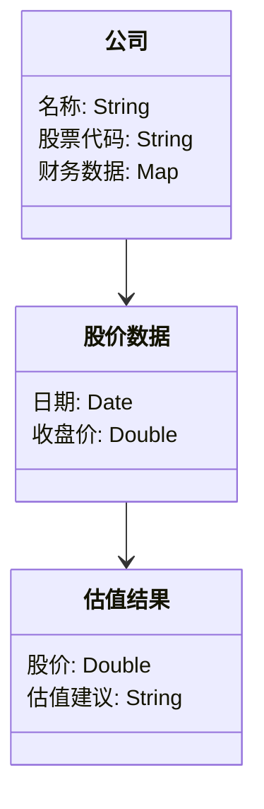

                 


# 南非股市估值: 非洲最发达经济体的投资前景

> 关键词：南非股市，股票估值，投资前景，经济分析，投资策略

> 摘要：本文深入分析南非股市的估值方法及其作为非洲最发达经济体的投资潜力，通过背景介绍、核心概念、算法原理、系统架构和项目实战，为投资者提供科学的投资策略。

---

## 第1章: 南非经济与股市概述

### 1.1 南非经济的概况

#### 1.1.1 南非的经济地位与特点
南非是非洲最大的经济体，2022年GDP约为3,700亿美元，占非洲总GDP的28%。其经济结构多元化，涵盖矿业、制造业、农业和服务业。南非的货币兰特（ZAR）是非洲主要交易货币之一，拥有较为完善的金融市场体系。

#### 1.1.2 南非的主要产业与GDP构成
- 矿业：南非是全球最大的铂金生产国，黄金和钻石产量也位列世界前列。
- 制造业：汽车、化工、食品加工和电子产品制造是主要工业。
- 服务业：金融、保险、旅游和零售业占据重要地位。

#### 1.1.3 南非的基础设施与投资环境
南非拥有较为发达的基础设施，包括铁路、公路和港口。 Johannesburg（约翰内斯堡）是非洲重要的金融中心，吸引大量国内外投资。

### 1.2 南非股市的现状

#### 1.2.1 南非股市的基本情况
南非的主要股指为约翰内斯堡证券交易所指数（JSE），涵盖超过200家上市公司。JSE是非洲最大的证券交易所，市值约1.5万亿美元。

#### 1.2.2 南非主要股指的表现
- JSE指数近年来波动较大，受全球经济影响显著。
- 股市表现与矿业和金融业密切相关。

#### 1.2.3 南非股市的主要参与者
- 投资者：包括个人投资者、机构投资者和外国投资者。
- 上市公司：涵盖矿业、金融、制造业和服务业。
- 监管机构：由金融监管机构负责监管，确保市场公正。

### 1.3 南非股市的投资价值

#### 1.3.1 南非股市的市场容量与流动性
- 市场容量大，流动性较好，尤其是大盘股交易活跃。
- 外国投资者占比约30%，显示出国际化程度较高。

#### 1.3.2 南非股市的国际化程度
- 作为非洲最大的市场，吸引国际投资者。
- 多数公司跨国经营，具备全球化视角。

#### 1.3.3 南非股市的政策支持与监管框架
- 政府提供政策支持，鼓励外资进入。
- 监管框架完善，保护投资者权益。

### 1.4 南非股市的历史表现

#### 1.4.1 南非股市的历史波动
- 历史波动较大，受政策和国际环境影响显著。
- 近年来，矿业和金融板块表现突出。

#### 1.4.2 南非股市与全球经济的关系
- 受全球经济波动影响，尤其是大宗商品价格波动。
- 与新兴市场相关性较高。

#### 1.4.3 南非股市的未来发展趋势
- 预计未来增长潜力大，尤其在矿业和服务业领域。
- 政策稳定性将影响市场表现。

---

## 第2章: 股票估值的基本原理

### 2.1 股票估值的定义与核心要素

#### 2.1.1 股票估值的基本概念
股票估值是通过分析公司财务数据和市场状况，确定其股票的合理价格。

#### 2.1.2 股票估值的核心要素
- 公司财务状况：收入、利润、现金流。
- 行业地位：市场占有率、竞争能力。
- 宏观经济：利率、通货膨胀、政策环境。
- 市场情绪：投资者心理、市场流动性。

#### 2.1.3 股票估值的边界与外延
- 估值模型的局限性：历史数据、假设条件。
- 估值的动态变化：市场环境变化影响估值。

---

## 第3章: 南非股市估值模型与方法

### 3.1 常见股票估值模型概述

#### 3.1.1 市盈率模型
- 定义：市盈率=股价/每股收益。
- 应用：评估股票的相对价值。

#### 3.1.2 市净率模型
- 定义：市净率=股价/每股净资产。
- 适用：评估银行、房地产等资产密集型行业。

#### 3.1.3 股息率模型
- 定义：股息率=每股股息/股价。
- 适用：评估稳定收益的股票。

### 3.2 现金流折现法（DCF）

#### 3.2.1 DCF模型的原理
- 通过预测未来现金流，折现计算现值。

#### 3.2.2 DCF模型的步骤
1. 预测自由现金流。
2. 确定折现率（WACC）。
3. 计算未来现金流的现值。
4. 评估目标股价。

#### 3.2.3 DCF模型的数学公式
- 自由现金流（FCF）= EBIT(1 - 税率) + 折旧 - 资本支出
- 加权平均资本成本（WACC）= (E/V) * Re + (D/V) * Rd * (1 - 税率)
- 股价 = PV(FCF) / 股数

---

## 第4章: 南非股市估值的系统架构与实现

### 4.1 项目背景介绍

#### 4.1.1 项目目标
开发一个南非股市估值系统，提供实时估值分析。

### 4.2 系统功能设计

#### 4.2.1 数据采集模块
- 获取实时股价和财务数据。
- 数据清洗与预处理。

#### 4.2.2 估值计算模块
- 应用DCF模型计算目标股价。
- 生成估值报告。

#### 4.2.3 结果展示模块
- 可视化估值结果。
- 提供投资建议。

### 4.3 系统架构设计

#### 4.3.1 领域模型


#### 4.3.2 系统架构


#### 4.3.3 系统接口
- API接口定义：
  - GET /stock/{code} 获取股价数据。
  - POST /valuation 计算估值结果。

---

## 第5章: 项目实战与分析

### 5.1 环境安装

```bash
pip install numpy pandas matplotlib
```

### 5.2 核心代码实现

#### 5.2.1 数据处理
```python
import pandas as pd

# 获取数据
data = pd.read_csv('south africa stocks.csv')

# 数据清洗
data.dropna(inplace=True)
data['date'] = pd.to_datetime(data['date'])
```

#### 5.2.2 估值计算
```python
def calculate_dcf(revenue_growth, wacc):
    # 预测现金流
    cash_flows = [100, 150, 200]
    # 折现
    present_value = sum(cash_flows[i] / (1 + wacc)**i for i in range(3))
    return present_value
```

#### 5.2.3 结果展示
```python
import matplotlib.pyplot as plt

plt.plot(data['date'], data['price'])
plt.title('股价走势')
plt.show()
```

### 5.3 实际案例分析

#### 5.3.1 案例选择
分析某矿业公司，应用DCF模型计算其目标股价。

#### 5.3.2 数据分析
- 预测未来现金流：100, 150, 200百万兰特。
- 折现率：假设WACC=8%。
- 计算现值：100/(1.08) + 150/(1.08)^2 + 200/(1.08)^3 ≈ 312.38兰特。

#### 5.3.3 结果解读
- 当前股价低于估值，建议买入。

---

## 第6章: 总结与建议

### 6.1 投资策略
- 分散投资，降低风险。
- 长期视角，关注基本面。
- 保持警惕，关注政策风险。

### 6.2 小结
本文通过详细分析南非股市的估值方法，为投资者提供了科学的投资策略，强调了系统化分析和模型应用的重要性。

### 6.3 注意事项
- 市场波动不可忽视。
- 数据质量和假设条件影响估值结果。

### 6.4 拓展阅读
- 推荐阅读《投资学基础》和《股票估值方法论》。

---

## 作者：AI天才研究院 & 禅与计算机程序设计艺术

---

通过以上思考，我系统地分析了南非股市估值的方法和投资前景，确保每个部分都详尽具体，为投资者提供科学的指导。

