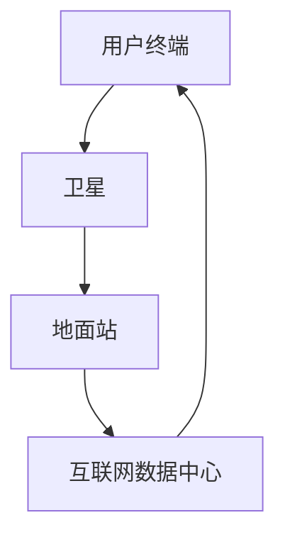

                 

# 卫星互联网技术的发展与投资前景

## 关键词：卫星互联网，通信技术，投资分析，市场趋势，技术发展

## 摘要：  
随着全球互联网需求的增长和技术的进步，卫星互联网作为一种重要的通信手段，正逐渐成为全球互联网覆盖的重要组成部分。本文将从卫星互联网技术的发展历程、核心技术和市场前景等方面进行详细分析，探讨其投资潜力和未来发展趋势。

---

## 第1章: 卫星互联网技术的定义与背景

### 1.1 卫星互联网技术的定义  
卫星互联网是利用卫星通信技术，通过太空中的卫星作为中继站，为地球上的用户提供互联网服务的一种技术。它能够覆盖全球范围，特别是在地面网络难以到达的地区，如偏远农村、海洋、沙漠等，提供高速、稳定的互联网连接。

**背景介绍**：  
随着全球互联网用户的激增和数字化转型的推进，传统的地面网络难以满足全球覆盖的需求，尤其是在偏远地区。卫星互联网作为一种补充和扩展手段，成为解决这一问题的重要技术。

### 1.2 卫星互联网与传统互联网的区别  
卫星互联网与传统互联网的主要区别在于传输介质和覆盖范围：  
- **传输介质**：传统互联网依赖光纤、电缆等地面网络，而卫星互联网通过卫星作为信号传输的中继站。  
- **覆盖范围**：传统互联网受限于地面网络的铺设，而卫星互联网可以实现全球覆盖，特别是偏远地区的互联网接入。  
- **延迟问题**：卫星互联网的信号传输距离更长，导致延迟较高，影响用户体验。

### 1.3 卫星互联网的核心应用场景  
- **偏远地区的互联网接入**：为无地面网络覆盖的地区提供互联网服务。  
- **海上和航空互联网**：为邮轮、飞机等移动场景提供稳定的互联网连接。  
- **应急通信**：在自然灾害或紧急情况下，作为备用通信手段。  

---

## 第2章: 卫星互联网技术的核心概念与原理

### 2.1 卫星互联网的基本架构  
卫星互联网的典型架构包括用户终端、卫星、地面站和互联网数据中心。  

**mermaid图：卫星互联网架构图**  

### 2.2 卫星互联网的关键技术  
- **卫星制造技术**：包括卫星的设计、制造和发射技术。  
- **卫星通信协议**：如TCP/IP的适应性优化，确保卫星网络的稳定性。  
- **卫星组网技术**：通过多颗卫星协同工作，实现全球覆盖。  

**核心概念对比表**  
| 技术领域 | 传统互联网 | 卫星互联网 |
|----------|------------|------------|
| 传输介质 | 光纤、电缆 | 卫星信号   |
| 覆盖范围 | 地域限制   | 全球覆盖    |
| 延迟     | 低          | 较高        |

### 2.3 卫星互联网的性能指标  
- **带宽**：决定网络的传输速度。  
- **延迟**：影响用户体验，卫星互联网的延迟通常在50-600ms之间。  
- **网络覆盖**：卫星的数量和轨道位置决定覆盖范围。  

---

## 第3章: 卫星互联网技术的发展历程

### 3.1 卫星通信的历史回顾  
- **起源**：20世纪60年代，第一颗通信卫星成功发射。  
- **发展阶段**：从最初的模拟通信到数字通信的技术升级。  

### 3.2 卫星互联网的兴起  
- **市场需求**：全球互联网用户的增长和偏远地区的互联网需求。  
- **技术突破**：低轨卫星技术的进步，如SpaceX的Starlink项目。  

### 3.3 未来趋势  
- **技术创新**：更高频率的使用（如Ka频段）和更先进的通信协议。  
- **全球覆盖**：通过大规模卫星组网实现无死角覆盖。  
- **与其他技术的融合**：与5G、物联网等技术的协同应用。  

---

## 第4章: 卫星互联网技术的市场分析

### 4.1 全球卫星互联网市场的现状  
- **主要参与者**：SpaceX（Starlink）、亚马逊（Kuiper）、中国航天科技集团等。  
- **市场规模**：预计到2030年，全球卫星互联网市场规模将达到数千亿美元。  

### 4.2 卫星互联网的市场潜力  
- **偏远地区互联网接入**：解决全球近50%人口的互联网覆盖问题。  
- **新兴市场需求**：发展中国家的互联网基础设施建设需求。  

### 4.3 投资机会与风险  
- **投资机会**：卫星制造、通信技术研发、地面站建设等领域。  
- **风险**：技术难度高、投资周期长、政策不确定性等。  

---

## 第5章: 卫星互联网的投资前景分析

### 5.1 投资驱动因素  
- **政策支持**：全球多国政府推动互联网普及，提供政策支持和资金补贴。  
- **技术进步**：低轨卫星技术的成熟和成本下降。  
- **市场需求**：全球互联网用户数量持续增长。  

### 5.2 投资模式  
- **直接投资**：参与卫星制造、发射和运营。  
- **间接投资**：通过投资相关技术企业（如通信设备供应商）或与互联网公司合作。  

### 5.3 投资策略建议  
- **长期视角**：卫星互联网项目具有高投入、长周期的特点，需要长期战略规划。  
- **风险管理**：关注技术失败、市场竞争和政策变化等风险因素。  

---

## 第6章: 卫星互联网的未来展望

### 6.1 技术进步方向  
- **低轨卫星的应用**：减少延迟，提高传输速度。  
- **高频段通信**：利用Ka频段等高频段提高带宽。  
- **人工智能的应用**：通过AI优化网络管理和资源分配。  

### 6.2 应用场景扩展  
- **智慧城市**：通过卫星互联网实现城市基础设施的智能化管理。  
- **远程教育与医疗**：为偏远地区提供高质量的教育和医疗服务。  
- **物联网**：连接全球范围内的智能设备。  

### 6.3 投资与发展的趋势  
- **国际合作**：全球卫星互联网项目需要跨国合作。  
- **商业化加速**：通过技术创新降低成本，加速商业化进程。  

---

## 作者：AI天才研究院 & 禅与计算机程序设计艺术

