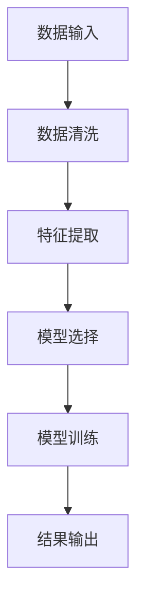
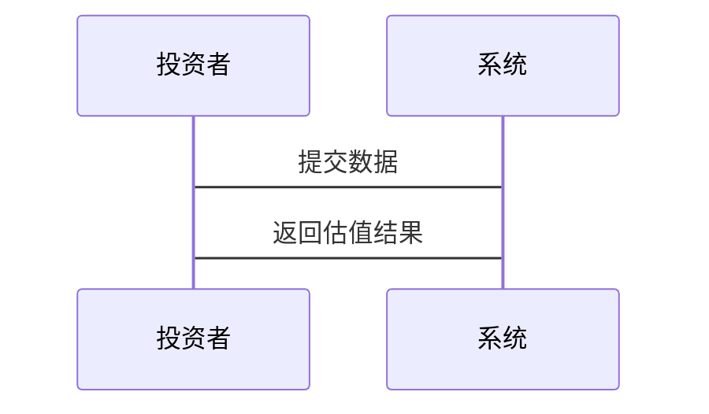

                 


# 印度尼西亚股市估值:东南亚最大经济体的潜力

## 关键词：印度尼西亚股市，估值，东南亚，潜力，投资

## 摘要：  
印度尼西亚作为东南亚最大的经济体，其股市具有巨大的发展潜力。本文将从经济背景、估值方法、数学模型、系统架构和实际案例等方面，详细分析印度尼西亚股市的估值潜力，为投资者提供深度的分析和见解。

---

# 第一部分: 印度尼西亚股市估值背景与概述

## 第1章: 印度尼西亚股市估值的背景与现状

### 1.1 印度尼西亚的经济地位与潜力

#### 1.1.1 印度尼西亚作为东南亚最大经济体的定位  
印度尼西亚是东南亚地区最大的经济体，其国内生产总值（GDP）占东南亚地区总GDP的40%以上。作为东南亚最大的经济体，印度尼西亚在区域经济合作中扮演着重要角色。

#### 1.1.2 印度尼西亚经济的多元化特征  
印度尼西亚经济具有高度的多元化特征，涵盖农业、矿业、制造业、服务业等多个领域。这种多元化使得印度尼西亚的经济相对稳定，同时也为其股市提供了丰富的投资标的。

#### 1.1.3 印度尼西亚股市的发展历程与现状  
印度尼西亚股市（IDX）成立于1983年，目前已成为东南亚地区最重要的证券交易所之一。IDX的市值近年来快速增长，吸引了大量国内外投资者。

### 1.2 印度尼西亚股市的主要特点

#### 1.2.1 股市规模与结构  
印度尼西亚股市的市场规模庞大，涵盖多个行业，包括银行、能源、制造业和科技等。IDX的上市公司数量超过600家，市值超过1.5万亿美元。

#### 1.2.2 股市的主要行业分布  
印度尼西亚股市的主要行业包括能源（如煤炭和天然气）、银行、制造业和科技。能源行业在 IDX 中占据重要地位，尤其是石油和天然气行业。

#### 1.2.3 股市的国际化与开放性  
印度尼西亚股市近年来不断推进国际化进程，吸引了大量外国投资者。IDX 与多个国际证券交易所建立了合作关系，进一步提升了其国际化程度。

### 1.3 影响印度尼西亚股市的主要因素

#### 1.3.1 经济指标对股市的影响  
印度尼西亚的GDP增长率、通货膨胀率和失业率等经济指标对股市有直接影响。例如，GDP增长通常会推动股市上涨。

#### 1.3.2 政治环境与政策变化  
印度尼西亚的政治环境和政策变化对股市也有重要影响。政府的政策调整，如税收政策、货币政策和外资政策，都会影响股市的表现。

#### 1.3.3 全球经济波动对印尼股市的传导效应  
全球经济波动，如全球金融危机、油价波动和美元汇率变化，都会对印度尼西亚股市产生影响。印尼作为出口导向型经济体，外部经济环境的变化对其股市有显著影响。

### 1.4 印度尼西亚股市的估值方法概述

#### 1.4.1 估值的基本概念与框架  
估值是通过对公司基本面的分析，确定其股票的合理价格。常用的估值方法包括市盈率（P/E）、市净率（P/B）和现金流折现模型（DCF）等。

#### 1.4.2 常用的估值指标与模型  
常用的估值指标包括市盈率（P/E）、市净率（P/B）、股息率和现金流折现率等。这些指标可以帮助投资者评估股票的内在价值。

#### 1.4.3 印尼股市估值的独特性与挑战  
印度尼西亚股市的独特性在于其多元化行业和市场开放性。然而，估值过程中也面临一些挑战，如市场波动大、数据不完整和政策不确定性等。

## 1.5 本章小结  
本章介绍了印度尼西亚股市的经济背景、主要特点和影响因素。通过分析这些因素，我们可以更好地理解印尼股市的估值潜力。

---

# 第二部分: 股市估值的核心概念与方法

## 第2章: 股市估值的核心概念与联系

### 2.1 股市估值的核心概念

#### 2.1.1 估值的基本原理  
估值的基本原理是通过对公司的财务数据和市场环境进行分析，确定其股票的合理价格。这需要综合考虑公司的盈利能力、成长性和市场风险等因素。

#### 2.1.2 估值的主要目标与边界  
估值的主要目标是确定股票的内在价值，帮助投资者做出合理的投资决策。其边界包括数据的完整性、模型的适用性和市场的流动性等。

#### 2.1.3 估值的关键要素与组成  
估值的关键要素包括公司财务数据、市场环境、行业竞争状况和宏观经济指标等。这些要素共同决定了股票的估值。

### 2.2 核心概念的属性特征对比

#### 2.2.1 估值方法的对比分析  
下表对比了市盈率（P/E）和市净率（P/B）两种估值方法的特点和适用场景：

| 估值指标 | 定义 | 适用场景 |
|----------|------|-----------|
| P/E      | 价格/每股收益 | 适用于盈利稳定的公司 |
| P/B      | 价格/每股净资产 | 适用于资产密集型行业 |

#### 2.2.2 不同估值模型的优缺点  
| 估值模型 | 优点 | 缺点 |
|-----------|-------|--------|
| P/E       | 简单易用 | 不适用于亏损公司 |
| DCF       | 精度高 | 数据需求多，计算复杂 |

#### 2.2.3 估值指标的属性特征  
估值指标的属性特征包括敏感性、相关性和稳定性。敏感性高的指标对市场变化反应迅速，相关性高的指标与公司价值密切相关，稳定性好的指标在不同市场条件下表现一致。

### 2.3 实体关系图（ER图）分析


---

## 第3章: 印度尼西亚股市估值的数学模型与算法原理

### 3.1 常用估值模型的数学公式

#### 3.1.1 市盈率（P/E）模型  
$$ P/E = \frac{Price}{Earnings} $$

#### 3.1.2 市净率（P/B）模型  
$$ P/B = \frac{Price}{Book\ Value} $$

#### 3.1.3 现金流折现模型（DCF）  
$$ V = \sum_{t=1}^{n} \frac{CF_t}{(1 + r)^t} + \frac{TV}{(1 + r)^n} $$

### 3.2 算法原理与流程图



### 3.3 算法实现与代码示例

```python
import pandas as pd
import numpy as np

def calculate_pe_ratio(df):
    df['PE_Ratio'] = df['Price'] / df['Earnings']
    return df

# 示例数据
data = {
    'Price': [100, 200, 300],
    'Earnings': [20, 30, 40]
}

df = pd.DataFrame(data)
df = calculate_pe_ratio(df)
print(df)
```

---

# 第三部分: 系统分析与架构设计

## 第4章: 印度尼西亚股市估值的系统分析与架构设计方案

### 4.1 问题场景介绍  
我们需要设计一个系统，用于分析和评估印度尼西亚股市的估值情况。该系统需要处理大量的金融数据，并应用多种估值模型进行分析。

### 4.2 系统功能设计

#### 4.2.1 领域模型  


#### 4.2.2 系统架构设计  


### 4.3 系统接口设计  
系统接口设计包括数据输入接口、模型调用接口和结果输出接口。

### 4.4 系统交互设计  


---

# 第四部分: 项目实战

## 第5章: 项目实战与案例分析

### 5.1 环境安装  
需要安装Python、Pandas、NumPy和Mermaid等工具。

### 5.2 系统核心实现源代码  
```python
import pandas as pd
import numpy as np

def calculate_pe_ratio(df):
    df['PE_Ratio'] = df['Price'] / df['Earnings']
    return df

# 示例数据
data = {
    'Price': [100, 200, 300],
    'Earnings': [20, 30, 40]
}

df = pd.DataFrame(data)
df = calculate_pe_ratio(df)
print(df)
```

### 5.3 代码应用解读与分析  
上述代码实现了市盈率的计算，帮助投资者快速评估股票的估值情况。

### 5.4 实际案例分析  
以印度尼西亚的某银行为例，使用市盈率模型进行估值分析。

### 5.5 项目小结  
本章通过实际案例分析，展示了如何应用数学模型进行印度尼西亚股市的估值。

---

## 总结与展望

### 总结  
本文全面分析了印度尼西亚股市的估值潜力，探讨了多种估值方法和模型，为投资者提供了重要的参考。

### 展望  
未来，随着印度尼西亚经济的持续增长和市场开放，其股市的估值潜力将进一步释放。

---

## 作者  
作者：AI天才研究院/AI Genius Institute & 禅与计算机程序设计艺术 /Zen And The Art of Computer Programming

