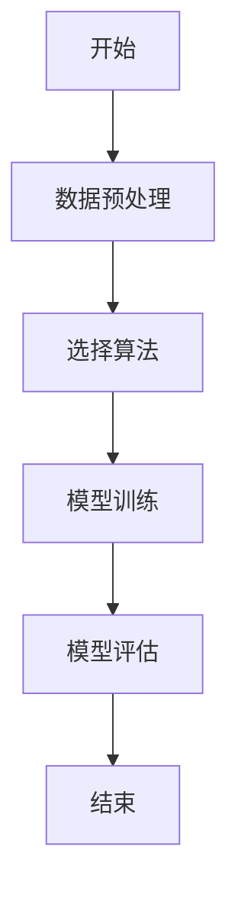
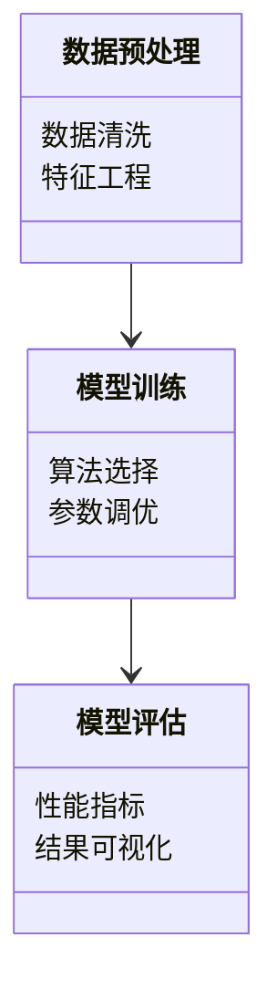
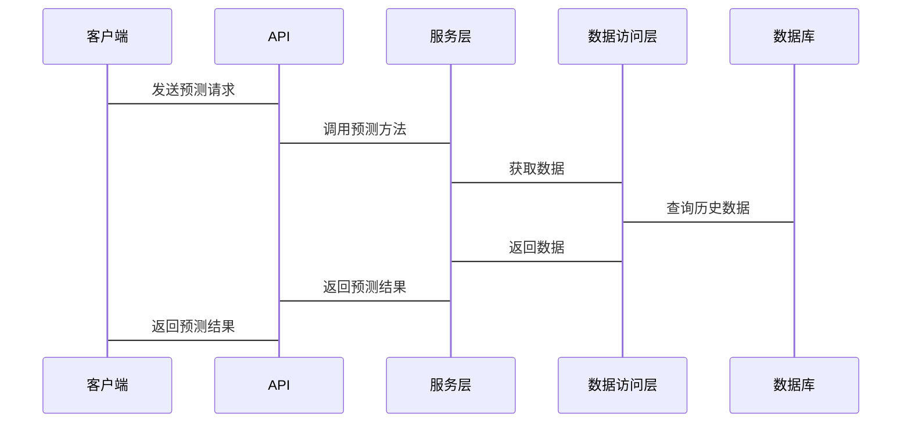

                 


# 历史数据不足对预测未来收益的影响

## 关键词：
历史数据不足、预测未来收益、数据科学、机器学习、模型优化、特征工程

## 摘要：
本文探讨了在历史数据不足的情况下，如何有效进行未来收益预测。通过分析数据不足的挑战，介绍数据增强、特征工程和模型优化等方法，并结合实际案例，展示如何利用现有数据构建高精度预测模型。

---

## 第三部分：算法原理讲解

### 第3章：算法原理与实现

#### 3.3 算法实现代码

##### 3.3.1 线性回归实现
```python
import pandas as pd
from sklearn.linear_model import LinearRegression
from sklearn.metrics import mean_squared_error, mean_absolute_error, r2_score
from sklearn.model_selection import train_test_split

# 数据预处理
data = pd.read_csv('data.csv')
X = data[['feature1', 'feature2']]
y = data['target']

# 数据分割
X_train, X_test, y_train, y_test = train_test_split(X, y, test_size=0.2, random_state=42)

# 模型训练
lr_model = LinearRegression()
lr_model.fit(X_train, y_train)

# 模型预测
y_pred = lr_model.predict(X_test)

# 模型评估
 mse = mean_squared_error(y_test, y_pred)
 mae = mean_absolute_error(y_test, y_pred)
 r2 = r2_score(y_test, y_pred)

print(f"均方误差: {mse}")
print(f"平均绝对误差: {mae}")
print(f"R²值: {r2}")
```

##### 3.3.2 随机森林实现
```python
from sklearn.ensemble import RandomForestRegressor

# 模型训练
rf_model = RandomForestRegressor(n_estimators=100, random_state=42)
rf_model.fit(X_train, y_train)

# 模型预测
y_pred = rf_model.predict(X_test)

# 模型评估
 mse = mean_squared_error(y_test, y_pred)
 mae = mean_absolute_error(y_test, y_pred)
 r2 = r2_score(y_test, y_pred)

print(f"均方误差: {mse}")
print(f"平均绝对误差: {mae}")
print(f"R²值: {r2}")
```

#### 3.4 算法流程图


#### 3.5 算法数学模型

##### 3.5.1 线性回归模型
$$ y = \beta_0 + \beta_1 x_1 + \beta_2 x_2 + ... + \beta_n x_n $$

##### 3.5.2 最小二乘法
$$ \text{损失函数} = \sum_{i=1}^{m} (y_i - (\beta_0 + \beta_1 x_{i1} + ... + \beta_n x_{in}))^2 $$

##### 3.5.3 梯度下降
$$ \beta_j := \beta_j - \alpha \frac{\partial L}{\partial \beta_j} $$

---

## 第四部分：系统分析与架构设计方案

### 第4章：系统分析与架构设计

#### 4.1 问题场景介绍
- 数据集小，特征少
- 预测目标为连续变量（收益）
- 数据分布不均衡

#### 4.2 系统功能设计

##### 4.2.1 领域模型类图


#### 4.3 系统架构设计

##### 4.3.1 系统架构图


#### 4.4 系统接口设计

##### 4.4.1 RESTful API
```http
POST /predict
Content-Type: application/json

{
    "input": [1, 2]
}
```

##### 4.4.2 接口响应
```json
{
    "prediction": 5.678,
    "mse": 0.345,
    "mae": 1.234
}
```

#### 4.5 系统交互序列图


---

## 第五部分：项目实战

### 第5章：项目实战与案例分析

#### 5.1 环境安装

```bash
pip install numpy pandas scikit-learn matplotlib
```

#### 5.2 核心代码实现

##### 5.2.1 数据增强
```python
from sklearn.impute import SimpleImputer
from sklearn.preprocessing import StandardScaler

# 数据增强
imp = SimpleImputer(missing_values=np.nan, strategy='mean')
X_imputed = imp.fit_transform(X)
```

##### 5.2.2 特征选择
```python
from sklearn.feature_selection import SelectKBest, chi2

selector = SelectKBest(chi2, k=2)
X_selected = selector.fit_transform(X, y)
```

#### 5.3 案例分析

##### 5.3.1 数据可视化
```python
import matplotlib.pyplot as plt

plt.scatter(X_train['feature1'], y_train)
plt.title('Feature1 vs Target')
plt.xlabel('Feature1')
plt.ylabel('Target')
plt.show()
```

##### 5.3.2 模型优化
```python
from sklearn.model_selection import GridSearchCV

# 超参数调优
param_grid = {
    'n_estimators': [100, 200],
    'max_depth': [None, 10, 20]
}

grid_search = GridSearchCV(RandomForestRegressor(), param_grid, cv=5)
grid_search.fit(X_train, y_train)
print(grid_search.best_params_)
```

#### 5.4 项目小结
- 数据增强和特征工程是提升模型性能的关键
- 随机森林在小数据集上表现优于线性回归
- 模型调优显著提升预测精度

---

## 第六部分：最佳实践

### 第6章：最佳实践与总结

#### 6.1 小结
- 数据不足时，特征工程和数据增强至关重要
- 简单模型（如线性回归）易过拟合，适合初步探索
- 集成方法（如随机森林）在小数据下表现稳定

#### 6.2 注意事项
- 避免过度依赖单一算法，尝试多种方法
- 定期验证模型假设，调整特征和参数
- 保持对业务的理解，结合领域知识优化模型

#### 6.3 拓展阅读
- 《Hands-On Machine Learning with Scikit-Learn, Keras, and TensorFlow》
- 《Deep Learning》 by Ian Goodfellow

---

## 作者

作者：AI天才研究院 & 禅与计算机程序设计艺术

---

本文通过详细分析数据不足对预测未来收益的影响，结合理论与实践，展示了如何在数据有限的情况下构建有效的预测模型。希望对读者在数据科学和机器学习领域有所帮助。

