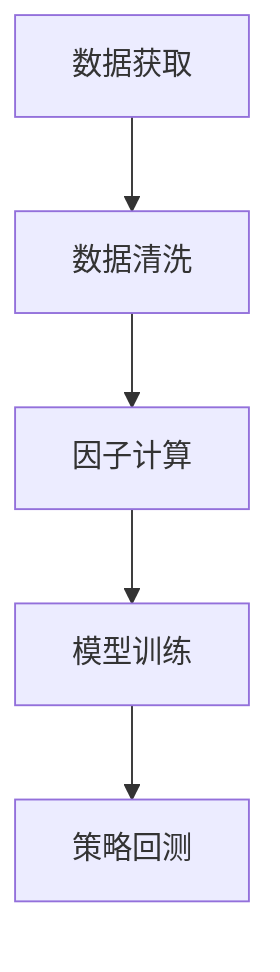

                 


# 另类Beta策略：捕捉非传统风险溢价

> 关键词：另类Beta策略，风险溢价，量化投资，因子分析，非传统风险

> 摘要：本文探讨了另类Beta策略在捕捉非传统风险溢价方面的应用，通过详细分析其核心概念、数学模型、算法实现和系统架构，展示了如何利用非传统风险溢价提升投资组合的表现。

---

# 第1章 引言

## 1.1 传统Beta策略的局限性
传统Beta策略是投资学中常用的衡量资产系统性风险的方法，其核心是通过回归分析确定资产相对于市场的波动性。然而，传统Beta策略存在以下问题：
- **过于依赖市场指数**：传统Beta策略假设市场指数（如标普500）能够完全代表系统性风险，但实际上市场可能存在结构性偏差。
- **忽略非传统风险因素**：传统Beta策略难以捕捉到一些非传统的风险溢价，例如小盘股溢价、动量效应等。
- **模型的静态性**：传统Beta系数是静态的，无法适应市场的动态变化。

## 1.2 非传统风险溢价的定义与特征
非传统风险溢价是指那些不能通过传统Beta策略捕捉到的额外收益，通常来源于市场异象（如Fama-French三因子模型中的价值因子和动量因子）或投资者行为偏差。

## 1.3 研究目标
本文旨在探讨如何通过另类Beta策略捕捉非传统风险溢价，并构建一个能够动态适应市场变化的投资模型。

---

# 第2章 另类Beta策略的核心概念

## 2.1 另类Beta策略的定义与原理
### 2.1.1 定义
另类Beta策略是一种基于非传统风险因子的投资策略，旨在捕捉传统Beta策略之外的额外收益。

### 2.1.2 原理
通过引入非传统的因子（如质量因子、动量因子等），构建一个扩展的多因子模型，从而捕捉更多的风险溢价。

## 2.2 非传统风险溢价的来源
### 2.2.1 市场异象
- **小盘股溢价**：小盘股通常具有更高的预期收益。
- **动量效应**：过去表现好的资产未来仍可能表现较好。

### 2.2.2 行为偏差
- **情绪驱动**：投资者情绪波动可能导致资产价格偏离其 fundamentals。
- **羊群效应**：投资者倾向于跟随市场趋势。

## 2.3 另类Beta策略的核心要素
### 2.3.1 数据来源
- **市场数据**：包括股票价格、成交量等。
- **因子数据**：如价值因子、动量因子等。

### 2.3.2 模型构建
- **因子选择**：选择能够捕捉非传统风险的因子。
- **模型优化**：通过回归分析确定各因子的权重。

---

# 第3章 非传统风险溢价的数学模型

## 3.1 传统Beta系数的计算
传统Beta系数的计算公式为：
$$
\beta_i = \frac{\text{cov}(r_i, r_m)}{\text{var}(r_m)}
$$
其中，$r_i$是资产$i$的超额收益，$r_m$是市场指数的超额收益。

## 3.2 扩展的Beta模型
为了捕捉非传统风险溢价，我们对Beta模型进行扩展，引入非传统因子：
$$
r_i = \alpha_i + \beta_i r_m + \sum_{k=1}^{n} \gamma_{ik} F_k + \epsilon_i
$$
其中，$F_k$是非传统因子，$\gamma_{ik}$是对应的因子载荷。

## 3.3 非传统因子的筛选
通过因子分析方法，筛选出能够显著解释资产超额收益的非传统因子。

---

# 第4章 算法实现

## 4.1 数据获取与预处理
- 数据来源：股票价格、财务数据等。
- 数据清洗：处理缺失值、异常值。

## 4.2 特征工程
- 构建非传统因子：如质量因子、动量因子等。
- 标准化处理：对因子进行标准化。

## 4.3 模型训练
- 使用多元回归模型训练Beta系数和非传统因子载荷。
- 模型优化：通过交叉验证选择最优模型。

## 4.4 回测与优化
- 回测策略：计算策略的收益、风险指标。
- 策略优化：调整因子权重、滑动窗口等。

---

# 第5章 系统架构设计

## 5.1 问题场景
- 数据处理模块：负责数据的获取与预处理。
- 因子计算模块：计算非传统因子。
- 回测模块：实现策略回测与优化。

## 5.2 系统架构图


## 5.3 接口设计
- 数据接口：与数据库交互。
- 模型接口：与第三方库（如pandas、scikit-learn）交互。

---

# 第6章 项目实战

## 6.1 环境配置
- Python 3.8+
- 软件包：pandas、numpy、scikit-learn、yfinance。

## 6.2 核心代码实现
```python
import pandas as pd
import numpy as np
from sklearn.linear_model import LinearRegression

# 数据获取
def get_data(tickers, start, end):
    df = yfinance.download(tickers, start=start, end=end)
    return df['Adj Close']

# 因子计算
def compute_factors(df, window=20):
    df['momentum'] = df['Adj Close'].rolling(window).mean()
    return df

# 模型训练
def train_model(X, y):
    model = LinearRegression()
    model.fit(X, y)
    return model

# 策略回测
def backtest(model, data):
    predictions = model.predict(data)
    returns = data.pct_change().shift(-1)
    backtest_returns = pd.Series(predictions - returns)
    return backtest_returns.mean()
```

## 6.3 实际案例分析
以标普500成分股为例，构建一个基于动量因子的另类Beta策略，并回测其表现。

---

# 第7章 总结与建议

## 7.1 本章小结
本文通过构建另类Beta策略，捕捉非传统风险溢价，展示了如何在传统策略之外获取额外收益。

## 7.2 最佳实践
- 定期重新优化模型。
- 结合市场环境调整因子权重。
- 严格控制风险，避免过度交易。

## 7.3 未来研究方向
- 探索更多非传统因子。
- 研究机器学习算法在Beta策略中的应用。

---

作者：AI天才研究院 & 禅与计算机程序设计艺术

