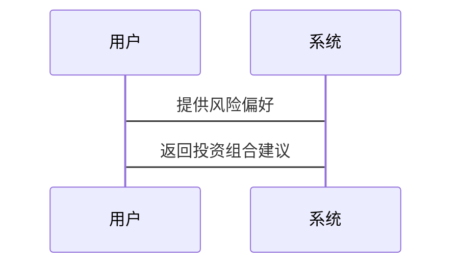

                 

# 另类投资品种：对冲通胀的有效工具

> 关键词：通胀对冲，另类投资，房地产，黄金，商品期货，REITs，加密货币

> 摘要：本文深入探讨了通胀对冲的必要性，介绍了多种另类投资品种，分析了它们在对冲通胀中的优势与劣势，并提出了构建有效投资组合的策略。通过实际案例和数学模型，帮助读者科学选择投资品种，优化资产配置，抵御通胀风险。

---

## 第一部分: 通胀与传统投资的局限性

### 第1章: 通胀的概念与类型

#### 1.1 通胀的定义与成因

- 通胀是指物价总水平在一段时间内持续上涨，导致货币购买力下降。
- 成因包括需求拉动型、成本推动型和货币供应量增加等。
- 通胀对个人和企业的财务状况产生负面影响，如减少实际收入和增加债务负担。

#### 1.2 传统投资与通胀对冲的矛盾

- 传统股票投资在通胀初期可能表现良好，但长期通胀可能导致企业利润下降，股价受压。
- 固定收益类资产如债券，通胀上升会降低其实际收益率，导致价值下降。
- 现金在通胀期间购买力下降，长期持有现金可能损失价值。

#### 1.3 另类投资的定义与重要性

- 另类投资是指传统股票、债券、现金之外的投资品种，包括房地产、黄金、商品期货、REITs和加密货币等。
- 另类投资具有多样性、抗通胀能力强的特点，能够帮助投资者在通胀期间保护资产。

---

## 第二部分: 另类投资品种的核心概念与联系

### 第2章: 另类投资品种的分类与特点

#### 2.1 另类投资的主要品种

- **房地产**：实物资产，价格受供需影响，通胀期间通常上涨。
- **黄金与贵金属**：避险资产，长期表现稳定，通胀上升时价格往往上涨。
- **商品期货与期权**：包括能源、金属和农产品，价格受供需影响，通胀期间可能上涨。
- **REITs**：通过投资房地产信托投资基金，间接投资房地产，分散风险。
- **加密货币**：如比特币，具有去中心化特点，通胀期间可能成为避险资产。

#### 2.2 各类另类投资品种的优劣势对比

| 投资品种 | 优势 | 劣势 |
|----------|------|------|
| 房地产   | 抗通胀能力强，长期增值 | 流动性差，初始投资大 |
| 黄金     | 保值能力强，风险较低 | 价格波动大，存储成本高 |
| 商品期货| 收益高，杠杆效应 | 风险高，需专业知识 |
| REITs    | 分散风险，收益稳定 | 受房地产市场影响 |
| 加密货币| 高回报，去中心化 | 波动性大，监管风险 |

### 第3章: 另类投资品种的通胀对冲原理

#### 3.1 通胀对冲的核心原理

- 通过投资于价格随通胀上升而上涨的资产，抵消通胀带来的购买力下降。
- 利用资产的多样化配置，分散通胀风险，平衡投资组合。

#### 3.2 各类另类投资品种的通胀对冲能力分析

- **房地产**：在通胀期间，房地产价格上涨，能够有效对冲通胀。
- **黄金与贵金属**：作为避险资产，黄金价格通常与通胀呈正相关。
- **商品期货与期权**：商品价格受通胀影响，期货和期权提供对冲工具。

---

## 第三部分: 另类投资的数学模型与策略

### 第4章: 数学模型与投资策略

#### 4.1 通胀对冲的数学模型

$$ E(r) = r_f + \beta (E(r_m) - r_f) $$

- 其中，\( E(r) \) 是预期收益率，\( r_f \) 是无风险利率，\( \beta \) 是系统性风险系数，\( E(r_m) \) 是市场预期收益率。
- 该模型用于评估不同资产的预期收益，选择与通胀相关性高的资产。

#### 4.2 投资组合优化

使用现代投资组合理论，通过优化资产配置，最小化投资组合的波动性，最大化预期收益。

$$ \text{最小化 } \sigma^2 \text{，在 } E(r) \text{ 固定的条件下} $$

---

## 第四部分: 项目实战与系统设计

### 第5章: 投资决策支持系统设计

#### 5.1 项目介绍

- 开发一个基于另类投资的通胀对冲系统，帮助用户选择合适的投资品种，优化资产配置。

#### 5.2 系统功能设计

- 用户输入：选择投资品种，设定风险偏好。
- 系统输出：生成投资组合建议，提供通胀对冲能力分析。

#### 5.3 系统架构设计

- 数据层：获取历史价格数据，分析通胀相关性。
- 业务逻辑层：计算预期收益和风险，生成投资组合建议。
- 用户界面：直观展示投资建议，便于用户决策。

#### 5.4 接口设计

- 数据接口：与金融数据供应商对接，获取实时价格和经济指标。
- 用户接口：图形化界面，展示分析结果和投资建议。

#### 5.5 交互图

---

## 第五部分: 总结与展望

### 第6章: 总结与注意事项

- 另类投资在通胀对冲中具有重要作用，但需谨慎选择和管理风险。
- 投资者应根据自身情况，合理配置资产，保持长期投资视角。

### 6.1 最佳实践 tips

- 多样化投资，分散风险。
- 定期评估投资组合，及时调整。
- 关注经济指标，预判通胀趋势。

### 6.2 小结

通过科学选择和管理另类投资品种，投资者能够在通胀环境下有效保护和增长资产，实现财务目标。

### 6.3 拓展阅读

- 阅读更多关于投资组合优化和风险管理的书籍。
- 关注全球经济动态，学习通胀预测方法。

---

## 作者：AI天才研究院 & 禅与计算机程序设计艺术

通过本文的详细分析，读者可以深入了解如何利用另类投资对冲通胀，并在实际操作中应用相关策略和数学模型，优化资产配置，实现稳健投资。

---

**感谢您的阅读！如果本文对您有所帮助，请点赞、收藏并分享给更多需要的朋友！**

