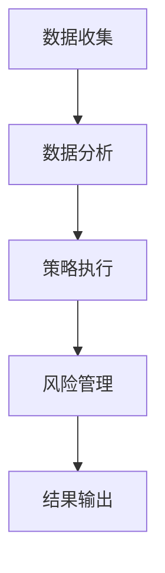

                 


# 另类投资在投资组合中的作用

> **关键词**：另类投资、投资组合优化、风险管理、夏普比率、系统架构设计

> **摘要**：本文探讨了另类投资在投资组合中的作用，通过分析其定义、策略、风险与收益，以及系统架构设计，展示了如何利用另类投资优化投资组合的表现。文章结合实际案例，详细讲解了从环境搭建到策略实现的全过程，并提供了最佳实践建议。

---

## 第1章：另类投资的定义与特点

### 1.1 另类投资的定义

另类投资是指除传统股票和债券之外的投资方式，包括私募股权、对冲基金、房地产、艺术品等。与传统投资相比，另类投资具有高风险、高回报的特点，且流动性较低。通过投资另类资产，投资者可以在传统资产之外寻找新的收益来源，从而实现投资组合的多样化。

#### 1.1.1 传统投资与另类投资的对比

| 特性 | 传统投资 | 另类投资 |
|------|----------|----------|
| 资产类型 | 股票、债券 | 私募股权、房地产、对冲基金 |
| 风险 | 中等 | 高 |
| 流动性 | 高 | 低 |
| 收益 | 稳定 | 高波动 |

#### 1.1.2 另类投资的特点

- **高回报潜力**：通过杠杆和复杂的策略，另类投资可能带来更高的收益。
- **多样化**：另类资产与传统资产的相关性较低，有助于降低整体投资组合的风险。
- **复杂性**：涉及复杂的金融工具和策略，对投资者的知识和经验要求较高。

### 1.2 另类投资在投资组合中的作用

#### 1.2.1 投资组合多样化的重要性

投资组合的多样化是降低风险的关键。通过引入另类资产，投资者可以减少对单一资产类别的依赖，分散市场风险。例如，房地产市场的波动可能与股票市场不同，从而在经济低迷时提供缓冲。

#### 1.2.2 另类资产如何降低风险

另类资产通常与传统资产负相关，能够在经济下行时提供保护。例如，当股市下跌时，房地产市场的收益可能相对稳定，从而平衡投资组合的整体表现。

#### 1.2.3 另类投资对收益的潜在贡献

通过投资高回报的另类资产，投资者可以在市场上涨时获得超额收益。例如，私募股权在企业价值提升时可能带来显著的资本增值。

---

## 第2章：另类投资的策略与应用

### 2.1 常见另类投资策略

#### 2.1.1 对冲基金策略

对冲基金通过做多和做空多种资产来对冲市场风险。例如，利用市场中不同资产的价格差异进行套利，以获取无风险收益。

#### 2.1.2 私募股权与风险投资

私募股权通过投资未上市公司，待公司上市或被收购时退出，获得资本增值。风险投资则专注于初创企业，具有高风险高回报的特点。

#### 2.1.3 套利与 arbitrage 策略

套利策略通过利用市场价差，在不承担额外风险的情况下获利。例如，利用同一资产在不同市场的价格差异进行套利。

### 2.2 另类资产配置策略

#### 2.2.1 资产类别选择

根据市场环境选择合适的另类资产。例如，在通胀预期上升时，投资房地产或大宗商品可以对冲通胀风险。

#### 2.2.2 风险调整后的收益分析

通过夏普比率评估不同资产的风险调整后收益。夏普比率计算公式为：

$$ \text{夏普比率} = \frac{E[\text{收益}] - R_f}{\text{标准差}} $$

其中，\( R_f \) 是无风险利率，\( E[\text{收益}] \) 是资产的期望收益，标准差衡量收益的波动性。

---

## 第3章：另类投资的风险与收益

### 3.1 另类投资的风险分析

#### 3.1.1 市场风险

市场波动可能导致另类资产价格下跌。例如，经济衰退时房地产市场需求下降，导致价格下跌。

#### 3.1.2 流动性风险

部分另类资产如私募股权可能难以快速变现，导致在需要资金时无法及时出售。

#### 3.1.3 信用风险

投资于债务类另类资产（如对冲基金）时，存在债务人违约的风险。

### 3.2 风险调整后的收益评估

#### 3.2.1 夏普比率的应用

夏普比率帮助投资者评估资产在承担风险后的超额收益。例如，若两资产的收益相同，夏普比率更高的资产更具吸引力。

---

## 第4章：投资系统架构

### 4.1 投资系统概述

#### 4.1.1 系统目标与范围

设计一个高效的投资系统，实现另类资产的数据收集、分析、策略执行和风险管理。

#### 4.1.2 系统功能模块

- 数据收集模块：获取另类资产的历史数据。
- 数据分析模块：计算收益、风险指标。
- 策略执行模块：根据分析结果执行投资策略。
- 风险管理模块：监控并管理投资风险。

#### 4.1.3 系统架构图



---

## 第5章：另类投资项目实战

### 5.1 环境搭建与数据收集

#### 5.1.1 数据源选择

使用Yahoo Finance获取历史数据。

#### 5.1.2 数据清洗与预处理

处理缺失值和异常值，确保数据质量。

#### 5.1.3 数据存储方案

使用CSV文件或数据库存储数据。

### 5.2 系统核心实现

#### 5.2.1 策略实现代码

```python
import pandas as pd
import numpy as np

def calculate_sharpe_ratio(returns, risk_free_rate):
    excess_returns = returns - risk_free_rate
    return (excess_returns.mean() / excess_returns.std()) * np.sqrt(252)
```

#### 5.2.2 风险管理模块

监控投资组合的VaR（在险价值）和最大回撤。

#### 5.2.3 绩效评估模块

计算投资组合的夏普比率、最大回撤等指标。

### 5.3 实际案例分析

#### 5.3.1 案例背景与目标

选择房地产投资组合，分析其在经济周期中的表现。

#### 5.3.2 数据分析与策略

利用历史数据计算房地产资产的风险和收益，优化投资组合配置。

---

## 第6章：最佳实践与小结

### 6.1 最佳实践 tips

- 分散投资，避免过度集中于单一资产。
- 定期评估投资组合，根据市场变化进行调整。
- 使用系统化的工具和模型进行风险管理和策略执行。

### 6.2 小结

另类投资在投资组合中的作用不可忽视，通过合理配置另类资产，投资者可以在控制风险的同时，实现更高的收益。

### 6.3 注意事项

- 了解所投资的资产及其风险。
- 使用专业的工具和模型进行分析。
- 定期审查和调整投资组合。

### 6.4 拓展阅读

建议进一步阅读《机构投资原理》等书籍，深入理解另类投资的理论与实践。

---

**作者：AI天才研究院/AI Genius Institute & 禅与计算机程序设计艺术 /Zen And The Art of Computer Programming**

