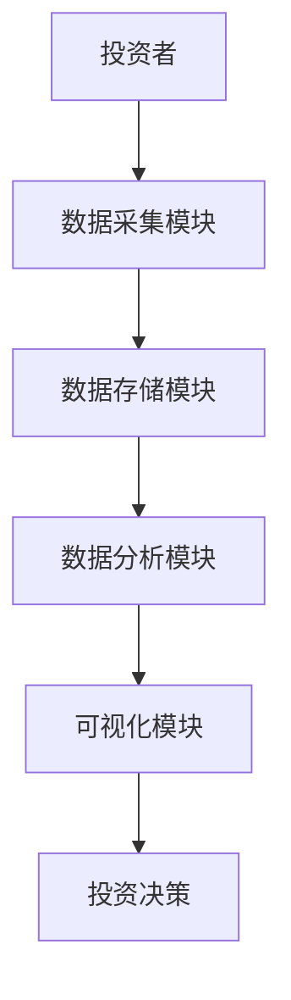

                 


```markdown
# 另类数据在投资分析中的价值

## 关键词：另类数据、投资分析、机器学习、自然语言处理、系统架构、统计套利

## 摘要：
本文深入探讨了另类数据在投资分析中的价值，从数据来源、分析方法到实际应用，结合机器学习和自然语言处理等技术，分析了另类数据在投资策略中的潜力与挑战。通过系统架构设计和项目实战，展示了如何利用另类数据构建高效的投资分析系统，并总结了最佳实践和未来研究方向。

---

## 第1章：另类数据的背景与概念

### 1.1 另类数据的定义与特点
- **1.1.1 另类数据的定义**：另类数据是指传统金融数据之外的非结构化或半结构化数据，如社交媒体、新闻、卫星图像等。
- **1.1.2 另类数据的核心特点**：非线性、实时性、异构性、海量性。
- **1.1.3 另类数据与传统金融数据的对比**：传统数据结构化、滞后性，另类数据非结构化、实时性。

### 1.2 另类数据在投资分析中的重要性
- **1.2.1 投资分析中的传统数据局限性**：难以捕捉市场情绪和实时动态。
- **1.2.2 另类数据的独特优势**：提供更多维度的信息，增强预测能力。
- **1.2.3 另类数据的应用场景与边界**：适用于情绪分析、舆情监控、供应链风险评估等。

### 1.3 本章小结
本章介绍了另类数据的基本概念、特点及其在投资分析中的重要性，为后续内容奠定了基础。

---

## 第2章：另类数据的来源与分类

### 2.1 另类数据的主要来源
- **2.1.1 社交媒体数据**：Twitter、Facebook等平台的用户评论和互动数据。
- **2.1.2 卫星图像数据**：用于监测供应链、库存变化和地理风险。
- **2.1.3 物联网数据**：传感器数据，用于监控物流和生产过程。
- **2.1.4 供应链数据**：物流、库存和订单数据，反映企业运营状况。
- **2.1.5 互联网搜索数据**：Google Trends等工具，用于分析市场趋势。

### 2.2 另类数据的分类与特征
- **2.2.1 文本型数据**：社交媒体评论、新闻文章。
- **2.2.2 图像型数据**：卫星图像、产品图片。
- **2.2.3 结构化数据**：部分物联网传感器数据。
- **2.2.4 非结构化数据**：文本、图像等未结构化的数据。

### 2.3 数据质量与预处理
- **2.3.1 数据清洗的重要性**：去除噪声、填补缺失值。
- **2.3.2 数据标准化与特征提取**：文本分词、图像增强。
- **2.3.3 数据增强与降噪技术**：使用NLP和图像处理技术提升数据质量。

### 2.4 本章小结
本章分析了另类数据的主要来源和分类，并探讨了数据预处理的关键技术，为后续分析奠定了基础。

---

## 第3章：另类数据驱动的投资分析方法

### 3.1 数据分析与特征工程
- **3.1.1 文本挖掘与情感分析**：使用NLP技术分析社交媒体情绪。
- **3.1.2 图像识别与模式识别**：识别卫星图像中的库存变化。
- **3.1.3 时间序列分析**：分析历史数据以发现周期性。

### 3.2 机器学习在投资分析中的应用
- **3.2.1 监督学习与回归分析**：预测股票价格。
- **3.2.2 非监督学习与聚类分析**：识别市场趋势。
- **3.2.3 强化学习与策略优化**：动态调整投资策略。

### 3.3 自然语言处理（NLP）在投资中的应用
- **3.3.1 事件抽取与新闻分析**：提取公司新闻的关键事件。
- **3.3.2 实体识别与关系挖掘**：识别公司及其竞争对手的关系。
- **3.3.3 预测模型与情感分析**：利用情感得分预测股价波动。

### 3.4 本章小结
本章探讨了多种数据分析方法，并展示了机器学习和NLP在投资分析中的应用。

---

## 第4章：另类数据驱动的量化投资策略

### 4.1 统计套利与另类数据
- **4.1.1 统计套利的基本原理**：利用资产价格的短期偏离获利。
- **4.1.2 另类数据在统计套利中的应用**：使用社交媒体数据预测价格波动。
- **4.1.3 套利机会的识别与风险控制**：实时监控套利机会并控制风险。

### 4.2 机器学习策略
- **4.2.1 机器学习模型的构建**：使用LSTM预测股票价格。
- **4.2.2 模型的实时更新与优化**：利用流数据优化模型。
- **4.2.3 风险管理与组合优化**：结合机器学习模型进行风险控制。

### 4.3 本章小结
本章展示了如何利用统计套利和机器学习策略进行投资，并强调了风险管理的重要性。

---

## 第5章：系统架构与数据处理流程

### 5.1 系统架构设计
- **5.1.1 数据采集模块**：实时采集社交媒体、新闻等数据。
- **5.1.2 数据存储模块**：使用分布式数据库存储海量数据。
- **5.1.3 数据分析模块**：利用大数据技术进行实时分析。
- **5.1.4 可视化模块**：生成直观的仪表盘供投资者参考。
- **5.1.5 接口设计**：提供API供其他系统调用。

### 5.2 数据处理流程
- **数据清洗与预处理**：去除噪声，标准化数据。
- **特征提取与建模**：提取关键特征，构建预测模型。
- **模型部署与监控**：实时监控模型性能，及时调整。

### 5.3 系统架构图


### 5.4 本章小结
本章展示了系统的整体架构和数据处理流程，强调了系统设计的重要性。

---

## 第6章：项目实战与案例分析

### 6.1 项目环境配置
- **数据源选择**：使用Twitter API获取社交媒体数据。
- **工具安装**：安装Python、TensorFlow、Numpy等工具。

### 6.2 核心代码实现
```python
import tensorflow as tf
from tensorflow.keras import layers

model = tf.keras.Sequential([
    layers.Dense(64, activation='relu'),
    layers.Dense(1, activation='sigmoid')
])

model.compile(optimizer='adam', loss='binary_crossentropy', metrics=['accuracy'])
model.fit(X_train, y_train, epochs=10, batch_size=32)
```

### 6.3 实际案例分析
- **案例一**：利用社交媒体数据预测某公司股价波动。
- **案例二**：通过卫星图像分析库存变化预测供应链风险。

### 6.4 本章小结
本章通过实际项目展示了如何利用另类数据进行投资分析，并分析了案例结果。

---

## 第7章：最佳实践与未来展望

### 7.1 最佳实践
- **数据质量控制**：确保数据准确性和完整性。
- **模型选择与优化**：根据数据类型选择合适的算法，并持续优化。
- **风险管理**：结合传统金融知识进行风险控制。

### 7.2 小结与注意事项
- 小结：另类数据为投资分析提供了新的视角和技术。
- 注意事项：数据隐私、模型解释性和计算资源需求。

### 7.3 未来展望
- **技术进步**：AI和大数据技术的进一步发展。
- **数据来源扩展**：更多新型数据源的挖掘。
- **监管与伦理**：数据使用中的监管和伦理问题。

---

## 作者：AI天才研究院/AI Genius Institute & 禅与计算机程序设计艺术 /Zen And The Art of Computer Programming

---

**摘要**：本文系统地探讨了另类数据在投资分析中的应用，从数据来源、分析方法到系统架构，结合实际案例和最佳实践，为投资分析提供了新的思路和方法。通过本文的学习，读者可以深入了解如何利用另类数据构建高效的投资分析系统，并掌握相关的技术细节和实际应用。
```

