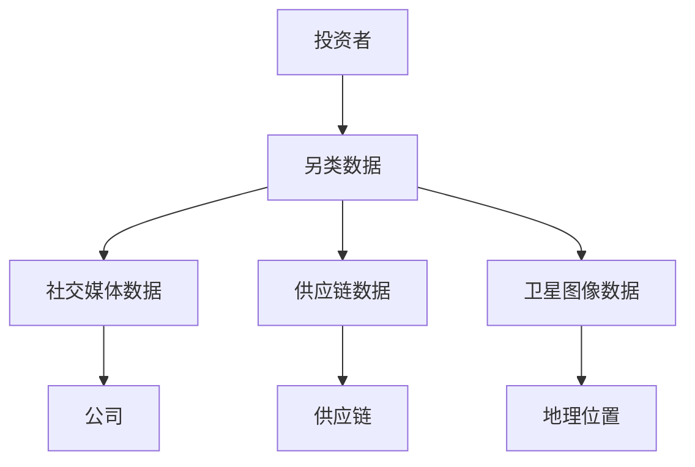
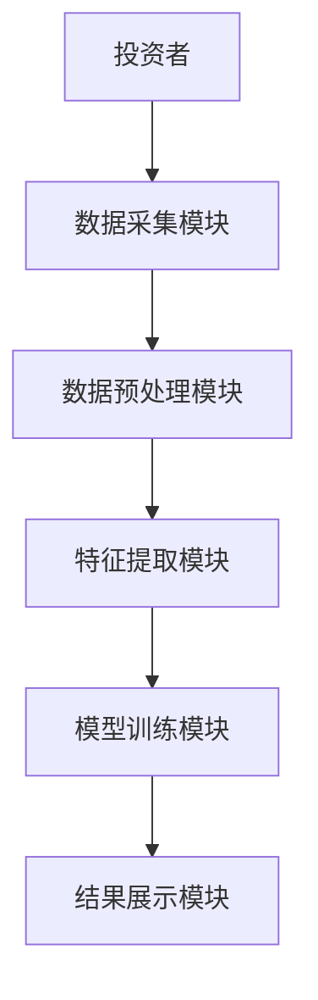

                 


# 另类数据在投资分析中的应用

## 关键词：另类数据，投资分析，社交媒体数据，卫星图像，供应链数据，算法交易，风险管理

## 摘要：  
本文探讨了另类数据在投资分析中的应用，详细介绍了另类数据的定义、分类、分析方法、数学模型、系统设计以及实际案例。通过分析社交媒体、卫星图像、供应链数据等非传统数据源，展示了它们如何为投资决策提供更全面的洞察。文章还介绍了常用的算法和模型，并通过实战案例展示了如何将这些技术应用于实际投资分析中。

---

## 第一部分：另类数据概述

### 第1章：另类数据的定义与背景

#### 1.1 问题背景与定义
- **1.1.1 传统金融数据的局限性**  
  传统金融数据（如价格、成交量、财务报表等）在投资分析中扮演着重要角色，但它们往往无法捕捉市场情绪、行业趋势或突发事件的实时信息。例如，股票价格只反映了市场对公司的估值，但无法直接体现公司的供应链问题或市场需求变化。

- **1.1.2 另类数据的定义与特点**  
  另类数据是指传统金融数据之外的非结构化或半结构化数据，包括社交媒体数据、卫星图像、供应链数据、传感器数据等。这些数据具有实时性、多样性和丰富性的特点，能够提供更多维度的市场洞察。

- **1.1.3 另类数据在投资中的重要性**  
  通过分析另类数据，投资者可以更早地发现市场趋势，识别潜在风险，从而做出更明智的投资决策。例如，社交媒体上的负面情绪可能预示着某公司股票的下跌。

#### 1.2 问题描述与解决
- **1.2.1 投资分析中的信息不对称问题**  
  信息不对称是投资分析中的一个重要挑战。传统数据的局限性使得投资者难以获取全面的市场信息，尤其是在新兴市场或复杂行业中。

- **1.2.2 另类数据如何弥补传统数据的不足**  
  另类数据能够提供实时的、多维度的市场信息。例如，卫星图像可以用来分析港口的货物积压情况，从而预测供应链的压力和公司的交货能力。

- **1.2.3 另类数据的应用场景与边界**  
  另类数据适用于多种投资场景，如舆情分析、行业趋势预测、风险管理等。然而，它并不能完全替代传统数据，而是作为传统数据的补充。

#### 1.3 核心概念与外延
- **1.3.1 另类数据的核心要素**  
  另类数据的核心要素包括数据来源、数据类型、数据处理方法和数据应用领域。例如，社交媒体数据的来源是公开的社交平台，数据类型是非结构化的文本数据。

- **1.3.2 另类数据与传统数据的对比**  
  通过对比分析，可以发现传统数据主要依赖于结构化数据，而另类数据则更注重非结构化数据的分析。

- **1.3.3 另类数据的分类与应用领域**  
  另类数据可以分为文本数据、网络数据、图像数据、传感器数据和结构化数据。每种数据类型都有其独特的应用场景，例如文本数据用于舆情分析，图像数据用于供应链监控。

---

## 第二部分：另类数据的分类与特征

### 第2章：另类数据的分类与特征

#### 2.1 另类数据的分类
- **2.1.1 文本数据**  
  文本数据包括社交媒体帖子、新闻文章、公司财报等。这些数据可以通过自然语言处理（NLP）技术进行分析，提取情感倾向、关键词和主题。

- **2.1.2 网络数据**  
  网络数据包括网页点击率、流量数据、在线搜索行为等。这些数据可以用来分析用户的兴趣和行为趋势。

- **2.1.3 图像数据**  
  图像数据包括卫星图像、产品图片、监控视频等。图像数据可以通过计算机视觉技术进行分析，提取物体、场景和模式。

- **2.1.4 传感器数据**  
  传感器数据包括物联网设备的实时数据，如温度、湿度、压力等。这些数据可以用于监控生产过程、环境变化等。

- **2.1.5 结构化数据**  
  结构化数据包括供应链数据、物流数据、交易数据等。这些数据可以通过传统的数据分析方法进行处理。

#### 2.2 数据特征对比
- **2.2.1 数据类型对比表格**  
  | 数据类型 | 数据来源 | 数据特征 | 分析方法 |
  |----------|----------|----------|----------|
  | 文本数据 | 社交媒体、新闻 | 非结构化、情感丰富 | NLP、主题建模 |
  | 图像数据 | 卫星图像、视频 | 结构化、视觉信息 | 计算机视觉、图像识别 |

- **2.2.2 数据来源对比分析**  
  文本数据的来源主要是社交平台和新闻网站，而图像数据的来源主要是卫星和视频监控设备。网络数据的来源主要是互联网平台。

- **2.2.3 数据处理难度对比**  
  文本数据的处理相对复杂，需要进行分词、情感分析等步骤；图像数据的处理需要依赖深度学习模型，如卷积神经网络（CNN）。

#### 2.3 实体关系图


#### 2.4 本章小结
- 通过本章的介绍，读者可以清晰地了解另类数据的分类及其特点，为后续的分析方法和模型选择奠定基础。

---

## 第三部分：另类数据的分析方法

### 第3章：另类数据的分析方法

#### 3.1 文本挖掘
- **3.1.1 文本挖掘的流程**  
  文本挖掘的流程包括数据清洗、分词、主题建模、情感分析等步骤。例如，使用Python的NLTK库进行分词，使用Gensim库进行主题建模。

- **3.1.2 情感分析算法**  
  情感分析算法用于识别文本中的情感倾向，例如使用VADER算法对社交媒体帖子进行情感分类。

- **3.1.3 实例分析**  
  通过分析某公司社交媒体上的负面评论，识别潜在的声誉风险。

#### 3.2 网络分析
- **3.2.1 网络分析的工具**  
  网络分析可以使用Gephi或NetworkX等工具，用于分析社交网络的结构和影响力。

- **3.2.2 社交网络分析**  
  社交网络分析可以帮助识别关键意见领袖（KOL）和信息传播路径，从而预测市场趋势。

- **3.2.3 实例分析**  
  通过分析某行业的社交网络，识别潜在的市场领导者和新兴品牌。

#### 3.3 图像识别
- **3.3.1 图像识别的算法**  
  图像识别可以使用深度学习模型，如卷积神经网络（CNN）进行图像分类和目标检测。

- **3.3.2 卫星图像分析**  
  卫星图像分析可以用于监控供应链中的物流情况，例如分析港口的货物积压情况。

- **3.3.3 实例分析**  
  通过分析卫星图像，识别某地区的作物生长情况，预测农业公司的收益。

#### 3.4 本章小结
- 本章介绍了常用的另类数据分析方法，包括文本挖掘、网络分析和图像识别，并通过实例展示了它们的应用场景。

---

## 第四部分：数学模型与深度学习

### 第4章：数学模型与深度学习

#### 4.1 统计模型
- **4.1.1 线性回归**  
  线性回归是一种简单的统计模型，用于预测连续型变量。例如，使用线性回归模型预测股票价格。

- **4.1.2 逻辑回归**  
  逻辑回归用于分类问题，例如预测股票涨跌。

#### 4.2 机器学习模型
- **4.2.1 随机森林**  
  随机森林是一种集成学习方法，用于分类和回归问题。

- **4.2.2 支持向量机（SVM）**  
  SVM用于分类和回归问题，适用于高维数据。

#### 4.3 深度学习模型
- **4.3.1 卷积神经网络（CNN）**  
  CNN用于图像识别和分类，例如识别卫星图像中的物体。

- **4.3.2 循环神经网络（RNN）**  
  RNN用于处理序列数据，例如分析时间序列数据。

#### 4.4 模型对比与选择
- **4.4.1 模型对比表格**  
  | 模型 | 优点 | 缺点 | 应用场景 |
  |------|------|------|----------|
  | 线性回归 | 简单、易于解释 | 适用于线性关系 | 股票价格预测 |
  | 随机森林 | 高准确性 | 计算复杂 | 特征重要性分析 |
  | CNN | 高准确性 | 需要大量数据 | 图像识别 |

#### 4.5 本章小结
- 通过本章的介绍，读者可以了解如何选择和应用不同的数学模型和深度学习模型进行投资分析。

---

## 第五部分：系统分析与架构设计

### 第5章：系统分析与架构设计

#### 5.1 问题场景介绍
- 投资者需要实时监控市场动态，分析社交媒体、卫星图像等数据，做出投资决策。

#### 5.2 系统功能设计
- **数据采集模块**  
  负责采集社交媒体、卫星图像等数据。

- **数据预处理模块**  
  负责清洗和转换数据，例如将文本数据分词。

- **特征提取模块**  
  负责提取数据的特征，例如从文本中提取情感特征。

- **模型训练模块**  
  负责训练和优化数学模型和深度学习模型。

- **结果展示模块**  
  负责将分析结果以可视化的方式展示给投资者。

#### 5.3 系统架构设计


#### 5.4 系统接口设计
- **数据接口**  
  与社交媒体平台和卫星图像供应商的数据接口对接。

- **模型接口**  
  与第三方机器学习模型服务对接。

#### 5.5 系统交互设计
```mermaid
sequenceDiagram
   投资者 -> 数据采集模块: 请求数据
   数据采集模块 -> 社交媒体平台: 获取数据
   数据采集模块 -> 卫星图像供应商: 获取数据
   数据预处理模块 -> 数据采集模块: 接收数据
   特征提取模块 -> 数据预处理模块: 接收数据
   模型训练模块 -> 特征提取模块: 接收特征
   结果展示模块 -> 模型训练模块: 获取结果
   投资者 <- 结果展示模块: 显示结果
```

#### 5.6 本章小结
- 通过本章的系统设计，读者可以了解如何构建一个完整的另类数据投资分析系统。

---

## 第六部分：项目实战

### 第6章：项目实战

#### 6.1 环境安装
- **Python 3.8+**  
- **必要的库**：NLTK、Gensim、Scikit-learn、TensorFlow、Keras、OpenCV。

#### 6.2 核心实现
- **文本挖掘代码示例**  
  ```python
  from nltk.corpus import stopwords
  from sklearn.feature_extraction.text import TfidfVectorizer

  # 加载数据
  texts = [...]  # 文本数据

  # 分词和去除停用词
  stop_words = set(stopwords.words('english'))
  vectorizer = TfidfVectorizer(stop_words=stop_words)
  X = vectorizer.fit_transform(texts)

  # 主题建模
  from gensim import models
 lda_model = models.LdaModel(X, num_topics=5, random_state=42)
  ```
- **图像识别代码示例**  
  ```python
  import cv2
  import numpy as np

  # 加载图像
  image = cv2.imread('satellite.jpg', cv2.IMREAD_GRAYSCALE)

  # 使用OpenCV进行图像处理
  edges = cv2.Canny(image, 100, 200)
  cv2.imwrite('edges.jpg', edges)
  ```

- **深度学习模型代码示例**  
  ```python
  import tensorflow as tf
  from tensorflow.keras import layers

  # 加载数据
  model = tf.keras.Sequential([
      layers.Conv2D(32, (3,3), activation='relu', input_shape=(64,64,3)),
      layers.MaxPooling2D((2,2)),
      layers.Conv2D(64, (3,3), activation='relu'),
      layers.MaxPooling2D((2,2)),
      layers.Flatten(),
      layers.Dense(128, activation='relu'),
      layers.Dense(10, activation='softmax')
  ])

  model.compile(optimizer='adam', loss='sparse_categorical_crossentropy', metrics=['accuracy'])
  model.fit(X_train, y_train, epochs=10, batch_size=32)
  ```

#### 6.3 案例分析
- **案例1：社交媒体情绪分析**  
  分析社交媒体上的情绪，预测某公司的股价走势。

- **案例2：卫星图像分析**  
  分析卫星图像，预测某地区的农作物产量，从而影响农业公司的股价。

#### 6.4 项目总结
- 通过本章的实战，读者可以掌握如何将理论应用于实际投资分析中。

---

## 第七部分：总结与展望

### 第7章：总结与展望

#### 7.1 全文总结
- 本文详细介绍了另类数据的定义、分类、分析方法、数学模型和系统设计，并通过实战案例展示了其在投资分析中的应用。

#### 7.2 未来展望
- 随着人工智能技术的不断发展，另类数据的应用将更加广泛和深入。例如，结合自然语言处理和图像识别技术，可以实现更智能的投资决策。

#### 7.3 致谢
- 感谢读者的耐心阅读和支持。

---

## 作者：AI天才研究院/AI Genius Institute & 禅与计算机程序设计艺术 /Zen And The Art of Computer Programming

