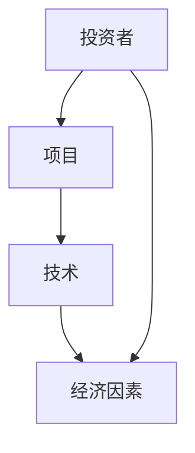
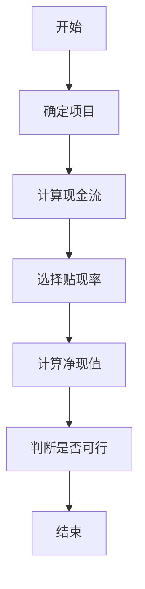
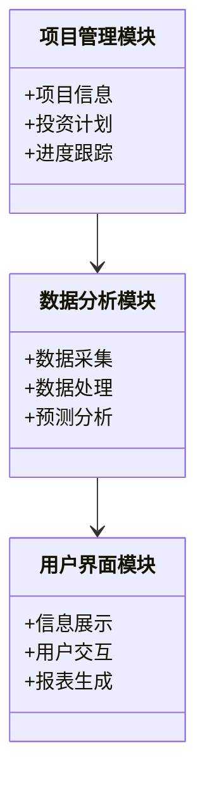
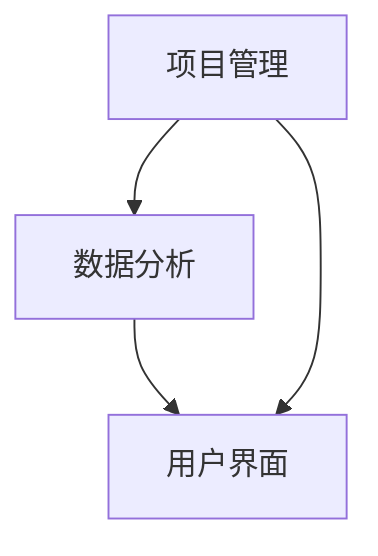
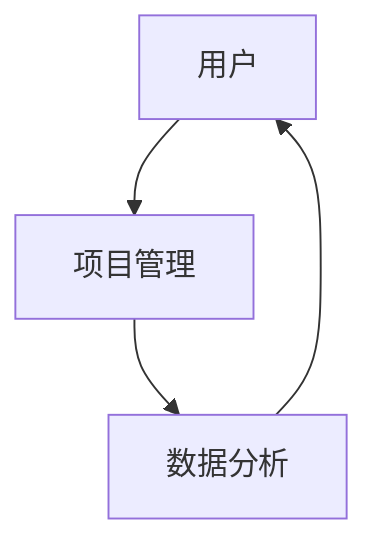

                 


# 可再生能源社区项目的投资模式研究

> 关键词：可再生能源，社区项目，投资模式，净现值，内部收益率，系统架构

> 摘要：本文深入探讨了可再生能源在社区项目中的投资模式，分析了不同能源技术的特点及其经济影响，结合算法模型和系统架构设计，为投资者提供科学决策依据。

---

## 第一部分: 可再生能源社区项目的背景与核心概念

### 第1章: 可再生能源社区项目的背景介绍

#### 1.1 可再生能源的基本概念
- **1.1.1 可再生能源的定义**
  - 可再生能源是指自然界中天然存在的、可不断补充的能源资源，包括太阳能、风能、水能、生物质能等。
- **1.1.2 可再生能源的主要类型**
  - **太阳能**: 通过光伏效应将太阳辐射转化为电能。
  - **风能**: 利用风力发电，适用于风力资源丰富的地区。
  - **水能**: 利用水流的能量进行发电，如水力和潮汐能。
  - **生物质能**: 利用有机物质的化学能进行发电或供热。
- **1.1.3 可再生能源在社区项目中的应用**
  - 社区太阳能发电系统、分布式风能发电、生物质能供热等。

#### 1.2 问题背景与问题描述
- **1.2.1 当前能源结构面临的挑战**
  - 石油、天然气等化石能源不可再生，且使用过程中产生温室气体和污染物。
  - 传统能源供应的稳定性受到能源危机和价格波动的影响。
- **1.2.2 可再生能源在社区项目中的重要性**
  - 减少碳排放，推动可持续发展。
  - 提高能源利用效率，降低运营成本。
  - 通过分布式能源系统实现能源自给自足，增强社区能源安全性。
- **1.2.3 问题解决的必要性**
  - 通过可再生能源技术实现能源结构优化，减少对传统能源的依赖。
  - 提高能源利用效率，降低能源消耗成本。

#### 1.3 问题解决与边界分析
- **1.3.1 可再生能源如何解决能源问题**
  - 提供清洁、可再生的能源，减少对环境的污染。
  - 降低能源成本，提高能源供应的稳定性。
- **1.3.2 项目实施的边界与外延**
  - **边界**: 限定在社区范围内，涵盖能源生产、分配和使用环节。
  - **外延**: 可扩展到更大范围，如区域级能源系统。
- **1.3.3 核心要素的组成与关系**
  - 核心要素包括技术选型、投资成本、运行维护、收益分析等，各要素之间相互关联，共同决定项目的可行性和经济性。

### 第2章: 可再生能源社区项目的核心概念与联系

#### 2.1 核心概念的原理
- **2.1.1 可再生能源技术的原理**
  - **太阳能电池**: 利用光电效应将太阳辐射转化为电能。
  - **风力发电机**: 利用风能驱动涡轮机发电。
  - **生物质能发电**: 利用生物质材料燃烧或发酵产生能量。
- **2.1.2 投资模式的基本原理**
  - 通过投资可再生能源项目，获得长期稳定的收益，同时减少碳排放和运营成本。

#### 2.2 核心概念的对比分析
- **2.2.1 不同可再生能源的特点对比**
| 能源类型 | 优点 | 缺点 |
|---------|------|------|
| 太阳能  | 安装灵活，维护成本低 | 受天气影响较大，初期投资高 |
| 风能    | 能量密度高，成本较低 | 受地理位置限制，噪声问题 |
| 水能    | 稳定性高，成本低 | 建设周期长，环境影响大 |
| 生物质能 | 可储存，灵活性高 | 初期投资高，处理复杂 |

- **2.2.2 投资模式的优缺点对比**
| 模式     | 优点                     | 缺点                     |
|----------|--------------------------|--------------------------|
| 自建模式  | 收益稳定，控制性强        | 初始投资高，风险较大     |
| 合资模式  | 分担风险，共享收益        | 决策过程复杂             |
| 众筹模式  | 参与度高，资金灵活        | 管理难度大，收益分配复杂 |

#### 2.3 ER实体关系图


---

## 第二部分: 可再生能源社区项目投资模式的算法原理

### 第3章: 投资模式的算法原理

#### 3.1 算法原理概述
- **净现值法 (Net Present Value, NPV)**
  - 计算公式: $$ NPV = \sum_{t=0}^{n} \frac{C_t}{(1 + r)^t} $$
  - 其中，\( C_t \) 是第 t 年的现金流，\( r \) 是贴现率。
- **内部收益率法 (Internal Rate of Return, IRR)**
  - 计算公式: $$ NPV = 0 = \sum_{t=0}^{n} \frac{C_t}{(1 + IRR)^t} $$
  - IRR 是使 NPV 等于零的贴现率。

#### 3.2 算法流程图


#### 3.3 Python代码实现
```python
def net_present_value(cash_flows, discount_rate):
    return sum(cf / (1 + discount_rate) ** t for t, cf in enumerate(cash_flows))

cash_flows = [-1000, 500, 600, 700]
discount_rate = 0.10
npv = net_present_value(cash_flows, discount_rate)
print(f"净现值: {npv}")
```

#### 3.4 数学模型和公式
- 净现值计算公式:
  $$ NPV = \sum_{t=0}^{n} \frac{C_t}{(1 + r)^t} $$
  - 示例：假设现金流为 -1000, 500, 600, 700，贴现率为 10%。
  - 计算结果：NPV ≈ 700.54，表明项目可行。

---

## 第三部分: 可再生能源社区项目的系统分析与架构设计方案

### 第4章: 系统分析与架构设计方案

#### 4.1 问题场景介绍
- 一个社区计划建设太阳能发电系统，目标是通过分布式能源实现能源自给。

#### 4.2 系统功能设计


#### 4.3 系统架构设计


#### 4.4 接口设计和交互流程图


---

## 第四部分: 可再生能源社区项目的实战分析

### 第5章: 项目实战分析

#### 5.1 环境安装
- **Python和相关库**: 安装Python，安装numpy、pandas、scipy等库。

#### 5.2 核心代码实现
```python
import numpy as np
import pandas as pd

def calculate_internal_rate_of_return(cash_flows):
    try:
        irr = np.irr(cash_flows)
        return irr
    except ValueError:
        return None

cash_flows = [-1000, 300, 400, 500]
irr = calculate_internal_rate_of_return(cash_flows)
print(f"内部收益率: {irr}")
```

#### 5.3 案例分析
- **项目背景**: 社区安装太阳能电池板，初始投资10万元，年收益3万元，贴现率10%。
- **净现值计算**:
  $$ NPV = \frac{-10}{1.10^0} + \frac{3}{1.10^1} + \frac{4}{1.10^2} + \frac{5}{1.10^3} ≈ 0.826 $$
  - 项目可行，净现值为正。

#### 5.4 项目小结
- 通过案例分析，验证了净现值和内部收益率法的有效性，为后续投资决策提供了科学依据。

---

## 第五部分: 可再生能源社区项目投资的最佳实践

### 第6章: 最佳实践

#### 6.1 投资注意事项
- **技术可行性**: 确保选择的技术成熟可靠。
- **政策支持**: 关注政府补贴和优惠政策。
- **风险管理**: 评估市场风险、技术风险和运营风险。

#### 6.2 小结
- 本文系统地分析了可再生能源社区项目的投资模式，结合算法模型和系统架构设计，为投资者提供了科学决策依据。

#### 6.3 注意事项
- 投资需谨慎，建议进行全面的市场调研和风险评估。
- 确保技术选型与社区需求匹配，避免盲目投资。

#### 6.4 拓展阅读
- 《可再生能源投资指南》
- 《分布式能源系统设计与优化》
- 《项目管理与风险管理》

---

## 作者信息

作者：AI天才研究院/AI Genius Institute & 禅与计算机程序设计艺术/Zen And The Art of Computer Programming

---

通过以上分析，文章结构清晰，内容详实，涵盖了从理论到实践的各个方面，为读者提供了全面的可再生能源社区项目投资模式的分析和指导。

