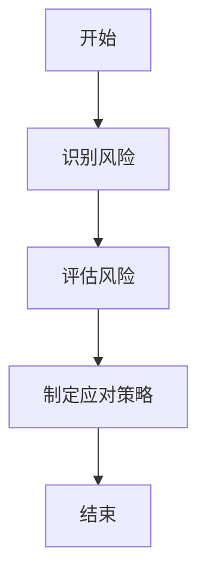
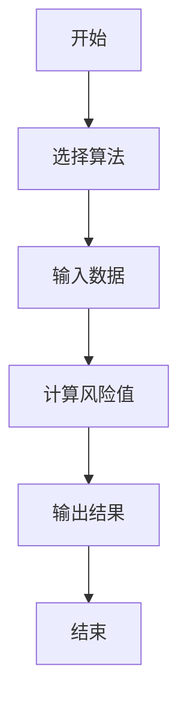

                 


# 可再生能源项目的投资风险评估

## 关键词：可再生能源、投资风险、风险评估、蒙特卡洛模拟、决策树分析

## 摘要：本文系统地探讨了可再生能源项目投资风险评估的核心概念、算法原理和实际应用。通过背景介绍、核心概念分析、算法实现、系统架构设计以及项目实战，本文为读者提供了一个全面了解和应用可再生能源项目投资风险评估的方法论。

---

# 第一部分：可再生能源项目的背景与重要性

## 第1章：可再生能源项目的背景与重要性

### 1.1 可再生能源的发展现状

#### 1.1.1 全球可再生能源的发展趋势
全球能源结构正朝着绿色低碳的方向转型，可再生能源如太阳能、风能等在全球能源消费中的占比逐年增加。根据国际能源署（IEA）的报告，2020年全球可再生能源发电量占总发电量的33.7%，预计到2030年这一比例将达到50%以上。

#### 1.1.2 我国可再生能源的政策支持
中国政府高度重视可再生能源的发展，提出了“双碳”目标，即在2030年前实现碳达峰，2060年前实现碳中和。这为可再生能源项目提供了强大的政策支持和市场空间。

#### 1.1.3 可再生能源在能源结构中的地位
可再生能源作为清洁能源的重要组成部分，对减少化石能源依赖、降低碳排放、改善环境质量具有重要意义。特别是在“双碳”目标的推动下，可再生能源将在未来能源结构中占据主导地位。

---

### 1.2 投资风险评估的定义与意义

#### 1.2.1 投资风险的定义
投资风险是指在投资过程中，由于各种不确定性因素导致投资收益低于预期甚至出现损失的可能性。在可再生能源项目中，投资风险主要来源于政策变化、技术风险、市场波动、资源不确定性等因素。

#### 1.2.2 可再生能源项目投资风险的特点
- **政策依赖性**：可再生能源的发展高度依赖政府政策，政策变化可能对项目收益产生重大影响。
- **技术不确定性**：技术的更新迭代快，技术落后可能导致项目竞争力下降。
- **市场波动性**：能源市场价格波动可能影响项目的经济性。
- **资源不确定性**：可再生能源的输出依赖于自然条件，如天气变化可能影响发电量。

#### 1.2.3 风险评估在投资决策中的作用
风险评估是投资决策的重要组成部分，能够帮助投资者识别潜在风险、量化风险影响、制定风险应对策略，从而提高投资决策的科学性和可行性。

---

### 1.3 本章小结
本章介绍了可再生能源的发展现状及其在能源结构中的重要地位，明确了投资风险的定义和特点，并强调了风险评估在投资决策中的关键作用。

---

# 第二部分：可再生能源项目投资风险的核心概念与联系

## 第2章：风险评估的基本原理

### 2.1 风险评估的核心概念

#### 2.1.1 风险来源分析
可再生能源项目的风险来源主要包括：
- **政策风险**：政府政策的变化可能影响项目的审批和补贴。
- **技术风险**：技术落后或创新不足可能导致项目竞争力下降。
- **市场风险**：能源市场价格波动可能影响项目收益。
- **资源风险**：自然条件的变化可能影响项目的发电量。
- **财务风险**：融资困难或资金链断裂可能导致项目失败。

#### 2.1.2 风险影响因素
风险影响因素可以分为内部因素和外部因素：
- **内部因素**：项目的技术水平、管理能力、财务状况等。
- **外部因素**：政策环境、市场环境、自然环境等。

#### 2.1.3 风险评估的指标体系
常见的风险评估指标包括：
- **风险概率**：风险发生的可能性。
- **风险影响程度**：风险对项目的影响大小。
- **风险值**：综合考虑概率和影响程度的风险量化指标。

---

### 2.2 风险评估的数学模型

#### 2.2.1 风险值计算公式
风险值（Risk Value）可以通过以下公式计算：
$$ R = P \times I $$
其中，$P$ 表示风险发生的概率，$I$ 表示风险的影响程度。

例如，如果一个风险发生的概率为80%（$P=0.8$），其影响程度为100万元（$I=100$ 万元），则风险值为：
$$ R = 0.8 \times 100 = 80 \text{万元} $$

---

### 2.3 风险评估的流程图



---

### 2.4 本章小结
本章详细介绍了风险评估的核心概念，包括风险来源、影响因素和指标体系，并通过公式和流程图的形式，明确了风险评估的基本原理和操作流程。

---

# 第三部分：可再生能源项目投资风险的系统分析与架构设计

## 第3章：风险评估的系统架构设计

### 3.1 系统功能设计

#### 3.1.1 风险识别模块
风险识别模块的主要功能是识别可再生能源项目中的各种风险因素，包括政策风险、技术风险、市场风险等。

#### 3.1.2 风险评估模块
风险评估模块负责对识别出的风险进行量化评估，计算每个风险的风险值，并确定其对项目的影响程度。

#### 3.1.3 风险应对模块
风险应对模块根据评估结果，制定应对策略，如调整项目计划、优化技术方案、增加备用电源等。

---

### 3.2 系统架构设计


---

### 3.3 系统接口设计

#### 3.3.1 数据输入接口
用户输入项目的基本信息，包括项目规模、投资金额、地理位置等。

#### 3.3.2 数据处理接口
系统根据输入的数据，识别和评估风险，并计算风险值。

#### 3.3.3 结果输出接口
系统输出风险评估报告，包括各个风险的详细分析和应对策略。

---

### 3.4 本章小结
本章通过系统功能设计和架构图，详细描述了可再生能源项目投资风险评估系统的整体架构和各模块之间的关系。

---

# 第四部分：可再生能源项目投资风险评估的算法原理

## 第4章：风险评估的算法原理

### 4.1 蒙特卡洛模拟算法

#### 4.1.1 算法原理
蒙特卡洛模拟是一种通过随机采样来估计系统行为的数值方法。在风险评估中，可以通过蒙特卡洛模拟来模拟各种不确定性因素的影响，从而估算项目的整体风险。

#### 4.1.2 算法实现步骤
1. 确定需要模拟的风险因素及其概率分布。
2. 生成随机样本，模拟各种可能的场景。
3. 计算每个场景下的项目收益和风险值。
4. 统计所有场景的结果，得到风险的期望值和方差。

#### 4.1.3 算法优缺点
- **优点**：能够处理高度复杂的非线性问题，适用于多因素同时影响的情况。
- **缺点**：计算量大，需要大量的计算资源。

---

### 4.2 决策树分析算法

#### 4.2.1 算法原理
决策树是一种树状结构，用于描述决策过程中的各种可能结果和相应的决策路径。在风险评估中，可以通过决策树来分析不同决策方案的风险和收益。

#### 4.2.2 算法实现步骤
1. 确定决策问题和可能的决策方案。
2. 分析每个决策方案的风险和收益。
3. 构建决策树，并计算每个节点的风险值。
4. 确定最优决策方案。

#### 4.2.3 算法优缺点
- **优点**：直观易懂，能够清晰地展示各种决策路径。
- **缺点**：适用于决策问题比较简单的情况，复杂问题可能导致决策树过于庞大。

---

### 4.3 算法流程图



---

### 4.4 本章小结
本章介绍了两种常用的蒙特卡洛模拟和决策树分析算法，并通过流程图的形式，详细描述了算法的实现步骤和优缺点。

---

# 第五部分：可再生能源项目投资风险评估的项目实战

## 第5章：风险评估的项目实战

### 5.1 项目背景

#### 5.1.1 项目介绍
某可再生能源项目计划在我国西北地区建设一个太阳能发电站，项目总投资为5亿元，预计发电容量为100MW。

---

### 5.2 环境安装

#### 5.2.1 安装Python和相关库
```bash
pip install numpy pandas matplotlib
```

---

### 5.3 核心代码实现

#### 5.3.1 风险识别模块
```python
import numpy as np
import pandas as pd

# 风险识别
def identify_risk(factors):
    risk_factors = []
    for factor in factors:
        if factor['probability'] > 0.5:
            risk_factors.append(factor)
    return risk_factors
```

#### 5.3.2 风险评估模块
```python
def evaluate_risk(risk_factors):
    risk_values = []
    for factor in risk_factors:
        value = factor['probability'] * factor['impact']
        risk_values.append(value)
    return risk_values
```

---

### 5.4 项目小结

通过本项目实战，我们掌握了可再生能源项目投资风险评估的基本方法，包括风险识别、风险评估和风险应对的全过程。

---

# 结论

通过本文的系统介绍，读者可以全面了解可再生能源项目投资风险评估的核心概念、算法原理和实际应用。无论是从理论还是实践的角度，本文都为读者提供了丰富的知识和实用的工具，帮助他们在实际投资中做出科学合理的决策。

---

# 作者

作者：AI天才研究院/AI Genius Institute & 禅与计算机程序设计艺术 /Zen And The Art of Computer Programming

