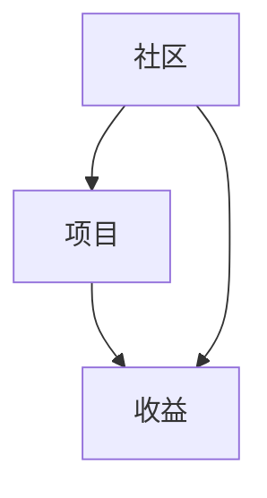
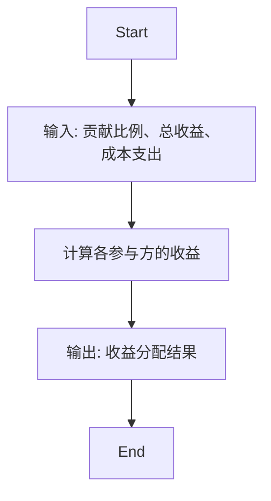
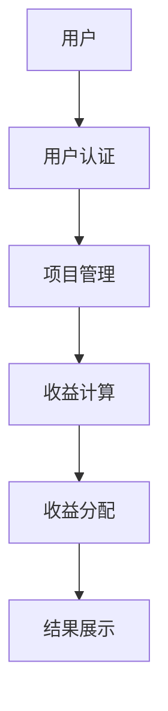

                 


# 可再生能源项目的社区参与模式与收益分配

## 关键词：可再生能源、社区参与模式、收益分配机制、分布式能源系统、能源合作社

## 摘要：可再生能源项目的社区参与模式与收益分配是实现可持续能源发展的重要环节。本文从背景、核心概念、算法原理、系统架构、项目实战到最佳实践，全面探讨如何设计和优化可再生能源项目的社区参与模式与收益分配机制，为实现能源的高效利用和公平分配提供理论支持和实践指导。

---

## 第一部分: 可再生能源项目的社区参与模式与收益分配背景介绍

### 第1章: 可再生能源项目的背景与问题背景

#### 1.1 可再生能源的发展现状
- **全球可再生能源发展的趋势**：全球能源结构转型加速，可再生能源占比逐年提升。
- **中国可再生能源发展的现状**：中国已成为全球最大的可再生能源市场，分布式能源系统快速发展。
- **可再生能源在社区层面的应用前景**：社区能源自治和共享经济模式的兴起。

#### 1.2 社区参与的必要性
- **社区能源消费的特点**：社区能源消费具有本地化、分布式的特点。
- **社区参与在可再生能源项目中的作用**：通过社区参与，可以降低能源浪费，提高能源使用效率。
- **当前社区参与的痛点与挑战**：社区参与度低、利益分配不公、参与模式单一。

#### 1.3 收益分配机制的重要性
- **可再生能源项目的收益来源**：发电收益、政府补贴、碳交易收益等。
- **收益分配对项目可持续性的影响**：合理的收益分配机制可以提高社区参与积极性，确保项目的长期运行。
- **收益分配的公平性与激励性**：收益分配应公平透明，同时具有激励作用，鼓励更多社区参与。

### 第2章: 可再生能源项目的社区参与模式

#### 2.1 社区参与模式的分类
- **自愿参与模式**：社区成员基于个人意愿参与项目，例如居民自愿加入社区太阳能电站。
- **组织化参与模式**：通过社区组织或能源合作社的形式，社区成员共同参与项目。
- **利益共享模式**：通过收益共享机制，社区成员按贡献比例分配收益。

#### 2.2 不同参与模式的特点对比
| 模式类型          | 特点                           | 优点                          | 缺点                          |
|-------------------|--------------------------------|--------------------------------|--------------------------------|
| 自愿参与模式      | 个体参与，灵活性高             | 简单易行，成本低               | 参与度低，缺乏组织性           |
| 组织化参与模式    | 通过组织形式进行集中管理       | 组织性强，便于管理             | 成立组织的成本较高             |
| 利益共享模式      | 按贡献比例分配收益             | 激励性强，公平透明             | 需要复杂的收益分配机制         |

#### 2.3 社区参与模式的ER实体关系图


---

## 第二部分: 可再生能源项目的收益分配机制

### 第3章: 收益分配机制的核心概念

#### 3.1 收益分配机制的定义
- **收益分配的基本概念**：将可再生能源项目的收益按照一定规则分配给参与者。
- **收益分配的主体与客体**：主体包括社区成员、投资者和政府，客体包括发电收益、补贴收益和碳交易收益。

#### 3.2 收益分配机制的属性特征
- **公平性**：收益分配应公平透明，确保各参与方的权益。
- **激励性**：收益分配应具有激励作用，鼓励更多人参与项目。
- **灵活性**：收益分配机制应具有灵活性，能够适应不同的项目规模和参与模式。

---

## 第三部分: 收益分配机制的算法原理

### 第4章: 收益分配机制的算法设计

#### 4.1 收益分配算法的基本原理
- **算法目标**：设计一个公平、透明的收益分配算法，实现社区参与模式下的收益最大化。
- **算法输入**：参与社区成员的贡献比例、项目的总收益、项目的成本支出。
- **算法输出**：各参与方的收益分配结果。

#### 4.2 收益分配算法的流程图


#### 4.3 收益分配算法的数学模型
- **总收益分配公式**：
  $$ \text{总收益} = \text{发电收益} + \text{政府补贴} + \text{碳交易收益} $$
- **个人收益分配公式**：
  $$ \text{个人收益} = \text{总收益} \times \text{贡献比例} $$
- **贡献比例计算公式**：
  $$ \text{贡献比例} = \frac{\text{个人贡献}}{\text{总贡献}} $$

---

## 第四部分: 可再生能源项目的系统分析与架构设计

### 第5章: 系统架构设计

#### 5.1 项目场景介绍
- **项目目标**：设计一个可再生能源社区参与与收益分配的信息化系统。
- **项目范围**：包括社区能源管理、收益分配、用户交互等功能。

#### 5.2 系统功能设计
- **用户模块**：用户注册、登录、查看收益、参与项目。
- **项目模块**：项目管理、收益计算、分配结果展示。
- **收益分配模块**：收益分配规则设置、分配结果查询。

#### 5.3 系统架构设计


---

## 第五部分: 项目实战

### 第6章: 项目实战与案例分析

#### 6.1 环境安装
- **安装Python**：用于开发系统核心功能。
- **安装依赖库**：例如，`pandas`、`numpy`、`flask`等。

#### 6.2 核心代码实现
```python
def calculate_revenue_distribution(project_revenue, contribution_ratio):
    return project_revenue * contribution_ratio

# 示例代码
project_revenue = 100000  # 项目总收益
contribution_ratio = [0.3, 0.2, 0.1, 0.4]  # 各参与方的贡献比例

# 计算各参与方的收益
revenue分配结果 = [calculate_revenue_distribution(project_revenue, ratio) for ratio in contribution_ratio]
```

#### 6.3 代码解读与分析
- **函数定义**：`calculate_revenue_distribution`函数用于计算各参与方的收益分配。
- **参数解释**：`project_revenue`为项目总收益，`contribution_ratio`为各参与方的贡献比例。
- **返回结果**：根据贡献比例计算各参与方的收益分配结果。

#### 6.4 实际案例分析
- **案例背景**：某社区建设了一个分布式光伏电站，总收益为10万元，社区成员贡献比例分别为30%、20%、10%、40%。
- **收益分配结果**：各参与方的收益分别为3万元、2万元、1万元、4万元。

---

## 第六部分: 最佳实践与总结

### 第7章: 最佳实践与总结

#### 7.1 小结
- **核心观点总结**：通过合理的社区参与模式和收益分配机制，可以实现可再生能源项目的高效管理和公平分配。

#### 7.2 注意事项
- **公平性原则**：收益分配应公平透明，确保各参与方的权益。
- **灵活性原则**：收益分配机制应具有灵活性，能够适应不同的项目规模和参与模式。

#### 7.3 拓展阅读
- **推荐书籍**：《分布式能源系统》、《社区能源自治》。
- **推荐阅读文章**：《可再生能源项目中的收益分配机制研究》。

---

## 作者：AI天才研究院/AI Genius Institute & 禅与计算机程序设计艺术 /Zen And The Art of Computer Programming

