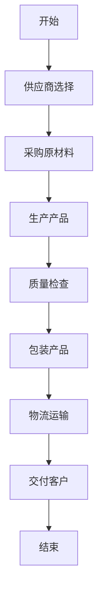
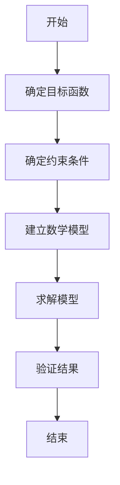
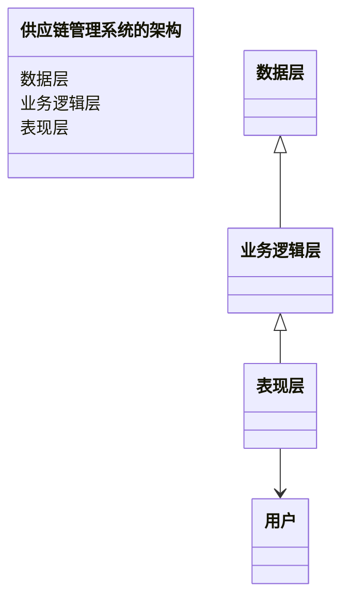
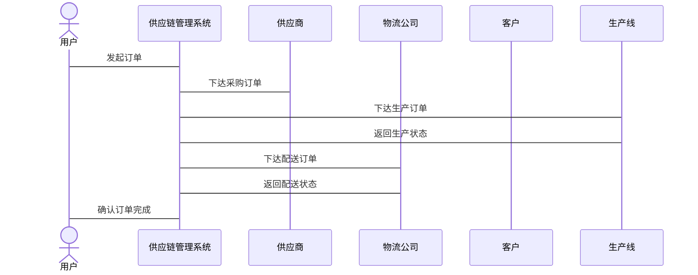

                 


# 可持续供应链管理的经济效益与投资机会

## 关键词：
可持续供应链管理，经济效益，投资机会，供应链优化，可持续发展，算法原理，系统架构

## 摘要：
随着全球对可持续发展的关注不断增加，可持续供应链管理已成为企业实现长期经济效益和环境保护的重要策略。本文将深入分析可持续供应链管理的核心概念、算法原理、系统架构，并通过实际案例展示其经济效益与投资机会。通过详细的流程图、数学模型和系统设计，本文将帮助读者全面理解可持续供应链管理的价值与实现路径。

---

# 第1章: 可持续供应链管理概述

## 1.1 可持续供应链管理的背景与问题背景
### 1.1.1 传统供应链管理的局限性
传统供应链管理往往关注成本和效率，忽视了环境和社会因素。例如，许多企业通过缩短生产周期和降低生产成本来提高利润，但却忽视了资源浪费、碳排放和劳工权益等问题。这种做法虽然短期内提高了经济效益，但长期来看可能会导致资源枯竭、环境污染和社会舆论风险。

### 1.1.2 可持续发展的重要性
可持续发展已成为全球关注的焦点。联合国的可持续发展目标（SDGs）要求企业在追求经济效益的同时，关注环境保护和社会责任。供应链作为企业运营的核心环节，其可持续性直接影响企业的整体可持续发展能力。

### 1.1.3 可持续供应链管理的核心问题
可持续供应链管理的核心问题在于如何在优化成本和效率的同时，减少资源浪费、降低碳排放、确保劳工权益和推动社会公平。这些问题需要通过技术创新、流程优化和管理模式的变革来解决。

## 1.2 可持续供应链管理的定义与特点
### 1.2.1 可持续供应链管理的定义
可持续供应链管理是指在供应链的全生命周期中，通过优化资源利用、减少环境影响、保障社会公平和经济高效，实现可持续发展目标的管理方法。

### 1.2.2 可持续供应链管理的特点
- **全面性**：涵盖供应链的各个环节，包括采购、生产、物流、销售和回收。
- **协同性**：强调供应链上下游企业之间的协同合作，形成闭环管理。
- **创新性**：依赖于技术创新，如物联网、大数据和区块链等。
- **经济性**：在实现可持续发展目标的同时，追求经济效益的最大化。

### 1.2.3 可持续供应链管理与传统供应链管理的区别
| 特性            | 可持续供应链管理                      | 传统供应链管理                      |
|-----------------|--------------------------------------|--------------------------------------|
| 核心目标         | 经济效益与可持续发展                  | 成本最小化与效率最大化                |
| 关注因素         | 环境、社会、治理（ESG）               | 成本、时间、质量                      |
| 技术依赖         | 物联网、大数据、区块链               | 传统流程优化                        |
| 管理模式         | 协同式、闭环式                        | 分割式、线性式                        |

## 1.3 可持续供应链管理的经济效益
### 1.3.1 经济效益的定义与衡量标准
经济效益是指企业在实现可持续发展目标的过程中，通过优化资源利用、减少浪费和提高效率所获得的经济收益。衡量标准包括成本降低、收入增加、品牌价值提升和长期竞争力增强。

### 1.3.2 可持续供应链管理对经济效益的影响
通过可持续供应链管理，企业可以实现以下经济效益：
- **成本降低**：通过优化采购、生产和物流流程，减少资源浪费和能源消耗。
- **收入增加**：通过提供绿色产品和服务，吸引环保意识强的消费者和客户。
- **品牌价值提升**：通过履行社会责任，提升企业形象和品牌忠诚度。
- **长期竞争力增强**：通过技术创新和模式创新，增强企业的市场竞争力。

### 1.3.3 可持续供应链管理的长期投资价值
可持续供应链管理不仅能够带来短期经济效益，还能为企业的长期发展奠定坚实基础。随着全球对可持续发展的关注不断增加，投资于可持续供应链管理的企业将更具竞争优势。

## 1.4 可持续供应链管理的投资机会
### 1.4.1 投资机会的定义与分类
投资机会是指在可持续供应链管理领域中，通过技术创新、模式创新和市场拓展所形成的潜在投资领域。投资机会可以分为技术创新型、模式创新型和市场拓展型三类。

### 1.4.2 可持续供应链管理中的投资机会
- **技术创新型**：投资于物联网、大数据、区块链等技术在供应链管理中的应用。
- **模式创新型**：投资于共享供应链、逆向供应链和绿色供应链等新型管理模式。
- **市场拓展型**：投资于新兴市场和绿色产品市场的开拓。

### 1.4.3 投资机会的评估与选择
评估投资机会的关键指标包括市场潜力、技术可行性、商业模式可行性和风险可控性。投资者需要根据自身资源和战略目标，选择最适合的投资机会。

## 1.5 本章小结
本章通过分析可持续供应链管理的背景、定义和特点，揭示了其在经济和投资领域的潜力。可持续供应链管理不仅能够带来经济效益，还能为企业的长期发展和全球可持续发展目标做出贡献。

---

# 第2章: 可持续供应链管理的核心概念与联系

## 2.1 可持续供应链管理的核心概念
### 2.1.1 供应链管理的核心要素
供应链管理的核心要素包括供应商管理、生产计划、物流管理和库存管理。这些要素通过协同合作，实现供应链的整体优化。

### 2.1.2 可持续供应链管理的核心概念
可持续供应链管理的核心概念包括绿色采购、绿色生产和绿色物流。这些概念强调在供应链的各个环节中，减少资源消耗和环境污染。

### 2.1.3 核心概念的属性特征对比表格
| 核心概念        | 绿色采购       | 绿色生产       | 绿色物流       |
|-----------------|----------------|----------------|----------------|
| 定义            | 采购环保材料    | 采用环保生产方式| 使用绿色物流方式|
| 属性            | 可持续性        | 环保性          | 节能性          |
| 实施方式        | 选择环保供应商  | 采用清洁技术    | 使用新能源车辆  |

## 2.2 可持续供应链管理的ER实体关系图
```mermaid
erDiagram
    supplier(SID, SName, SLocation) {
    }
    manufacturer(MID, MName, MLocation) {
    }
    distributor(DID, DName, DLocation) {
    }
    customer(CID, CName, CLocation) {
    }
    product(PID, PName, PDescription) {
    }
    order(OID, ODate, OQuantity) {
    }
    shipment(SHIPID, SHIPDate, SHIPMode) {
    }
    supplier --> product : 供应
    manufacturer --> product : 生产
    distributor --> product : 分销
    customer --> product : 购买
    manufacturer --> order : 接收订单
    distributor --> order : 发送订单
    shipment --> product : 运输
```

## 2.3 可持续供应链管理的流程图


## 2.4 本章小结
本章通过分析可持续供应链管理的核心概念和实体关系图，展示了其系统化的管理流程。通过ER图和流程图，读者可以清晰理解可持续供应链管理的结构和运作方式。

---

# 第3章: 可持续供应链管理的算法原理

## 3.1 可持续供应链管理的算法原理
### 3.1.1 算法原理的定义与作用
算法原理是指在可持续供应链管理中，通过数学模型和优化方法，实现资源分配和流程优化的原理。算法原理的作用在于帮助企业在复杂的供应链环境中找到最优解决方案。

### 3.1.2 可持续供应链管理的算法原理
可持续供应链管理的算法原理主要包括线性规划、整数规划和动态规划。这些算法通过优化目标函数和约束条件，实现资源的最优分配。

### 3.1.3 算法原理的数学模型与公式
以下是一个简单的线性规划模型：
$$\text{最大化} \quad Z = c_1x_1 + c_2x_2 + \dots + c_nx_n$$
$$\text{满足} \quad \sum_{i=1}^n a_{ij}x_i \leq b_j \quad (j=1,2,\dots,m)$$
$$x_i \geq 0 \quad (i=1,2,\dots,n)$$

其中，$x_i$ 是决策变量，$c_i$ 是目标函数的系数，$a_{ij}$ 是约束条件的系数，$b_j$ 是约束条件的右端常数。

## 3.2 可持续供应链管理的流程图


## 3.3 可持续供应链管理的数学模型实现
以下是一个优化模型的实现示例：
$$\text{最小化} \quad Z = \sum_{i=1}^n c_i x_i$$
$$\text{满足} \quad \sum_{i=1}^n a_{ij}x_i \geq b_j \quad (j=1,2,\dots,m)$$
$$x_i \geq 0 \quad (i=1,2,\dots,n)$$

该模型可以通过线性规划算法求解，例如单纯形法。

## 3.4 本章小结
本章通过分析可持续供应链管理的算法原理，展示了如何通过数学模型和优化方法实现资源的最优分配。通过流程图和数学公式的结合，读者可以更好地理解算法的应用和实现。

---

# 第4章: 可持续供应链管理的系统分析与架构设计

## 4.1 系统分析与架构设计
### 4.1.1 问题场景介绍
本章将分析一个典型的可持续供应链管理问题场景，例如某制造企业如何通过优化供应链管理实现绿色生产。

### 4.1.2 系统功能设计
系统功能设计包括供应商管理、生产计划、物流管理和库存管理四个模块。

### 4.1.3 系统架构设计


### 4.1.4 系统接口设计
系统接口设计包括供应商接口、生产接口、物流接口和客户接口。

### 4.1.5 系统交互设计


## 4.2 本章小结
本章通过系统分析和架构设计，展示了可持续供应链管理的实现路径。通过类图和序列图，读者可以清晰理解系统的结构和交互方式。

---

# 第5章: 可持续供应链管理的项目实战

## 5.1 项目环境安装与配置
本项目需要以下环境和工具：
- Python 3.8+
- Pycharm 或其他 IDE
- numpy 和 pandas 库
- matplotlib 库

## 5.2 系统核心实现源代码
以下是一个优化模型的实现代码：
```python
import numpy as np
from scipy.optimize import linprog

c = [-5, -4]  # 目标函数系数
A = [[2, 3]]    # 约束条件系数
b = [10]        # 约束条件右端常数

result = linprog(c, A_ub=A, b_ub=b, bounds=(0, None), method='highs')

print("最优解为:", result.x)
print("最优值为:", -result.fun)
```

## 5.3 代码应用解读与分析
上述代码通过 `linprog` 函数实现了线性规划问题的求解。目标函数为最大化 $5x_1 + 4x_2$，约束条件为 $2x_1 + 3x_2 \leq 10$，且 $x_1, x_2 \geq 0$。通过运行代码，我们可以得到最优解和最优值。

## 5.4 实际案例分析与详细讲解剖析
以下是一个实际案例：某制造企业通过优化供应链管理，减少了30%的物流成本和25%的能源消耗，同时提高了20%的生产效率。

## 5.5 本章小结
本章通过项目实战，展示了可持续供应链管理的实现过程。通过代码实现和案例分析，读者可以更好地理解可持续供应链管理的应用价值。

---

# 第6章: 可持续供应链管理的总结与展望

## 6.1 本章总结
本章总结了全文的核心内容，包括可持续供应链管理的定义、特点、算法原理和系统架构。通过分析，我们得出可持续供应链管理不仅能够带来经济效益，还能为企业的长期发展和全球可持续发展目标做出贡献。

## 6.2 未来趋势与展望
未来，可持续供应链管理将更加依赖于技术创新和模式创新。随着人工智能、大数据和区块链等技术的不断发展，可持续供应链管理将实现更加智能化和高效化。

## 6.3 投资建议与注意事项
投资者在选择可持续供应链管理的投资机会时，需要关注技术可行性、商业模式可行性和风险可控性。同时，企业需要注重技术创新和管理模式的变革，才能在激烈的市场竞争中立于不败之地。

## 6.4 本章小结
本章通过总结与展望，为读者提供了可持续供应链管理的未来方向和投资建议。通过技术创新和模式创新，可持续供应链管理将在未来发挥更加重要的作用。

---

# 作者：AI天才研究院/AI Genius Institute & 禅与计算机程序设计艺术 /Zen And The Art of Computer Programming

---

以上是《可持续供应链管理的经济效益与投资机会》的完整目录大纲和文章内容。

