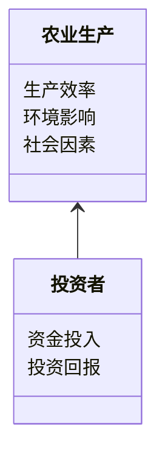
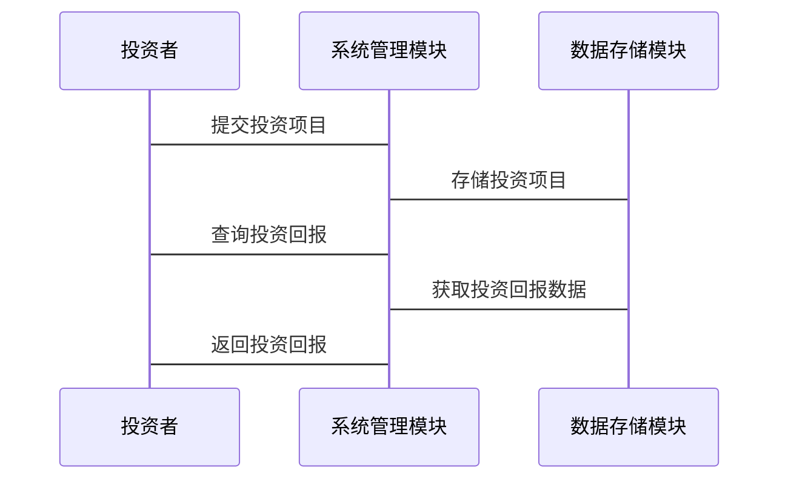

                 


# 可持续农业实践与相关产业链投资

## 关键词：可持续农业，产业链投资，农业技术，投资策略，现代农业

## 摘要：  
本文深入探讨了可持续农业的核心概念、实践方法及其相关产业链的投资机会。通过分析农业生产的各个环节，结合现代技术手段，本文提出了一套基于数学优化模型的投资策略，并通过实际案例展示了如何在确保生态平衡的前提下实现经济效益的最大化。文章内容涵盖背景介绍、核心概念、算法原理、系统架构设计及项目实战等多个方面，为读者提供了一个全面的视角来理解和投资可持续农业产业链。

---

## 第1章: 可持续农业的背景与概念

### 1.1 可持续农业的定义与核心理念

#### 1.1.1 可持续农业的定义  
可持续农业是一种以生态系统为基础的农业生产方式，旨在在满足当前人类需求的同时，不损害后代人满足其需求的能力。它强调资源的高效利用、环境的保护以及社会的公平性。

#### 1.1.2 可持续农业的核心理念  
- **生态平衡**：通过合理利用土地、水资源和生物多样性，确保农业生态系统的长期稳定性。  
- **资源高效利用**：通过技术创新和管理优化，最大化农业生产效率，减少资源浪费。  
- **社会公平**：确保农民、消费者和投资者的利益得到合理分配，促进社会的可持续发展。

#### 1.1.3 可持续农业与传统农业的区别  
| 特性         | 可持续农业                     | 传统农业                     |
|--------------|-------------------------------|------------------------------|
| 资源利用     | 高效，循环利用                | 低效，资源浪费                |
| 环境影响     | 最小化，保护生态              | 可能破坏环境，污染严重        |
| 社会效益     | 公平，注重长期利益            | 短期利益优先，忽视社会公平    |

---

### 1.2 可持续农业的背景与问题背景

#### 1.2.1 当前农业面临的主要问题  
- **资源枯竭**：过度使用化肥和水资源导致土地退化和水资源短缺。  
- **环境污染**：农药和化肥的滥用导致土壤和水体污染。  
- **气候变化**：极端天气事件频发，影响农作物的生长周期。  
- **社会不公**：小规模农民缺乏资源和支持，难以与大型企业竞争。

#### 1.2.2 可持续农业的必要性  
随着全球人口的增长和资源的有限性，传统农业模式已无法满足未来的粮食需求。可持续农业通过高效利用资源和保护环境，为人类提供了更可靠的食物来源，同时减少了对环境的破坏。

#### 1.2.3 可持续农业的边界与外延  
可持续农业不仅关注农业生产本身，还包括从生产到消费的整个产业链。其外延涉及农业技术、金融支持、政策制定等多个领域。

---

### 1.3 可持续农业的核心要素

#### 1.3.1 生产效率  
通过技术创新和管理优化，提高单位面积的产量，减少资源浪费。

#### 1.3.2 环境影响  
通过减少化肥和农药的使用，采用有机农业和生态农业等方式，降低对环境的负面影响。

#### 1.3.3 社会因素  
确保农民的权益，提高他们的生活水平和教育水平，促进农村地区的可持续发展。

---

### 1.4 可持续农业的产业链构成

#### 1.4.1 农业生产环节  
包括农作物种植、畜禽养殖、水产养殖等，是可持续农业的核心环节。

#### 1.4.2 加工与流通环节  
通过农产品加工和物流体系，确保农产品的高效流通和价值最大化。

#### 1.4.3 投资与金融支持  
通过金融工具（如股权投资、债权融资等）支持可持续农业项目的发展。

---

### 1.5 本章小结  
本章从背景和概念两个方面介绍了可持续农业的核心理念及其产业链构成，为后续章节的分析奠定了基础。

---

## 第2章: 可持续农业的核心概念与联系

### 2.1 可持续农业的核心概念原理

#### 2.1.1 生态平衡  
通过合理利用资源，确保农业生态系统的稳定性和可持续性。

#### 2.1.2 资源高效利用  
通过技术创新和管理优化，实现资源的高效利用，减少浪费。

#### 2.1.3 社会公平  
确保农民、消费者和投资者的利益得到公平分配，促进社会的可持续发展。

---

### 2.2 可持续农业的核心概念属性特征对比

| 概念         | 特征                           |
|--------------|-------------------------------|
| 生态平衡     | 系统稳定性，资源循环利用       |
| 资源高效利用 | 最小化资源消耗，最大化产出     |
| 社会公平     | 确保利益相关者权益             |

---

### 2.3 可持续农业的ER实体关系图

```mermaid
erd
actor: 可持续农业实践者
role: 投资者
entity: 农业生产
attribute: 生产效率，环境影响，社会因素
```

---

### 2.4 本章小结  
本章通过对比和图表的方式，详细分析了可持续农业的核心概念及其相互关系，为后续的算法设计和系统架构提供了理论支持。

---

## 第3章: 可持续农业产业链投资的算法原理

### 3.1 可持续农业产业链投资的优化模型

#### 3.1.1 线性规划模型  
线性规划是一种优化技术，用于在给定的约束条件下最大化或最小化目标函数。在可持续农业投资中，线性规划可以用于优化资源配置。

#### 3.1.2 机器学习模型  
机器学习算法可以通过历史数据预测农产品的价格波动，帮助投资者制定更科学的投资策略。

#### 3.1.3 组合优化模型  
组合优化模型用于在多个投资项目中选择最优组合，以实现最大化的投资回报。

---

### 3.2 投资组合优化的数学模型

#### 最大化目标函数  
$$ \text{目标函数：} \quad \max \sum_{i=1}^{n} w_i r_i $$  
其中，\( w_i \) 是第 \( i \) 个投资项目的权重，\( r_i \) 是其预期收益率。

#### 约束条件  
$$ \text{约束条件：} \quad \sum_{i=1}^{n} w_i = 1 $$  
$$ \quad \quad \quad \quad w_i \geq 0 \quad \forall i $$  

---

### 3.3 投资组合优化的代码实现

```python
import numpy as np
from scipy.optimize import minimize

def portfolio_optimization(returns):
    n = len(returns.columns)
    # 定义目标函数
    def objective(weights):
        return -np.sum(returns.mean() * weights)
    # 约束条件
    constraints = [
        {'type': 'eq', 'fun': lambda w: np.sum(w) - 1},
        {'type': 'ineq', 'fun': lambda w: w}
    ]
    # 稀疏优化
    result = minimize(objective, np.ones(n)/n, constraints=constraints)
    return result.x

# 示例数据
returns = pd.DataFrame({
    'Project A': [0.1, 0.2, 0.15],
    'Project B': [0.15, 0.1, 0.2],
    'Project C': [0.05, 0.08, 0.07]
})
weights = portfolio_optimization(returns)
print(weights)
```

---

### 3.4 本章小结  
本章通过数学优化模型和机器学习算法，详细分析了可持续农业产业链投资的核心原理，为后续的系统设计提供了技术支持。

---

## 第4章: 可持续农业产业链投资的系统架构设计

### 4.1 问题场景介绍  
本章以一个典型的可持续农业产业链为例，分析其系统架构设计。

### 4.2 系统功能设计

#### 4.2.1 领域模型  


#### 4.2.2 系统架构  
```mermaid
containerDiagram
    container 服务器 {
        系统管理模块
        数据存储模块
        用户界面模块
    }
    container 客户端 {
        用户界面模块
    }
    客户端 --> 系统管理模块
    系统管理模块 --> 数据存储模块
```

---

### 4.3 系统接口设计  
系统接口包括投资者的登录、投资项目的提交、投资回报的查询等功能。

---

### 4.4 系统交互设计  


---

### 4.5 本章小结  
本章通过系统架构设计，详细分析了可持续农业产业链投资的实现方式，为后续的项目实战奠定了基础。

---

## 第5章: 可持续农业产业链投资的项目实战

### 5.1 环境安装  
- 安装Python和相关库（如NumPy、Scipy、Matplotlib等）。  
- 安装Jupyter Notebook用于代码实现和可视化。

---

### 5.2 系统核心实现源代码

#### 5.2.1 投资组合优化的代码实现  
```python
import numpy as np
from scipy.optimize import minimize

def portfolio_optimization(returns):
    n = len(returns.columns)
    # 定义目标函数
    def objective(weights):
        return -np.sum(returns.mean() * weights)
    # 约束条件
    constraints = [
        {'type': 'eq', 'fun': lambda w: np.sum(w) - 1},
        {'type': 'ineq', 'fun': lambda w: w}
    ]
    # 稀疏优化
    result = minimize(objective, np.ones(n)/n, constraints=constraints)
    return result.x

# 示例数据
returns = pd.DataFrame({
    'Project A': [0.1, 0.2, 0.15],
    'Project B': [0.15, 0.1, 0.2],
    'Project C': [0.05, 0.08, 0.07]
})
weights = portfolio_optimization(returns)
print(weights)
```

#### 5.2.2 投资回报的可视化  
```python
import matplotlib.pyplot as plt

returns.mean().plot(kind='bar')
plt.title('投资项目平均收益率')
plt.show()
```

---

### 5.3 实际案例分析  
以一个实际的可持续农业项目为例，分析其投资回报和风险。

---

### 5.4 本章小结  
本章通过项目实战，详细展示了如何将理论应用于实际投资决策，帮助投资者更好地理解和操作可持续农业产业链投资。

---

## 第6章: 可持续农业产业链投资的最佳实践

### 6.1 小结  
本文从背景、概念、算法、系统架构到项目实战，全面分析了可持续农业产业链投资的核心内容。

---

### 6.2 注意事项  
- 投资者需充分了解投资项目的风险和收益。  
- 优先选择具有技术优势和社会责任的农业项目。  
- 注意政策变化对投资的影响。

---

### 6.3 拓展阅读  
- 《可持续农业的技术创新与应用》  
- 《现代农业投资策略与风险管理》  

---

## 作者：AI天才研究院/AI Genius Institute & 禅与计算机程序设计艺术 /Zen And The Art of Computer Programming

