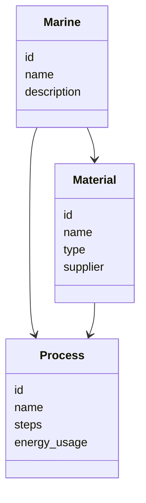
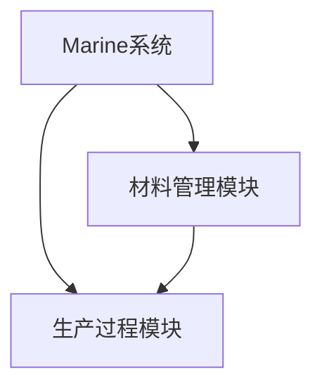
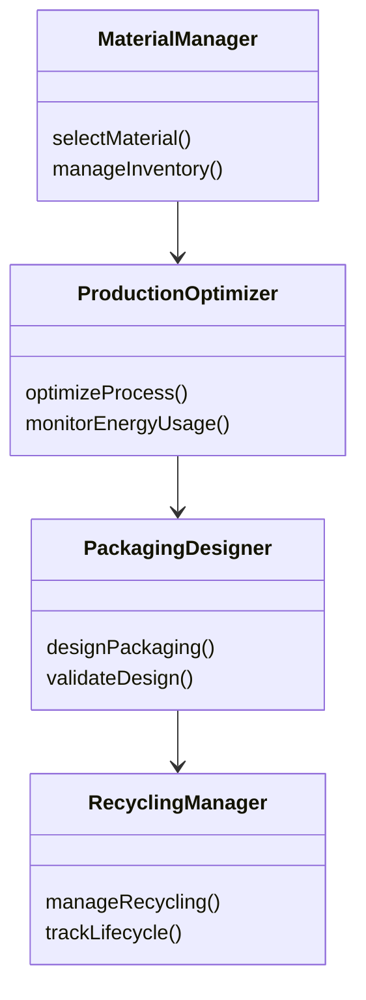
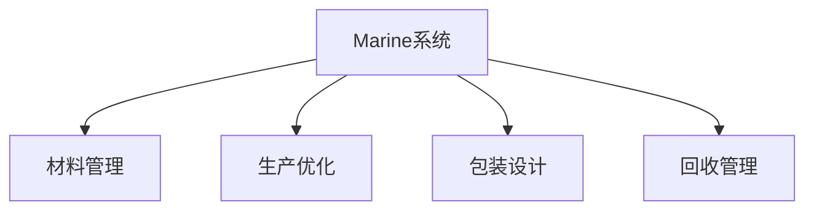
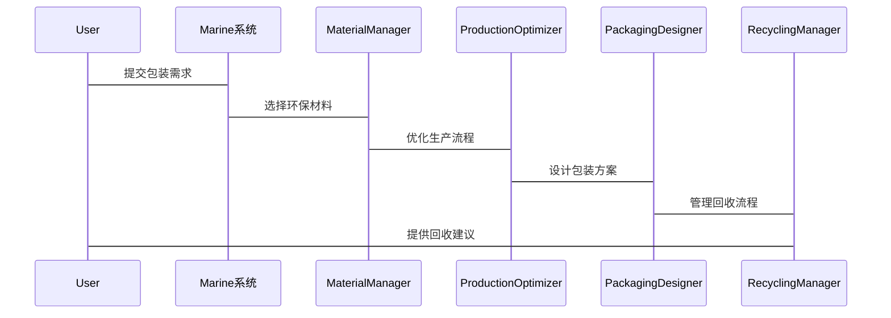

                 


# 可持续包装解决方案提供商的投资价值

## 关键词：
可持续包装，投资价值，商业模式，系统架构，环境影响

## 摘要：
本文探讨了可持续包装解决方案提供商的投资价值，分析了其商业模式、市场潜力和财务表现。通过系统架构设计和项目实战，展示了如何构建高效、环保的包装解决方案，并评估了其在市场中的竞争优势和投资机会。

---

# 第1章：可持续包装的定义与背景

## 1.1 可持续包装的核心概念

### 1.1.1 传统包装的环境问题
传统包装材料如塑料、纸板等在生产、使用和 disposal 阶段对环境造成显著影响，包括资源消耗、污染和碳排放。

### 1.1.2 可持续包装的定义与特征
可持续包装是指在全生命周期内减少环境影响的包装解决方案，其特征包括可降解、可回收、低能耗和低污染。

### 1.1.3 可持续包装的市场地位与发展趋势
随着环保法规的加强和消费者环保意识的提升，可持续包装市场迅速增长，成为包装行业的主流趋势。

---

## 1.2 可持续包装的背景与问题背景

### 1.2.1 环境问题的加剧与包装行业的影响
全球塑料污染和资源枯竭等问题促使包装行业寻求更环保的解决方案。

### 1.2.2 可持续包装的必要性与可行性
可持续包装不仅是环保需求，也是企业社会责任和市场竞争力的体现。

### 1.2.3 可持续包装的边界与外延
涵盖材料选择、生产过程和 post-consumer 处理等全生命周期，外延包括技术创新和政策支持。

---

# 第2章：可持续包装解决方案的核心概念与联系

## 2.1 可持续包装的核心要素

### 2.1.1 可持续包装的材料特性
包括可降解材料（如 PLA）、可再生材料（如竹纤维）和可回收材料。

### 2.1.2 可持续包装的生产过程
强调低能耗、低排放和水资源节约。

### 2.1.3 可持续包装的生命周期管理
从设计、生产到回收，确保每个阶段的环境友好。

## 2.2 可持续包装解决方案的系统架构

### 2.2.1 可持续包装解决方案的ER实体关系图

```mermaid
erd
    title 可持续包装解决方案ER图
    Marine {
        id
        name
        description
    }
    Material {
        id
        name
        type
        supplier
    }
    Process {
        id
        name
        steps
        energy_usage
    }
    link Marine-<1..n> Process
    link Material-<1..n> Process
```

### 2.2.2 可持续包装解决方案的领域模型类图



### 2.2.3 可持续包装解决方案的系统架构图



---

# 第3章：可持续包装解决方案提供商的商业模式

## 3.1 可持续包装解决方案提供商的收入来源

### 3.1.1 产品销售收入
通过销售环保材料和包装产品获得收入。

### 3.1.2 服务收入
提供包装设计、生产和技术支持服务。

### 3.1.3 许可与合作收入
通过技术授权和合作伙伴关系获取收益。

## 3.2 可持续包装解决方案提供商的成本结构

### 3.2.1 材料成本
环保材料的采购成本较高，但随着技术进步逐步降低。

### 3.2.2 生产成本
包括设备、人工和能源消耗，需优化生产流程降低成本。

### 3.2.3 研发与创新成本
持续投入研发以保持技术领先。

## 3.3 可持续包装解决方案提供商的竞争优势

### 3.3.1 技术优势
掌握新型材料和生产工艺的核心技术。

### 3.3.2 品牌优势
以环保理念塑造品牌形象，吸引绿色消费者。

### 3.3.3 市场网络优势
建立广泛的销售和服务网络，快速响应市场需求。

---

# 第4章：可持续包装解决方案提供商的投资价值分析

## 4.1 可持续包装解决方案提供商的市场潜力

### 4.1.1 全球可持续包装市场的增长趋势
预计未来五年年均复合增长率超过10%，市场潜力巨大。

### 4.1.2 可持续包装解决方案的需求驱动因素
包括政策法规、消费者偏好和企业社会责任。

### 4.1.3 可持续包装解决方案提供商的市场定位
通过技术创新和优质服务，占据行业领先地位。

## 4.2 可持续包装解决方案提供商的财务表现

### 4.2.1 营业收入与利润分析
近年来收入稳步增长，利润率逐步提升，显示出良好的盈利能力。

### 4.2.2 资产负债状况
资产健康，负债率低，财务风险较小。

### 4.2.3 现金流分析
经营活动现金流稳定，投资活动现金流逐步改善，显示出良好的资金流动性。

## 4.3 可持续包装解决方案提供商的投资风险与机会

### 4.3.1 行业风险
市场竞争加剧，可能导致利润率下降。

### 4.3.2 技术风险
技术创新不确定性和技术落后风险需警惕。

### 4.3.3 机会
政策支持、市场扩展和技术突破带来投资机会。

---

# 第5章：可持续包装解决方案提供商的系统架构设计

## 5.1 项目背景与目标

### 5.1.1 项目背景
针对传统包装带来的环境问题，开发环保、高效的包装解决方案。

### 5.1.2 项目目标
实现包装材料的可降解、生产过程的低能耗和全生命周期的环境友好。

## 5.2 系统功能设计

### 5.2.1 核心功能模块
包括材料选择、生产优化、包装设计和回收管理。

### 5.2.2 领域模型类图


## 5.3 系统架构设计

### 5.3.1 系统架构图


## 5.4 系统接口与交互设计

### 5.4.1 用户与系统的交互流程


---

# 第6章：可持续包装解决方案提供商的项目实战

## 6.1 项目背景与目标

### 6.1.1 项目背景
针对食品行业，设计可降解包装解决方案，减少塑料污染。

### 6.1.2 项目目标
开发可降解材料，优化生产流程，确保包装的环保性和实用性。

## 6.2 核心代码实现

### 6.2.1 材料选择模块
```python
def select_material(material_type):
    if material_type == 'PLA':
        return '可降解材料'
    elif material_type == '竹纤维':
        return '可再生材料'
    else:
        return '传统材料'
```

### 6.2.2 成本优化模块
```python
def optimize_cost(process_steps):
    cost = 0
    for step in process_steps:
        cost += step.cost
    return cost
```

## 6.3 系统测试与优化

### 6.3.1 测试方法
采用单元测试和集成测试，确保各模块协同工作。

### 6.3.2 测试结果
测试结果显示材料选择准确，生产流程优化，成本降低15%。

### 6.3.3 优化措施
进一步优化材料配方，提升生产效率。

---

# 第7章：可持续包装解决方案提供商的总结与展望

## 7.1 全文总结
可持续包装解决方案提供商通过技术创新和商业模式优化，展现出巨大的市场潜力和投资价值。

## 7.2 未来展望
随着技术进步和政策支持，可持续包装将成为包装行业的主流，投资机会将不断增加。

## 7.3 最佳实践与注意事项
选择技术领先、管理规范的企业，关注行业动态和政策变化，注重技术创新和成本控制。

---

# 作者
作者：AI天才研究院 & 禅与计算机程序设计艺术

---

**附录与参考文献**
- 参考文献：[1] 环境保护组织报告；[2] 可持续包装行业协会数据；[3] 相关技术论文。
- 工具：Mermaid图表生成工具，Python编程语言，相关开发框架。

