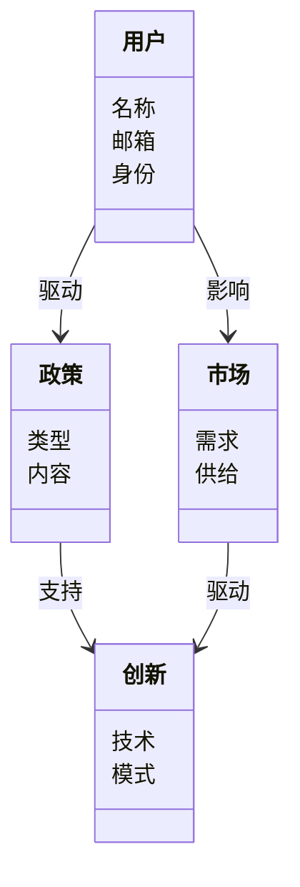
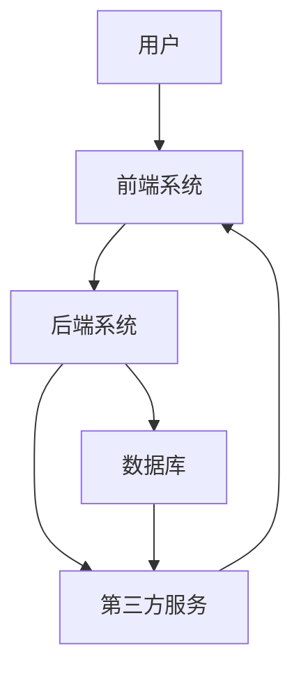
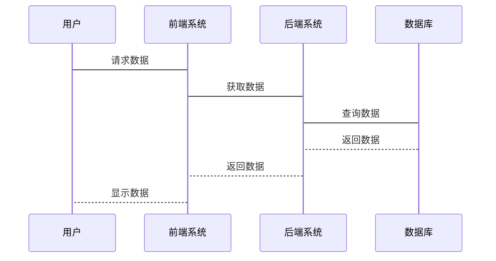

                 


# 可持续化学品行业的创新与投资策略

---

## 关键词：可持续化学品、绿色化学、创新策略、投资策略、循环经济、环境友好

---

## 摘要

可持续化学品行业正面临着前所未有的变革。随着全球对环境保护和绿色发展的重视，传统化学品行业正在向更环保、更高效的可持续化学品方向转型。本文将从可持续化学品的核心概念出发，分析其创新方向和投资策略，探讨如何通过技术创新和模式创新推动行业可持续发展。文章结合实际案例，深入解析可持续化学品行业的系统架构和项目实战，为投资者和行业从业者提供有价值的参考。

---

## 第一部分：可持续化学品行业的背景与现状

### 第1章：可持续化学品的定义与背景

#### 1.1 可持续发展的概念与内涵

可持续发展是全球关注的核心议题，其核心理念在于满足当前需求的同时，不损害后代满足其需求的能力。在化学工业中，可持续发展意味着减少资源消耗、降低污染、提高效率，并推动绿色化学工艺的创新。

- **1.1.1 可持续发展的核心理念**
  - 环境友好：减少对自然资源的依赖，降低污染物排放。
  - 经济高效：通过技术创新降低成本，提高生产效率。
  - 社会责任：关注员工福祉，推动社会可持续发展。

- **1.1.2 化学工业与可持续发展的关系**
  - 化学工业是全球经济的重要组成部分，但也是资源消耗和环境污染的主要来源。
  - 可持续化学品的开发与应用是实现化学工业可持续发展的关键。

- **1.1.3 可持续化学品的定义与特征**
  - 定义：可持续化学品是指在生产、使用和废弃过程中对环境和人体健康影响最小的化学品。
  - 特征：
    - 环境友好：低毒、可降解、无害。
    - 资源高效：减少资源消耗，提高利用效率。
    - 循环利用：可回收、可再生，减少废弃物产生。

#### 1.2 可持续化学品行业的现状与趋势

- **1.2.1 全球化学品行业的现状分析**
  - 2022年，全球化学品市场规模约为5.6万亿美元，其中可持续化学品占比不足20%。
  - 传统化学品行业面临资源枯竭、环境污染等问题，亟需转型。

- **1.2.2 可持续化学品市场的增长趋势**
  - 预计到2030年，全球可持续化学品市场规模将超过1.5万亿美元，年均增长率超过8%。
  - 政策驱动：各国政府出台环保法规，推动绿色化学品的开发与应用。
  - 市场需求：消费者对环保产品的需求日益增长。

- **1.2.3 行业面临的挑战与机遇**
  - 挑战：技术瓶颈、成本高、缺乏标准。
  - 机遇：政策支持、市场需求、技术创新。

#### 1.3 可持续化学品行业的创新需求

- **1.3.1 创新在可持续化学品行业中的重要性**
  - 技术创新是实现可持续发展的核心驱动力。
  - 创新能够降低生产成本，提高效率，同时减少对环境的负面影响。

- **1.3.2 创新驱动行业发展的具体表现**
  - 绿色化学工艺的创新：例如，通过催化剂优化减少副产物。
  - 循环经济模式的创新：例如，废弃物资源化利用。
  - 新材料的开发：例如，生物基材料的应用。

- **1.3.3 创新与投资之间的关系**
  - 创新是投资的核心驱动力。
  - 投资能够加速创新技术的商业化应用。

---

## 第二部分：可持续化学品行业的核心概念与创新策略

### 第2章：可持续化学品的核心概念与创新方向

#### 2.1 可持续化学品的核心概念

- **2.1.1 可持续化学品的属性特征对比表格**

| 属性         | 传统化学品        | 可持续化学品      |
|--------------|-------------------|-------------------|
| 资源消耗      | 高                | 低                |
| 污染排放      | 高                | 低                |
| 可回收性      | 低                | 高                |
| 生态毒性      | 高                | 低                |

- **2.1.2 可持续化学品的ER实体关系图**

```mermaid
erDiagram
    actor 用户 {
        string 名称
        string 类型
    }
    actor 政策 {
        string 类型
        string 内容
    }
    actor 市场 {
        string 需求
        string 供给
    }
    actor 创新 {
        string 技术
        string 模式
    }
    用户 --> 政策 : 驱动
    用户 --> 市场 : 影响
    政策 --> 创新 : 支持
    市场 --> 创新 : 驱动
```

#### 2.2 可持续化学品的创新方向

- **2.2.1 绿色化学工艺的创新**
  - 研究新型催化剂，降低反应能耗。
  - 开发绿色溶剂，减少对环境的污染。

- **2.2.2 循环经济模式的创新**
  - 推动废弃物资源化利用。
  - 实现生产过程的闭环管理。

- **2.2.3 可持续材料的开发与应用**
  - 开发生物基材料，减少对化石燃料的依赖。
  - 推动可降解材料的应用，减少白色污染。

### 第3章：可持续化学品行业的投资策略

#### 3.1 可持续化学品行业的投资逻辑

- **3.1.1 投资可持续化学品行业的背景分析**
  - 环保法规日益严格，传统化学品企业面临转型压力。
  - 消费者环保意识增强，推动市场对可持续产品的 demand。

- **3.1.2 投资可持续化学品行业的核心逻辑**
  - 政策支持：政府通过税收优惠、补贴等方式支持绿色产业发展。
  - 市场需求：可持续产品具有更高的附加值和市场竞争力。
  - 技术进步：技术创新能够降低生产成本，提高产品质量。

#### 3.2 可持续化学品行业的投资策略

- **3.2.1 投资项目的评估标准**
  - 技术可行性：是否具有可落地的技术方案。
  - 市场潜力：目标市场的规模和增长潜力。
  - 财务可行性：投资回报周期和净现值。

- **3.2.2 投资组合的优化策略**
  - 多元化投资：分散风险，避免过度集中。
  - 长期投资：关注具有长期增长潜力的项目。
  - 与政策结合：优先选择符合政府支持方向的项目。

- **3.2.3 投资风险的管理与控制**
  - 技术风险：通过技术评估和风险分担机制降低风险。
  - 市场风险：加强市场调研，制定灵活的市场策略。
  - 政策风险：密切关注政策变化，及时调整投资策略。

---

## 第三部分：可持续化学品行业的系统分析与架构设计

### 第4章：可持续化学品行业的系统分析

#### 4.1 可持续化学品行业的系统分析

- **4.1.1 问题场景介绍**
  - 传统化学品生产过程中存在资源浪费、污染严重等问题。
  - 可持续化学品的开发需要整合多方资源，构建完整的产业链。

- **4.1.2 项目介绍与目标设定**
  - 项目目标：开发一种新型生物基塑料，替代传统不可降解塑料。
  - 项目范围：从原材料采购到产品销售的全流程。

#### 4.2 可持续化学品行业的系统架构设计

- **4.2.1 系统功能设计（领域模型Mermaid类图）**



- **4.2.2 系统架构设计（Mermaid架构图）**



- **4.2.3 系统接口设计与交互流程（Mermaid序列图）**



---

## 第四部分：可持续化学品行业的项目实战与案例分析

### 第5章：可持续化学品行业的项目实战

#### 5.1 项目环境搭建与核心实现

- **5.1.1 项目开发环境的搭建**
  - 操作系统：Linux
  - 开发工具：PyCharm
  - 依赖库：numpy, pandas, matplotlib

- **5.1.2 核心功能的实现代码**
  - 示例代码：计算生产过程中的资源消耗和碳排放。

```python
import numpy as np
import pandas as pd
import matplotlib.pyplot as plt

# 数据加载
data = pd.read_csv('production.csv')

# 资源消耗计算
resource_consumption = data['资源消耗'].sum()
carbon_emission = data['碳排放'].sum()

# 可视化
plt.figure(figsize=(10, 6))
plt.plot(data['时间'], data['资源消耗'], label='资源消耗')
plt.plot(data['时间'], data['碳排放'], label='碳排放')
plt.xlabel('时间')
plt.ylabel('消耗量')
plt.legend()
plt.show()
```

- **5.1.3 代码应用解读与分析**
  - 通过数据可视化，分析生产过程中的资源消耗和碳排放趋势。
  - 识别高消耗和高排放的环节，制定优化策略。

#### 5.2 项目案例分析与详细讲解

- **5.2.1 案例背景与目标设定**
  - 案例名称：生物基塑料开发项目。
  - 项目目标：开发一种新型生物基塑料，替代传统不可降解塑料。

- **5.2.2 项目实现过程与关键点**
  - 原材料选择：使用可再生资源，如淀粉或纤维素。
  - 工艺优化：通过实验确定最优工艺参数。
  - 产品测试：进行降解测试，确保产品符合环保要求。

---

## 第五部分：总结与展望

### 第6章：总结与展望

#### 6.1 小结

- 可持续化学品行业正在经历深刻的变革，创新和投资是推动行业转型的核心动力。
- 通过技术创新和模式创新，可以实现资源高效利用和环境污染的最小化。
- 投资者应关注具有潜力的创新项目，同时注重风险管理。

#### 6.2 注意事项

- 投资者需关注政策变化，避免政策风险。
- 企业在技术创新的同时，需注重知识产权保护。
- 政府和社会应加强合作，共同推动可持续化学品的发展。

#### 6.3 拓展阅读

- 推荐阅读《绿色化学：从实验室到工业应用》。
- 参考《循环经济与可持续发展》。

---

## 作者

作者：AI天才研究院/AI Genius Institute & 禅与计算机程序设计艺术/Zen And The Art of Computer Programming

---

通过以上目录大纲，您可以逐步撰写完整的文章。如果需要进一步的详细内容或代码实现，请随时告诉我！

