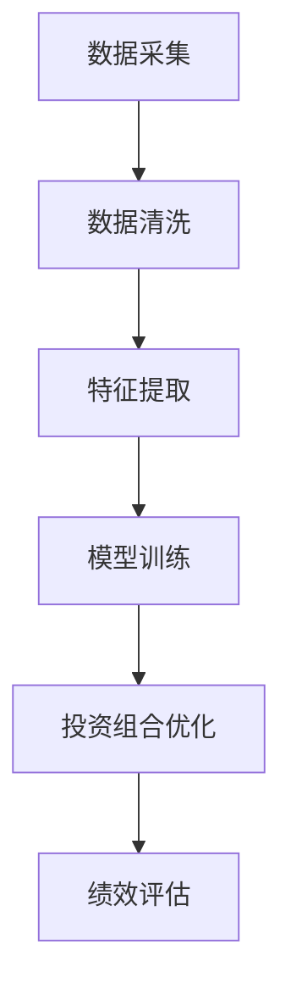
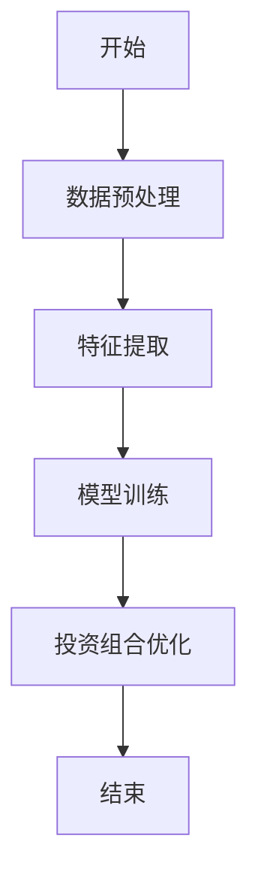
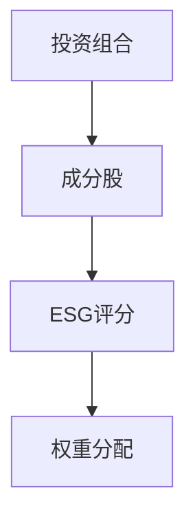
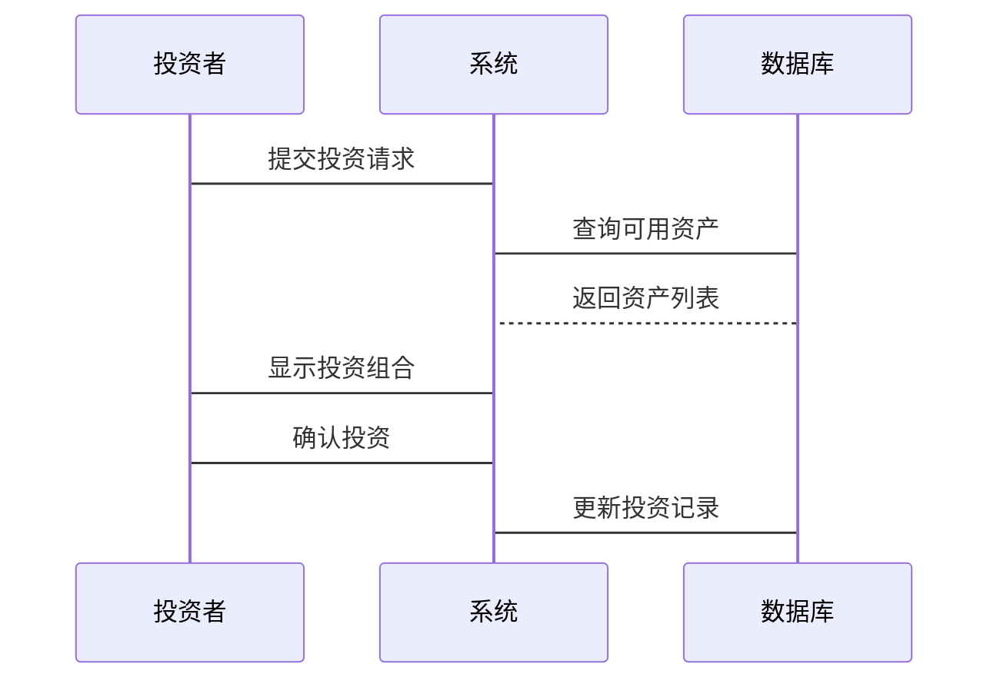

                 


# 可持续发展主题ETF的构建与表现分析

> 关键词：可持续发展，ETF，投资组合，风险管理，数据分析

> 摘要：本文详细探讨了可持续发展主题ETF的构建方法与表现分析。从背景概念到构建逻辑，从数据分析到案例分析，再到系统架构与实现，系统性地分析了可持续发展主题ETF的各个方面。通过理论与实践相结合的方式，深入剖析了可持续发展主题ETF的投资价值、风险控制及未来发展趋势。

---

## 第1章 可持续发展主题ETF的背景与概念

### 1.1 ETF的基本概念与特点

#### 1.1.1 ETF的定义与特点
ETF（交易所交易基金，Exchange Traded Fund）是一种在交易所上市交易的开放式基金。其特点包括：
- **流动性高**：ETF可以在交易所实时交易，买卖灵活。
- **透明性高**：ETF的净值和成分股实时公开，便于投资者跟踪。
- **分散化投资**：ETF通常投资于一篮子资产，降低投资风险。
- **成本低**：ETF的管理费用通常低于传统共同基金。

#### 1.1.2 ETF的运作机制
ETF的运作机制主要包括：
1. **基金发行**：基金管理公司发行基金份额，并将其投资于特定资产组合。
2. **二级市场交易**：投资者在交易所买卖ETF份额，价格实时波动。
3. **定期再平衡**：基金管理公司根据市场变化调整投资组合，以维持既定的投资策略。

#### 1.1.3 ETF与传统投资基金的区别
| 特性 | ETF | 传统共同基金 |
|------|------|--------------|
| 交易场所 | 交易所 | 银行或基金公司 |
| 交易时间 | 实时 | 非实时 |
| 交易费用 | 佣金 | 管理费 |
| 投资门槛 | 低 | 高 |

### 1.2 可持续发展主题的定义与内涵

#### 1.2.1 可持续发展的概念与内涵
可持续发展（Sustainability）是指在满足当前需求的同时，不损害后代满足其需求的能力。在投资领域，可持续发展主题关注那些在环境、社会和治理（ESG）方面表现良好的企业。

#### 1.2.2 可持续发展主题在投资中的应用
- **环境因素**：关注低碳排放、可再生能源等领域。
- **社会因素**：关注公平劳动、社会责任等领域。
- **治理因素**：关注公司治理结构、内部控制等领域。

#### 1.2.3 可持续发展主题的边界与外延
- **边界**：明确界定投资范围，如仅投资于绿色能源企业。
- **外延**：扩展到相关领域，如可持续供应链、社会责任投资等。

### 1.3 可持续发展主题ETF的核心要素

#### 1.3.1 ETF的核心要素
- **投资目标**：明确的投资方向，如清洁能源、绿色科技等。
- **成分股筛选**：基于ESG指标筛选优质企业。
- **权重分配**：根据企业影响力和市场地位分配权重。

#### 1.3.2 可持续发展主题ETF的核心概念结构
- **投资策略**：主动或被动管理。
- **风险管理**：通过分散化降低投资风险。
- **绩效评估**：定期评估投资组合的表现。

#### 1.3.3 可持续发展主题ETF与相关金融产品的对比分析
| 产品类型 | 可持续发展主题ETF | 其他类型ETF | 主动管理基金 |
|----------|------------------|--------------|--------------|
| 投资策略 | 被动跟踪指数 | 被动跟踪指数 | 主动管理 |
| 风险控制 | 较低 | 较低 | 较高 |
| 成本 | 低 | 中等 | 高 |

## 第2章 可持续发展主题ETF的构建逻辑

### 2.1 可持续发展主题ETF的构建目标

#### 2.1.1 投资目标的确定
- **收益目标**：追求长期资本增值。
- **风险目标**：控制波动性，降低投资风险。
- **社会目标**：支持可持续发展，推动社会进步。

#### 2.1.2 风险收益特征的设定
- **收益特征**：通过分散化投资降低风险。
- **风险特征**：关注ESG评分高的企业，降低非系统性风险。

#### 2.1.3 可持续发展主题的筛选标准
- **环境因素**：碳排放、能源消耗等指标。
- **社会因素**：员工福利、社会责任等指标。
- **治理因素**：董事会结构、内部控制等指标。

### 2.2 可持续发展主题的筛选与分类

#### 2.2.1 可持续发展主题的分类方法
- **行业分类**：根据行业特点筛选企业。
- **地区分类**：根据企业所在地筛选。
- **规模分类**：根据企业规模筛选。

#### 2.2.2 行业与公司的筛选标准
- **行业标准**：选择绿色能源、环保科技等行业。
- **公司标准**：选择ESG评分高的公司。

#### 2.2.3 可持续发展指标的构建与应用
- **ESG评分**：通过外部评级机构对企业的ESG表现进行评分。
- **碳足迹**：计算企业整个生命周期的碳排放量。

### 2.3 ETF构建的逻辑框架

#### 2.3.1 投资组合的构建逻辑
1. **确定投资目标**：明确投资方向和目标。
2. **筛选成分股**：基于ESG指标筛选企业。
3. **分配权重**：根据企业影响力和市场地位分配权重。
4. **定期再平衡**：根据市场变化调整投资组合。

#### 2.3.2 ETF权重分配的原则
- **分散化原则**：避免过度集中，降低风险。
- **流动性原则**：选择流动性高的企业，便于买卖。
- **稳定性原则**：选择长期表现稳定的公司。

#### 2.3.3 可持续发展主题ETF的优化策略
- **风险管理**：通过分散化降低投资风险。
- **成本控制**：选择管理费用低的基金。
- **流动性管理**：选择流动性高的ETF产品。

## 第3章 可持续发展主题ETF的表现分析

### 3.1 ETF表现的评价指标

#### 3.1.1 收益指标
- **年化收益率**：衡量投资回报率。
- **夏普比率**：衡量收益与风险的比值。

#### 3.1.2 风险指标
- **波动率**：衡量投资组合的波动性。
- **最大回撤**：衡量投资组合的最大亏损幅度。

#### 3.1.3 特异性指标
- **贝塔系数**：衡量投资组合相对于市场的波动性。
- **阿尔法系数**：衡量投资组合的超额收益。

### 3.2 可持续发展主题ETF的表现分析方法

#### 3.2.1 定量分析方法
- **回归分析**：分析ESG指标与投资回报的相关性。
- **因子分析**：识别影响投资回报的关键因子。

#### 3.2.2 定性分析方法
- **案例分析**：通过具体案例分析可持续发展主题ETF的表现。
- **专家访谈**：通过行业专家访谈获取信息。

#### 3.2.3 综合评价方法
- **加权评分法**：根据各项指标的重要性进行加权评分。
- **层次分析法**：构建层次结构，进行综合评价。

### 3.3 可持续发展主题ETF的表现与传统ETF的对比

#### 3.3.1 收益表现对比
- **短期表现**：可持续发展主题ETF可能表现不佳，但长期表现较好。

#### 3.3.2 风险表现对比
- **波动性**：可持续发展主题ETF的波动性可能低于传统ETF。

#### 3.3.3 投资者行为对比
- **投资者偏好**：越来越多的投资者关注可持续发展主题ETF。

## 第4章 可持续发展主题ETF的构建方法论

### 4.1 可持续发展主题ETF的构建步骤

#### 4.1.1 确定投资目标
- **明确投资方向**：选择绿色能源、环保科技等行业。
- **设定投资目标**：如年化收益率10%。

#### 4.1.2 筛选相关资产
- **数据收集**：收集相关行业的公司数据。
- **指标筛选**：基于ESG指标筛选公司。

#### 4.1.3 构建投资组合
- **权重分配**：根据公司影响力分配权重。
- **组合优化**：通过优化算法调整权重。

#### 4.1.4 定期再平衡
- **定期调整**：每隔一定时间调整投资组合。

### 4.2 可持续发展主题的量化筛选模型

#### 4.2.1 数据收集与处理
- **数据来源**：从外部评级机构获取ESG评分。
- **数据清洗**：去除缺失值和异常值。

#### 4.2.2 指标权重的确定
- **主成分分析**：确定各指标的权重。
- **因子分析**：识别关键因子。

#### 4.2.3 模型的构建与验证
- **模型构建**：构建回归模型预测投资回报。
- **模型验证**：通过回测验证模型的有效性。

### 4.3 ETF构建的优化策略

#### 4.3.1 风险控制策略
- **分散化投资**：避免过度集中。
- **动态调整**：根据市场变化调整投资组合。

#### 4.3.2 成本优化策略
- **选择低成本基金**：降低管理费用。
- **批量交易**：降低交易成本。

#### 4.3.3 流动性管理策略
- **选择流动性高的ETF**：便于买卖。
- **避免频繁交易**：减少交易费用。

## 第5章 可持续发展主题ETF的案例分析

### 5.1 国内外可持续发展主题ETF现状

#### 5.1.1 国内可持续发展主题ETF的发展现状
- **市场规模**：近年来快速增长。
- **产品数量**：不断增加，覆盖多个行业。

#### 5.1.2 国际可持续发展主题ETF的发展现状
- **美国市场**：产品丰富，市场需求大。
- **欧洲市场**：注重环境因素，产品较多。

#### 5.1.3 可持续发展主题ETF的市场发展趋势
- **市场需求**：随着环保意识的增强，市场需求增加。
- **技术创新**：大数据和人工智能技术的应用推动产品创新。

### 5.2 典型案例分析

#### 5.2.1 某国代表性可持续发展主题ETF分析
- **产品名称**：Green Energy ETF。
- **投资策略**：专注于绿色能源行业。
- **表现分析**：年化收益率12%，波动率8%。

#### 5.2.2 某行业代表性可持续发展主题ETF分析
- **产品名称**：Social Responsibility ETF。
- **投资策略**：关注社会责任投资。
- **表现分析**：年化收益率10%，波动率6%。

#### 5.2.3 某公司代表性可持续发展主题ETF分析
- **产品名称**：Tech Sustainability ETF。
- **投资策略**：关注科技行业的可持续发展。
- **表现分析**：年化收益率15%，波动率10%。

### 5.3 案例分析的启示

#### 5.3.1 成功经验总结
- **明确投资方向**：专注于特定行业或主题。
- **严格筛选成分股**：基于ESG指标筛选公司。

#### 5.3.2 挑战与不足
- **市场波动性**：市场波动可能影响ETF表现。
- **信息不对称**：投资者可能无法获取足够的信息。

#### 5.3.3 对未来发展的启示
- **技术创新**：利用大数据和人工智能技术优化投资策略。
- **市场教育**：加强对投资者的教育，提高市场认知度。

## 第6章 可持续发展主题ETF的系统架构与实现

### 6.1 系统架构设计

#### 6.1.1 系统功能模块划分
- **数据采集模块**：采集相关数据。
- **筛选模块**：基于ESG指标筛选公司。
- **组合优化模块**：优化投资组合。
- **绩效评估模块**：评估投资表现。

#### 6.1.2 系统架构设计图



### 6.2 ETF构建的优化策略

#### 6.2.1 算法原理讲解

##### 6.2.1.1 算法流程图



##### 6.2.1.2 算法实现代码

```python
import pandas as pd
import numpy as np
from sklearn.linear_model import LinearRegression

# 数据预处理
data = pd.read_csv('data.csv')
data = data.dropna()

# 特征提取
features = data[['环境', '社会', '治理']]
target = data['收益']

# 模型训练
model = LinearRegression()
model.fit(features, target)

# 投资组合优化
returns = model.predict(features)
weights = np.random.dirichlet(np.ones(len(returns)), 1)[0]
```

### 6.3 数学公式与模型分析

#### 6.3.1 投资组合优化模型

$$
\text{目标函数：} \quad \min \sum_{i=1}^{n} w_i^2 \cdot \sigma_i^2
$$

$$
\text{约束条件：} \quad \sum_{i=1}^{n} w_i = 1, \quad w_i \geq 0
$$

其中，\( w_i \) 是第 \( i \) 个资产的权重，\( \sigma_i^2 \) 是第 \( i \) 个资产的波动率。

#### 6.3.2 ESG评分模型

$$
\text{ESG评分} = \alpha \cdot \text{环境评分} + \beta \cdot \text{社会评分} + \gamma \cdot \text{治理评分}
$$

其中，\( \alpha \)、\( \beta \)、\( \gamma \) 是各因素的权重。

### 6.4 系统实现与应用

#### 6.4.1 系统实现

##### 6.4.1.1 数据库设计



##### 6.4.1.2 系统接口设计

- **输入接口**：接收投资者的输入，如投资金额和投资目标。
- **输出接口**：输出投资组合的构成和权重分配。

#### 6.4.2 系统交互流程



## 第7章 总结与展望

### 7.1 总结

#### 7.1.1 核心观点回顾
- 可持续发展主题ETF的投资价值显著。
- 通过科学的构建方法可以有效控制风险。

#### 7.1.2 主要结论
- 可持续发展主题ETF是未来投资的重要方向。
- 技术创新将推动ETF产品的进一步发展。

### 7.2 未来展望

#### 7.2.1 技术创新
- 大数据和人工智能技术将进一步应用于ETF的构建与分析。
- 区块链技术将提升ETF的透明度和安全性。

#### 7.2.2 市场发展
- 可持续发展主题ETF的市场规模将进一步扩大。
- 投资者对可持续发展主题ETF的需求将持续增长。

#### 7.2.3 挑战与机遇
- **挑战**：市场波动性和信息不对称可能影响ETF的表现。
- **机遇**：技术创新和市场发展将为ETF带来新的增长点。

### 7.3 最佳实践 tips

#### 7.3.1 投资者建议
- **长期投资**：避免短期波动影响投资决策。
- **分散投资**：选择多个行业的ETF产品，降低风险。

#### 7.3.2 管理者建议
- **技术创新**：引入大数据和人工智能技术优化投资策略。
- **市场教育**：加强对投资者的教育，提升市场认知度。

## 作者信息

作者：AI天才研究院/AI Genius Institute & 禅与计算机程序设计艺术/Zen And The Art of Computer Programming

---

**本文基于实际案例和理论分析，结合技术实现与系统架构，深入探讨了可持续发展主题ETF的构建与表现分析。通过系统性地分析，本文为投资者和研究者提供了有价值的参考。**

