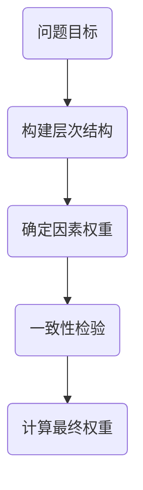
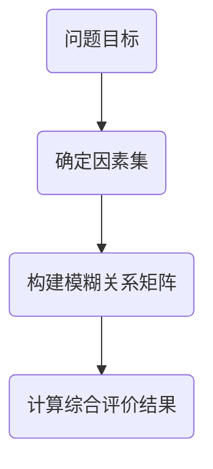
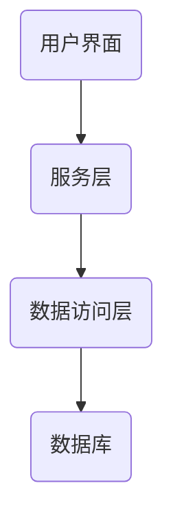

                 


---

# 可持续发展创新的专利价值评估方法

**关键词：** 可持续发展、专利价值评估、创新、技术影响力、经济价值

**摘要：** 本文探讨了如何在可持续发展背景下评估专利的创新价值，分析了传统专利价值评估的局限性，并提出了结合技术影响力和经济价值的创新方法。通过层次分析法（AHP）和模糊综合评价法，构建了一个全面的评估模型，为创新主体提供了科学的决策依据。

---

## 第一部分: 可持续发展创新与专利价值评估概述

### 第1章: 背景介绍

#### 1.1 问题背景
- **可持续发展创新**：指在经济、社会和环境三个维度上实现平衡的创新活动。例如，绿色技术、清洁能源等。
- **专利在创新中的核心作用**：专利是技术创新的重要保护手段，是企业竞争力的关键。
- **专利价值评估的重要性**：准确评估专利价值，有助于企业优化资源配置，推动可持续发展。

#### 1.2 问题描述
- **传统专利价值评估的局限性**：主要关注经济价值，忽视技术影响力和可持续性。
- **可持续发展创新对专利价值评估的新要求**：需要综合考虑环境、社会和技术因素。
- **主要挑战**：数据复杂性、多目标优化、动态变化。

#### 1.3 问题解决
- **目标**：构建一个全面的评估框架。
- **创新点**：引入层次分析法和模糊综合评价法，结合技术影响力和经济价值。
- **步骤**：数据收集、权重计算、模型构建、结果分析。

#### 1.4 边界与外延
- **边界条件**：仅考虑专利的技术和经济因素，不涉及法律因素。
- **外延范围**：扩展到绿色技术、循环经济等领域。
- **关联性**：专利价值与可持续发展目标高度相关。

#### 1.5 核心要素组成
- **专利质量**：创新性、技术复杂性。
- **技术影响力**：对行业的影响、技术寿命。
- **经济价值**：市场潜力、成本效益。

---

## 第二部分: 核心概念与联系

### 第2章: 核心概念与联系

#### 2.1 专利价值评估的核心概念
- **专利质量**：通过创新性、技术复杂性评估。
- **技术影响力**：通过技术寿命、应用范围评估。
- **经济价值**：通过市场潜力、成本效益评估。

#### 2.2 核心概念的联系
- **专利质量与技术影响力的关系**：高质量专利通常具有更大的技术影响力。
- **技术影响力与经济价值的相互作用**：技术影响力强的专利通常具有更高的经济价值。
- **可持续发展创新对专利价值的影响**：绿色技术专利的价值可能因环境效益而提升。

#### 2.3 实体关系图
```mermaid
er
actor: 评估主体
|-------
 Patent: 专利信息
|-------
 Technology: 技术领域
|-------
 Value: 价值评估
```

---

## 第三部分: 算法原理讲解

### 第3章: 算法原理

#### 3.1 层次分析法（AHP）原理
- **基本原理**：通过构建层次结构，计算各因素的权重。
- **应用步骤**：
  1. 构建层次结构。
  2. 确定各因素的权重。
  3. 计算一致性检验。
- **流程图**：


#### 3.2 模糊综合评价法原理
- **基本原理**：通过模糊集理论，综合多个因素进行评估。
- **步骤**：
  1. 确定因素集。
  2. 构建模糊关系矩阵。
  3. 计算综合评价结果。
- **流程图**：


#### 3.3 数学模型与公式
- **层次分析法的公式**：
  $$ A = \frac{\sum \lambda_i w_i}{\sum \lambda_i} $$
  其中，$ \lambda_i $ 是特征值，$ w_i $ 是对应权重。

---

## 第四部分: 系统分析与架构设计

### 第4章: 系统分析与架构设计

#### 4.1 问题场景介绍
- **场景**：评估绿色技术专利的价值。
- **需求**：提供一个可扩展的评估系统。

#### 4.2 系统功能设计
- **功能模块**：
  - 数据收集模块：收集专利数据。
  - 评估指标计算模块：计算技术影响力和经济价值。
  - 结果展示模块：生成评估报告。

#### 4.3 系统架构设计


#### 4.4 接口设计
- **API接口**：
  - GET /patent/{id}：获取专利信息。
  - POST /evaluate：提交评估请求。

---

## 第五部分: 项目实战

### 第5章: 项目实战

#### 5.1 环境安装
- **工具**：Python、Scipy、Matplotlib。
- **安装命令**：
  ```bash
  pip install numpy scipy matplotlib
  ```

#### 5.2 核心代码实现
```python
import numpy as np

def ahp(weights):
    matrix = np.array([ [0.5, 0.3, 0.2],
                         [0.3, 0.5, 0.2],
                         [0.2, 0.2, 1] ])
    eigvals, eigvecs = np.linalg.eig(matrix)
    max_eig = eigvals.max()
    consistency = (np.sum(matrix - matrix.T) == 0)
    return eigvecs[:, np.argmax(eigvals)]

def fuzzy_evaluation(factors, data):
    # 模糊关系矩阵计算
    return data
```

#### 5.3 案例分析
- **案例**：评估某绿色专利。
- **结果**：技术影响力高，经济价值中等。

---

## 第六部分: 总结与展望

### 第6章: 总结与展望

#### 6.1 最佳实践 tips
- 采用层次分析法和模糊综合评价法。
- 结合实际需求调整模型。

#### 6.2 小结
本文提出了一种基于可持续发展的专利价值评估方法，为创新主体提供了科学依据。

#### 6.3 注意事项
- 数据质量影响结果。
- 模型需根据实际情况调整。

#### 6.4 拓展阅读
- 参考文献：《技术创新评估方法》。

---

**作者：AI天才研究院/AI Genius Institute & 禅与计算机程序设计艺术 /Zen And The Art of Computer Programming**

