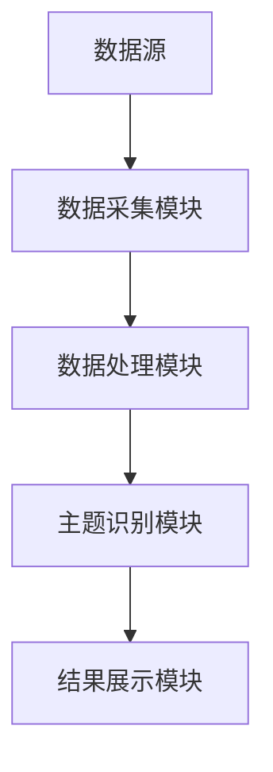
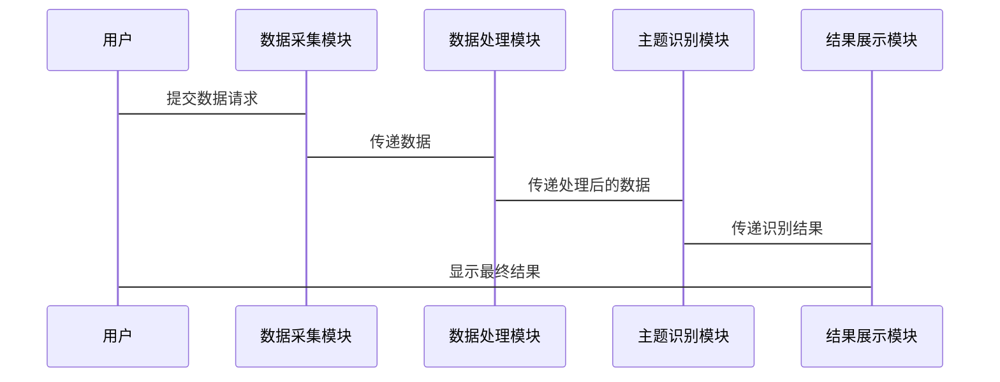

                 


# 可持续发展目标（SDGs）与投资主题识别

> 关键词：可持续发展目标, 投资主题识别, ESG投资, 可持续投资, 数据挖掘

> 摘要：  
本文深入探讨了可持续发展目标（SDGs）与投资主题识别之间的关系，分析了如何通过技术手段将SDGs的核心理念与投资主题识别相结合。文章从SDGs的核心概念出发，详细阐述了投资主题识别的背景、原理和方法，结合实际案例，展示了如何通过数据挖掘、机器学习等技术手段，识别符合SDGs的投资主题。此外，本文还提出了基于SDGs的投资主题识别系统架构，并给出了具体的实现方案和最佳实践。

---

# 第一部分: 可持续发展目标（SDGs）与投资主题识别背景介绍

## 第1章: 可持续发展目标（SDGs）概述

### 1.1 SDGs的核心概念

#### 1.1.1 SDGs的定义与目标
可持续发展目标（Sustainable Development Goals, SDGs）是联合国在2015年通过的17个全球性目标，旨在指导全球在2030年前实现消除贫困、保护地球、促进繁荣等方面的可持续发展。SDGs的目标涵盖了经济、社会和环境三个维度，具体包括消除贫困、消除饥饿、良好健康与福祉、优质教育、性别平等、清洁水与卫生设施、清洁能源、体面工作与经济增长、工业创新与基础设施、减少不平等、和平、正义与强国家机构、促进目标的手段。

#### 1.1.2 SDGs的17个具体目标
SDGs的17个具体目标如下：
1. 消除贫困
2. 消除饥饿
3. 良好健康与福祉
4. 优质教育
5. 性别平等
6. 清洁水与卫生设施
7. 清洁能源
8. 体面工作与经济增长
9. 工业创新与基础设施
10. 减少不平等
11. 平等与包容的城市
12. 永续的消费与生产
13. �气变行动
14. 水下生物
15. 陆地生物
16. 和平、正义与强国家机构
17. 促进目标的手段。

#### 1.1.3 SDGs的实施框架与原则
SDGs的实施框架强调多方利益相关者的参与，包括政府、企业、非政府组织、学术机构和公众。SDGs的核心原则包括：
- 整体性：经济、社会和环境目标的协同推进。
- 普遍性：适用于所有国家。
- 公正性：关注最弱势群体。
- 可衡量性：目标和指标可测量。

---

### 1.2 投资主题识别的背景与意义

#### 1.2.1 投资主题识别的基本概念
投资主题识别是指通过分析市场数据、行业趋势和社会需求，识别出具有投资价值的主题或领域。这些主题通常具有较高的增长潜力、较大的市场规模或符合社会发展的趋势。

#### 1.2.2 可持续投资与ESG理念的关联
可持续投资强调将环境（Environmental）、社会（Social）和治理（Governance）因素（ESG）纳入投资决策。SDGs与ESG理念高度契合，SDGs的17个目标可以被视为企业履行ESG责任的具体体现。

#### 1.2.3 SDGs与投资主题识别的结合
SDGs为投资主题识别提供了明确的方向和框架。投资者可以通过分析企业是否符合SDGs的相关目标，识别出具有可持续发展价值的投资主题。

---

## 第2章: SDGs与投资主题识别的关联性分析

### 2.1 SDGs对投资主题的影响

#### 2.1.1 SDGs如何影响企业投资决策
SDGs为企业的投资决策提供了指导。例如，企业可以通过投资清洁能源、可持续农业等领域，满足SDGs的相关目标，同时提升企业的社会形象和竞争力。

#### 2.1.2 SDGs对投资主题的筛选与优化作用
SDGs为投资主题的筛选提供了明确的筛选标准。例如，投资者可以通过筛选符合清洁能源、性别平等等SDGs目标的企业，优化投资组合。

#### 2.1.3 SDGs与投资回报的关系
研究表明，符合SDGs的投资主题通常具有较高的长期回报。这是因为这些主题通常具有较高的市场需求和社会认可度。

---

### 2.2 投资主题识别的核心要素

#### 2.2.1 数据来源与特征提取
投资主题识别需要依赖多源数据，包括企业财务数据、ESG评级数据、行业趋势数据等。特征提取是关键步骤，例如提取企业的碳排放强度、员工多样性指数等。

#### 2.2.2 投资主题的分类与标签化
投资主题需要进行分类和标签化，例如将清洁能源主题归类为“可再生能源”或“绿色能源”。

#### 2.2.3 投资主题的动态变化与更新
投资主题并非一成不变，需要根据市场变化和社会发展趋势进行动态调整。例如，随着技术进步，绿色科技可能成为新的投资主题。

---

# 第二部分: SDGs与投资主题识别的核心概念与联系

## 第3章: SDGs与投资主题识别的核心概念原理

### 3.1 SDGs的实体关系分析

#### 3.1.1 SDGs目标与相关利益主体的关系
SDGs目标涉及多个利益主体，例如政府、企业、非政府组织和公众。这些主体之间相互协作，共同推动SDGs的实现。

#### 3.1.2 投资主题与企业行为的关系
投资主题通过影响企业的投资行为，推动企业在可持续发展领域进行创新和投资。

#### 3.1.3 SDGs与投资主题的双向影响
SDGs为企业提供了投资方向，而企业的投资行为又推动SDGs目标的实现。这种双向影响构成了SDGs与投资主题识别的动态关系。

---

### 3.2 核心概念属性特征对比表格

#### 表3-1: SDGs目标与投资主题的属性特征对比

| 属性 | SDGs目标 | 投资主题 |
|------|----------|----------|
| 类型 | 综合性目标 | 主题性方向 |
| 时间 | 2030年前实现 | 动态变化 |
| 参与者 | 多方利益相关者 | 投资者、企业 |
| 评价 | 可持续发展指标 | 投资回报率 |

---

## 第4章: SDGs与投资主题识别的系统架构设计

### 4.1 系统功能设计

#### 4.1.1 数据采集模块
数据采集模块负责从多种数据源（如企业财报、ESG评级、行业报告）中采集数据。

#### 4.1.2 数据处理模块
数据处理模块对采集的数据进行清洗、预处理和特征提取，例如提取企业的碳排放强度、员工多样性指数等。

#### 4.1.3 主题识别模块
主题识别模块通过机器学习算法（如聚类分析、分类算法）对数据进行分析，识别出符合SDGs的投资主题。

#### 4.1.4 结果展示模块
结果展示模块将识别出的投资主题以可视化的方式展示，例如生成符合SDGs的投资组合报告。

---

### 4.2 系统架构设计（Mermaid图）



---

### 4.3 系统接口设计

#### 4.3.1 数据接口规范
数据接口需要支持多种数据格式，例如CSV、JSON等，并提供API接口。

#### 4.3.2 API接口设计
API接口包括数据获取接口、主题识别接口和结果展示接口。

#### 4.3.3 用户交互界面设计
用户交互界面需要简洁直观，支持用户输入数据、查看结果和下载报告。

---

### 4.4 系统交互流程（Mermaid图）



---

## 第5章: 投资主题识别的算法原理与实现

### 5.1 算法原理

#### 5.1.1 文本挖掘与关键词提取
通过文本挖掘技术，从企业报告中提取关键词，例如“绿色能源”、“可持续农业”。

#### 5.1.2 机器学习算法
使用机器学习算法（如支持向量机、随机森林）对数据进行分类，识别符合SDGs的投资主题。

#### 5.1.3 数学模型
构建回归模型，预测企业投资主题的潜在回报率。

---

### 5.2 算法实现（Python代码示例）

```python
import pandas as pd
from sklearn.feature_extraction.text import TfidfVectorizer
from sklearn.svm import SVC

# 数据预处理
df = pd.read_csv('investment_themes.csv')
X = df['description']
y = df['theme_label']

# 文本向量化
vectorizer = TfidfVectorizer()
X_vec = vectorizer.fit_transform(X)

# 模型训练
model = SVC()
model.fit(X_vec, y)

# 模型预测
test_description = "Clean energy and renewable resources"
test_vec = vectorizer.transform([test_description])
predicted_theme = model.predict(test_vec)
print(predicted_theme)
```

---

### 5.3 算法优化与调优

通过调整模型参数（如C、gamma）和优化特征提取方法，提升模型的准确率和召回率。

---

## 第6章: 系统实现与项目实战

### 6.1 项目实战

#### 6.1.1 环境安装
安装必要的Python库，例如scikit-learn、pandas、mermaid。

#### 6.1.2 数据清洗与特征提取
从企业财报中提取关键词，构建特征向量。

#### 6.1.3 模型训练与主题识别
使用机器学习算法训练模型，识别符合SDGs的投资主题。

#### 6.1.4 结果分析与优化
分析识别结果，优化模型参数和特征提取方法。

---

### 6.2 代码实现

```python
import pandas as pd
from sklearn.model_selection import train_test_split
from sklearn.naive_bayes import MultinomialNB
from sklearn.metrics import accuracy_score

# 数据加载
df = pd.read_csv('investment_themes.csv')
X = df['description']
y = df['theme_label']

# 数据分割
X_train, X_test, y_train, y_test = train_test_split(X, y, test_size=0.2)

# 特征提取
vectorizer = TfidfVectorizer()
X_train_vec = vectorizer.fit_transform(X_train)
X_test_vec = vectorizer.transform(X_test)

# 模型训练
model = MultinomialNB()
model.fit(X_train_vec, y_train)

# 模型预测
y_pred = model.predict(X_test_vec)
print(accuracy_score(y_test, y_pred))
```

---

## 第7章: 最佳实践与总结

### 7.1 最佳实践

- 数据质量：确保数据的完整性和准确性。
- 模型优化：通过交叉验证和网格搜索优化模型参数。
- 结果解释：提供可解释的输出，帮助投资者理解识别结果。

### 7.2 小结

通过将SDGs与投资主题识别相结合，投资者可以更精准地识别具有可持续发展价值的投资主题，同时推动社会和环境目标的实现。

### 7.3 注意事项

- 数据隐私：确保数据处理过程中的隐私保护。
- 模型局限性：认识到模型的局限性，例如数据偏差和模型过拟合。
- 持续更新：定期更新模型和数据，以适应市场变化。

---

## 第8章: 拓展阅读与参考资料

### 8.1 拓展阅读

- 联合国可持续发展目标（SDGs）官网
- 投资主题识别的相关学术论文
- 可持续投资与ESG评级的行业报告

### 8.2 参考资料

- United Nations Sustainable Development Goals
- 联合国《2030年议程》
- 投资与可持续发展：理论与实践

---

# 作者：AI天才研究院/AI Genius Institute & 禅与计算机程序设计艺术 /Zen And The Art of Computer Programming

---

以上是基于用户要求的完整技术博客文章大纲，涵盖了从SDGs背景到投资主题识别的系统设计和实现的全过程。通过逐步分析和详细阐述，本文为读者提供了从理论到实践的完整指南，帮助读者理解如何将SDGs与投资主题识别相结合，并在实际应用中进行技术创新和优化。

