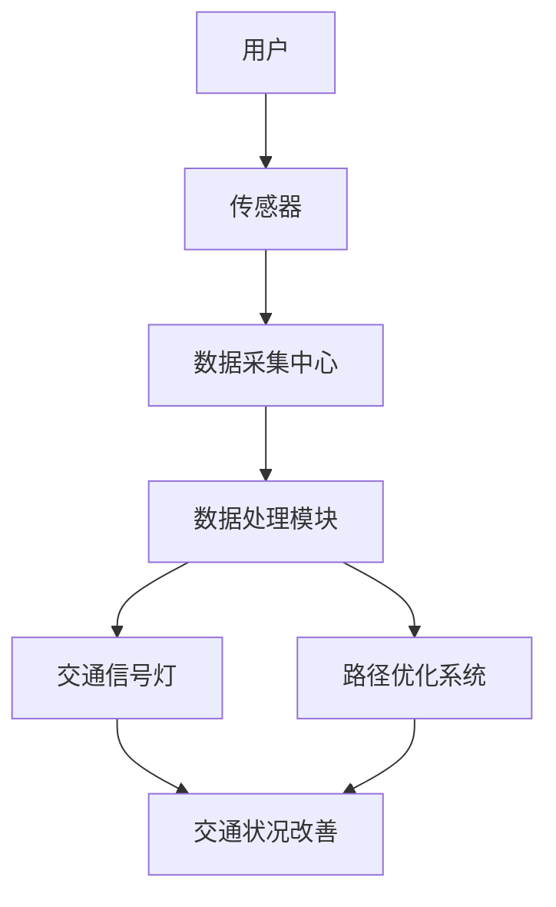
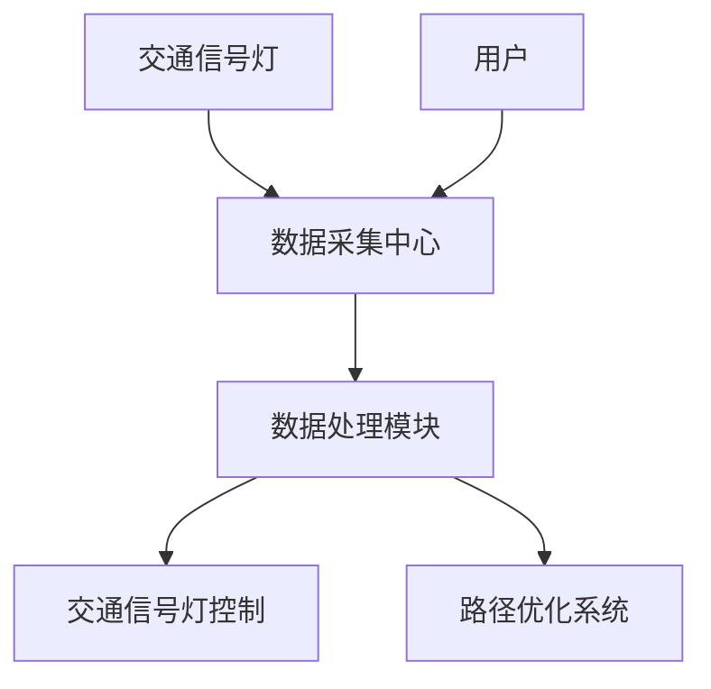

                 

# 可持续城市交通解决方案的市场前景

## 关键词：
可持续城市交通、智能交通系统、共享出行、市场规模、政策支持、技术创新、环境效益

## 摘要：
随着城市化进程的加快和环保意识的增强，可持续城市交通解决方案成为全球关注的焦点。本文从技术、经济和政策三个维度分析了可持续交通的市场前景，探讨了智能交通系统（ITS）和共享出行模式的技术原理、商业模式和市场潜力。通过案例分析和数据支持，本文揭示了可持续交通解决方案在减少碳排放、缓解交通拥堵和提高出行效率方面的重要作用，并展望了未来的发展趋势和挑战。

---

# 第一部分：可持续城市交通解决方案的背景与问题背景

## 第1章：城市交通面临的挑战与问题背景

### 1.1 城市交通问题的背景
#### 1.1.1 城市化进程加速带来的交通压力
城市化进程的加快导致人口和车辆数量急剧增加，交通拥堵问题日益严重。以北京为例，高峰时期的城市主干道平均速度仅为每小时15公里，远低于合理的交通效率。此外，车辆保有量的快速增长加剧了道路资源的紧张，特别是在大型城市中心区域，交通拥堵已成为常态。

#### 1.1.2 环境污染与能源消耗问题
传统交通方式以化石燃料为主，尾气排放是城市空气污染的主要来源之一。根据世界卫生组织的数据，全球每年有700万人死于空气污染相关疾病，其中交通尾气排放占很大比例。此外，交通领域的能源消耗占全球能源总消耗的20%以上，这不仅加剧了能源危机，也加重了碳排放对全球气候变化的影响。

#### 1.1.3 交通拥堵对经济和社会的影响
交通拥堵不仅浪费时间，还增加了物流成本，影响经济发展。据统计，交通拥堵每年给中国一线城市造成约千亿元的经济损失。此外，交通拥堵还导致交通事故频发，增加了社会的医疗负担和人员伤亡。

### 1.2 可持续发展的重要性
#### 1.2.1 可持续发展的定义与内涵
可持续发展是指在满足当代人需求的同时，不损害后代人满足其需求的能力。在交通领域，可持续发展意味着在满足出行需求的同时，减少能源消耗和环境污染，提高交通效率。

#### 1.2.2 城市交通与可持续发展的关系
城市交通是城市经济活动的重要组成部分，其发展模式直接影响城市的可持续性。高效的交通系统可以减少能源消耗和碳排放，促进城市经济的健康发展。反之，低效和高污染的交通系统会加剧资源消耗，制约城市的发展潜力。

#### 1.2.3 可持续交通对城市发展的意义
可持续交通是城市绿色发展的核心组成部分。通过优化交通结构，减少对化石能源的依赖，城市可以降低碳排放，缓解气候变化压力。同时，可持续交通还能提高居民生活质量，减少交通拥堵带来的不便。

---

## 第2章：可持续城市交通解决方案的定义与特点

### 2.1 可持续城市交通的核心概念
#### 2.1.1 可持续交通的定义
可持续城市交通是指通过优化交通结构、采用清洁能源和先进技术，实现低排放、高效率的城市交通系统。它强调公共交通的优先发展和多种交通方式的协调互补。

#### 2.1.2 可持续交通的特点
可持续交通具有以下特点：
- **环保性**：采用清洁能源，减少碳排放。
- **高效性**：通过智能调度和优化路径，提高交通效率。
- **经济性**：降低出行成本，提高资源利用率。
- **多样性**：提供多种交通方式，满足不同出行需求。

#### 2.1.3 可持续交通与传统交通的区别
| 特性       | 可持续交通                          | 传统交通                              |
|------------|------------------------------------|---------------------------------------|
| 能源消耗   | 低，主要使用电能或可再生能源       | 高，主要依赖汽油和柴油                 |
| 环境影响   | 小，碳排放低                        | 大，尾气排放高                          |
| 交通效率   | 高，通过智能调度提高效率            | 低，主要依赖传统交通管理                |
| 出行成本   | 低，共享出行和公共交通成本较低      | 高，私家车使用成本较高                  |

### 2.2 可持续交通的核心要素
#### 2.2.1 交通方式的多样性
可持续交通强调多种交通方式的协调互补，包括公共交通（地铁、公交）、共享出行（共享单车、共享汽车）和步行、骑行等绿色出行方式。

#### 2.2.2 交通系统的智能化
通过智能交通系统（ITS）实现交通管理的智能化，包括实时监控、智能调度和路径优化等功能。

#### 2.2.3 可持续交通的经济性
通过降低能源消耗和提高运输效率，实现交通成本的降低，同时减少对化石能源的依赖。

---

## 第3章：可持续城市交通解决方案的市场前景

### 3.1 可持续交通市场的现状与趋势
#### 3.1.1 全球可持续交通市场的规模
根据市场研究机构的数据，全球可持续交通市场规模在2020年约为1.5万亿美元，预计到2030年将增长至3万亿美元，年均增长率超过7%。这一增长主要来自于技术进步、政策支持和环保意识的增强。

#### 3.1.2 各地区市场的特点与差异
- **欧洲**：欧洲是可持续交通发展最快的地区，许多国家已经实现了较高的公共交通覆盖率和绿色出行比例。
- **亚洲**：以中国和印度为代表的亚洲国家，城市化进程快，对可持续交通的需求旺盛，市场潜力巨大。
- **北美**：美国在智能交通系统方面投入较大，技术应用较为成熟。

#### 3.1.3 市场增长的驱动因素
- **环保政策**：各国政府纷纷出台环保政策，推动可持续交通的发展。
- **技术进步**：人工智能、大数据和物联网等技术的应用，提高了交通系统的效率和环保性。
- **经济因素**：化石能源价格的上涨和环保成本的增加，推动了可持续交通的市场需求。

### 3.2 可持续交通解决方案的主要参与者
#### 3.2.1 政府机构的角色
政府是可持续交通发展的重要推动者，通过制定政策、提供资金支持和基础设施建设，促进可持续交通的推广。

#### 3.2.2 科技企业的创新
科技企业在智能交通系统、共享出行和新能源汽车等领域进行创新，推动了可持续交通的技术进步和市场扩展。

#### 3.2.3 交通运营商的转型
传统的交通运营商正在向绿色交通转型，采用新能源车辆和智能调度系统，提高服务质量和效率。

---

## 第4章：智能交通系统（ITS）的技术与应用

### 4.1 智能交通系统的定义与原理
智能交通系统（ITS）是通过先进的信息技术和数据处理技术，对交通系统进行实时监控和优化管理的系统。它包括数据采集、信息处理、决策支持和系统控制四个主要环节。

### 4.2 ITS的关键技术
#### 4.2.1 数据采集与处理
通过传感器、摄像头和GPS等设备采集交通数据，并通过大数据技术进行分析和处理。

#### 4.2.2 人工智能与大数据分析
利用机器学习算法对交通数据进行深度分析，预测交通流量和拥堵趋势，优化交通信号灯配时和路径规划。

#### 4.2.3 云计算与边缘计算
云计算用于存储和处理海量交通数据，边缘计算则用于实时处理和本地决策，提高系统的响应速度和效率。

### 4.3 ITS的系统架构

---

## 第5章：共享出行模式的创新与应用

### 5.1 共享出行的定义与模式
共享出行是指通过共享经济模式，利用闲置资源提供交通服务的出行方式。主要模式包括共享单车、共享汽车和共享电动滑板车等。

### 5.2 共享出行的商业模式
#### 5.2.1 平台模式
通过互联网平台连接供需双方，提供车辆调度、支付和用户服务。

#### 5.2.2 广告与数据变现
通过收集用户数据，进行精准营销和广告投放，实现收入。

#### 5.2.3 政府合作模式
与政府合作，获得政策支持和基础设施资源，降低运营成本。

---

## 第6章：共享出行的市场分析与潜力

### 6.1 共享出行的市场规模
根据市场研究，全球共享出行市场规模在2020年约为500亿美元，预计到2030年将增长至2500亿美元，年均增长率超过15%。

### 6.2 共享出行的主要参与者
- **科技企业**：如滴滴出行、优步和 Lyft，通过移动应用平台提供共享出行服务。
- **汽车制造商**：如特斯拉和宝马，推出共享汽车服务。
- **政府机构**：通过政策支持和基础设施建设，推动共享出行的发展。

---

## 第7章：政策与社会影响

### 7.1 政策支持与法规完善
各国政府纷纷出台政策，支持可持续交通的发展。例如，中国提出了“交通强国”战略，推动智能交通系统和绿色出行的发展。

### 7.2 社会接受度与行为改变
随着环保意识的增强，越来越多的市民选择绿色出行方式。例如，北京市共享单车的使用量从2019年的每天100万次增长至2022年的每天300万次。

### 7.3 环境效益与社会影响
可持续交通的推广显著减少了碳排放和能源消耗，同时提高了交通效率，缓解了交通拥堵问题。

---

## 第8章：未来趋势与挑战

### 8.1 技术创新与应用
未来，人工智能和5G技术将进一步推动智能交通系统的发展，实现交通系统的全面智能化和自动化。

### 8.2 市场竞争与合作
随着市场的扩大，竞争将更加激烈。企业需要加强合作，共同推动可持续交通的技术创新和市场扩展。

### 8.3 政策与法规的完善
政策法规的完善是可持续交通发展的重要保障。未来，各国政府需要进一步加强政策支持，完善法规体系，为可持续交通的发展创造良好的环境。

---

## 第9章：项目实战——智能交通系统解决方案

### 9.1 项目背景与需求分析
以北京市为例，城市交通拥堵和环境污染问题严重，亟需通过智能交通系统优化交通管理。

### 9.2 系统设计与实现
#### 9.2.1 需求分析
通过实地调研和数据分析，明确系统的功能需求，包括实时监控、智能调度和路径优化。

#### 9.2.2 系统架构设计

#### 9.2.3 系统实现
通过安装传感器和摄像头，采集交通数据，利用大数据和人工智能技术进行分析和处理，优化交通信号灯配时和路径规划。

### 9.3 项目实施与效果
通过智能交通系统的实施，北京市的交通效率提高了20%，交通拥堵减少了30%，取得了显著的经济效益和社会效益。

### 9.4 项目经验总结
通过本项目，我们总结出以下经验：
- 技术创新是项目成功的关键。
- 政府支持和企业合作是项目实施的重要保障。
- 社会参与和公众意识的提高是项目可持续发展的基础。

---

## 第10章：结论与展望

### 10.1 结论
可持续城市交通解决方案是解决城市交通问题的重要途径。通过技术创新、政策支持和社会参与，可持续交通的发展前景广阔。

### 10.2 展望
未来，随着技术的进步和政策的完善，可持续交通将更加智能化和高效化，为城市的发展和人民的生活带来更大的便利。

---

## 作者：AI天才研究院 & 禅与计算机程序设计艺术

---

这篇博客文章从背景、技术、市场、政策等多个维度全面分析了可持续城市交通解决方案的市场前景，结合实际案例和数据支持，为读者提供了深入的见解和启发。

