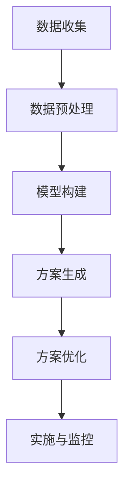
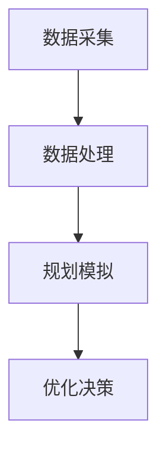
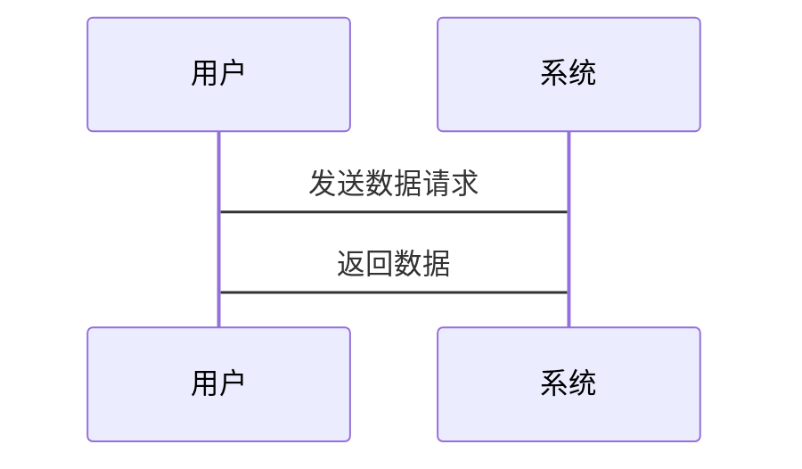

                 


# 可持续城市规划技术的市场潜力评估

> 关键词：可持续城市规划，市场潜力，城市设计，技术分析，系统架构

> 摘要：随着全球城市化进程的加快，可持续城市规划技术的重要性日益凸显。本文系统地分析了可持续城市规划的核心概念、技术优势、市场潜力，并通过实际案例和数据分析，评估了其在市场中的潜力。文章从背景介绍、技术分析、市场评估、系统设计、项目实战等多个方面展开，旨在为相关领域的企业和研究机构提供理论支持和实践指导。

---

# 第三章：可持续城市规划技术的技术分析

## 3.1 技术优势与局限性

### 3.1.1 技术优势
- **环保性**：通过优化土地利用和资源分配，减少对环境的破坏。
- **经济性**：降低长期运营成本，提高资源利用效率。
- **社会性**：提升居民生活质量，促进社会公平。

### 3.1.2 技术局限性
- **实施难度**：需要跨学科合作，技术门槛较高。
- **成本问题**：初期投入较大，回报周期较长。
- **政策依赖**：依赖政府政策支持和法规引导。

## 3.2 技术实现流程

### 3.2.1 核心步骤
1. 数据收集与分析：包括土地利用、交通、能源消耗等数据。
2. 模型构建：基于数据建立数学模型，模拟城市规划方案。
3. 方案优化：通过算法优化，选择最优规划方案。
4. 实施与监控：监控实施效果，持续调整优化。

### 3.2.2 技术实现流程图


## 3.3 技术对比分析

### 3.3.1 技术对比表格
| 技术特点 | 可持续城市规划技术 | 传统城市规划技术 |
|----------|------------------|------------------|
| 环保性    | 高               | 低               |
| 经济性    | 高               | 中               |
| 社会性    | 高               | 低               |
| 实施难度  | 高               | 中               |

## 3.4 本章小结
本章分析了可持续城市规划技术的优势与局限性，并通过流程图和对比表格，详细阐述了其技术实现的流程和特点。

---

# 第四章：可持续城市规划技术的市场分析

## 4.1 市场规模与增长趋势

### 4.1.1 全球市场规模
- 2020年：全球市场规模约为$100$亿美元。
- 预计年增长率：$8\%$以上，到2030年市场规模将超过$200$亿美元。

### 4.1.2 区域分布
- 发达国家：欧洲、北美市场占比最大。
- 发展中国家：亚洲市场增长最快，尤其是中国和印度。

## 4.2 市场竞争格局

### 4.2.1 主要参与者
- **科技公司**：如Google、Microsoft等，提供地理信息系统（GIS）技术支持。
- **咨询公司**：如 McKinsey、BCG 等，提供战略咨询服务。
- **初创企业**：专注于可持续城市规划技术的创新企业。

### 4.2.2 市场竞争分析
- **竞争态势**：寡头垄断，科技巨头占据主导地位。
- **竞争策略**：技术创新、价格战、生态系统整合。

## 4.3 用户需求分析

### 4.3.1 政府需求
- 政策制定：推动可持续城市规划的法规和政策。
- 公共项目：如绿色建筑、低碳交通等项目的实施。

### 4.3.2 企业需求
- 房地产开发：绿色建筑认证、可持续社区规划。
- 城市交通：智能交通系统、共享出行平台。

## 4.4 本章小结
本章通过市场规模、竞争格局和用户需求的分析，揭示了可持续城市规划技术在市场中的潜力和挑战。

---

# 第五章：可持续城市规划技术的系统架构设计

## 5.1 系统功能设计

### 5.1.1 功能模块
1. 数据采集模块：收集城市数据，如土地利用、交通流量等。
2. 数据处理模块：清洗、分析和建模。
3. 规划模拟模块：模拟不同规划方案的效果。
4. 优化决策模块：基于模型结果，生成最优方案。

### 5.1.2 功能流程图


## 5.2 系统架构设计

### 5.2.1 分层架构
- **数据层**：数据存储和管理。
- **业务逻辑层**：处理业务逻辑，如模型计算。
- **用户界面层**：提供可视化界面，供用户操作。

### 5.2.2 系统架构图


## 5.3 接口设计

### 5.3.1 API接口
- 数据接口：RESTful API，支持GET、POST请求。
- 模型接口：提供API调用模型计算功能。

### 5.3.2 接口交互图


## 5.4 本章小结
本章详细设计了可持续城市规划技术的系统架构，并通过功能模块和架构图展示了系统的整体结构。

---

# 第六章：可持续城市规划技术的项目实战

## 6.1 环境配置与工具安装

### 6.1.1 开发环境
- 操作系统：Linux或Windows。
- 开发工具：PyCharm、VS Code。
- 数据库：PostgreSQL、MySQL。

### 6.1.2 工具安装
- Python：安装Anaconda，版本3.9以上。
- 库依赖：安装`numpy`、`pandas`、`matplotlib`、`geopandas`等库。

## 6.2 核心代码实现

### 6.2.1 数据预处理
```python
import pandas as pd
import numpy as np

# 读取数据
data = pd.read_csv('city_data.csv')

# 数据清洗
data = data.dropna()
data = data[data['population'] > 0]
```

### 6.2.2 模型构建
```python
import geopandas as gpd

# 加载空间数据
gdf = gpd.read_file('city_shapes.shp')

# 空间分析
def calculate_density(gdf):
    density = gdf['population'] / gdf['area']
    return density

density = calculate_density(gdf)
```

### 6.2.3 方案优化
```python
import matplotlib.pyplot as plt

# 可视化密度分布
plt.figure(figsize=(10,6))
plt.hist(density, bins=20, alpha=0.7)
plt.xlabel('人口密度')
plt.ylabel('频数')
plt.show()
```

## 6.3 案例分析

### 6.3.1 案例背景
- 案例城市：某中型城市，面临交通拥堵和环境污染问题。
- 目标：优化城市交通网络，减少碳排放。

### 6.3.2 实施步骤
1. 数据收集：收集交通流量、碳排放数据。
2. 模型构建：建立交通网络模型。
3. 方案优化：优化交通网络结构，减少碳排放。
4. 实施与监控：监控优化效果，持续调整。

## 6.4 本章小结
本章通过实际项目案例，详细讲解了可持续城市规划技术的实施过程，并展示了如何通过代码实现数据处理和模型优化。

---

# 第七章：总结与展望

## 7.1 本研究的核心内容回顾
- 可持续城市规划技术的核心概念和优势。
- 市场潜力评估的方法和结果。
- 系统架构设计和项目实战经验。

## 7.2 未来研究方向
- 技术创新：开发更智能的规划算法。
- 市场拓展：开拓新兴市场，如发展中国家。
- 政策支持：推动政策法规的完善，促进技术应用。

## 7.3 结论
可持续城市规划技术在市场中具有巨大的潜力，随着技术的进步和政策的支持，其应用将更加广泛。

---

# 作者

作者：AI天才研究院/AI Genius Institute & 禅与计算机程序设计艺术 /Zen And The Art of Computer Programming

