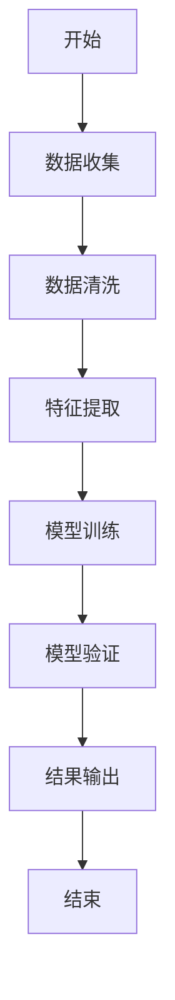
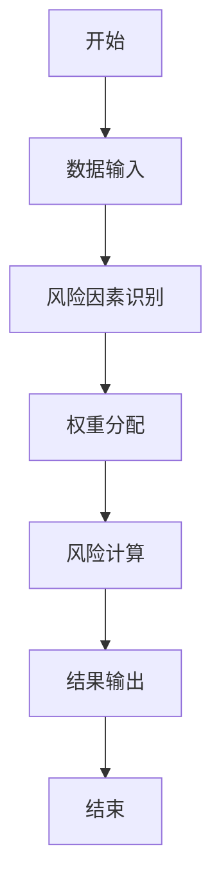
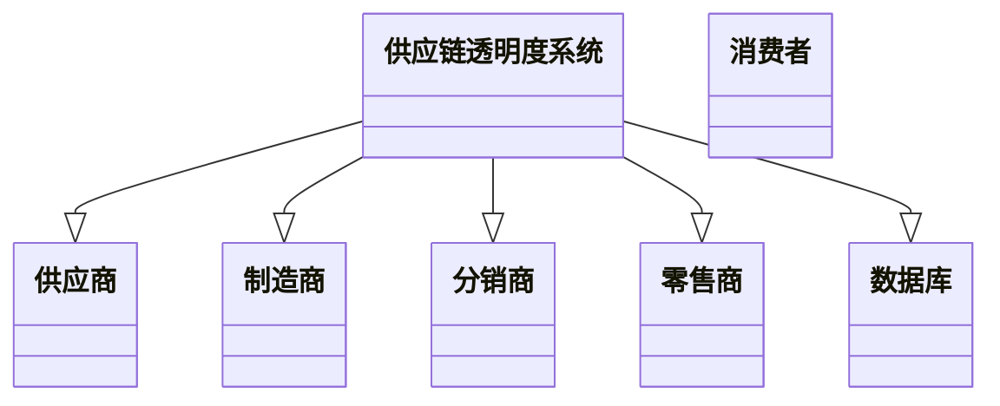

                 


---

# 可持续时尚供应链的透明度与投资风险

> **关键词**：可持续供应链、透明度、投资风险、风险管理、时尚产业

> **摘要**：  
本文探讨了可持续时尚供应链的透明度与投资风险之间的关系，分析了透明度对供应链风险管理的影响，以及如何通过提升透明度来降低投资风险。文章从背景、核心概念、评估模型、量化方法、系统设计、项目实战等多个维度展开，结合实际案例和数学模型，提出了提升供应链透明度和降低投资风险的具体策略。通过本文的分析，读者能够更好地理解可持续供应链的重要性，并掌握相关风险评估和管理的方法。

---

## 第1章 可持续时尚供应链的背景与挑战

### 1.1 问题背景介绍

#### 1.1.1 传统供应链的局限性
传统供应链往往忽视环境和社会因素，导致资源浪费、环境污染和劳工权益问题。这些问题不仅影响企业的声誉，还可能导致高昂的合规成本。

#### 1.1.2 可持续发展的概念与内涵
可持续发展强调在满足当前需求的同时，不损害后代发展的可能性。在供应链管理中，这意味着要在环境、社会和经济三个维度上实现平衡。

#### 1.1.3 时尚产业的环境与社会责任
时尚产业是全球第二大污染行业，其生产过程涉及大量资源消耗和环境污染。提升供应链的透明度是企业履行社会责任、减少环境影响的重要途径。

### 1.2 供应链透明度的重要性

#### 1.2.1 透明度的定义与范围
供应链透明度指的是供应链各环节的信息公开程度，包括原材料来源、生产过程、劳工条件等。

#### 1.2.2 透明度对消费者信任的影响
消费者越来越关注产品背后的社会和环境影响。透明的供应链能够增强消费者的信任，提升品牌忠诚度。

#### 1.2.3 透明度对品牌价值的提升
透明度高的品牌更容易获得消费者的认可，从而在市场竞争中占据优势。

### 1.3 投资风险与可持续供应链的关系

#### 1.3.1 投资风险的定义与分类
投资风险是指在投资过程中可能面临的不确定性，通常分为系统性风险和非系统性风险。

#### 1.3.2 可持续供应链对投资风险的影响
透明的供应链能够降低因环境和社会问题引发的风险，从而降低投资风险。

#### 1.3.3 透明度与投资决策的关联
投资者越来越关注企业的可持续性表现，透明的供应链信息能够帮助投资者做出更明智的决策。

---

## 第2章 可持续供应链的核心概念与联系

### 2.1 可持续供应链的核心要素

#### 2.1.1 环境因素
包括资源消耗、能源使用、碳排放等。

#### 2.1.2 社会因素
包括劳工权益、工作条件、社区影响等。

#### 2.1.3 经济因素
包括成本控制、经济效益、供应链稳定性等。

### 2.2 透明度与投资风险的关联分析

#### 2.2.1 透明度对风险识别的影响
透明的供应链能够帮助投资者更好地识别和评估潜在风险。

#### 2.2.2 投资风险的量化方法
通过透明度数据，可以建立数学模型对投资风险进行量化评估。

#### 2.2.3 透明度对投资决策的指导作用
透明度高的供应链信息能够为投资者提供决策依据，降低投资风险。

### 2.3 可持续供应链的系统结构

#### 2.3.1 供应链的层次结构
供应链由供应商、制造商、分销商、零售商和消费者组成。

#### 2.3.2 核心要素的相互作用
环境、社会和经济因素在供应链中相互作用，共同影响供应链的整体表现。

#### 2.3.3 系统的整体优化
通过优化各环节的透明度，可以实现供应链的整体优化，降低投资风险。

---

## 第3章 可持续供应链透明度的评估模型

### 3.1 透明度评估指标的设计

#### 3.1.1 环境指标
包括碳排放强度、水资源使用效率等。

#### 3.1.2 社会指标
包括员工满意度、劳工权益保护等。

#### 3.1.3 经济指标
包括生产成本、供应链效率等。

### 3.2 透明度评估模型的构建

#### 3.2.1 数据收集与处理
收集供应链各环节的环境、社会和经济数据，并进行清洗和预处理。

#### 3.2.2 模型构建的步骤
1. 确定评估指标。
2. 确定各指标的权重。
3. 计算各环节的透明度得分。
4. 综合各环节得分，得出整体透明度。

#### 3.2.3 模型的验证与优化
通过实际案例验证模型的有效性，并根据反馈进行优化。

### 3.3 透明度评估的流程图



---

## 第4章 可持续供应链投资风险的量化方法

### 4.1 投资风险的分类与影响因素

#### 4.1.1 系统性风险
由市场整体波动引发的风险。

#### 4.1.2 非系统性风险
由供应链特定环节的不确定性引发的风险。

#### 4.1.3 可持续性相关风险
由于供应链的环境和社会表现不佳引发的风险。

### 4.2 投资风险的量化模型

#### 4.2.1 风险评估的数学模型
$$ R = \sum_{i=1}^{n} w_i \cdot r_i $$
其中，$R$ 表示总风险，$w_i$ 表示第 $i$ 个风险因素的权重，$r_i$ 表示第 $i$ 个风险因素的值。

### 4.3 风险评估的流程图



---

## 第5章 可持续供应链的系统分析与架构设计

### 5.1 问题场景介绍

#### 5.1.1 供应链透明度低的现状
许多企业缺乏对供应链各环节的透明管理，导致风险难以识别和控制。

#### 5.1.2 投资风险的复杂性
投资风险受多种因素影响，需要通过系统的分析和评估来降低。

#### 5.1.3 可持续供应链的系统需求
需要构建一个透明、高效、可靠的可持续供应链系统。

### 5.2 系统功能设计

#### 5.2.1 领域模型



---

## 第6章 项目实战：可持续供应链系统实现

### 6.1 环境安装

#### 6.1.1 安装Python
需要安装Python 3.6或更高版本。

#### 6.1.2 安装依赖库
安装Pandas、NumPy、Scikit-learn等库。

### 6.2 核心代码实现

#### 6.2.1 数据预处理
```python
import pandas as pd
import numpy as np

# 读取数据
data = pd.read_csv('supply_chain.csv')

# 数据清洗
data.dropna(inplace=True)
data['score'] = data['score'].astype(float)
```

#### 6.2.2 风险评估模型
```python
from sklearn.model_selection import train_test_split
from sklearn.linear_model import LinearRegression

# 数据分割
X = data[['score', 'cost']]
y = data['risk']

X_train, X_test, y_train, y_test = train_test_split(X, y, test_size=0.2)

# 模型训练
model = LinearRegression()
model.fit(X_train, y_train)

# 模型预测
y_pred = model.predict(X_test)
```

### 6.3 案例分析

#### 6.3.1 案例背景
某服装企业希望通过提升供应链透明度来降低投资风险。

#### 6.3.2 数据分析
通过分析供应链各环节的透明度数据，识别高风险环节并进行优化。

#### 6.3.3 模型验证
通过实际数据验证模型的有效性，并根据结果调整供应链策略。

### 6.4 项目小结
通过本项目，我们成功构建了一个可持续供应链透明度评估系统，并验证了其在降低投资风险方面的有效性。

---

## 第7章 最佳实践与小结

### 7.1 最佳实践 tips

#### 7.1.1 提升透明度的关键点
1. 建立透明的供应链管理机制。
2. 定期公开供应链信息。
3. 与利益相关方保持良好沟通。

#### 7.1.2 降低投资风险的策略
1. 建立全面的风险评估体系。
2. 优化供应链管理流程。
3. 加强与供应商的合作关系。

### 7.2 小结
通过本文的分析，我们可以看到，提升供应链透明度是降低投资风险的关键。企业和社会各方需要共同努力，推动可持续供应链的发展。

### 7.3 注意事项
在实际操作中，需要注意数据的准确性和模型的适用性，确保评估结果的有效性。

### 7.4 拓展阅读
推荐阅读相关书籍和论文，深入了解可持续供应链的理论与实践。

---

## 作者：AI天才研究院/AI Genius Institute & 禅与计算机程序设计艺术 /Zen And The Art of Computer Programming

---

以上是《可持续时尚供应链的透明度与投资风险》的完整内容，涵盖了从背景到实际应用的各个方面，结合理论与实践，为企业和投资者提供了有价值的参考。

