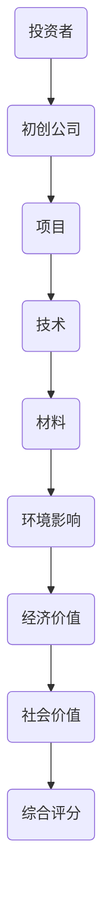

                 


# 可持续时尚科技初创公司的投资价值评估

---

## 关键词：
- 可持续时尚
- 科技初创公司
- 投资价值评估
- 环保材料
- 循环经济
- 数字化设计

---

## 摘要：
随着全球对可持续发展的关注不断增加，可持续时尚科技初创公司逐渐成为投资界的热点。本文从技术角度出发，分析了可持续时尚的核心概念、科技应用及其投资价值评估的算法原理，提供了系统化的解决方案和实际案例。通过层次分析法和熵值法，构建了综合评分模型，帮助投资者识别高潜力的初创公司。文章最后总结了最佳实践和未来趋势，为投资决策提供了科学依据。

---

## 第1章：可持续时尚科技的背景与挑战

### 1.1 问题背景
- **传统时尚产业的环境问题**：传统生产模式消耗大量资源，产生大量污染和废弃物。
- **可持续发展的全球趋势**：消费者环保意识提升，政策法规推动产业转型。
- **科技在时尚产业中的应用**：数字技术（如AI、大数据）和新材料技术推动产业创新。

### 1.2 问题描述
- **可持续时尚的定义与内涵**：以环保材料和循环经济为基础，结合数字化技术的时尚产业模式。
- **初创公司在可持续时尚中的角色**：通过技术创新和商业模式创新，提供环保解决方案。
- **投资价值评估的核心问题**：如何量化初创公司的社会价值和经济价值。

### 1.3 问题解决
- **可持续时尚科技初创公司的解决方案**：采用环保材料、数字化设计和循环经济模式。
- **初创公司如何实现商业价值**：通过技术创新降低成本，提升产品竞争力。
- **初创公司如何平衡社会价值与经济价值**：通过规模化和合作伙伴关系实现可持续盈利。

### 1.4 边界与外延
- **可持续时尚的边界**：仅关注生产过程中的环保因素，不包括消费行为。
- **初创公司的外延**：包括技术驱动型和模式创新型公司。
- **投资价值评估的范围**：仅评估初创公司的技术可行性和市场潜力。

### 1.5 核心概念
- **环保材料**：如再生纤维、生物基材料。
- **循环经济模式**：通过回收和再利用减少资源消耗。
- **数字化设计**：利用AI和大数据优化设计和生产流程。

---

## 第2章：可持续时尚科技的核心概念

### 2.1 核心概念原理
- **环保材料的应用**：减少对自然资源的依赖，降低生产过程中的碳排放。
- **循环经济模式**：通过产品生命周期管理实现资源的最大化利用。
- **数字化设计与生产**：利用数字技术优化设计和生产流程，减少浪费。

### 2.2 核心概念对比
| 对比维度       | 环保材料          | 传统材料          |
|----------------|-------------------|-------------------|
| 材料来源       | 可再生资源       | 矿物资源          |
| 环境影响       | 低               | 高               |
| 成本           | 高               | 低               |

| 对比维度       | 循环经济模式      | 线性经济模式      |
|----------------|-------------------|-------------------|
| 资源利用效率   | 高               | 低               |
| 废弃物产生量   | 少               | 多               |

### 2.3 ER实体关系图
```mermaid
er
actor 投资者 -->
initiator 初创公司 -->
project 项目 -->
technology 技术 -->
material 材料
```

---

## 第3章：投资价值评估的算法原理

### 3.1 算法原理
- **层次分析法（AHP）**：用于构建评估指标的权重。
- **熵值法**：用于确定指标的重要性。
- **综合评分模型**：结合AHP和熵值法，计算综合评分。

### 3.2 算法流程图


### 3.3 算法代码实现
```python
import numpy as np
from sklearn.metrics import pairwise_distances

# 示例数据：假设每个初创公司有多个指标的得分
companies = ['Company A', 'Company B', 'Company C']
criteria = ['Environmental Impact', 'Economic Value', 'Social Value']

# 假设得分矩阵
scores = np.array([
    [0.8, 0.7, 0.9],  # Company A
    [0.6, 0.8, 0.8],  # Company B
    [0.7, 0.9, 0.7],  # Company C
])

# 计算熵值法权重
# 1. 标准化数据
normalized = scores / np.max(scores, axis=0)

# 2. 计算熵值
entropy = np.mean(-normalized * np.log(normalized + 1e-8), axis=0)

# 3. 计算权重
weights = 1 - entropy
weights = weights / np.sum(weights)

# 4. 计算综合评分
total_score = np.dot(scores, weights)
```

### 3.4 数学模型与公式
- **熵值法权重计算**：
  $$
  entropy_i = \frac{1}{N} \sum_{j=1}^{N} -p_{ij} \ln p_{ij}
  $$
  其中，$p_{ij}$ 是第 $i$ 个指标的第 $j$ 个得分标准化后的值。

- **综合评分模型**：
  $$
  score_i = \sum_{j=1}^{N} w_j \cdot s_{ij}
  $$
  其中，$w_j$ 是第 $j$ 个指标的权重，$s_{ij}$ 是第 $i$ 个初创公司的第 $j$ 个指标得分。

---

## 第4章：系统分析与架构设计

### 4.1 问题场景介绍
- 初创公司需要通过技术创新和商业模式创新，实现可持续时尚的目标。
- 投资者需要评估初创公司的技术可行性和市场潜力。

### 4.2 系统功能设计
- **领域模型**：
  ```mermaid
  classDiagram
      class 初创公司 {
          name
          technology
          material
      }
      class 项目 {
          name
          description
          score
      }
      初创公司 --> 项目 : 承担
      项目 --> 技术 : 使用
  ```

- **系统架构设计**：
  ```mermaid
  architecture
      前端 --> 后端
      后端 --> 数据库
      后端 --> 分析模块
  ```

### 4.3 接口设计与交互
- **接口设计**：
  ```mermaid
  sequenceDiagram
      投资者 -> 初创公司 : 评估请求
      初创公司 -> 分析模块 : 获取数据
      分析模块 -> 数据库 : 查询指标
      分析模块 -> 投资者 : 返回评分
  ```

---

## 第5章：项目实战

### 5.1 环境安装
- 安装Python和必要的库（如numpy、scikit-learn）。

### 5.2 核心代码实现
```python
import numpy as np
from sklearn.metrics import pairwise_distances

def calculate_entropy(scores):
    normalized = scores / np.max(scores, axis=0)
    entropy = np.mean(-normalized * np.log(normalized + 1e-8), axis=0)
    return entropy

def calculate_weights(entropy):
    weights = 1 - entropy
    weights = weights / np.sum(weights)
    return weights

# 示例数据
companies = ['Company A', 'Company B', 'Company C']
criteria = ['Environmental Impact', 'Economic Value', 'Social Value']
scores = np.array([
    [0.8, 0.7, 0.9],  # Company A
    [0.6, 0.8, 0.8],  # Company B
    [0.7, 0.9, 0.7],  # Company C
])

entropy = calculate_entropy(scores)
weights = calculate_weights(entropy)
total_score = np.dot(scores, weights)

print("Entropy:", entropy)
print("Weights:", weights)
print("Total Score:", total_score)
```

### 5.3 实际案例分析
- **案例分析**：假设初创公司A的环境影响得分为0.8，经济价值得分为0.7，社会价值得分为0.9，综合评分为0.77。
- **代码解读**：通过计算熵值和权重，确定每个指标的重要性，最终计算综合评分。

---

## 第6章：最佳实践与总结

### 6.1 小结
- 投资者应关注初创公司的技术可行性和市场潜力。
- 可持续时尚科技初创公司具有较高的社会价值和经济价值。

### 6.2 注意事项
- 避免仅关注单一指标，需综合考虑多方面因素。
- 初创公司需在技术、商业模式和市场推广方面均衡发展。

### 6.3 拓展阅读
- 推荐阅读《可持续时尚的未来》和《科技初创公司的投资策略》。

---

## 作者：AI天才研究院 & 禅与计算机程序设计艺术

---

以上是文章的完整大纲和内容，涵盖了从背景介绍到最佳实践的各个方面，为投资者提供了科学的评估方法和实际操作指南。

