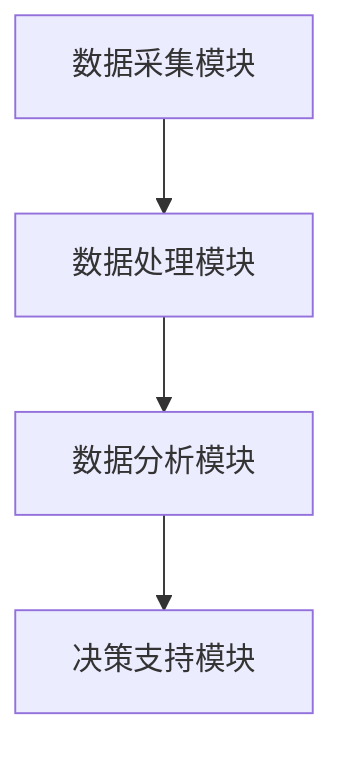
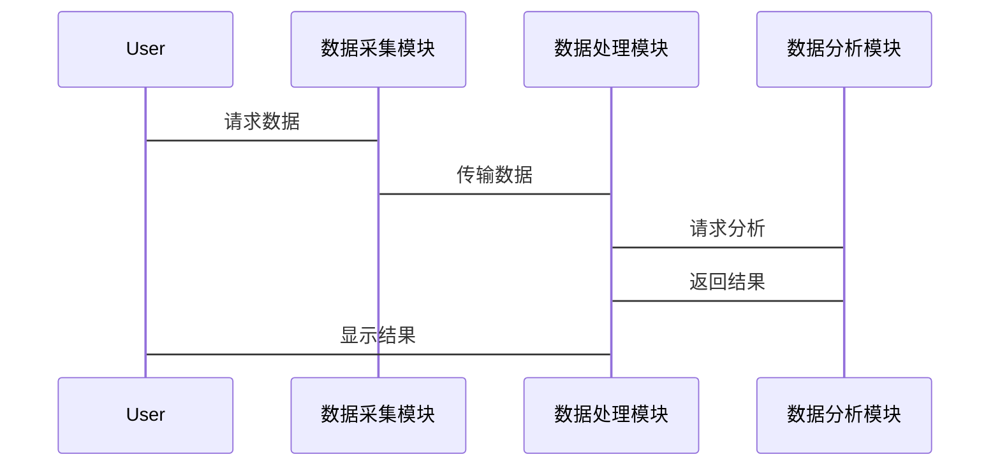

                 


# 可持续水资源管理技术的市场需求分析

> 关键词：可持续水资源管理，市场需求分析，智能传感器，数据挖掘，人工智能，系统架构设计

> 摘要：本文通过对可持续水资源管理技术的市场需求进行深入分析，探讨了智能化水资源管理技术的核心概念、市场需求分析方法以及系统架构设计。文章结合实际案例，详细阐述了智能传感器、数据挖掘和人工智能等技术在水资源管理中的应用，并通过系统设计和实现，展示了如何利用这些技术满足市场需求。

---

## 目录

1. [可持续水资源管理技术的背景与概述](#可持续水资源管理技术的背景与概述)
2. [可持续水资源管理技术的核心概念与市场需求](#可持续水资源管理技术的核心概念与市场需求)
3. [市场需求分析的核心概念与原理](#市场需求分析的核心概念与原理)
4. [智能化水资源管理技术的市场需求分析](#智能化水资源管理技术的市场需求分析)
5. [市场需求分析的系统架构与实现](#市场需求分析的系统架构与实现)
6. [项目实战与案例分析](#项目实战与案例分析)

---

## 第一部分：可持续水资源管理技术的背景与概述

### 第1章：可持续水资源管理的背景与意义

#### 1.1 水资源管理的重要性

##### 1.1.1 水资源的基本概念与属性

水资源是指地球上所有可以被利用的水，包括地表水、地下水和大气水等。水资源是生命之源，是人类生存和发展的基础。水具有流动性、循环性、不可替代性等属性，这些属性决定了水资源管理的复杂性和重要性。

##### 1.1.2 可持续发展的定义与内涵

可持续发展是指在满足当代人需求的同时，不损害后代人满足其需求的能力。在水资源管理中，可持续发展意味着在不破坏生态环境的前提下，合理利用水资源，确保水资源的长期供应。

##### 1.1.3 水资源管理与可持续发展的关系

水资源管理是实现可持续发展的重要组成部分。通过科学的水资源管理，可以有效利用水资源，减少浪费，避免因过度开发而导致的水资源枯竭和环境破坏。

#### 1.2 当前水资源管理面临的问题

##### 1.2.1 水资源短缺的现状

全球水资源分布不均，许多地区面临水资源短缺的问题。随着人口增长和经济发展，水资源需求不断增加，导致许多地区的水资源供应紧张。

##### 1.2.2 水污染与水质下降的挑战

工业化和城市化过程中，大量污染物进入水体，导致水污染和水质下降。这不仅影响了水资源的可用性，还对生态环境和人类健康造成了严重威胁。

##### 1.2.3 水资源分配不均的问题

水资源在地区间分布不均，一些地区水资源丰富，而另一些地区则极度匮乏。这导致了水资源分配不均的问题，加剧了水资源短缺的矛盾。

#### 1.3 可持续水资源管理的目标与原则

##### 1.3.1 可持续水资源管理的目标

可持续水资源管理的目标是实现水资源的高效利用和保护，确保水资源的可持续供应，同时减少对环境的负面影响。

##### 1.3.2 可持续发展的基本原则

可持续发展的基本原则包括公平性、效率性和共同性。在水资源管理中，需要公平分配水资源，提高利用效率，并加强国际合作，共同应对水资源挑战。

##### 1.3.3 水资源管理中的伦理与社会因素

水资源管理不仅仅是技术问题，还涉及伦理和社会因素。例如，如何在不同利益相关者之间公平分配水资源，如何平衡经济发展与环境保护的关系等。

#### 1.4 本章小结

本章介绍了可持续水资源管理的重要性和当前面临的主要问题，强调了可持续水资源管理的目标和原则。通过分析水资源短缺、水污染和水资源分配不均等问题，为后续的市场需求分析奠定了基础。

---

## 第二部分：可持续水资源管理技术的核心概念与市场需求

### 第2章：可持续水资源管理技术的核心概念

#### 2.1 水资源管理技术的分类

##### 2.1.1 水资源监测技术

水资源监测技术包括水位监测、流量监测、水质监测等。通过这些技术，可以实时掌握水资源的动态变化，为水资源管理提供数据支持。

##### 2.1.2 水资源优化配置技术

水资源优化配置技术通过数学模型和优化算法，合理分配水资源，提高水资源利用效率。例如，利用线性规划模型优化水资源分配方案。

##### 2.1.3 水资源保护技术

水资源保护技术包括水污染治理、生态修复等技术。这些技术可以有效减少水资源的浪费和污染，保护生态环境。

#### 2.2 智能化水资源管理技术

##### 2.2.1 智能传感器与物联网技术

智能传感器可以实时采集水资源数据，如水位、流量、水质等。物联网技术将这些数据传输到云端，进行分析和处理，为水资源管理提供支持。

##### 2.2.2 数据挖掘与预测分析

数据挖掘技术可以从大量数据中提取有用信息，预测未来水资源的变化趋势。例如，利用时间序列分析预测未来水位变化。

##### 2.2.3 人工智能在水资源管理中的应用

人工智能技术可以用于水资源管理的各个环节，如智能监测、预测分析和优化决策。例如，利用机器学习算法预测水质变化。

#### 2.3 可持续水资源管理技术的属性特征对比

##### 2.3.1 技术属性对比表格

| 技术类别 | 数据采集 | 数据分析 | 决策支持 |
|----------|----------|----------|----------|
| 智能传感器 | 高效 | 中等 | 低 |
| 数据挖掘 | 低效 | 高效 | 中等 |
| 人工智能 | 低效 | 高效 | 高效 |

##### 2.3.2 应用场景对比分析

智能传感器适用于实时监测，数据挖掘适用于历史数据分析，人工智能适用于预测和优化决策。不同技术在不同场景下的应用效果不同。

##### 2.3.3 经济效益与环境效益对比

智能传感器投资高，但长期经济效益显著；数据挖掘投资中等，环境效益较好；人工智能投资高，但环境效益和经济效益均较高。

#### 2.4 本章小结

本章介绍了可持续水资源管理技术的主要分类和技术属性，分析了不同技术在不同场景下的应用效果和经济效益。这为后续的市场需求分析提供了技术基础。

### 第3章：市场需求分析的核心概念与原理

#### 3.1 市场需求分析的基本原理

##### 3.1.1 市场需求的定义与特征

市场需求是指在一定价格和条件下，消费者愿意购买的数量。市场需求具有多样性、动态性和可预测性等特点。

##### 3.1.2 可持续水资源管理技术的市场需求驱动因素

市场需求驱动因素包括政策法规、技术进步、环境压力和经济发展等。例如，政策法规要求企业必须采用可持续水资源管理技术。

##### 3.1.3 市场需求分析的方法与工具

常用的需求分析方法包括问卷调查、访谈法、焦点小组等。工具包括SPSS、Excel和Power BI等数据分析工具。

#### 3.2 可持续水资源管理技术的市场需求分析框架

##### 3.2.1 需求层次分析

需求层次分析包括基本需求和高级需求。基本需求是企业必须采用的技术，高级需求是企业为了提升竞争力而采用的技术。

##### 3.2.2 市场细分与目标客户识别

市场细分可以根据行业、规模和地理位置等因素进行。目标客户包括政府机构、企业和个人用户等。

##### 3.2.3 需求预测与市场容量估算

需求预测可以通过时间序列分析和回归分析等方法进行。市场容量估算需要考虑市场规模、增长率和市场渗透率等因素。

#### 3.3 市场需求与技术创新的关系

##### 3.3.1 技术创新对市场需求的促进作用

技术创新可以提高产品性能和降低成本，从而刺激市场需求。例如，智能传感器的出现推动了水资源监测技术的市场需求。

##### 3.3.2 市场需求对技术创新的引导作用

市场需求引导技术创新，企业根据市场需求开发新产品和技术。例如，市场需求推动了人工智能在水资源管理中的应用。

##### 3.3.3 技术创新与市场需求的平衡点

技术创新需要满足市场需求，同时市场需求也需要技术创新来实现目标。两者需要保持动态平衡。

#### 3.4 本章小结

本章分析了市场需求分析的核心概念和基本原理，探讨了市场需求与技术创新的关系。这为后续的技术需求分析奠定了理论基础。

---

## 第三部分：可持续水资源管理技术的市场需求分析方法

### 第4章：智能化水资源管理技术的市场需求分析

#### 4.1 智能传感器与物联网技术的市场需求

##### 4.1.1 智能传感器的应用场景与市场需求

智能传感器广泛应用于水资源监测、污染监控等领域。市场需求主要集中在工业、农业和市政等领域。

##### 4.1.2 物联网技术在水资源管理中的应用

物联网技术可以实现水资源的实时监测和远程控制，市场需求主要集中在智能水务系统和智能灌溉系统等领域。

##### 4.1.3 市场需求驱动因素分析

市场需求驱动因素包括政策支持、技术进步和环境压力等。例如，政策法规要求企业采用智能传感器进行水质监测。

#### 4.2 数据挖掘与预测分析的市场需求

##### 4.2.1 数据挖掘技术在水资源管理中的应用

数据挖掘技术可以分析历史数据，发现水资源变化的规律。市场需求主要集中在数据分析和预测领域。

##### 4.2.2 预测分析模型的市场需求

预测分析模型可以帮助企业预测未来水资源的变化趋势，市场需求主要集中在农业、工业和市政领域。

##### 4.2.3 数据安全与隐私保护的挑战

数据安全和隐私保护是数据挖掘和预测分析中的重要问题。企业需要采取加密技术和访问控制等措施，确保数据安全。

#### 4.3 人工智能在水资源管理中的市场需求

##### 4.3.1 人工智能技术的应用领域

人工智能技术可以应用于水资源监测、污染治理和优化配置等领域。市场需求主要集中在智能监测和预测分析领域。

##### 4.3.2 人工智能算法的市场需求

人工智能算法可以帮助企业优化决策，提高水资源利用效率。市场需求主要集中在算法开发和应用领域。

##### 4.3.3 人工智能技术的市场前景

人工智能技术在水资源管理中的应用前景广阔，随着技术的进步，市场需求将不断增加。

#### 4.4 本章小结

本章分析了智能传感器、数据挖掘和人工智能等技术的市场需求，探讨了这些技术在水资源管理中的应用前景。这为后续的技术需求分析提供了具体的技术视角。

### 第5章：市场需求分析的系统架构与实现

#### 5.1 系统架构设计

##### 5.1.1 系统功能模块划分

系统功能模块包括数据采集、数据处理、数据分析和决策支持等模块。每个模块都有特定的功能和职责。

##### 5.1.2 系统架构的Mermaid图



##### 5.1.3 功能模块的交互流程

数据采集模块通过智能传感器采集数据，传输到数据处理模块进行预处理，然后传输到数据分析模块进行分析，最后生成决策支持报告。

#### 5.2 系统接口设计

##### 5.2.1 数据接口的设计

数据接口包括数据采集接口和数据分析接口。数据采集接口负责接收传感器数据，数据分析接口负责接收分析结果。

##### 5.2.2 用户接口的设计

用户接口包括数据可视化界面和决策支持界面。用户可以通过数据可视化界面查看实时数据，通过决策支持界面查看分析结果。

##### 5.2.3 系统交互流程的Mermaid图



#### 5.3 系统实现的技术细节

##### 5.3.1 数据采集与处理的算法

数据采集算法包括信号采集和数据预处理算法。数据预处理算法包括去噪和数据归一化等。

##### 5.3.2 数据分析与预测的实现

数据分析与预测的实现包括数据清洗、特征提取和模型训练等步骤。例如，利用Python的scikit-learn库进行机器学习模型训练。

##### 5.3.3 系统优化与性能提升

系统优化包括算法优化和系统架构优化。例如，利用并行计算优化数据分析速度。

#### 5.4 本章小结

本章详细介绍了系统架构设计和接口设计，探讨了系统实现的技术细节。这为后续的系统优化和实际应用提供了技术支持。

---

## 第四部分：项目实战与案例分析

### 第6章：项目实战与案例分析

#### 6.1 项目背景与目标

##### 6.1.1 项目背景

本项目旨在通过智能化技术优化水资源管理，提高水资源利用效率，减少浪费和污染。

##### 6.1.2 项目目标

项目目标包括实现水资源实时监测、优化资源配置和预测未来水资源变化趋势。

#### 6.2 项目实施过程

##### 6.2.1 环境安装

项目需要安装智能传感器、数据采集设备和数据分析平台。环境包括硬件设备和软件平台。

##### 6.2.2 系统核心实现源代码

以下是数据分析模块的核心代码示例：

```python
import pandas as pd
from sklearn.model_selection import train_test_split
from sklearn.linear_model import LinearRegression

# 读取数据
data = pd.read_csv('water_data.csv')

# 数据预处理
X = data[['water_level', 'flow_rate']]
y = data['water_quality']

# 划分训练集和测试集
X_train, X_test, y_train, y_test = train_test_split(X, y, test_size=0.2, random_state=42)

# 训练模型
model = LinearRegression()
model.fit(X_train, y_train)

# 预测结果
y_pred = model.predict(X_test)
```

##### 6.2.3 代码应用解读与分析

上述代码利用线性回归模型进行水质预测。数据预处理包括特征选择和数据划分，模型训练和预测是利用scikit-learn库完成的。结果可以通过混淆矩阵和回归指标进行评估。

##### 6.2.4 实际案例分析

以某城市污水处理厂为例，利用智能传感器和数据分析平台，实时监测水质和水量，优化污水处理方案，提高处理效率，减少污染排放。

##### 6.2.5 项目小结

本项目展示了智能化技术在水资源管理中的实际应用，证明了技术的有效性和可行性。

#### 6.3 本章小结

本章通过实际项目案例，展示了可持续水资源管理技术的市场需求分析和系统实现过程。项目实战证明了技术的有效性和市场前景。

---

## 第五部分：总结与展望

### 第7章：总结与展望

#### 7.1 本文章核心内容总结

本文通过分析可持续水资源管理技术的市场需求，探讨了智能传感器、数据挖掘和人工智能等技术的应用前景。系统架构设计和项目实战展示了技术的可行性和实际价值。

#### 7.2 对未来发展的展望

未来，随着技术的进步，智能化水资源管理技术将更加成熟。市场需求将进一步扩大，技术应用将更加广泛。同时，数据安全和隐私保护问题需要进一步解决。

#### 7.3 最佳实践 tips

在实际应用中，企业需要结合自身需求和实际情况，选择合适的技术和方案。同时，要加强数据安全和隐私保护，确保技术应用的合规性和安全性。

#### 7.4 本章小结

本文总结了核心内容，展望了未来技术的发展，提出了最佳实践建议，为读者提供了全面的技术视角。

---

## 作者信息

作者：AI天才研究院/AI Genius Institute & 禅与计算机程序设计艺术/Zen And The Art of Computer Programming

---

感谢您的耐心阅读，如果对本文有任何疑问或建议，请随时与我们联系。

